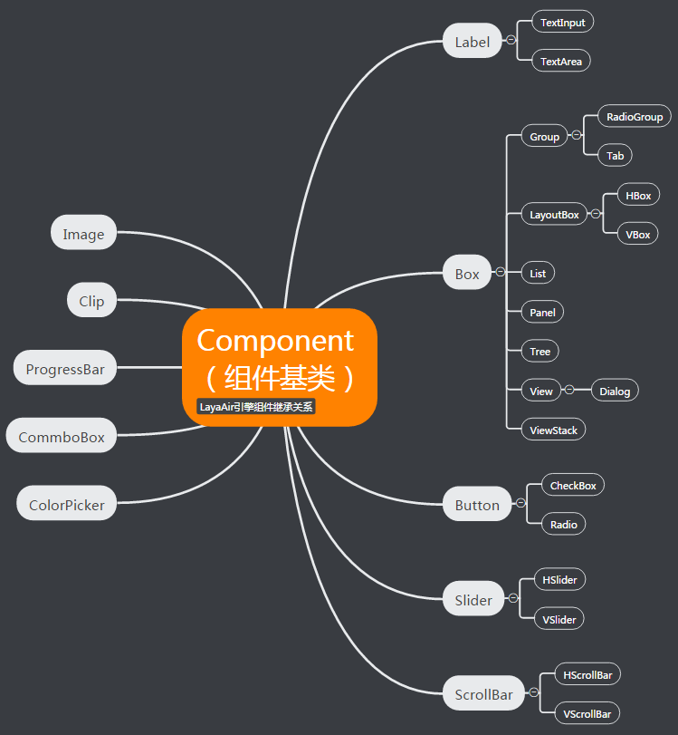

# Introduction of LayaAir component class and  type

> In LayaAirIDE's UI, animation and other visual settings, components features are provides in major case. Each component has a set of its own attributes, methods, and events. Using components can separate program design from interface design, and improve reusability of code. Deep understanding of components can better enhance the efficiency of IDE development.

## 1. Inheritance of components

### 1.1 Base class Component

LayaAirIDE's own component classes are all located in the laya.ui package, and **all components inherit directly or indirectly from the Component class** (component base class).  In the API document of the LayaAir engine, click the UI category, as shown in Figure 1, and find the [laya.ui.Component Class](http://layaair.ldc.layabox.com/api/index.html?category=UI&class=laya.ui.Component). You can view the relevant component API instructions.

   (Picture 1)

### 1.2 Component class inheritance relationship

The Sprite class is the most basic display object container class in the LayaAir engine. The Component class inherits from the Sprite class, adds the generic basic properties, methods and interfaces of the components, and defines the extended functions such as the life cycle of the components.

As the base class of the component Box, Button, Clip, ColorPicker, ComboBox, Image, Label, ProgressBar, ScrollBar, Slider, TipManagerare subclasses of `laya.ui.Component`. The inheritance structure of the component is shown in Fig. 2

   (Picture 2)

*Tips: as shown in Figure 2, IDE commonly used UI page Dialog class inherited from the View class, and the View class continues in the Box class. Other component inheritance relationships are suggested to understand and remember*

## 2. Classification of components

According to the structure and function of the component itself, the components under the laya.ui package can be divided into three categories. They are view components, container components, and base components.

### 2.1 Basic components

The base component is the most commonly used component in page editing. Drag and drop through the `resource manager` or `component library` to the scene editor for visual operation. You can set its `attribute value` in the property setter, and then view the display directly in the scene editor.

Basic components include: Label, TextInput, TextArea, Button, Image, CheckBox, Radio, Clip, ProgressBar, Slider, HSlider, VSlider , ScrollBar, HScrollBar, VScrollBar, ComboBox.

*Tips：With detailed descriptions of these basic components, you can refer to the documentation of the IDE component properties.*

### 2.2 Container class components

Container class components are generated by converting one or more base components into containers. In IDE, you can convert one or more basic components into container components through the Ctrl+B shortcut key. As shown in figure 3.

   (Picture 3)

Container class components include:Box, List, Tab, RadioGroup, ViewStack, Panel, HBox, VBox, Tree, Sprite.

### 2.3 View class components

The view class component is a page-level display object container. In the LayaAir IDE's UI system, the page is used to carry all display components, LayaAir view class components handle only `View` and `Dialog`.

### 
