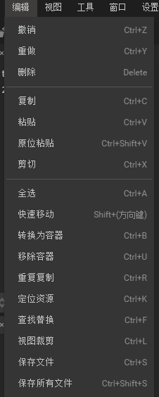
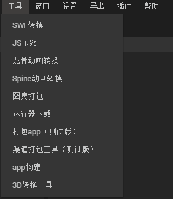
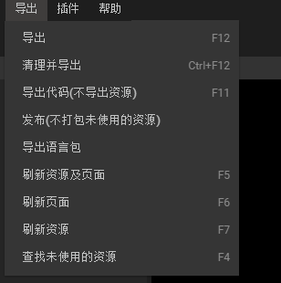
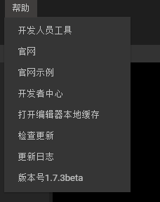

# Introduction to the menu bar

 

​        The menu bar is located at the top of the interface, which contains the whole IDE control information. Developers who are not familiar with the interface can quickly find the function that needs to be operated in the menu bar.  Below we will introduce the menu bar in detail.

​    
​        	（Picture 1）

 

### 1. Document  

​    
​        	（Picture 2）

- New project: create a new project through the new project options window.

- New file: create a new edit page through the new page window, shortcut key Ctrl+N.

- New directory: create a new page folder in the project, shortcut key Ctrl+D.

- Open the project: through the Explorer to browse and open a project, shortcut keys Ctrl + D.

- Conversion project: in the conversion project window, you can choose the MornUI project and convert it to the LayaAir project.

- Set the project: set the project configuration file, shortcut key F9.

- Settings page: set the default attribute of the page, shortcut key Ctrl+P.

- Refresh editor: You can refresh the editor's state, equivalent to the reset or restart editor.

  ​

### 2. Edit

​   
​        	（Picture 3）

- Undo: Undo the current operation, return to the previous step, the shortcut Ctrl + Z.

- Redo: When undoing too much, you can undo the undo action, the shortcut Ctrl + Y.

- Delete: delete the selected resource or control, shortcut key Delete.

- Copy: Copy the currently selected resource or control, shortcut Ctrl + C.

- Paste: Paste the already copied resources or controls, shortcut key Ctrl + V.

- In situ paste: copy and paste the selected control in the original position of the control, the shortcut key Ctrl+Shift+V.

- Cut: shear select controls or resources, shortcut key Ctrl+X.

- Select: select all controls, shortcut Ctrl+A.

- Quick move: move the selected controls quickly to the position of the directional key, move 10 pixels, and the shortcut key Shift+ direction key.

- Turn to a container: convert the selected control to a container. You can choose the specific container type in the conversion box, the shortcut key Ctrl+B.

- Remove container: remove the container from the selected container to the common control. The shortcut key Ctrl+U.

- Duplicate replication: set the number of rows and the number of rows to be copied multiple times in the repeated component, and the shortcut key Ctrl+R.

- Location resource: location of quick resource in Explorer, shortcut key Ctrl+K.

- Find replace: pop-up replacement window, you can find the location replaced by other content, shortcut key Ctrl+F.

- Save the file: save the file change, shortcut key Ctrl+S.

- Save all files: save all file changes, shortcut key Ctrl+Shift+S.

  ​

### 3. View

​    
​             （Picture 4）
- Zoom In: zoom in the scene editor, shortcut key Ctrl++.

- Zoom Out: reduce scene editor, shortcut key Ctrl+-.

- Restore view: restore the scene editor to the original size, shortcut key Ctrl+0 (or Ctrl+|).

- Drag view: hold the right mouse button (or mouse wheel) to drag the view position.

- Show / hide reference view: set the display / hide view in the scene editor, shortcut key F8.

- Show / hide ruler: set in the scene editor to show / hide the ruler, shortcut key Ctrl+Shift+R.

- To control the selected node in the hierarchy control manager level position to move a shortcut key, up Ctrl+↑.

- ​Node level down: position control selected controls in the hierarchical management for the downward movement of a shortcut key Ctrl+↓.

  ​

### 4. Tool

​    
​        	（Picture 5）

- SWF conversion: open the SWF resource conversion tool window, for the user to carry on the SWF conversion operation.

- JS compression: open the JS compression tool window for users to compress and confuse JS files.

- Keel animation conversion: open the keel animation conversion window for users to convert DragonBones skeletal animation into LayaAir recognition format.

- Spine animation conversion: open the Spine animation conversion window for users to convert Spine skeletal animation into LayaAir recognition format.

- Atlas packaging: open atlas packing window for users to carry out atlas packaging operations.

- Runtime Download: open the two-dimensional code window downloaded by the operator for the user to scan the code to download the LayaNative operator.

- Packaging APP:APP packaging environment configuration and operation window for users to package LayaAir project for Android's APP (APK file)

- Channel packaging tools: open channel packing window for users to directly package LayaAir engine project into APK packages which have been connected to a number of mainstream Android channels.

- APP Construction: open the construction function window for users to build LayaAir engine project as Android-eclipse, Android-studio, XCode (IOS) three mobile terminal APP project.

- 3D conversion tool: open 3D conversion tool URL link, compression package provides the 3DMax and Unity3D editor of the resource conversion tool, let 3DMax and Unity3D resources become LayaAir engine support resources.

  ​

### 5. Windows

​    
​        	（Picture 6）

- Animation panel: if the animation manager panel is closed, you can set it up here to display the panel again.

- Frame property panel: if the frame property panel is closed, you can set it here to display the panel again.

- Project panel: if the project manager panel is closed, you can set it up here to display the panel again.

- Resource panel: if the Explorer panel is closed, you can set up to display the panel again.

- Property panel: if the property setter panel is closed, you can set it to re display this panel.

- Hierarchical panel: if the hierarchy manager panel is closed, you can set it up here to display the panel again.

- Template panel: if the template manager panel is closed, you can set it up here to display the panel again.

- Component panel: if the component panel is closed, you can set it up here to display the panel again.

- Restore panel settings: restore the location of all management panels and view size, shortcut F3.

  ​

### 6. Set up

   
  ​        	（Picture 8）

- Editor settings: mode settings and ruler display settings after UI release.
- Class library management: the class library version used to set up the current project.

### 7. Export

​    
​        	（Picture 7）

- Export: the interface will be packaged export, if the resource folder does not change, then skip the folder, only to change the folder for packaging and export, shortcut key F12.

- Cleaning and exporting: resource files that have been packaged before forced cleanup, repackaged and exported for all files, shortcut key Ctrl+F12.

- Export code (not export resources): when resources did not change, only UI position and attributes change when using this function, only to re export the UI code, not to re export resources, will speed up the output efficiency of the UI project.

- Publishing (not packing unused resources): similar to F12 functionality, but only packaging and exporting already used resources, and not operating unused resources. The use of this function, because you need to traverse the use of all resources, will lead to UI project export speed slowed down, so it is not recommended to use when development, only in the release of online version of the project can be used

- Export language package: this function can extract all the current LayaAirIDE UI text content, generate lang.lang file, to set up multilingual version.

- Refresh resources and pages: refresh and re display resources and pages, usually in the case of resource changes, used to refresh all, shortcut key F5.

- Refresh the page: refresh the page and re display the page, shortcut key F6.

- Refresh resources: refresh explorer, re display Explorer reference to resource, shortcut key F7.

- Find unused resources: find unused resources in the project, and sort out a list, easy to quickly delete the unused resources, shortcut key F4.

  ​

### 8. Plug-in

You can edit and develop plug-ins or find shared plug-ins to install to IDE for developers to use.

### 9. Help

​   
​        	（Picture 9）

- Developer Tools: Used to open the editor's debug page.
- Official website: open Layabox official website link.
- Example: Open the official website of the LayaAir engine example link.
- Developer Center: Open the Layabox Developer Center link.
- Open the editor local cache: open the directory where the editor's local cache file resides.
- Check update: open LayaAirIDE version download list link.
- Update log: open the link between the engine in gitHub and the IDE version update log.
- Current version number: displays the current version number of LayaAirIDE.

