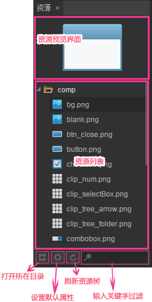
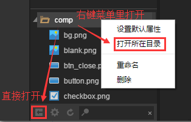
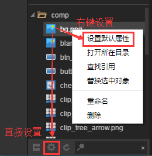
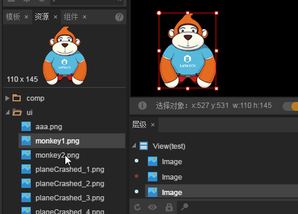

# Introduction to Resource Manager

The resource manager is the work area we use to access and manage project resources. It is a necessary step to add a resource when you start working. This article will introduce the resource manager's function usage and resource naming rules.

## 1. Interface introduction

​        The resource manager displays the contents of the project resource folder as a tree structure, as shown in Figure 1. Here we introduce each interface element.

 （Picture 1）

​        `Resource preview interface`：The resource selected in the resource list is displayed directly in the `resource preview interface`.

​        `Resource list`：in the `project root/laya/assets/` directory are displayed in the `the resource list`. Select the directory or directory resources, right-click `open directory`, will directly open the directory in the operating system.

​       `Common function buttons`： at the bottom of the resource manager are common function buttons, including opening directories, setting default attributes, refreshing resource lists, and keyword filtering.

## 2. Function introduction

### 2.1 Open the directory

All the resources in the resource manager can be managed in IDE, and can be directly operated and managed in the system. Therefore, when the `selected`  directory or resources, ` right-click menu` click `Open Directory`. The `function button` or click Open Directory directly open. The operation is illustrated in figure 2.

   (Picture 2)

### 2.2  create, delete, refresh

#### Create resources and directories

When you open the directory, we can easily create resources and directories. For example, paste the required resources or directories directly into the root directory of the resource manager （*project root directory /laya/assets/*）, After F5 refreshes, the resources can be used in IDE.

#### delete

When delete the directory or resources, there are two ways. The first is the resource or directory that you want to delete in the IDE, right-click on the menu, or delete the Delete key directly. The second is to open directory, system directory, delete. The difference is that IDE will automatically refresh deleted, delete the directory in the system need to click the refresh button or shortcut key F5 refresh in IDE.

#### refresh

Refresh is a common operation in Explorer. Click the `refresh button` at the bottom of the Explorer or the `shortcut key F7` to refresh the resource list of the resource manager and keep it consistent with the system list. You can also press the shortcut key F5 to refresh the resource manager list.

*Tips：F5 shortcut key is not only refresh the Explorer, will also refresh the project manager, if the modified resource is used in the UI project, you need to press the F5 shortcut key.*

The creation, deletion, and refresh operations for resources and directories can be found in Figure 3.

   (Picture 3)

### 2.3 Filter resources

When there are more resources, you can filter the resources by inputting the text keywords in the explorer search box, can find the resources quickly and conveniently. The operation is shown in figure 4.

  (Picture 4)

### 2.4 Set the default properties

Select the resource or directory, can right-click the default attribute, or click the bottom function button of the resource manager, as shown in figure 5.

  (Picture 5)

Click to `set the default attributes`, can play the resources property settings panel, as shown in figure 6.

   (Picture 6)

**Set up the panel**

`Resource Name`： Displays the resource name and path in the resource manager.

`Component Type`：The drop-down option for the component type is all of the component types（*all component types can be viewed in the documentation《IDE component details》*）,  if we want to change the default IDE to identify the type of component, specified as the other component type can be set here.

`Setting the 9th grid`：set the attribute of the 9th grid for the resource, the function of the function is the same as the setting of the nine square in the attribute setting device, and the specific operation refers to the setting of the square in the attribute setting device.

`Default global properties`： this column is also a `property` in the corresponding settings, such as the component's attribute width would like to set to 800, then in the column set "width = 800" can be. If you want to set multiple attributes in advance, the direct line can be set to multiple attribute values. As shown in Figure 7.

   (Picture 7)

**Tips：`set 9th grid` and `Default global attribute` set all belong to the component properties set in advance. When the same component resources used in multiple locations, and need to configure the same attribute, this setting can reduce it Multiple repetitive operations.

`Package type`：By `default` , the packing rules in the project settings (F9) are used. In addition, the function can be manually set to `packing` and `not packing`. When set to a non-default option, the specified package type has a higher priority than the project setting.

`Image type`：when two adjacent images in IDE are in good condition, but when there is a gap in the browser running (usually black line), the picture type is set to `Repeat` to solve.

### 2.5 use resources

After you select the resource, drag and drop the mouse to the scene editor to use the resource component, as shown in figure 8.

   (Picture 8)

### 2.6   Find references and text replacements

#### Find references

After you select the resource component,` right-click` on the `search reference`. In the Find Replacement panel, click `search`to find which project pages the currently selected component is referenced. The operation is shown in Figure 9.

   (Picture 9)

#### Text replacements

In the `find replacement`panel, click `replace` to replace all the `skin property` content that is the same as the value in the Find text. As shown in Figure 10.

  (Figure 10)

### 2.7  key components Replace the selected component in the Scene Editor

First select the ` components in the scene editor`, and then right-click ` the resource manager` to select `the resources to replace`e, click the right-click menu to replace the selected object, you can replace the scene editor with a key, as shown in Figure 11. When the location has been adjusted, just want to switch to other resources, the function is more practical.

   (picture 11)

 *Tips： A key replacement can not only replace the same type of component, you can also replace a key type of different components.*

## 3、Resource naming rules

The resources in the explorer are identified as components in the scene editor, and the default way to identify the component type is the named prefix of the resource. For example, named btn_xxx will be identified as button Named tab_xxx, will be identified as a Tab component. Below we detailed rules for naming resources are introduced, developers must grasp skilled memory. If you do not understand the component developer, please read the "Detailed explanation of IDE component" document.

### 3.1 Naming rules for basic components

 Here are basic components of LayaAirIDE default resource naming rules:

| Basic component name      | Component Chinese name   | Resource prefix (full write, case insensitive)      | Resource prefix (abbreviated, case sensitive) |
| ----------- | -------- | ------------------- | -------------- |
| Label       | 文本框      | label_              | --             |
| TextInput   | 输入框      | textinput_          | input_         |
| TextArea    | 带滚动条的文本域 | textarea_           | area_          |
| Button      | 按钮       | button_             | btn_           |
| CheckBox    | 多选框      | checkbox_           | check_         |
| Radio       | 单选框      | radio_              | --             |
| Tab         | 标签       | tab_                | --             |
| RadioGroup  | 单选框按钮组   | radiogroup_         | --             |
| VSlider     | 垂直滑动条    | vslider_            | --             |
| HSlider     | 水平滑动条    | hslider_            | --             |
| Clip        | 位图切片     | clip_               | --             |
| ProgressBar | 进度条      | progressbar_        | progress_      |
| ComboBox    | 下拉框      | combobox_           | combo_         |
| VScrollBar  | 垂直滚动条    | vscrollbar_         | vscroll_       |
| HScrollBar  | 水平滚动条    | hscrollbar_         | hscroll_       |
| Image       | 位图       | Not recognized as other components are considered Image | --             |

**Tips**: resources can be directly used to prefix all written or abbreviations, and underline. Such as `textinput.png` and `input.png`. But if you still follow the other characters must be underlined, for example `inputAAA.png` Will be recognized as an input box component, `input_AAA.png` will be identified as the input box (TextInput) component.

### 3.2 Special components

There are five special components of IDE, vertical slider component VSlider, horizontal slider component HSlider, progress bar component ProgressBar, vertical scroll bar component VScrollBar, horizontal roll Moving bar assembly HScrollBar.

#### The composition of special components

A special component is not a single picture, but consists of multiple pictures. The naming rules of the main resource pictures comply with the naming rules of the underlying components, and the additional resources are composed of two parts, which are used in two parts `$` Symbolic connection, `$` The name of the primary resource, `$` Next is the name of the associated state.

`bar` refers to the `Slide\Move` statement. For example `ProgressBa$bar.png`, you can see from the name, he belongs to the ProgressBar component, when the progress bar （`bar`） using `ProgressBa$bar.png` resources.

`down` refers to a `downward` state. If the horizontal scroll bar, `down` is usually the default or click on the `right` of the state.

`up` efers to the `upward` state. If the horizontal scroll bar, `up` is usually the default or click on the `left` of the state.

Named special components and composition, to a more intuitive understanding of the resource name can be compared in figure 12.

  (Picture 12)

**Tips**：*Because the additional resources for the special component in the ` resource manager`are not displayed separately, only the primary resource component is displayed in the list. If you want to operate on special component resources, you need to `open the directory` function, in the system file directory management operations.*

### 3.3 Container assembly

Container components include Box, List, Tab, RadioGroup, ViewStack, Panel, HBox, VBox, Tree, Sprite. In addition to Tab, usually do not appear in the list of resources, but when in the `scene editor`, when selecting single or multiple components in the `scene editor`, through the shortcut `Ctrl + B` can be converted to various types of containers, the container can be viewed in the drop-down list, as shown in figure 13.

  (picture 13)

### 3.4 Prefix for custom component recognition

If we don't want to use the default prefix IDE, how to change? Modify the `laya.editorUI.xml` file corresponding to the component configuration, all the IDE own components related information stored in the file.

`laya.editorUI.xml`under `LayaAirIDE根目录\resources\app\out\vs\layaEditor\renders\` directory.

The value in `resName` is the prefix name of the component (the full prefix of the component can not be modified), modify the value of  `resName`. For example, we will identify the prefix `Button` component by `resName="btn"`to resName="bt". Save and then refresh the IDE editor, found that the original BTN prefix named Button resources are identified as Image resources, while the BT prefix named resources are identified as Button components. As shown in figure 14.

   (Picture 14)

*Tips：In the absence of special requirements, it is recommended not to modify the default prefix.*

### 3.5 Identifiable resource types (resource suffix)

 
The LayaAir IDE recognizes only the standard png and jpg image formats. Please do not use other types of image resources or other types of resources renamed png and jpg image resources.

