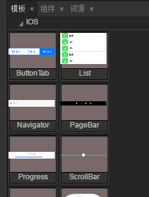
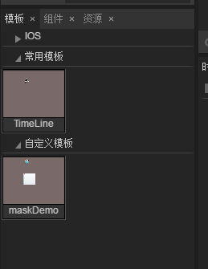

# Template library

>  This article is based on LayaAirIDE 1.7.3 screenshot, if there are difference, please download the latest LayaAirIDE version.

​        

The template library is the work area where we store and use templates. The use of templates can greatly enhance the efficiency of the staff needs.

### First, default IOS style template

​        LayaAirIDE provides by default a batch of IOS-style common UI templates, as shown in figure 1.

​         
​        (Picture 1)

​    

### 2. Create common templates and custom templates

The UI file in the ` project manager`  can be directly converted to a `common template` or a `custom template`. As shown in figure 2.

   (Picture 2)

After the successful conversion, will automatically refresh the panel, such as is the first conversion function using a template, create the corresponding template directory, as shown in Figure 3. We can see in three categories : `IOS`, `commonly used templates`, `custom template`.

   (Picture 3)

The directory of the template is located in the `IDE root folder \resources\app\out\vs\layaEditor\laya\template`, as shown in Figure 4.

   (Picture 4)

*Tips: Created UI template is generic that can be used for other projects.*

