# Create Atlas and details usage

*[Note] This article is based on LayaAirIDE 1.7.3 screenshot, if there are difference, please download the latest LayaAirIDE version.*


Atlas  is a common art resource in game development. It combines many pictures into a large one (spritesheet) through the tool. Stores the original picture resource information into files such as Atlas and json. Figure 1  is a PNG atlas resource packaged with LayaAirIDE.


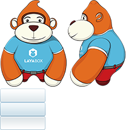 <br /> (Picture 1)


## 1. Why use Atlas resources?

** In the game, using multiple pictures Atlas resources as art resources, have the following advantages :**

#### 1.1 optimize memory

　　When the atlas is synthesized, the blank area around each image is remove, and a variety of optimization algorithms can be implemented on the whole. It can greatly reduce the occupation of the game package and memory footprint.

#### 1.2 Reduce CPU operation

　　Whether multiple `Sprite` is rendering from the same Atlas picture, these `Sprite` can use the same rendering batch, greatly reduce CPU computing time and improving operational efficiency.


## 2.Format to support atlas packaging

LayaAirIDE supports both PNG and JPG resource formats packaged as atlas. But the original set of packaging resources recommended is the use of PNG. JPG volume can be larger and not support transparency.

*Tips: it should be noted that the depth of the original PNG resources can not exceed 32, otherwise the render may display wrong  blurred pixels. In addition, PNG and JPG resources can not be other formats of resources renamed PNG and JPG format.*


## 3.Way to make atlas with LayaAirIDE

There are two ways to package atlas in LayaAirIDE.

#### 3.1 Use IDE atlas packaging tool

　　In the IDE navigation `tool` menu, click the ` atlas package`, open it with packaging tool panel, as shown in Figure 2 and figure 3.

　　 <br />(picture 2)

　　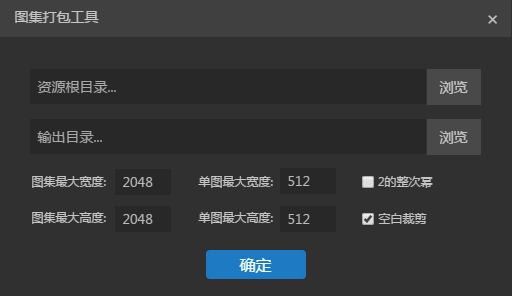 <br /> （picture 3）


**Atlas package tool panel instructions**

**`Resource root directory`**

　　The `resource root directory` refers to the parent directory of the original resource location before the atlas is packed.  each directory corresponds to a single atlas file, and multiple directories generate multiple Atlas files.( The packed atlas file is named in the directory under the root of the resource, as shown in Figure 4 and figure 5)

　　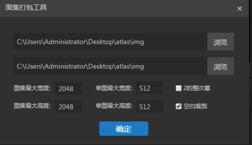 <br /> (图4)

　　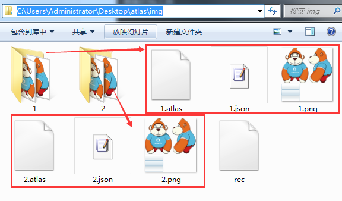 <br />(图5)

　　Drag the directory directly to the `Resource root` input box, or click `Browse`to get the directory path at the same time, will automatically fill in the `output directory` and `resource root directory` equivalent path.

**`Output directory`**

　　`The output directory` refers to the packaged catalog resource storage directory.

　　The default is the same as the root of the resource. You can click `browse` or manually change the path in the `output directory` input box.

　　*Tips: changing the output directory can not be dragged by the directory, otherwise it will affect the path to the root directory of the resource.*

**`Picture size maximum width \ height`**

　　The default value is `2048×2048`, which determines the maximum Picture size of a single atlas. If the original image is too large and exceeds the maximum width of a single atlas, a new atlas file (multiple Atlas) will be generated during packing.

**`Single Atlas maximum width \ height`**

　　The default value is `512×512`, and a single Atlas that exceeds this size will not be packed into the graph set.

　　*Tips: more than 512 × 512 single image is not recommended to pack to the Atlas, you can preload the map alone, but the load can not be more than 1024 × 1024, otherwise it will affect the performance.*

**`The whole power of 2`**

　　If checked, the width of the generated image will be the whole power of 2.

**`Blank clipping`** options

　　If checked, the generated image will automatically cut out the blank area in the original image.


#### 3.2 Automatic packing atlas librairy in resource manager

##### 3.2.1 Atlas packing method

　　**Pack all resources**

　　All resources in the Explorer directory, when exported by `F12` or `Ctrl+F12`, are **automatically packaged **. As shown in Figure 6-1.

　　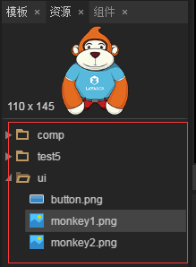 <br /> (picture 6-1)


　　**Do not package unused resources**

　　If the `resources in the explorer` are not used in the `project manager` ,  through the menu `export`--> `publishing` function, and  F12 package is the same effect. But the unused resources can not be packaged. Because this package needs to traverse the usage state of all resources, resulting in slower packaging, so this approach is usually used only for the online release version.


　　**Do not pack the single resource settings**

　　Select the resource, right-click to `set the default properties`, in the property settings panel, set `Package Type option`and not `Pack Type`. The resource will not Was packed into the chart.

　　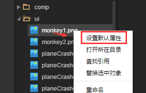 <br >（图6-2）

　　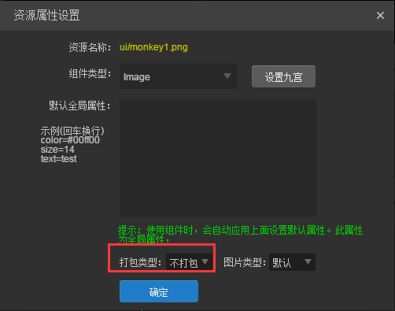 <br />（图6-3）

　

3.2.1 Atlas export path in Explorer

　　To export items, automatically packaged in “`the default project root Atlas located at /bin/h5/res/atlas/`” directory, named atlas and packing tools as same as directory name, as shown in figure 7.

　　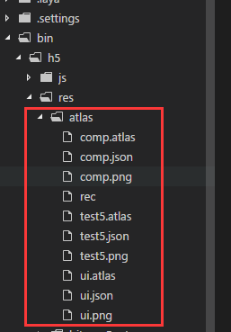 <br /> (picture 7-1)

　　If you want to change the default export directory of the atlas, you can change the export path at the resource publishing directory of the project settings panel through the shortcut key F9. You can also set the maximum width and height of the atlas, and do not pack a single spritesheet width and height limits standards.

　　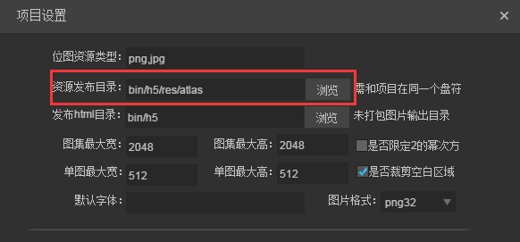 <br /> (picture 7-2)


## 4. Package generated by the introduction of the album file

#### 4.1 Package the generated file

　　After the package, will generate a dedicated set of Atlas resources files (`.atlas`,`.json` and `.png`with same name file name). Atlas packaging will generate also a `rec` file（*internal data use by software,useless for developers*）, as shown in Figure 7 above.

#### 4.2 The difference between atlas and json

　　`.atlas` and `.json` files are independent of each other, both are the configuration information of the PNG atlas. The difference between them lies in their following differences :

　　`.atlas`s extension is a LayaAirIDE specific configuration file information, only for the`.atlas` data. There is no need to fill out the type of loading. Here is a sample Atlas mode loading code :

```java
// atlas implementation sample code
Laya.loader.load("./res/atlas/ui.atlas", Handler.create(this, onLoaded));
```

　　`.json` is a compatible third party configuration, and a widely used structure data. In order to identify whether the configuration information for the Atlas, loading `.json` file Atlas, you need to fill Type to distinguish `.json` mode loading. Here is an example code:

```java
// json method Atlas use examples
Laya.loader.load([{url: "res/atlas/ui.json", type: Loader.ATLAS}], Handler.create(this, onLoaded));
```


## 5. Package common mistakes

#### 5.1  Atlas packing tools in the resource directory settings error

Using the `atlas packing tool`,  if the developer's `resource root directory` is not set to the  ` original atlas resource parent directory`, the packaging tool will not report an error and still generate the atlas resource, as shown in Figure 8, shown in figure 9. However, this kind of atlas is not available in the project.

  　　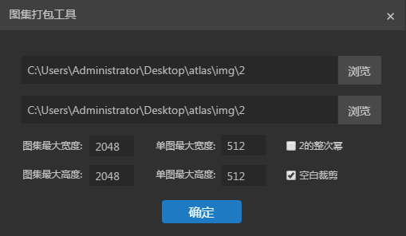 <br />  (picture 8)

  　　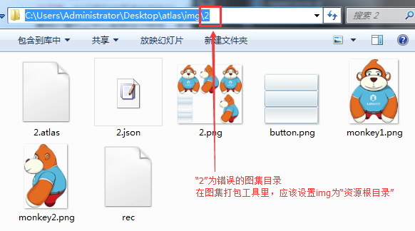 <br /> (picture 9)


#### 5.2  After deleting the atlas file, can not be re export problems

When the user manually deleted the atlas file, but did not delete the rec file, as shown in figure 10. In this case, **if the original resource does not change, it is unable to re-export the atlas file directly using F12.**

At this point, you can use the shortcut keys `Ctrl+F12` to clean up and export. Or delete the rec file directly, and then export it with F12. You can normally export the Atlas.

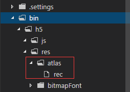 <br /> (图10)


## 6. how to use the atlas in the project

In the project if you use the resources in the Atlas, you need to preload the atlas resources, and then set the image of the（*skin*） attribute value as the “original spritesheet directory name / original resource name .png”。

For example: the resource in Figure 6 above is packaged as shown in Figure 1, and now we show the small figure `monkey1.png` in the `ui` directory in Figure 6 through the atlas in the project. The example code is as follows:

**Main.as Entry class ：**

```java
package {
	import laya.net.Loader;
	import laya.utils.Handler;
	import laya.ui.Image;
	public class Main {
		public function Main() {
			
			// Initialization engine
			Laya.init(1334, 750);
			
			// Preload the atlas resource ui.atlas, and then execute callback method onLoaded
			Laya.loader.load("./res/atlas/ui.atlas", Handler.create(this, onLoaded));
		}
		private function onLoaded():void {
			// Example Image
			var img:Image = new Image();
			// Setting the skin (the way to take a small graph is the original directory name / original map resource name.Png)
			img.skin = "ui/monkey1.png";
			// Added to the stage display
			Laya.stage.addChild(img);
		}
	}
}
```

The code runs as follows:

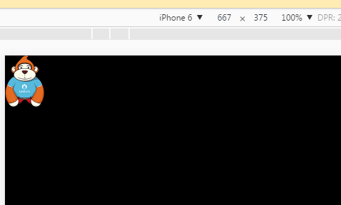 <br />（picture 11）

As shown in Figure 11, we successfully take out the thumbnail resource from the atlas and applied it to the project, and the `sink` value of `ui/monkey1.png` in the code is actually the path resource name and directory before the atlas is packed.

This is the end of this article. If you have any questions, please come to the community：[http://ask.layabox.com](img/http://ask.layabox.com)
