# Timeline animation editor

*[notice] this tutorial uses LayaAirIDE version 1.73. If there is any difference in the article contents, please get the latest version of LayaAirIDE.*
> Timeline animation editor is the core module of LayaAirIDE, through the production of key frames with timeline. Automatically generate animation frames in motion, you can quickly achieve the game alpha transparency gradient, displacement, rotation, zoom and other animation effects. Saving the production process most of the time, improve the development efficiency. This article is a comprehensive introduction to the timeline animation editor function and use,  with code and animation editor.
>


## 1. Create timeline animation

　　**There are two ways to create a timeline animation**. One is to create a timeline animation for the `.ani` file, and the other is creating a timeline animation in the UI page (`.ui` file).

　　Two file production timeline animation in exactly same way, the only **difference** is `.ani` file animation can be used in other UI pages, and UI pages in  timeline animation.

　　For generic timeline animation, it is recommended to create in the `.ani`. For generic timeline animation, it is recommended to create in the `.ani` file as an example.

**Tips**：

- If you create a timeline animation in the UI page,  you need to select animation component in the `scene editor`, and then click Select in timeline panel, and then `edit animation`.
- In the UI page to create timeline animation,`editing mode`check state, not directly drag the components into the `scene editor`, need to exit the `animation editing mode`, UI components to be used to drag the `scene editor`, and then re-enter `Animated mode edition`.


### 1.1 Create timeline animation file ani

**Step A**： In the Project Manager, `right-click` menu, select `New ` -> `Animation`, as shown in Figure 1.

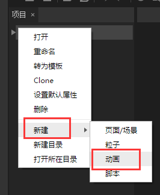<br />(Picture 1)


**Step B**： left click on the `animation`, the pop-up timeline animation create panels. In the panel, select the GraphicAnimation type, enter the `animation name`, and click `OK`, as shown in figure 2.

<br /> (Picture 2)

*Tips: panel of the column description, please refer to the document "UI pages, particles, animation, script added panel details"*

Click OK, then complete the `TimeLine.ani` animation file creation, and automatically open, into the animation editing mode. As shown in figure 3.

<br />(Picture 3)

**Tips**:

- Open `.ani` or `.ui` file, `timeline` panel ` frame properties` panel default is located in the bottom of the IDE.  the production of timeline animation these two panels need to use, if you can not find or accidentally turned off, you can press the shortcut key `F3` to restore for the default panel layout.

- In `.ani`file, the starting point(`0,0`) of the scene edit area is at the center of the intersection of the two red lines. Different from the top left corner of the UI file, you need to pay attention.


### 

### 1.2 Create a displacement of the timeline animation

#### 1.2.1 Set a label for timeline animation

<br/>
(Picture 4)

Timeline panel can manage multiple animation effects, the default nomenclature is named ani1, ani2 ... ... ani(x). in order to facilitate the distinction, we need to modify the dynamic name, you can use the move name. No need to refresh after the change, immediately take effect, as shown in Figure 5.

 <br /> (Picture 5)


#### 1.2.2  Enter the animation editing mode

Only check the animation editing mode before you can edit the current animation effect. Into the edit mode, the default in the 0 frame, as shown in Figure 6. (*Timeline animation starts from 0 frames*)

 <br /> (Picture 6)


#### 1.2.3 Import animation resources

In the resource panel, drag and drop bitmap resources (Image components) into the animation editing panel and automatically create a key frame in 0 frames. As shown in figure 7.

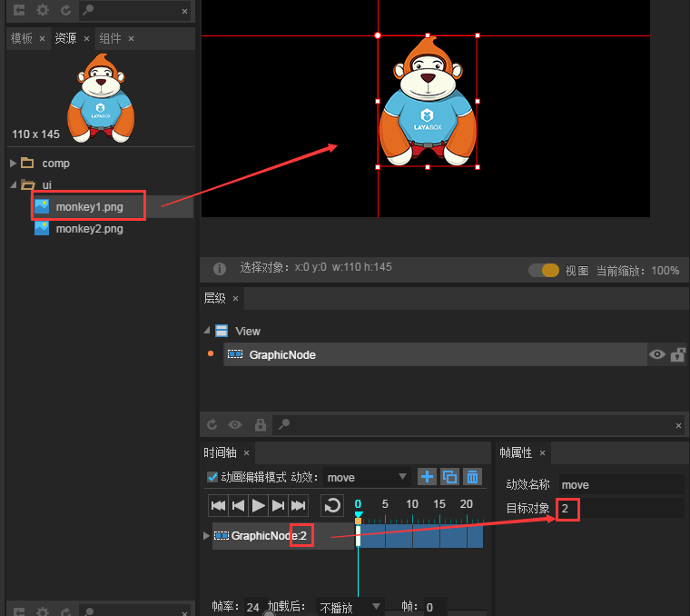 <br /> (Picture 7)

Figure 7, `GraphicNode:2` stands for each animation node, and when you check the 0th frame, you can see that 2 is exactly same value of the target object.


#### 1.2.4 Creating keyframes

There are three ways to create keyframe. Respectively, in the level of the panel to create arbitrary properties automatically, in the scene editor to create the right, change the component of any attribute value automatically created.

**A：create in the hierarchy panel**

Select a frame, then select the level of the panel in the component node, click `right click` --> `create key frame`, as shown in Figure 8-1.

 <br /> (Picture 8-1)

**B: right click in the scene editor to create**

In the Scene Editor, right-click on the component in the `scene`  --> `Create Keyframe` 

 <br /> (picture 8-2)


**C: auto-creation**

In the scene editor, when you select the component and change any attribute value of the component, the key frame is created automatically.

In this case, we use the third way to create.  First, select `20th` frames with the mouse, and then change the value of the x-axis attribute to `160`. At this time, will automatically generate the key frame in the first 20, and a timeline displacement animation of X axis from `0` to `160` is successfully created. As shown in figure 8-3.

 <br /> （picture 8-3）


#### 1.2.5 Play Timeline Animation

Play the animated with button from left to right. The effect of playing（*loop, play, pause*）.  the animation with different buttons is shown in Figure 9.

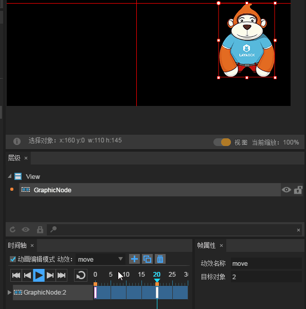 <br /> (Picture 9)

**First frame button**": Click the play pointer to move to the first frame of the timeline（*frame 0*）.

**Previous frame button**: Click the play pointer to move to the previous frame from the current frame. If the current frame is the first frame, the playback pointer moves to the last frame of the key frame.

**Play \ Pause button**：when clicked, the animation is played from where the current frame is located and is stopped at the last key frame.  Click in the playback state will pause the animation, click again to play.

**Next button **: when clicked,  the pointer move to the next frame of the current frame. If the current frame is the last frame of the keyframe, the playback pointer moves to the first frame.

**Tail frame button **: Click the play pointer to move to the last frame of the timeline key frame.

**Loop button**: when selected,  click play button and animation will loop. unselect loop button will cancel the looping state.


　　

### 1.3  Make animation effects through the property panel

In the properties panel of the component, there are some attributes that enable the implementation of the animation effect. Examples are presented in this section.

#### 1.3.1 Increase the effect of rotating animation.

For example, on the basis of the previous animation, we make a moving and rotating animation by changing the axis point and rotation angle. As shown in figure 10.

 <br /> (Picture 10)

**How to do：**

Select the last key frame (frame 20), select the component, modify the property panel value: `x` value is 235，`y` value is 100，`pivotX` value is 50，`pivotY` value is 100，`rotation` value is 270.  Click to play. 

**Attribute Explanation:**

`x` and `y` position coordinate of the component..

`pivotX`and `pivotY` axis point coordinates of components (X and Y).

`rotation` define angle of the component.


#### 1.3.2 Increases zoom animation effects

On the previous animation, you can see the zoom effect of the timeline animation by changing the scaling ratio, as shown in figure 11.

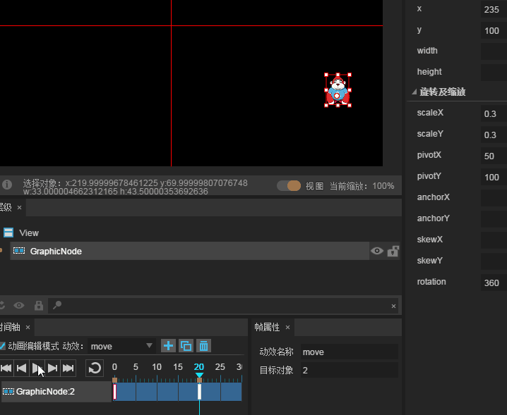 <br />(Picture 11)

**How to do: **

Select until the last key frame (20 frames), modify component the value of the property panel: set the`scaleX` and `scaleY` values are set to 0.3. `rotation`can modify to 360

**Attribute Explanation:**

`scaleX`component horizontally scaled, defaults to 1, not scaled.

`scaleY`component vertically scaled, defaults to 1, not scaled.


#### 1.3.3 Increase the animation of the transparent gradient effect

Transparent gradient effect is also one of the commonly used animation effects, by modifying the alpha value, you can easily achieve fade, and other transparent gradient effect. We continue to extend on the previous animation. The effect is shown in figure 12.

 <br />(Picture 12)

**How to do: **

Select the last key frame (frame 20), select the component, modify the value of the property panel: the `scaleX` and `scaleY`values are modified to 0.2. Change the `rotation`720. `alpha`is set to 0.

**Attribute Explanation: **

`alpha` is the transparency property value, defaults to 1, and is opaque. 0 is fully transparent, and the range of attributes is 0~1.


#### 1.3.4  pivot point animation settings

##### Create a new timeline animation

In order to distinguish between the shift effect just now, we click the plus sign icon, and then create a timeline animation, as shown in figure 13-1.

 <br /> (Picture 13-1)

After the creation of animation, the name was changed to pivot, we can see the newly created `pivot` animation and `move` animation from the original animation list, as shown in Figure 13-2, click on the name list by switching can achieve different animation.

 <br /> (Picture 13-2)


##### Make animation centered on the center point

When the pivot point is not set,  the default is the upper left corner of the component as the origin axis. At this point, we perform the rotation operation, as shown in figure 14-1.

 <br /> (Picture 14-1)

If you want to achieve the rotation of the center of the picture, how to operate it, here you can use two ways to achieve.

**Method 1: implemented by anchor.**

The anchor point is set by the ratio of the maximum length of the X or Y axis of the component. The value is `0-1`. For example, we take `anchorX` and `anchorY` attribute values by `0.5`, which is the length of the X axis and the Y axis. 50% position to obtain the coordinates of the pivot point. In this way, in the end of the time frame set a`rotation angle 360`, to achieve the center point as the axis of the rotation effect, the effect shown in Figure 14-2.

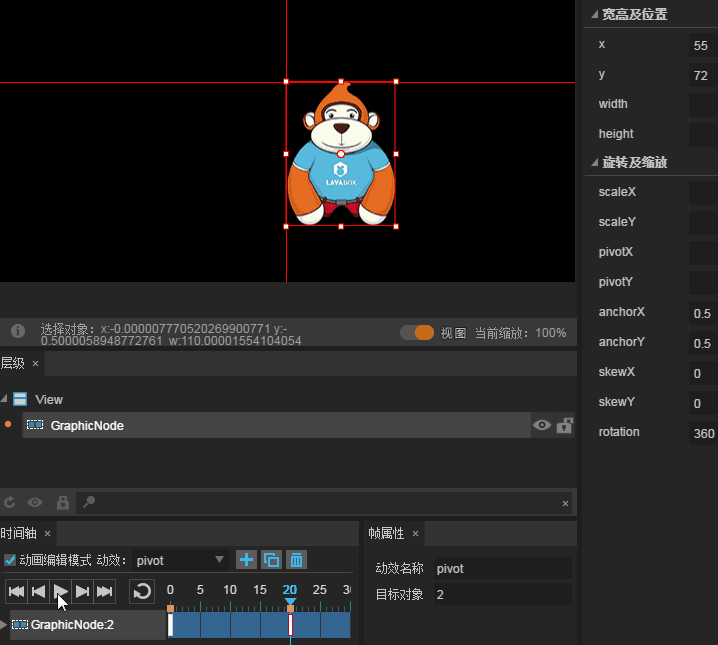 <br /> (Picture 14-2)

**Tips**: * through the anchor is a very convenient way to set the axis point. But the anchor method can only set the axis of the UI components, for the Graphics component and Sprite and other 2D components of the axis can only be achieved through the second way.*


**Method 2 : Through the axis point attribute realization*

We want to in the center as the axis of rotation, you can also set the component through the axis point attribute for center pivot point, such as the original size of the picture is `110*145`, then we will get the original width in addition to the 2 center point position, set the `pivotX` property value is `55`, the `pivotY` property value is `72.5`. Then play the animation, the same effect as the first method. As shown in figure 14-3.

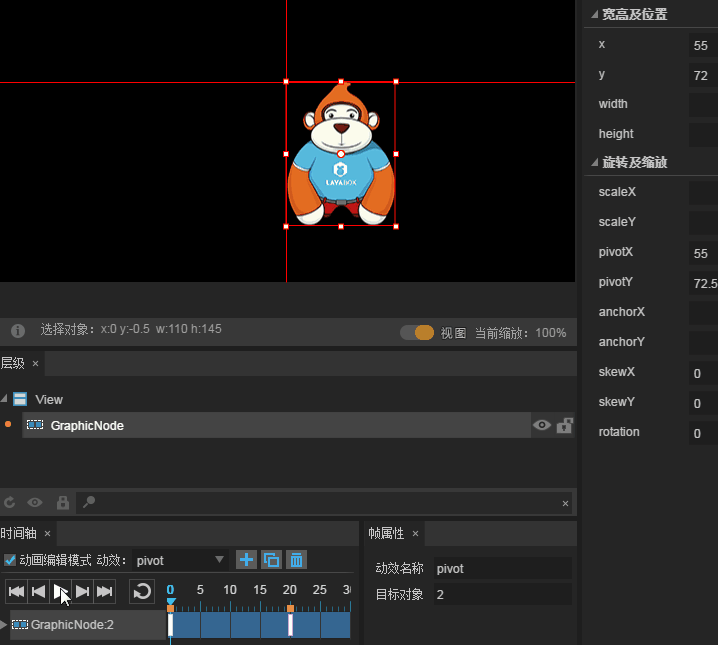 <br />(Picture 14-3)

**Tips**：*relative to the anchor point directly set 0.5, you can get the center point for the axis point, the axis point property settings need simple calculation, a little bit more trouble. But the pivot point approach is more widely used, not only to set up components, but also to set containers and Sprite.*


#### 1.3.5 Tilt angle animation setting

##### The coordinate system of the tilted property

The coordinate system of skewX and skewY is different from the conventional coordinate system. **The horizontal direction is y, and the vertical direction is X**. As shown in figure 15.

 <br /> (Picture 15)

In order to facilitate understanding of skewX and skewY tilt angle changes. We use the timeline animation to express.

##### skewX tilting change effect demo

Operation: no effect is set in the `0th frame`. the first `20` will skewX set to `30`, click on the player, the component skewX axis in the anti-clockwise direction of deformation. As shown in Figure 16-1.

 <br /> (Picture 16-1)

　　**Tips**:* If the skewX value is negative, the component X axis will move in a clockwise direction.*

##### skewY tilting change effect demo

Operation: In the `0th frame`  does not set any effect, the first `20 frames` will skewY set to `30`, click on the player, the component skewY axis in the clockwise direction of deformation. As shown in Figure 16-2

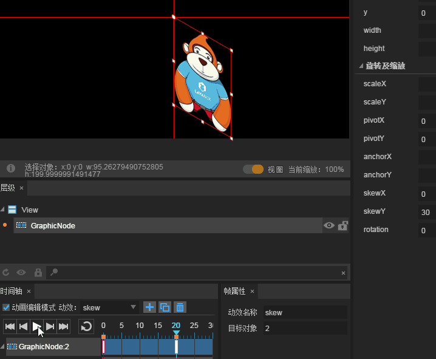 <br /> (Picture 16-2)

　　**Tips**:*If the skewY value is negative, the component Y axis will move in a counterclockwise direction.*

##### skewY and skewY simultaneous tilt effect demonstration

Operation: In the `0th frame` does not set any effect, the first `20 frames` will skewX set to`30`, skewY set to `20`click on the player, the components of the skewX counterclockwise move, skewY axis clockwise move, common extrusion components deformation. As shown in 16-3.

 <br />(Picture 16-3)

##### Tilt animation without deformation

The previous example of the presentation is the deformation effect caused by the change of the tilt angle when the skew property value is positive. If the skew attribute value is negative, the direction of the deformation is the opposite direction. Therefore, when skewX and skewY use the same numerical angle, one property is positive, the other is negative. Then the tilt angle and direction are the same without deformation. Below, we demonstrate the effect of tilt animation without distortion by a simple pendulum effect.

Operation: Set `skewX` to `-50` at frame `0`, and`skewY` set to `50`. At keyframe 15, set `skewX` to `10`, `skewY` to `-10`. For 30th frame set `skewX` and `skewY` to 0. After setting, click and play the effect as shown in Figure 16-4.

 <br /> (Picture 16-4)


## 2. Introduction to Animation Editor

There are two basic concepts in the animation editor: the node layer and the node attribute layer are displayed. As shown in Figure 17,  `GraphicNode` is the display node, followed by the number of the target object ID, animation scene for each additional animation  component, the timeline will add a corresponding display node. Click the expand button (triangle) on the left side of the node layer to see all the animation attributes belonging to the node. `skewY` and `skewX` are the tilted animation properties to be implemented in the timeline animation. For each additional animation attribute, Layer will add a corresponding node attribute layer.

 <br /> (Picture 17)

### 2.1 add new and delete animation

In previous example has shown a new timeline animation operation with the `+button`. However, we can also add a new animation like the original animation by copying the animated button. The new animation can be based on the original animation Continue to expand 

and adjust. From the list of animations in Figure 18, we can see that the new animation naming method is "`original animation name _0, original animation name _1, .....`"For example, in Figure 18, `skew_0` and`skew_1`are copied from `skew`，`skew_0_0_0` into`skew_0_0`. You can also modify the default animation name in the Frame Properties panel.

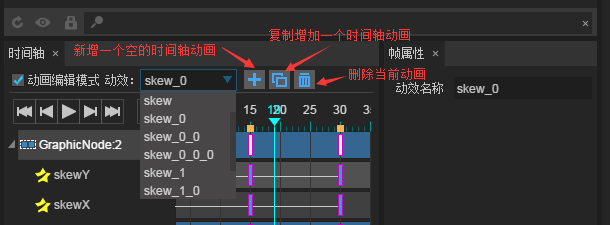 <br /> (Picture 18)

When you click the Delete button, you will be prompted to delete it. Click OK to delete the current animation, as shown in Figure 19-1.

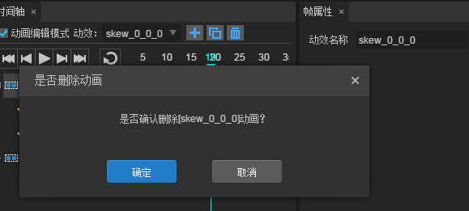 <br /> (Picture 19-1)

**Tips**:**note here that deleting the timeline animation only removes animation effects and attributes on the timeline, without deleting the animation nodes in the scene**. Especially after we delete the last animation, it will be more obvious to see that the node has not been deleted, as shown in figure 19-2.

 <br />(Picture 19-2）


### 2.2 add and delete multi node animations

#### 2.2.1 new node layer and node naming.

We've been using a node to animate the timeline, and now we copy a new skew animation and then dragged a new component into the scene. A node layer is automatically added. 

Because of the juxtaposition of multiple nodes, which is not intuitive, it is easy to distinguish which node in the scene is operating. So we select the node, and in the property manager, set the name property value, as shown in figure 20.

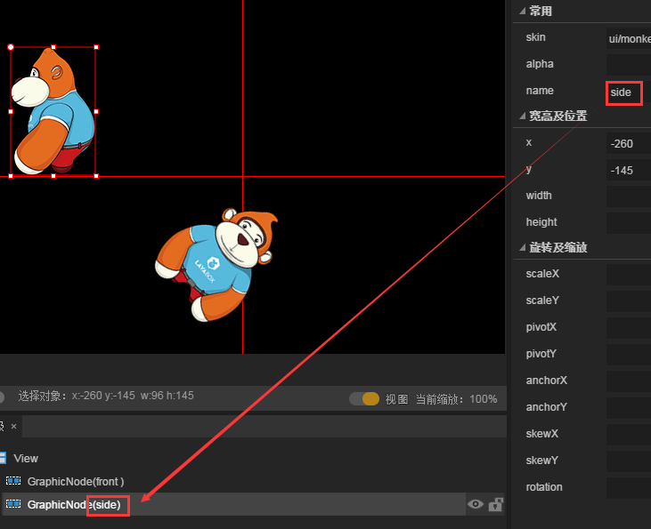 <br /> (Picture 20)

#### 2.2.2 Making multi-node animation

In the new node layer, we can according to the actual needs, set up a different position with the previous node layer key frame, for example, we have this node layer to create a translation of the animation back and forth, deliberately set the second key frame in the 13 frame position. After the animation is finished, the effect is shown in Figure 21.（*The basic operation described above will not be described in detail*）

<br />  (Picture 21)

**Tips**：Since the translation animation in this example is in the negative coordinate area. Need to explain here. `In the negative coordinate area of the timeline animation, the click event can not be triggered`, If the click event interaction is required, the X and Y of the animation must be in the positive coordinate area, that is, the lower right cross section of the cross red line.

#### 2.2.3 Delete node

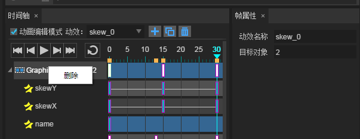 <br /> (Picture 22-1)

If we as shown in Figure 22-1, select the node, right-click to `delete`, and can not delete the node as attributes, the current node to delete, can only delete the current node produced animation and node properties. As shown in Figure 22-2.

 <br /> (Picture 22-2)

So how do I remove the node? You need to select the node you want to delete in the`hierarchy panel`, and then right-click to `delete it`, as shown in Figure 22-3. In the pop-up prompts `whether to delete`, click `OK`. However, if there are**multiple animations in the animation list**, be sure to note that the node you deleted is also used in other animations, because the deletion of the component will affect all the animation.**Once deleted, the nodes and animations within other animations will disappear.**

 <br /> （Picture 22-3）


### 2.3 Node properties and slow motion settings

In the node layer is the node attribute layer, select the node attribute frame, you can see the detailed frame properties, as shown in Figure 23.

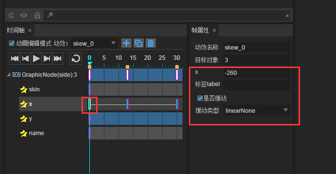 <br /> （Picture 23)

#### Node frame properties are introduced

`x`：X is the property name, and -260 is the value of the current frame. If skin is selected, the skin property name and the corresponding value are displayed. This column cannot be modified.

`tag label`：When the column is set, you can manipulate the frame with code in the item by tag name. When the tag is set, a red dot appears on the frame where the label is set, as shown in figure 24.

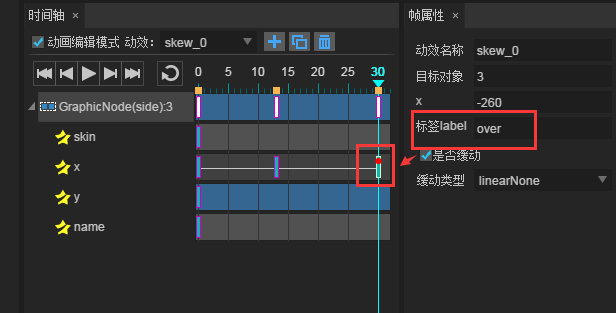 <br /> （Picture 24)

`Whether to move`: you can choose whether to use the easing effect, the default check status.

`Slow motion type`: the default is linearNone slow motion effect, and other slow motion developers can use it themselves.

**Tips**:* easing effect on the current animation of the starting key frame position, if you want to change the type of relaxation to pay special attention.*


### 2.4 production frame by frame animation.

Frame by frame animation is also one of the most popular animations in the game. In the timeline, there are two ways to animate frames by frame.

##### Method 1 : create key frames continuously

Step 1: Drag the first frame of the component into the scene editor. Step 2: Create keyframes continuously in the Timeline. As shown in Figure 25-1.

 <br > （Picture 25-1)

Step 3: replace the frame skin (skin) properties, as shown in figure 25-2. Then click play to see the animation effects.

 <br /> （Picture 25-2)

**Tips**:*If you drag the components in batches on the timeline, there will be multiple animation nodes in the scene. Rather than the desired frame-by-frame animation. *

##### Method 2 : one-time creation

Selecting numbers images content, and drag onto the timeline creates a frame by frame animation, which is faster. As shown in animation 25-3.

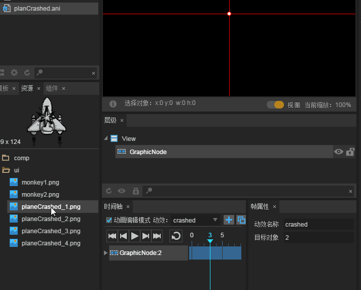 <br /> （picture 25-3）


### 2.5 Bottom function bar

 <br />(frame 26)

In the bottom of the timeline animation editor function bar, the specific description is as follows:

`Frame rate ：`default is 24 frames, and the frame rate can be changed by changing the frame rate.

`load ：`select different actions, after loading, will perform the corresponding action. Three options are not played, played once or loop, and the default is not played.

*Tips： This setting is only effective in animated editing in the Timeline of the UI, and is invalid when the animation edit of the ANI file is set. *

`Frame: ` the default display current frame, enter the target number of frames after the carriage return, will jump directly to the specify frame.

`Round Slider: ` Used for display spacing adjustment between frames and frames on the timeline. As shown in Figure 27-1.

 <br />(Picture 27-1)

`Rectangular slider: ` drag the slider to move the timeline to slide the frame on the timeline. As shown in figure 27-2.

 <br /> (picture 27-2)


## 3、Use timeline animation

### 3.1 Export timeline animation

In IDE, by pressing the shortcut keys, F12 or ctrl+F12 will export the timeline animation, and the `.ani`  file will be generated in the  `project root/bin/h5/` The resource atlas used in the animation is in the root directory of the `project root /bin/h5/res/atlas/`, as shown in figure 28.

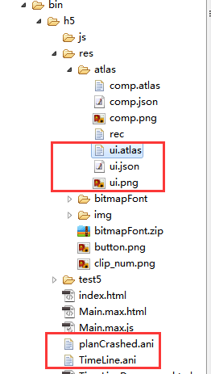 <br />(picture 28)


### 3.2 Use timeline animation in your project

In the project, the use of timeline animation is mainly divided into three steps.

Step 1: Load the animations required for the atlas.

```java
// After the Atlas is loaded, the onLoad callback method is executed
Laya.loader.load("res/atlas/ui.atlas", Handler.create(this, onLoaded));
```

Step 2: create the Animation instance and load the animation file

```java
//Create an instance of Animation
var tl:Animation = new Animation();
//Load animation file
tl.loadAnimation("TimeLine.ani");
```

Step 3: add animation to the stage, play animation

```java
//Add to the stage
Laya.stage.addChild(tl);
//Play Animation animation
tl.play();
```

The complete sample code is as follows:

**Entry class TimeLineDemo.as**

```java
package
{
	import laya.display.Animation;
	import laya.utils.Handler;
	import laya.webgl.WebGL;

	public class TimeLineDemo
	{
		public function TimeLineDemo()
		{
          	//Initialize stage
			Laya.init(1334,750, WebGL);
          	//Set stage background color
			Laya.stage.bgColor = "#ffffff";
			//After loading the atlas successfully, execute the onLoad callback method
			Laya.loader.load("res/atlas/ui.atlas", Handler.create(this, onLoaded));
			
		}
		
		private function onLoaded():void
		{
			//Create an instance of Animation
			var tl:Animation = new Animation();
			//Load animation file
			tl.loadAnimation("TimeLine.ani");
			//Add to the stage
			Laya.stage.addChild(tl);
			//Play Animation animation
			tl.play();
			
		}
	}
}
```

The code runs as shown in Figure 29:

 <br />(Picture 29)


### 3.3 Use multiple timeline animation

Before we made multiple animations in TimeLine.ani, how do we load and use other animations? At this point, the value of the animation name is reflected. By default, when the playback method `play()` is played, the default is to play the first animation. If you want to use another animation, then set the animation name at the third parameter. The API parameter description of the `play()` method is shown in figure 30.

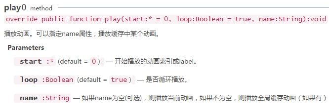 <br />（Picture 30）

Modify the sample code to use multiple Animation as follows:

**Enrty class TimeLineDemo.as** 

```java
package
{
	import laya.display.Animation;
	import laya.utils.Handler;
	import laya.webgl.WebGL;

	public class TimeLineDemo
	{
		public function TimeLineDemo()
		{
			Laya.init(1334,750, WebGL);
			Laya.stage.bgColor = "#ffffff";
			//After loading the atlas successfully, execute the onLoad callback method
			Laya.loader.load("res/atlas/ui.atlas", Handler.create(this, onLoaded));
			
		}
		
		private function onLoaded():void
		{
			//Create an instance of Animation
			var tl:Animation = new Animation();
			//Load animation file
			tl.loadAnimation("TimeLine.ani");
			//Add to the stage
			Laya.stage.addChild(tl);
			//Play Animation animation
			tl.play();
			
			//Create a new instance of Animation
			var tl2:Animation = new Animation();
			//Load animation file
			tl2.loadAnimation("TimeLine.ani");
			//Add to the stage
			Laya.stage.addChild(tl2);
			// set Pivot  for Animation class
			tl2.play(0, true, "pivot");
			// define position of animation
			tl2.pos(300,0);
			
		}
	}
}
```

The sample code runs as shown in Figure 31:

 <br /> (Picture 31)

#### 

### 3.4 Use the timeline animation in the UI and call it in the project code

#### 3.4.1 Create a UI page, add Animation animation to the scene.

We first create a `TimeLine.ui`UI page, and then drag and drop `planCrashed.ani` directly into the scene, as shown in figure 32.

 <br /> (Picture 32)


#### 3.4.2 Set the Animation animation property value

Select the animation in the UI scene, there are many attribute values which can be set. Here we first set the value of `var`, must be set, otherwise the animation cannot be called. And then set the location attribute x value of 500, y is 0（*equivalent to the code set pos value*），to avoid and the previous animation overlap. Other attribute values are not introduced one by one, the mouse moved to the property name will have a corresponding description. As shown in Figure 33.

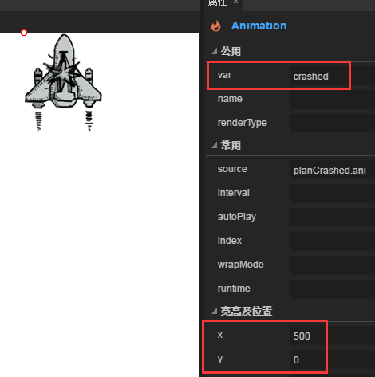 <br /> (Picture 33)


#### 3.4.3 Calling animations in the UI in the project

After you export by F12, add the code directly to the previous example. The code example is as follows:

**Entry class TimeLineDemo.as** 

```java
package
{
	import laya.display.Animation;
	import laya.utils.Handler;
	import laya.webgl.WebGL;
	
	import ui.TimeLineUI;

	public class TimeLineDemo
	{
		public function TimeLineDemo()
		{
			Laya.init(1334,750, WebGL);
			Laya.stage.bgColor = "#ffffff";
			//加载图集成功后，执行onLoad回调方法
			Laya.loader.load("res/atlas/ui.atlas", Handler.create(this, onLoaded));
			
		}
		
		private function onLoaded():void
		{
			// Create an instance of Animation
			var tl:Animation = new Animation();
			// Load animation file
			tl.loadAnimation("TimeLine.ani");
			// Add to the stage
			Laya.stage.addChild(tl);
			// Play Animation animation
			tl.play();
			
			// Create a new instance of Animation
			var tl2:Animation = new Animation();
			// Load animation file
			tl2.loadAnimation("TimeLine.ani");
			// Add to the stage
			Laya.stage.addChild(tl2);
			// set Pivot  for Animation class
			tl2.play(0, true, "pivot");
			// define position of animation
			tl2.pos(300,0);
			
			
			// Create an instance of UI
			var plan:TimeLineUI = new TimeLineUI();
			// Add to the stage
			Laya.stage.addChild(plan);
			// Play animation in the UI scene
			plan.crashed.play();
			
		}
	}
}
```

The operational effect is shown in Figure 34:

 <br /> (Picture 34)

Animations used in UI can easily control animation attributes directly in the property manager in UI. For example, we want the aircraft explode at a slower rate. Then we can select the animation directly in UI, and then set the attribute value of interval. Interval controls the time interval in which the animation is played (in milliseconds) and defaults to 50 milliseconds when not set. Here we've changed more so that the plane will explode at a slower rate. As shown in figure 35.

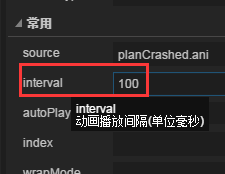 <br /> (图35)

After modification, export with F12, and then without changing the project code, recompile directly.  You can see that the content effect has changed, as shown in figure 36.

 <br />(picture 36)


So far, the production and use of timeline animation have been described. For more information, APIs can be used to view the Animation API documentation [Animation API documentation](http://layaair.ldc.layabox.com/api/index.html?category=Core&class=laya.display.Animation)。


  

 
