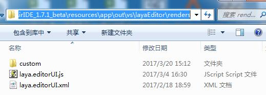
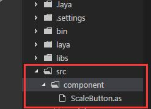
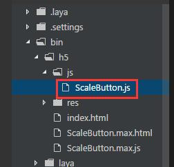
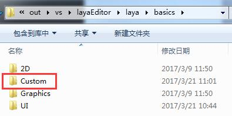
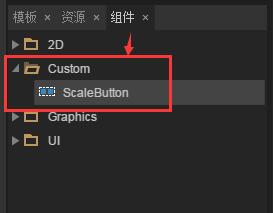
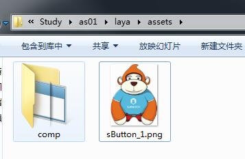
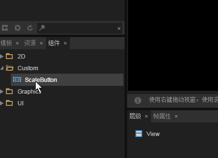
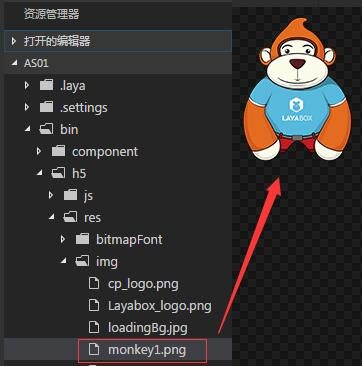
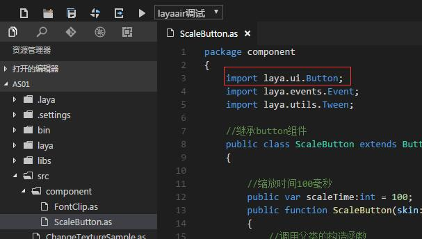

# Making and using custom components

　　LayaAir provides custom components Interface, developers can modify or add components as needed, and new components can be recognized and used by LayaAirIDE. This chapter to the zoom button, for example, describes how to add a new component, as well How to use this component in LayaAirIDE.

### 	**1. understand the components and rules**   
#### 					**1.1 component directory structure**

​	The components directory is located in the “\resources\app\out\vs\layaEditor\renders” directory under the LayaAirIDE root directory. As shown in Figure 1:
​	 <br />
​	（Picture 1）

​	**Component Directory Structure Description：**

​		“custom”：This directory is used to store js and xml files of custom components.

​		“laya.editorUI.js”：LayaAirIDE comes with the components of the function code.

​		“laya.editorUI.xml”：LayaAirIDE comes with the component configuration information.

#### 				**1.2 Component xml configuration information description**

​	A complete component by js and xml two parts, of which js is part of the function of the realization of the part, xml is in the IDE component display and call part, including the component image resource name (case sensitive), the properties of the panel options Default value and so on.

​	Here's an example of the TextArea component in laya.editorUI.xml:

```xml
	<TextArea className="laya.editorUI.TextArea" inherit="TextInput" defaultValue="text='TextArea'" skinLabel="skin" resName="area" icon="TextArea" groups="Common, commonly used, size and position, rotation and scaling" drag="3">
		<prop name="vScrollBarSkin" tips="Vertical scroll bar skin" type="string" default="" accept="res" group="Commonly used" />
		<prop name="hScrollBarSkin" tips="Horizontal scroll bar skin" type="string" default="" accept="res" group="Commonly used" />
	</TextArea>
```

​	

​	**Component XML specification: **

​		"TextArea": TextArea markup as the beginning and end of the component. The naming of TextArea can be different from the category, but it is easy to understand memory, and is used for component name display in IDE.

​		"classsName": The complete classpath for this component, such as: laya.editorUI.TextArea

​		"inherit":  inherited parent class.

​		"defaultValue": The default value of the component properties.

​		"skinLabel": used for skin related settings in the property panel. The value of skinLabel corresponds to the name field of prop and the related settings. If there is no prop, it is not set, and this setting is not available in the TextArea component;

​		"resName": component resource prefix (case sensitive), the resource with this prefix is recognized as the component; the configuration area of TextArea is the abbreviation mode of TextArea, and is displayed in the component panel of IDE TextArea. In terms of component naming, you can see the "component resource naming rules" document based on the IDE component.

​		"icon":  the icon name of the component displayed in IDE (case sensitive). The directory of the icon is in the "resources\app\out\vs\layaEditor\laya\icons\components" directory under the LayaAirIDE root directory. We can create new icon icons or multiple components using one icon together. For example, TextArea will correspond to the TextArea.png in the component directory.

​		"groups": grouping display for attribute panels, separated by commas

​		"drag": stretch the value of the parameters: 1: There are two points, only horizontal stretching, such as hscroll components; 2: There are two points that can only be stretched vertically, such as vscroll components; Point, you can horizontal,
Vertical, zoom in, zoom out;

​		"prop": prop is the setting of the property in the property panel, and each prop tag corresponds to a component property;

​		"name":  the name of the property, will be displayed in the Properties panel

​		"tips": tips prompt information displayed by the mouse on the property name

​		"type": the attribute value type in the input box

​		"default": the default value of this property

​		"accept": this attribute receives two values of res and files. Res represents the property bar and can be dragged into a single resource; files represents the property bar and can be dragged into multiple resources;

​		"group":  the group in which the attribute is located; the group corresponding to groups does not belong to the "other" group;

### 2、Import the LayaAirIDE component library 
#### 			2.1  download the LayaAirIDE component library (this is the AS version)

​	Download address： [https://github.com/layabox/layaair-ide-ui]( https://github.com/layabox/layaair-ide-ui)

#### 2.2  Create the project and import it into the directory of the project

​	First use LayaAirIDE to create a AS3 project (create a project, please see the relevant tutorials, this chapter is no longer detailed). Then unzip the downloaded zip package and put the editorUI and IDE directories in the project root directory 
Under the "libs/laya/src/laya" directory. As shown in figure 2:

​	

​	(Picture 2)

### 3. Make a custom component  
#### 			3.1  Create a component class

​	   First create a component directory (package) "component", to facilitate the classification of other components in the future, and then create a zoom button class ScaleButton.as in the component directory, as shown in figure 3:

​	

​	（picture 3）

​	When we've finished, we start writing the code for scaling components as follows:

```javascript
package component
{
	import laya.editorUI.Button;
	import laya.events.Event;
	import laya.utils.Tween;
	
  	// Inherit button component
	public class ScaleButton extends Button
	{
	
		// Scale time 100 ms
		public var scaleTime:int = 100;
		public function ScaleButton(skin:String=null,label:String="")
		{
			// Call the parent class's constructor
			super(skin,label);
			
			/* Set the button as a single button
			** Value：
			** 1：Singlet state. The picture is not cut, and the skin condition of the button is only one.
			** 2：Two state. The picture will be cut vertically into 2 parts in vertical direction, from top to bottom, in turn, bounce skin, press and pass and select the state of skin.
			** 3：Three state. The picture will be cut vertically into 2 parts in vertical direction, from top to bottom, in turn, bounce state skin, through the state skin, press and select the state of the skin
			*/
			this.stateNum = 1;
			
			//Adding a mouse to event listening. Zoom button on time.
			this.on(Event.MOUSE_DOWN,this,scaleSmal);
			//Adding mouse to raise event listening. Restore button when lifting.
			this.on(Event.MOUSE_UP,this, scaleBig);
			//Adding mouse to event listening. When you leave, restore button.
			this.on(Event.MOUSE_OUT,this, scaleBig);
			
		}
		
		private function scaleBig():void
		{
			//Slow action of increasing reduction
			Tween.to(this, {scaleX:1,scaleY:1},scaleTime);
		}
		
		private function scaleSmal():void
		{
			//Slow down to 0.8
			Tween.to(this,{scaleX:0.8,scaleY:0.8},scaleTime);
		}
	}
}
```

#### 3.2 package function with sub-components JS

​	AS3 JS compiler is the whole package compiled by default, which means that the logic of all code and engine libraries are all compiled into a JS file, for custom components, the JS needs to be copied to the IDE component.
​	Create a subcontract configuration file module.def, in the root directory of the project, open the file, and compile the generated JS file name “ScaleButton” and the subpaths to compile in the file according to the subcontract rule“src/component” as follows:：

```
module:"ScaleButton"  	//Setting the compiled sub - packet JS file name
path:"src/component"      //Set directory path where components need to be subcontracted
```

​	After the completion of the subcontracting rules and save, we compiled just compiled ScaleButton.as (in this article for ease of presentation, we set ScaleButton.as file directly to the document class), you can see js
Directory has a ScaleButton.js, as shown in Figure 4, open this js we can see that corresponds to the ScaleButton.as code we just prepared, this JS is our custom component JS function implementation Section, but does not include engine code and other code.

​	

​	（Picture 4）

#### 3.3 Write the XML configuration file for components
​	In accordance with the XML configuration instructions mentioned above, we have completed the XML configuration of the zoom button, and this custom component is finished. The XML configuration information of the zoom button is written as follows:

```xml
<?xml version="1.0" encoding="utf-8" ?>
<uiComp>
	<ScaleButton className="component.ScaleButton" runClass="component.ScaleButton"  inherit="Button" skinLabel="skin" 
	defaultValue="label=''" resName="sButton" icon="Box" groups="Common, commonly used, size and position" drag="3">
		<prop name="scaleTime" tips="Zoom use time" type="number" default="100" group="Common" />
	</ScaleButton>
</uiComp>
```

​	Tips：xml configuration information content explained with reference to the above component xml instructions.

### 4. add and use custom components

#### 	4.1 Add a Component to the IDE's Custom Component Catalog

​	After the XML configuration file is written, it is saved directly in the directory of the custom component（LayaAirIDE Root directory “resources\app\out\vs\layaEditor\renders\custom” ）, within the LayaAirIDE root directory, and the naming requirement of the component XML is needed Consistent with the component JS, here we are named ScaleButton.xml. Then we copied the generated ScaleButton.js （"root directory /bin/h5/js" directory, referring to figure 4） to custom Component directory. As shown in figure 5:

​	

​	（picture 5）

#### 4.2 displays in the IDE component panel Show.

​	Open the IDE component directory（LayaAirIDE root directory \resources\app\out\vs\layaEditor\laya\basics）, create a new custom component, store directory Custom, for storing the self defined components, such as Figure 6.

​	

​	（Picture 6）

​	Then put a PNG icon named sButton in the Custom directory (recommended size 16*16), as shown in Figure 7, and complete this step to find the scaled button component we created ourselves in the IDE component panel, as shown in figure 8.

​	

​	(Figure 7) the icon specifies the value of the resName property in the component XML

​	

​	(Figure 8) the component name of the IDE corresponds to the tag name of the component XML

​	**Tips:** 额外提醒的是，组件的icon图标并非是”LayaAirIDE根目录\resources\app\out\vs\layaEditor\laya\basics\Custom”目录中的sButton.png。icon图标位于LayaAirIDE根目录下的”resources\app\out\vs\layaEditor\laya\icons\components”目录内，对应xml中icon属性的值，上文中的xml说明已进行介绍。如果创建自己的icon图标，参照components目录内的icon尺寸标识制作，放到components目录内，然后在xml中设置对应的文件名即可。

#### 4.3 displays in the IDE resource panel

​	Resource panel, the default in the comp file placed in the common UI component skin resources, component naming conventions to facilitate the identification of the skin resources as components（resources must be stored in the "project root directory \laya\assets"identified as a component）. Unlike the palette component's skin property, which is blank, the default property of the skin property in the palette is the relative path in the "\laya\assets" directory.

​	为了方便项目使用带skin资源的组件，我们继续介绍如何在资源面板中显示组件。首先我们先准备一张skin资源，由于上文示例的自定义组件是缩放按钮，我们直接复制任意一张图片即可体验缩放按钮组件的缩放效果。图片资源复制到"项目根目录\laya\assets"目录下即可，图片资源命名为xml中resName的属性值sButton或以sButton为前缀，如图9所示。

​	

​	（Picture 9）

​	​After the resource copy is completed, we again open the LayaAirIDE resource management panel, click the refresh resource tree button to see the just copied sButton_1.png, click on the picture, we can see the picture Preview. This shows that our custom component with the skin defaults was successfully added to the project's Explorer panel, as shown in Figure 10.

​	

​	（Picture 10）

​	Tips：The components shown in the Resources panel are for the current project only and are added to the Components panel as common components for all projects.
​		

#### 4.4 Use custom components

​	​Create a demo page in the project management panel (details on the page only for demonstration effect component non operating steps), a zoom button component two ways to use our custom.

​	4.4.1 From the resource panel to use

​	In resource management panel to find the sButton prefix components, drag directly to the page, click to see the zoom effect, as shown in Figure 11.

​	

​	（Picture 11）

​	4.4.2  is used in the component panel

​	In the component panel to find ScaleButton components, drag directly to the page, click to see the zoom effect, as shown in Figure 12

​	

​	(Figure 12) the component panel does not contain picture resources. It needs to be set through the property skin

### 5. Debugging components

​	Based on the above, we have completed the LayaAirIDE component production and use of the entire process. However, in the formal process of custom components, there is a very  important part of the step,  in order to simplify the process,  As soon as possible to achieve the goal of custom components skipped, this step is the component debugging.

​	With the smooth operation of the document, the lack of debugging links, although there is no problem, however, in the actual development process, most people can not guarantee coding without any error. Adding the wrong components to the IDE won't be as smooth as the document, and it's hard to debug the components in IDE. Therefore, in this section, we add the missing steps, after writing the components, first debugging, and then sub package compilation.

#### 	**5.1 Copy the picture to the project's resource path**

​	Copy a picture to the project resource path "project root directory /h5/res/img" directory, as shown in figure 13.

​	

​	（Picture 13）

#### 				5.2  modify the component class reference

​	Open the scale button code ScaleButton.as above, insert the original component library into “import laya.editorUI.Button;”; instead, “import laya.ui.Button;” is introduced into the UI Library of the engine, and the others remain unchanged. Because  laya.editorUI is used for LayaAirIDE, the project operation must refer to the engine library laya.ui. As shown in figure 14:

​	

​	（Picture 14）

#### 	5.3 create an entry class

​	In the “project root directory /src” to create an entry class Main.as, encoded as follows:

```javascript
package
{
	import component.ScaleButton;	
	import laya.utils.Handler;
	
	public class Main
	{
		public function Main()
		{
			//Initial stage
			Laya.init(1136,640);
					
			//Load picture resources, callback
			Laya.loader.load("res/img/monkey1.png",Handler.create(this, onLoaded));
			
		}
		
		private function onLoaded():void
		{
			var scaleButton:ScaleButton = new ScaleButton();
			//The resource path of the component skin组件skin的资源路径
			scaleButton.skin = "res/img/monkey1.png";
			//Add to the stage
			Laya.stage.addChild(scaleButton);
		}
	}
}
```

​	将入口类设置为文档类后编译运行，在浏览器中点击能够实现缩放效果时，如图15所示。说明这是有效的自定义组件，可以放心的添加到IDE中使用了。（注意：正常的步骤是调试在分包之前，而本篇先介绍的分包操作，如果直接调试会出现报错，所以在编译运行之前，需要先将分包配置文件module.def改名或删除）

​	

​	（Picture 15）

​	Tips：When debugging is successful, when you're ready to publish components, don't forget to restore the packet configuration file module.def. In addition, when the JS code of the subcontract is released, the import of laya.ui will be restored to laya.editor at the time of debugging.

### 6. Component registration

​	Component registration is a custom component associated with a class name, displayed in accordance with the registration mapping instance.

​	For example：

```java
View.regComponent("ScaleButton",component.ScaleButton);//Register components
```


### 7. Other instructions

​	​If the custom component is a container class component and needs to be used in the project, you need to press F9 to open the project settings panel in the editor mode of the LayaAir IDE project and add it to the “Container List” custom container component class names, separated by commas, as shown in Figure 16.

​	

​	（Picture 16）

​	If the custom component is a page class component and needs to be used in a project, you need to open the project settings panel in the editor mode of this LayaAir IDE project and add custom class page component class names, separated by commas, as shown in Figure 17.

​	

​	（Picture 17）

This is the end of this article. If you have any questions, please come to the community: http://ask.layabox.com

