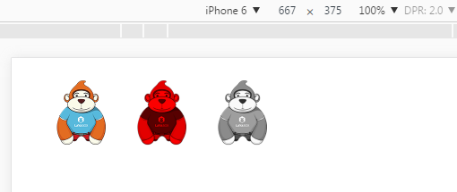
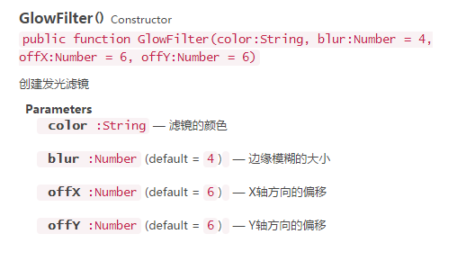
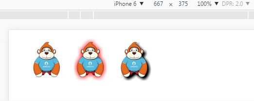

# Filter effect

> LayaAir engine provides 3 effects:  color filter, light (or shadow) filter and  blur filter. The color filter supports Canvas and WebGL mode, light filter and blur filter support only WebGL mode because of the large consumption of performance.


## 1. Set the color filter

### 1.1 Introducing Color Filter API

The color filter class ColorFilter is located in laya.filters package, change the color channel by specifying the matrix (arranged in 4 x 5 matrix).

Click   [laya.filters.ColorFilter ](http://layaair.ldc.layabox.com/api/index.html?category=Filter&class=laya.filters.ColorFilter) to view the API instructions.


### 1.2 Set color filter

If you want to set a color filter for a bitmap, you need to set a color matrix first, and then use a ColorFilter method to create a color filter, as shown in the following code:

```java
//颜色矩阵，红色
var colorMatrix = 
  [
  1, 0, 0, 0, 0, //R
  0, 0, 0, 0, 0, //G
  0, 0, 0, 0, 0, //B
  0, 0, 0, 1, 0, //A
];

//创建颜色滤镜
var redFilter = new Laya.ColorFilter(colorMatrix)
```

Finally,through the Sprite's filters property, the color filter effect is superimposed on the bitmap. Then, we create a Main.js entry class and set it as the default application (recommended by FlashBuilder). Write the code as follows:

```javascript
//初始化舞台
Laya.init(1334, 750,Laya.WebGL);
//设置舞台背景色
Laya.stage.bgColor = "#ffffff";
//原始位图
createImg(100,50);
//红色滤镜
creteRedFilter();
//灰色滤镜
createGrayFilter();

/**创建位图**/
function createImg(w,h){
    var Img = new Laya.Sprite(); 
			 
    //添加到舞台
    Laya.stage.addChild(Img);   
    
    //加载显示图片
    Img.loadImage("res/img/monkey1.png",w,h);  
    
    return Img;
}
/**创建红色滤镜位图**/
function creteRedFilter(){
    //颜色滤镜矩阵,红色
    var colorMatrix = 
        [
            1, 0, 0, 0, 0, //R
            0, 0, 0, 0, 0, //G
            0, 0, 0, 0, 0, //B
            0, 0, 0, 1, 0, //A
        ];
    
    //创建红色颜色滤镜
    var redFilter = new Laya.ColorFilter(colorMatrix);
        
    //在坐标280,50位置创建一个位图
    var img = createImg(280,50); 
    //添加红色颜色滤镜效果
    img.filters = [redFilter];
}
/**创建灰色滤镜位图**/
function createGrayFilter(){
    //颜色滤镜矩阵,灰色
    var colorMatrix = 
        [
            0.3086, 0.6094, 0.0820, 0, 0,  //R
            0.3086, 0.6094, 0.0820, 0, 0, //G
            0.3086, 0.6094, 0.0820, 0, 0,  //B
            0, 0, 0, 1, 0, //A
        ];
    //创建灰色颜色滤镜
    var GrayFilter = new Laya.ColorFilter(colorMatrix);
    
    //在坐标460,50位置创建一个位图
    var img = createImg(460,50); 	
    //添加灰色颜色滤镜效果
    img.filters = [GrayFilter];
}
```

In the above code, we created a original  raw bitmap, with red filter effect bitmap and gray filter effect bitmap. Operation results shown in Figure 1:

 <br /> (Picture 1)


## 2. set the light and shadow filter

### 2.1 Introduction to the light filter API

The light filter class for GlowFilter is located in the laya.filters package, and the shading angle can also be adjusting  as a shadow filter. The parameters are shown in Figure 2. Note: This filter only works in WebGL mode.

 <br /> (Picture 2)

Click on [laya.filters. GlowFilter](http://layaair.ldc.layabox.com/api/index.html?category=Filter&class=laya.filters.GlowFilter)  to see the API instructions.


### 2.2 Set up filter and shadow filter

The light and shadow filter settings is simple, and we directly look through the code to see the example results,

first create a Main.js entry class and set it as the default application. Write the code as follows:


```javascript
//初始化舞台
Laya.init(1334,750,Laya.WebGL);
//设置舞台背景色
Laya.stage.bgColor = "#ffffff";
//原始位图
createImg(100,50);
//发光滤镜
createGlowFilter();
//阴影滤镜
createShadeFilter();

/**创建位图**/
function createImg(w,h){
    var Img = new Laya.Sprite();
    //添加到舞台
    Laya.stage.addChild(Img);
    //加载显示图片，坐标位于100,50
    Img.loadImage("res/img/monkey1.png",w,h);
    return Img;
}
/**创建发光滤镜位图**/
function createGlowFilter(){
    //创建发光滤镜位图
    var glowFilter = new Laya.GlowFilter("#ff0000",15,0,0);
    //在坐标280,50创建位图
    var img = createImg(280,50);
    //添加发光滤镜
    img.filters = [glowFilter];
}
/**创建阴影滤镜位图**/
function createShadeFilter(){
    //创建阴影滤镜
    var glowFilter = new Laya.GlowFilter("#000000",8,8,8);
    //在坐标460,50创建位图
    var img = createImg(460,50);
    //添加阴影滤镜
    img.filters = [glowFilter];
}
```

In the code above, we created a new bitmap, apply light filter effect and a shadow filter effect on it. The running effect is shown in figure 3:

 <br /> (Picture 3)


## 3、Set blur filter

### 3.1 Fuzzy filter API introducing

The BlurFilter class located in the laya.filters package. It is possible to adjust the intensity  parameter. The parameter instructions are shown in figure 4. Note: this filter only supports WebGL mode.

 <br /> (Picture 4)

Click on   [laya.filters. BlurFilter](http://layaair.ldc.layabox.com/api/index.html?category=Filter&class=laya.filters.BlurFilter)   to view the API instructions.


### 3.2 Set the blur filter

Blur filter settings are relatively simple. Create a filter instance, and then set the fuzzy strength attribute. Superimposed on the bitmap, and  see the sample effect directly through the code.

First create a Main.js entry class and set it as the default application (recommended with FlashBuilder). Write the code as follows:


```javascript
//初始化舞台
Laya.init(1334,750,Laya.WebGL);
//设置舞台背景色
Laya.stage.bgColor = "#ffffff";
//原始位图
createImg(100,50);
//模糊滤镜
createBlurFilter();


/**创建位图**/
function createImg(w,h){
    var Img = new Laya.Sprite();
    //添加到舞台
    Laya.stage.addChild(Img);
    //加载显示图片，坐标位于100,50
    Img.loadImage("res/img/monkey1.png",w,h);
    return Img;
}
/**创建糊滤滤镜位图**/
function createBlurFilter(){
    //创建模糊滤镜实例
    var blurFilter = new Laya.BlurFilter();
    //设置模糊强度
    blurFilter.strength = 5;
    //在坐标280,50创建位图
    var img = createImg(280,50);
    //添加滤镜效果
    img.filters = [blurFilter];
}
```

In the code above, we created an raw original bitmap with blur filter effect bitmap. The running effect is shown in figure 5:

 <br /> (Picture 5)


