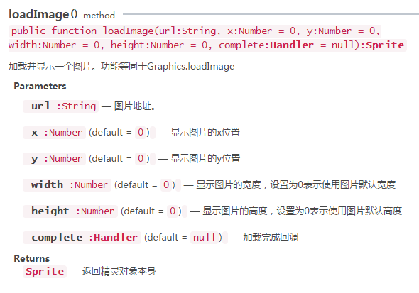

# 显示与切换图片

> 图片的显示是游戏开发基础，本篇从API到示例分别介绍Sprite.loadImage与Graphics.drawTexture两种显示图片的方法。

## 1、用loadImage方法显示与切换图片

### 1.1 loadImage API概述

在API文档中搜索laya.display.Sprite，可以找到loadImage()方法，如图1所示，我们先熟悉一下该方法的参数。

 <br /> (图1)

### 1.2 用loadImage加载显示图片的示例

创建一个Main.js入口类，编写代码如下：

```javascript
//初始化舞台
Laya.init(1334, 750);
//设置舞台背景色
Laya.stage.bgColor = "#ffffff";
var img = new Laya.Sprite();
//加载显示图片，坐标位于100,50
img.loadImage("res/img/monkey1.png",100,50);
//添加到舞台
Laya.stage.addChild(img);
```

在示例代码里，“`100,50`”是图片的显示坐标信息。示例代码运行效果如图2-1所示：

 <br /> (图2-1)

### 1.3 用loadImage切换图片的示例

  切换图片是在显示图片的基础之上，增加了清空绘制，然后通过代码逻辑获得新的图片资源重新绘制。具体的代码说明可以参考代码注释及API，结合实例运行体验。

下面我们在Main.js类中修改代码为如下所示：

```javascript
//初始化舞台
Laya.init(1334, 750);

//需要切换的图片资源路径
this.monkey1 = "res/img/monkey1.png";
this.monkey2 = "res/img/monkey2.png";
//切换状态
this.flag = false;

//设置舞台背景色
Laya.stage.bgColor = "#ffffff";
this.img = new Laya.Sprite();
//显示绘制的图片
switchImg();
//侦听switchImg中图片区域的点击事件，触发后执行switchImg切换图片
this.img.on(Laya.Event.CLICK,this,switchImg);
//添加到舞台
Laya.stage.addChild(img);

function switchImg(){
    //清空图片
    this.img.graphics.clear();
    //获得要切换的图片资源路径
    var imgUrl = (this.flag = !this.flag)? this.monkey1:this.monkey2;
    //加载显示图片，坐标位于100,50
    this.img.loadImage(imgUrl, 100, 50);
}
```

运行代码效果如动图2-2所示：

 <br /> (动图2-2)


## 2 、用drawTexture方法显示与切换图片

### 2.1  drawTexture API 概述

在API文档中搜索laya.display.Graphics，可以找到drawTexture()方法，除此之外，还需要了解laya.net.LoaderManager中的load()方法和getRes()方法，以及laya.utils.Handler中的create()方法，各方法的参数图3、图4、图5、图6所示：

 <br /> (图3)

 <br /> (图4)

 <br /> (图5)

 <br /> (图6)


### 2.2 用drawTexture 加载显示图片的示例

​     loadImage()方法可以即时加载外部图片资源，也可以从缓冲区读取图片资源，drawTexture()方法则必须先加载完图片后，再绘制添加到舞台中来，因此在示例代码中需要使用到加载（`Laya.loader.load()`）与回调(`Handler.create()`)的方法，下面我们通过简单的示例代码加载显示一张图片，代码说明请查看代码中的注释部分以及相关API说明。

创建一个Main.js类，编写代码如下：

```javascript
//初始化舞台
Laya.init(1334, 750);

//需要切换的图片资源路径
this.monkey2 = "res/img/monkey2.png";

//设置舞台背景色
Laya.stage.bgColor = "#ffffff";
//先加载图片资源，在图片资源加载成功后，通过回调方法绘制图片并添加到舞台
Laya.loader.load(this.monkey2,Laya.Handler.create(this,graphicsImg));
function graphicsImg(){
    var img = new Laya.Sprite();
    //获取图片资源，绘制到画布
    img.graphics.drawTexture(Laya.loader.getRes(this.monkey2),100,50);
    //添加到舞台
    Laya.stage.addChild(img);
}
```

代码运行效果如图7-1所示。

 <br /> (图7-1)


### 2.3 用drawTexture 切换图片的示例

 切换图片是在显示图片的基础之上，增加了清空绘制，然后通过代码逻辑获得新的图片资源重新绘制。具体的代码说明可以参考代码注释及API，结合实例运行体验。

下面我们在Main.js类中修改代码为如下所示：

```javascript
//初始化舞台
Laya.init(1334, 750);

//需要切换的图片资源路径
this.monkey1 = "res/img/monkey1.png";
this.monkey2 = "res/img/monkey2.png";
//切换状态
this.flag = false;
//设置舞台背景色
Laya.stage.bgColor = "#ffffff";
//加载多张图片，在图片资源加载成功后，通过回调方法绘制图片并添加到舞台
Laya.loader.load([this.monkey1,this.monkey2],Laya.Handler.create(this,graphicsImg));
function graphicsImg(){
    //创建一个实例
    this.img = new Laya.Sprite();
    //添加到舞台
    Laya.stage.addChild(this.img);
    //显示初始化绘制的图片
    switchImg();
    //侦听switchImg中图片区域的点击事件，触发后执行switchImg切换纹理绘制
    this.img.on(Laya.Event.CLICK,this,switchImg);			

    //设置图片坐标s
    this.img.pos(100,50);
}
function switchImg(){
    //清空绘制
    this.img.graphics.clear();
    //获得要切换的图片资源路径
    var imgUrl = (this.flag = !this.flag)? this.monkey2:this.monkey1;
    //获取图片资源
    var texture = Laya.loader.getRes(imgUrl);
    //绘制纹理
    this.img.graphics.drawTexture(texture);                        
    //设置纹理宽高
    this.img.size(texture.width, texture.height);   
}
```

代码运行效果如图7-2所示。

 <br /> (动图7-2)


