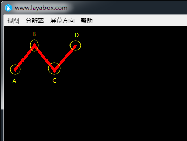
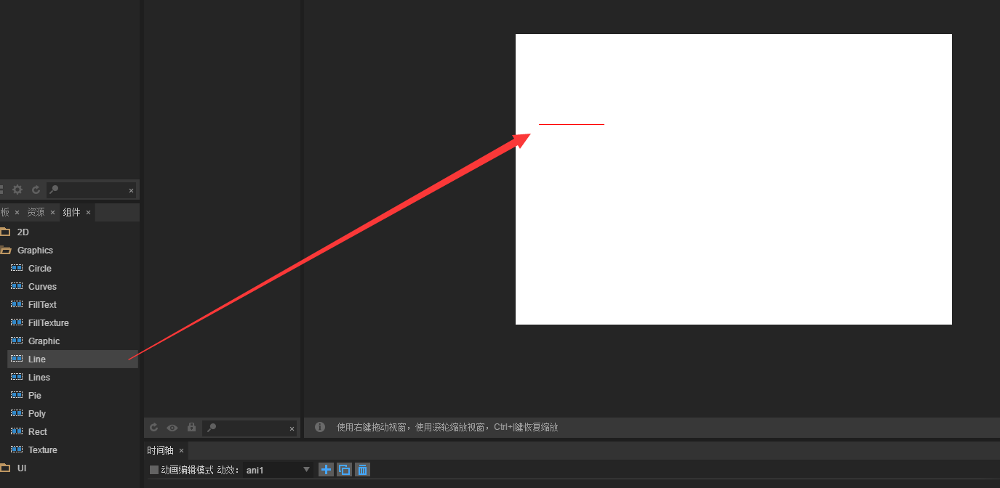
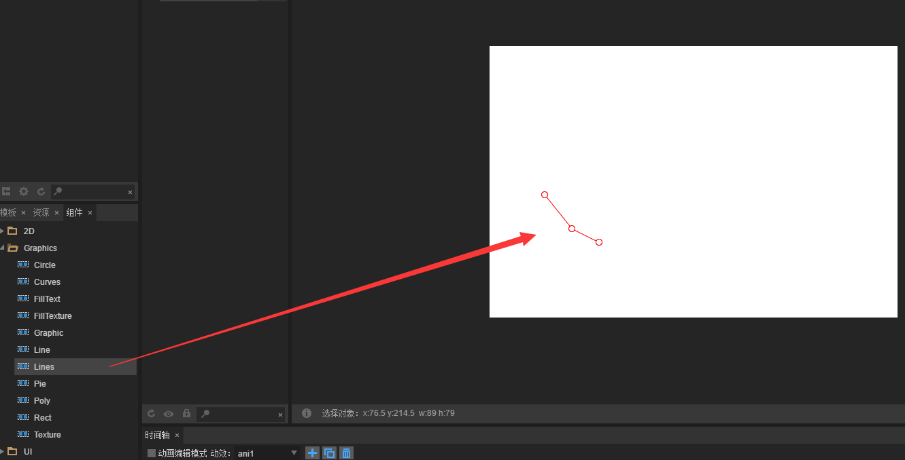
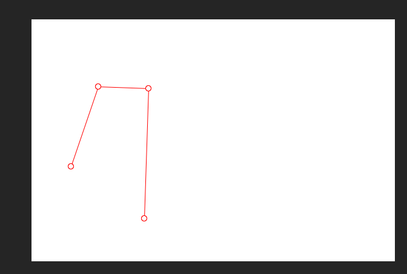

# Draw line and polylines


### 1. Draw a straight line

​        Search in the API The laya.display.Graphics class various vector drawing methods. drawLine (); is able to draw vector lines, detailed description of the method is shown below:

​	<br/>
​	(picture 1)

Here, we use the LayaAir engine to draw a straight line, the sample code is as follows:

```javascript
(function()
{
    var Sprite = Laya.Sprite;
    var Stage  = Laya.Stage;
    var WebGL  = Laya.WebGL;
    var sp;
 
    (function()
    {
        //初始化舞台
        Laya.init(500, 300, WebGL);
        drawSomething();
    })();
 
    function drawSomething()
    {
        sp = new Sprite();
        Laya.stage.addChild(sp);
        //画直线
        sp.graphics.drawLine(10, 58, 167, 58, "#ff0000", 5);
    }
})();
```

After the release, as shown in the picture below, we draw a red straight line.

​	<br/>
​	(Picture 2)


### 2. Draw the broken line

So how do you draw multiple polyline? Use the drawLines () method directly. This method is similar to drawLine, so careful of adding the plurial letter "s". The parameters of drawLines are shown in the following figure:

​	<br/>
​	(Picture 3)

Here we use the LayaAir engine to draw a polyline, the sample code is as follows:


Code run

```javascript
(function()
{
    var Sprite = Laya.Sprite;
    var Stage  = Laya.Stage;
    var WebGL  = Laya.WebGL;
    var sp;
 
    (function()
    {
        //初始化舞台
        Laya.init(500, 300, WebGL);
        drawSomething();
    })();
 
    function drawSomething()
    {
        sp = new Sprite();
        Laya.stage.addChild(sp);
        //画折线
        sp.graphics.drawLines(20, 88, [0, 0, 39, -50, 78, 0, 120, -50],  "#ff0000", 5);
    }
})();
```

Effect:

​	<br/>
​	(Picture 4)

From the code, we can see that the difference between the drawn polyline and straight line is started from the third parameters, array type which set of broken line points. With point A(0, 0) is the starting coordinate,  B (39, -50), C (78, 0) and D (120, -50). But what you need to understand and notice here is that all the given coordinates are relative coordinates, which are affected by the first and second attributes parameters : "20" and "88". Once the "20" and "88" are changed, the overall polyline will be affected.

In the actual coding process, you can adjust the parameters manually to display your own modifications.


### C. use LayaAirIDE drag control to draw a straight line

**1 **: Open our LayaAirIDE and click design mode to create a new View page

​	<br/>
​   	(Picture 5) 

**2 **: Drag the curve component in the component from View page to automatically generate the default straight line

​	<br/>
​   	(Picture 6)  

**3 **: Modify (add / reduce) the values in the Line component property, change the length, width, color and so on.

​   	<br/>
​   	(Picture 7)    

​   	<br/>
​   	(Picture 8)    


### D. Use the LayaAirIDE drag control to draw the polyline

**1 **: open our LayaAirIDE and click design mode to create a new View page

​	<br/>
​   	(Picture 9)  

**2 **: Drag the curve component in the view page to automatically generate the default polyline

​	<br/>
​   	(Picture 10)   

**3 **: Modify (add / subtract) the values in the Lines component's properties, change the line angle, color, width, or add new discounts for the polyline.

​   	<br/>
​   	(Picture 11)    

​   	<br/>
​   	(Picture 12)   

Here we draw the line and polyline through the components in LayaAir IDE.