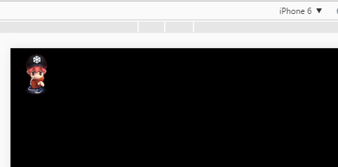
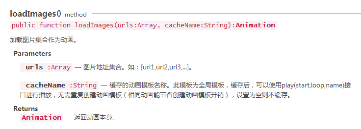

# Atlas animation usage

### 1. atlas animation overview

In game development, the use of animation is basically everywhere, LayaAir engine provides a powerful animation animation class, it can use a variety of animation resources to generate game animation.

We can use the LayaAir IDE to create timeline animation generated by the  extension file “.ani“ resources. You can also use the Atlas packaged animation frame picture, with extension named “.Atlas“ resources.

This article will introduce the production method of atlas animation, as shown in Figure 1,  an example of the realization of the atlas animation with commonly used operations.

<br/> (Picture 1)


### 2. Play the cartoon animation

#### 2.1 Atlas resource settings

Animation Atlas resources need to pay attention to some case such as the role of class animation. (Figure 2)

<br/>(Picture 2)

**Tips**：

- IDE atlas packaging tools,  will be packaged into directory for each Atlas, details refer to the document "Atlas production and use of detailed explanation.
- "Special effects animation" have many effect frame number, so it combines into number of special effects in collection resources (placed in directory).

After the IDE is packaged, 3 files are generated, “.atlas”,“.json”,".png" files (Figure 3). Animation class get image resources by loading  “.atlas” or “.json”  files. It is recommended to use the “.atlas”  file (you do not need to add a type setting code when using it).

<br/>(Picture 3)


#### 2.2 loading animation Atlas resources

Through the `loadAtlas()` method of the `laya.display.Animation` class, we load character animation resources , the basic description of the method shown in Figure 4.

<br/> (Picture 4)

##### Sample code:

Create the entry document class AtlasAniDemo.js, and write the code as follows:

```javascript
//初始化舞台
Laya.init(1334, 750,Laya.WebGL);
//创建动画实例
this.roleAni = new Laya.Animation();
//加载动画图集，加载成功后执行回调方法
this.roleAni.loadAtlas("res/atlas/role.atlas",Laya.Handler.create(this,onLoaded));
function onLoaded(){
    //添加到舞台
    Laya.stage.addChild(this.roleAni);
}


```

Run the code, as shown in Figure 5. Animation has been loaded on the stage, the default state is not played.

 

(Picture 5)

#### 2.3 Play atlas animation

Load Atlas animation using the loadAtlas () method, you need also to use the play () method to run animation. The API parameters for the play () method are shown in Figure 6.

<br/>(Picture 6)

We continue to use the previous example to add play () to the onLoaded method.

The code in the onLoaded method is shown below

```javascript
function onLoaded(){
    //添加到舞台
    Laya.stage.addChild(this.roleAni);
    //播放动画
    this.roleAni.play();
}
```

The code runs as shown in Figure 7

 

(Picture 7)

#### 2.4 Create animated templates with createFrames to play the animations specified in the atlas collection.

If the plot is a separate sequence frame animation, it can be played directly using the play() method. However, if you want to play the specified animation, you need to create an animation template to fit multiple animations into an atlas. The animation template method is`Animation.createFrames()`, as shown in Figure 8.

<br/> (Picture 8)

##### Create effect of animated templates

Let's review the third parameter of the `play()` method `name`. When we create a set a group of animated templates, name parameter of the `play()` method can use the name of the animation template. 

Here we continue the previous example, by creating an animation template to play only  the "dizzy"state label.

The code is written below:

```javascript
//初始化舞台
Laya.init(1334, 750,Laya.WebGL);
//创建动画实例
this.roleAni = new Laya.Animation();
//加载动画图集，加载成功后执行回调方法
this.roleAni.loadAtlas("res/atlas/role.atlas",Laya.Handler.create(this,onLoaded));
function onLoaded(){
    //添加到舞台
    Laya.stage.addChild(this.roleAni);
    //创建动画模板dizziness
    Laya.Animation.createFrames(aniUrls("die",6),"dizziness");
    //循环播放动画
    this.roleAni.play(0,true,"dizziness");
}
/**
 * 创建一组动画的url数组（美术资源地址数组）
 * aniName  动作的名称，用于生成url
 * length   动画最后一帧的索引值，
 */	
function aniUrls(aniName,length){
    var urls = [];
    for(var i = 0;i<length;i++){
        //动画资源路径要和动画图集打包前的资源命名对应起来
        urls.push("role/"+aniName+i+".png");
    }
    return urls;
}
```

The code runs as shown in Figure 9, and only the actions of the animation template are played in the chart.

 

(Picture 9)

Tips: although each set of actions can be individually packaged into an atlas, it can also play directly. But separate set will increase the amount of resources loaded and increase the performance cost of the game.


#### 2.5 Use loadImages to directly play the animations specified in the atlas

In addition to creating animation templates with the static method `createFrames()`, you can also use the loadImages() method to implement the dizzy animation effects specified in the play chart. Let's take a look at the parameters of the `loadImages()` method, as shown in figure 10.

 

(Picture 10)

Since loadImages()  creates animation templates, URLs receives a collection of picture addresses, so we need to use Laya.loader.load() to load the atlas files first. Let's take a look at the sample code and the comments.

```javascript
//初始化舞台
Laya.init(1334, 750,Laya.WebGL);
//加载完动画的图集后执行回调方法onLoaded
Laya.loader.load("res/atlas/role.atlas",Laya.Handler.create(this,onLoaded));
function onLoaded(){
    //创建动画实例
    this.roleAni = new Laya.Animation();
    //添加到舞台
    Laya.stage.addChild(this.roleAni);
    //通过数组加载动画资源，然后用play方法直接播放。由于loadImages方法返回的是Animation对象本身，可以直接使用“loadImages(...).play(...);”语法。
    this.roleAni.loadImages(aniUrls("move",6)).play();
}
/**
 * 创建一组动画的url数组（美术资源地址数组）
 * aniName  动作的名称，用于生成url
 * length   动画最后一帧的索引值，
 */	
function aniUrls(aniName,length){
    var urls = [];
    for(var i = 0;i<length;i++){
        //动画资源路径要和动画图集打包前的资源命名对应起来
        urls.push("role/"+aniName+i+".png");
    }
    return urls;
}
```

The code runs as shown in Figure 11

 

(Picture 11)

**Tips**：

- loadImage method can also create animation templates, such as the above loading and playing to rewrite `roleAni.loadImages(aniUrls("move",6),"walk").play();` and the value of the second parameter name “walk”  is the animation template（*key*）。
- When used repeatedly, the use of animation templates can be the cost of the CPU


### 3、Other indications

#### 3.1 API

common method of Atlas animation used API this article  have been introduced, for further Animation properties introduced, you can view the API document:

Animation base class:

[https://layaair.ldc.layabox.com/api/?category=Core&class=laya.display.AnimationPlayerBase](https://layaair.ldc.layabox.com/api/?category=Core&class=laya.display.AnimationPlayerBase)

Animation class:

[https://layaair.ldc.layabox.com/api/?category=Core&class=laya.display.Animation](https://layaair.ldc.layabox.com/api/?category=Core&class=laya.display.Animation)


#### 3.2 IDE production Atlas animation

Set Atlas animation in the IDE design UI is possible. Make a direct use of Animation components, more visual way will be more intuitive.From IDE animation part , you can view the `Animation component properties` and the use of  `LayaAirIDE production animations`  at these two documents.
