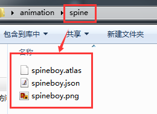
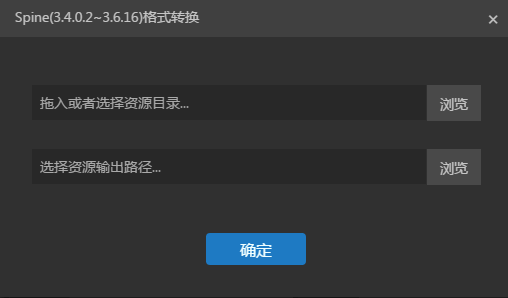
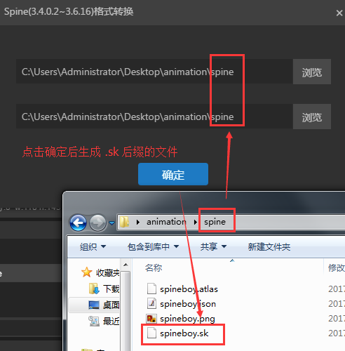
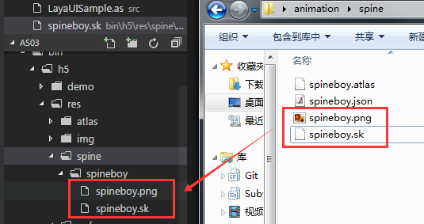
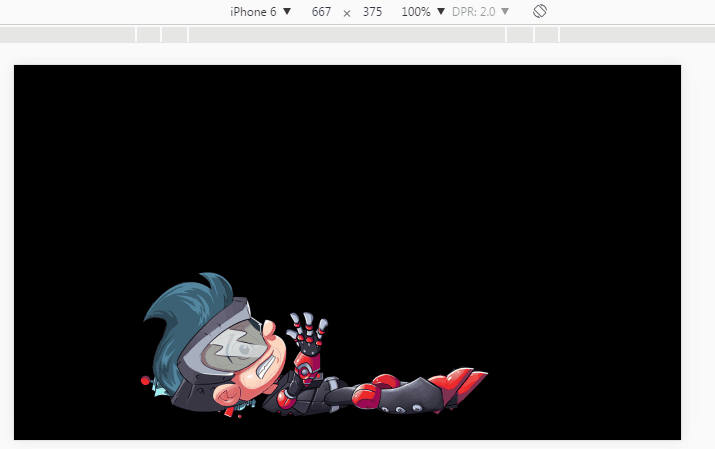

# LayaAir engine plays Spine skeleton animation

> This article uses LayaAirIDE 1.7.6 version screenshot description, if any differences, please download the latest stable version of LayaAirIDE, and the latest version shall prevail.

Spine skeletal animation is one of the skeletal animations frequently used in games. The Spine skeletal animation format can be converted into a skeletal animation format supported by the LayaAir engine with LayaAirIDE's own conversion tool.


### 1. Original Spine skeleton animation specificities

In the export of the original Spine skeletal animation, several things need to pay attention to, or you can't complete the conversion.

#### 1.1 Supports export only JSON format conversions 

Spine skeletal animation supports JSON and binary two data export methods, it should be noted that the LayaAirIDE Spine conversion tools only support JSON format version. When exporting, select export in JSON format.

#### 1.2 You must create Atlas when exporting

The LayaAirIDE Spine conversion tool supports only the  Spine skeletal animation with atlas mode, so you must check the `creation atlas` when you export using the Spine skeletal animation editing tool, as shown in figure 1.

 

(Picture 1) Spine the export of editing tool interface for the Spine skeletal animation

#### 1.3 In the atlas package settings item, you can not check the rotation options

On the right side of the creation of the Spine skeleton animation editing tool, click the `Setting` button, enter the atlas packaging settings tab (Pack Settings) interface. Make sure that the `settings`  option in the locale is unchecked. After you select the `旋转`选项后，LayaAirIDE转换Spine工具，无法转换成功。

 

(Picture 2) Spine skeleton animation export atlas packaging settings interface

#### 1.4 Notify the exported version of Spine

LayaAirIDE does not support all conversions for all Spine versions. The supported version numbers are displayed in the Spine Conversion Tool panel. As of this document, Spine released version has been supported  from 3.4.0.2 to 3.6.16. 
Subsequent LayaAirIDE will update the Spine version regularly, and the developer may be concerned about the change status of the version number in the conversion tool panel.

#### 1.5  Convert the entire exported directory

The exported files generated are `atlas,json,png`, as shown in figure 3. It should be noted that when converting tools, you do not drag files directly to convert, and drag the entire parent directory, such as the spine directory in Figure 3, into the conversion panel.

 

(Picture 3)


### 2. Spine animation converted to LayaAir engine to identify the format

#### 2.1 Open the Conversion Tool panel

In the `design mode` of LayaAirIDE, click the menu bar `tool ` --> `Spine animation conversion` , as shown in Figure 4, you can open the `Spine format conversion` tool.

 

(Picture 4)


In `Spine format conversion` tool panel, the top Spine behind the brackets is about support the  version number conversion, as shown in Figure 5. Current support from Spine 3.4.0.2 to 3.6.16 version and by the LayaAir engine.

 

(Picture 5)


#### 2.2 Generate .sk suffix for skeletal animation files

After opening the  ` Spine Format Conversion`drag the spine exported resource directory into the conversion panel, or click the Browse button to select the spine exported resource directory. And then click `OK` to create a new .sk suffix skeletal animation file in the original resource directory. As shown in Figure 6.

 

(Picture 6)


### 3. Spine animation loading display

#### 3.1 Copy the converted spine animation resource to the corresponding directory of the project.

In addition to converting the generated .sk format file, the .png suffix library resource also needs to be copied to the project's directory, as shown in Figure 7. (Other exported files are not used for conversion tools only.)

 

(Picture 7)

#### 3.2 spine animation playback example

Following example will use the `laya.ani.bone.Skeleton`  class, and the specific API instructions can directly open the link view:[https://layaair.ldc.layabox.com/api/?category=Bone&class=laya.ani.bone.Skeleton](https://layaair.ldc.layabox.com/api/?category=Bone&class=laya.ani.bone.Skeleton)

Create a document class SpineDemo.js, code written as follows:

```javascript
//初始化舞台
Laya.init(1334,750);
//创建一个Skeleton对象
var skeleton = new Laya.Skeleton();
//添加到舞台
Laya.stage.addChild(skeleton);
skeleton.pos(600,700);
//通过加载直接创建动画
skeleton.load("res/spine/spineboy/spineboy.sk");
```
The operation effect is shown in Figure 8

 

(Picture 8)


