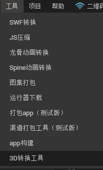
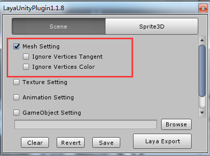
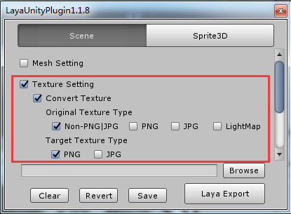
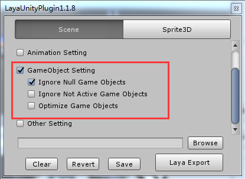

## Unity plug-in utility


### Download the LayaAir3D export tool

Download address http://ldc.layabox.com/download/tools/LayaAir3DConvertTools.zip

Or under ide menu ----- Tools ----3D conversion tool (Figure 1).

After downloading, we can see two tools, one is for converting FBX format FBXTools tools, this tool will no longer maintain updates, suggest that developers use another unity exportPlug-in tools, more convenient for developers to build the game world and export use.

<br>（Picture 1）


### Install plug-in package

Launch unity, create a new project, and import the resources and materials, maps and etc.. The name of the project can be named according to your own needs. Ctrl+s saves our scene, and we save the name here which called truck.

Right to import LayaAir3D conversion tools at the resource management interface. The plug-in version will be updated as the LayaAir engine function increases, but the import method is completely the same.

When the import tool succeeds, a LayaPlugin folder appears in the resource management interface, and the export plug-in menu LayaPlugin appears in the unity menu bar. As shown in figure 2:

<br>（Picture 2）

​

### Export resource settings

We create a car model in unity, and then we export it with the plug-in of LayaAir. Click the menu bar LayaPlugin, the export settings panel will appear, which we will explain in detail for you.

<br>（Picture 3）


#### Export resource categories

**Scene class** refers to the whole scene, whether in the scene model, texture, texture, animation, or light maps derived, mainly used for scene production, the file extension is .ls, need to use the Scene class or its inheritance class loading.

**Sprite3D class** scene less than Lightmapped are often used to separate resources derived characters or game activity in the article, the file extension is .lh, with Spite3D loading.

Their loading, we will introduce in the “3D technical document - LayaAir3D model" chapter

#### Mesh Setting

Grid data export settings, two information check (Figure 4), they can play the model grid LM file size compression effect, suggestions such as projects not tangent (not normal map) and vertex color, please check, can save about 20% of the size of the resource model.

Ignore Vertices Tangent        ignores vertex tangent information
Ignore Vertices Color             ignores vertex color information

<br>（picture 4）


#### Texture Setting

Map export settings, check out, such as (Figure 5) information, in the layaAir engine only supports png and jpg format pictures, if the project uses other formats, the game will load an error, so you need to convert.

Original Texture Type　The format files that needs to be converted
Non-PNG|JPG　　non png|jpg and tga,psd,gif,tif,bmp,exr are not supported
PNG,JPG　　　　PNG format resources used in the original scene and the JPG format resources used
LightMap　　　　Illumination map (only selecting Scene class export will have). Use PhotoShop conversion is recommended

Target Texture Type　 Converts the target texture type
PNG 　　　　　　 PNG format, with transparent channel
JPG　　　　　　　Converted to jpg with compression, optional compression quality

<br>（picture 5）


#### Animation Setting

Animation export settings（picture 6）

Optimize Bones   removes the useless bones in animation and removes only useless bones that do not affect the animation of bones
Compress Lsani   Temporarily useless, developing, compressing skeletal animation data, reducing file size

<br>（picture 6）


#### Terrain Setting

Unity type export settings (Figure 7)

Convert Terrain To Mesh  
If there is a type in the scene, convert it into a mesh model.
Unity terrain-making is very convenient, you can use the brush to draw terrain, such as mountains, rivers and ditches, but also support the brush to draw multiple details of the map, for several maps of the surface. LayaAir export plug-in will be converted to Mesh type, convenient for developers to use. The difference is that the material is different from ordinary materials, including the details of the map.

Resolution
Export model mesh surface optimization settings, the general default Medium can be select. The following is the set of optimization levels, each of which is equivalent to the precision of the number of surfaces divided by 4.


Very Height  The highest number of surfaces after optimization
Height           The optimal number of surfaces is relatively high
Medium	       The optimized number of surfaces is medium
Low		       Low surface number after optimization
Very Low       The minimum number of surfaces is the lowest    

<br>（Picture 7）


#### GameObject Setting 

Game items node settings（picture 8）

Ignore Null Game Objects 
The empty nodes are ignored when exporting, and the nodes that are not supported by the LayaAir engine are also labeled as empty nodes, such as camera nodes and light nodes, which can reduce the number of sprites.

Ignore Not Active Game Objects 
When exporting, the nodes that are not activated in the unity scene are ignored.

Optimize Game Objects 
When exporting from the first level node in the unity scene, the tree structure is flatten and all unnecessary nodes are deleted to minimize the number of sprites.

Batch Make The First Level Game Objects 
Batch export (you must select sprite3d only) Batch export all level one node in the scene.

 <br>（Picture 8）


#### Other Setting

Other settings（Picture 9）

Cover Original Export Files 
Export raw export file when exporting

Customize Export Root Directory Name 
Custom export folder name, the default folder name is“layaScene+scene name”.

Automatically Save The Configuration 
Automatically save current configuration when exporting

 <br>（Picture 9）


#### Export settings

Browse saved file path
Clear   Clears the current configuration
Revert reads the saved configuration from the configuration table
Save   Save the current configuration, saved, the next time you open the direct configuration before use to facilitate developers to operate.
Laya Export exports the current resource. After clicking, the data of the current scene or model will be exported to the specified path.

 <br>（Picture 10）


### Exported resources are briefly introduced

When the output scenario is configured, click the Laya Export button, and then export the default LayaScene_truck folder (Figure 10).

 <br>（Picture 11）

See the file resources on the map, generated after the export. Ls, .lm, .lmat data resources, and maps png, tga resources.

.ls is a scene file, which is generated when the Scene class is exported. It contains all kinds of data needed by the scene, model, illumination map, position and so on, and needs to be 

loaded with Scene class.

.lh is a model file, generated when you choose to export the Sprite3D category, is missing lightmap file information, and others are the same as .ls.

.lm is the model data file, equivalent to FBX format conversion, can be loaded by MeshSprite3D class.

.lmat is the material data file, which is the material information which is set for the model in unity. When loading.Ls or.Lh file, it will automatically load.Lmat to produce material. .lmat can also manually modify some of its properties.

.lani  is the animation data file (the model in Figure 10 is not animated, so it is not generated when exporting). If there is an animation on the model, the animation configuration file will be 

generated, and the skeleton or frame animation information will be generated.

Their specific usage will be described in detail in the following course documentation.


### Simply load the instance

We copy the contents of the LayaScene_truck folder to the root directory of the project under bin/h5/下。

Tips：the simple loading application is introduced in this chapter. After exporting, all kinds of formats are generated. Their detailed description will be introduced in the 3D technical document “LayaAir3D Scene” and “Introduce to model in LayaAir3D” articles

Load scene .ls sample code is as below.

```java
var LayaAir3D = (function () 
{
    function LayaAir3D() 
    {
        //初始化引擎
        Laya3D.init(0, 0,true);
        Laya.stage.scaleMode = Laya.Stage.SCALE_FULL;
        Laya.stage.screenMode = Laya.Stage.SCREEN_NONE;
        Laya.Stat.show();

        //添加3D场景
        var scene = Laya.Scene.load("LayaScene_truck/truck.ls");
        Laya.stage.addChild(scene);

        //创建摄像机(横纵比，近距裁剪，远距裁剪)
        var camera= new Laya.Camera( 0, 0.1, 1000);
        //加载到场景
        scene.addChild(camera);
        //移动摄像机位置
        camera.transform.position=new Laya.Vector3(-8, 4, 15);
        //旋转摄像机角度
        camera.transform.rotate(new Laya.Vector3( -8, -25, 0), true, false);
	}
 	return LayaAir3D;
} ());

LayaAir3D();
```

Compile and run the above simple code, we found that the scene is loaded successfully, and the model in the scene is also displayed on the 3D view (Figure 10).

 <br>（picture 12）

