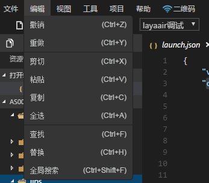
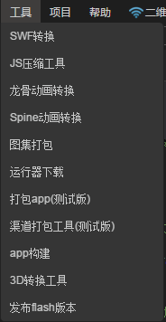

# Menu bar

 

​  The code mode menu bar contains a set of commonly used functions and options. In this chapter, we'll give you a detailed description of the code pattern menu bar.
  
​        (Figure 1) menu bar panel

 

## 1. File

​         
​        File list (Figure 2)

​        **New project**：Pop-up window and let users to select a new project name, location, project type supports AS, JS, TS .

​        **Create a new file**：Make a new document in the Edit View window. The document location can be found in the Work File section from Resource View window. The new code document will be generated only when the save operation is performed.

​        **New window**：New window will pop up a new code editing window for you to create a new project or open other items to edit.

​        **Open the project**：Launching project will pop up an Explorer style browser window to browser location of the project. Once confirmed, the IDE will switch to the new project you opened.

​        **Open the folder**：Select folder will pop up an Explorer style browser window to the the folder location, confirm the resource view window automatically add your open folder.

​        **Save**：Save the current operation file.

​        **Save as**：Save the current operation file as a new file.

​        **Save all**：Perform a save operation on all files.

​        **Refresh editor**： Refresh the editor's real time state.

  

## 2. Editing

​         
​        (Figure 3) edit the list

 

​        **Undo**：Undo the current operation

​        **Redo**：Restore a cancelled operation.

​        **Cut**：Select the selected paragraph or file for cutting.

​        **Paste**：Paste or copy the copied paragraph or file paste operation.

​        **Copy**：Copy the selected paragraph or file.

​        **Select**：Select the contents of the file.

​        **Find**：Find the function window on the top of the edit view window for keyword search.

​         
​        (Figure 4) find the panel

​        **Replace**：Function window on the top right of the edit view window to replace keywords.

​        **Global search**：Convert the resource view window into the global search window, search the keyword for all items, list all the file paths that contain the keyword, and the number of keywords and the number of keywords. And highlight the keyword in the code edit window.

 

## 3. View

​         
​        (Figure 5) view list

​        **File**：If the resource management view is masked, this option will reproduce the Explorer window. 

​        **Search**：If the global search window is blocked, this option will reproduce the global search window. 

​        **GIT**：If the GIT window is blocked, this option will reproduce the GIT window. 

​        **Debugging**：If the debug window is blocked, this option will reappear the debug window.

​        **Command panel**：This option displays the command window at the top of the edit view window.

​         
​        (Figure 6) command panel

​        **Errors and warnings**： This option displays the output window below the edit view window.

​        **Output panel**：This option displays the output window below the edit view window.

​        **Terminal**：This option initialize the command line terminal of the system.

​        **Debug panel**：This option displays the debug console window under the edit view window.

​        **Full Screen**：Maximizes display of IDE into full screen.

​        **Split editor**： Split the edit view window into multiple split screens.

​        **Toggle sidebar**：display / hide the sidebar. 

​        **Move the sidebar** Move the sidebar to the left / right side.

​        **Zoom in**：Enlarge the display ratio of LayaAirIDE.

​        **Zoom out**：Reduce into overall proportion of the display of LayaAirIDE.

​        **Reset zoom**：Reset the display ratio of LayaAirIDE to default scaling.

## 4. Tools

​         
​        (Figure 7) tool panel   

- **SWF conversion**：Open the SWF resource conversion tool window by the user.
- **JS compression tool**：Open the JS compression tool window for users to compress and confuse JS files.
- **Keel animation conversion**：Open keel animation conversion window for users to DragonBones skeleton animation converted to LayaAir recognized format.
- **Spine Animation Conversion**：Open the Spine animation conversion window for users to convert Spine skeleton animation to LayaAir recognized format.
- **Atlas packaging**：Open atlas packing window for users to carry out atlas packaging operations.
- **Runter Download**：Open the two-dimensional code window downloaded by the runtime for the user to scan and download the LayaNative runtime.
- **Package APP**：APP package environment configuration and operation window for users to LayaAir project packaged as Android's APP (apk file)
- **Channel packaging tools**：Open channel packing window, users can directly package LayaAir engine project into APK connected to a number of mainstream Android channels.
- **Build**：Open the build function window for the user to set up LayaAir engine project as Android-eclipse, Android-studio, XCode (IOS) mobile terminal APP project.
- **3D conversion tool**：Open 3D conversion tool URL link, compression package provides 3DMax and Unity3D conversion tool, let 3DMax and Unity3D assets resources exported into LayaAir engine.
- **Release Flash version**：Only supports AS3 project to be published as SWF file (flash version)

## 5. Project

​         
​        (Figure 8) project panel

​        **Class library management**：Class library version used to set the current project.

## 6. Help

​         
​        (Figure 9) help panel
- **Developer Tools**：Used to open the editor's debug page.
- **Official website**： Open Layabox official website link.
- **Example**：Open the official website of the LayaAir engine to reach many sample demo links.
- **Developer Center**：Open the Layabox Developer Center link.
- **Open the local cache directory of the editor**：Open the directory of the local cache file editor.
- **LayaAir contribution list**：Official submission engine BUG report, and can participate to contribution list.
- **Check update**：Open LayaAirIDE version download list link.
- **Update log**：Open the engine from gitHub with the IDE version update log link.
- **Current version numbe**：Displays the current version number of LayaAirIDE.
