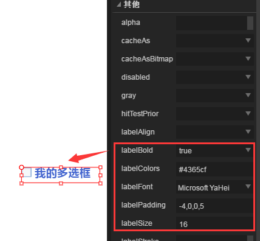

# CheckBox component

> CheckBox component explains that because many component properties are generic, common and generic component have been introduced in the `Property Setter` document. Please read the 《Property Setter》document before reading this article.

## 1. Creating CheckBox components

​       CheckBox (checkbox) is composed of two parts, select the status box and content label label. The selection state box must be the picture resource, and the label is text. When you use the CheckBox component, you can only use the select state box, or you can only set a tag label.

### 1.1 Preparing resources

The selection box of the CheckBox component is the skin of the CheckBox component (skin), and the name of the picture resource is usually `check`,`checkbox` or `check_` prefix, as shown in figure 1. CheckBox component resources are typically composed of three or two state skin picture components.

<br/> （Picture 1）

*Tips: For component skin skin and polymorphic cutting stateNum, check the 《Property Setter》document.*

### 1.2 Creating CheckBox components directly with the engine


Using the LayaAir engine to create a CheckBox component is relatively simple and usually takes only a few steps to introduce `laya.ui.CheckBox` package path, load resources, create a CheckBox instance, add CheckBox to the stage, set the attributes of the CheckBox component. Specific implementations refer to the following code and annotations.

**Create an entry class ComponentDemo.as, write the following code:**

```javascript
//初始化引擎，设置宽高并开启WebGL渲染模式
Laya.init(600, 400,Laya.WebGL);
//设置舞台背景颜色
Laya.stage.bgColor = "#ffffff";
//资源路径
this.skin1 = "checkbox.png";
this.skin2 = "checkbox.png";
//加载资源成功后，执行onLoad回调方法
Laya.loader.load([skin1,skin2],Laya.Handler.create(this,onLoaded));
function onLoaded(){
    //创建一个CheckBox实例cb1
			var cb1 = new Laya.CheckBox(this.skin1);
			//添加到舞台上显示
			Laya.stage.addChild(cb1);			
			//设置checkbox的坐标位置
			cb1.pos(300,200);			
			//文本标签内容
			cb1.label="我是多选框1";
			//label文本字体大小
			cb1.labelSize = 20;
            //设置为默认选中状态
			cb1.selected = true; 

			//再创建一个CheckBox实例cb2
			var cb2 = new Laya.CheckBox(this.skin2);
			//添加到舞台上显示
			Laya.stage.addChild(cb2);			
			//设置checkbox的坐标位置
			cb2.pos(300,300);			
			//文本标签内容
			cb2.label="我是多选框2";
			//label文本字体大小
			cb2.labelSize = 20;
}
```


The performance of the code is shown in figure 2:

 <br /> (Picture 2)


Please refer to its script interface.

**Tips:** CheckBox Please refer to the property interface of component [CheckBox API](http://layaair.ldc.layabox.com/api/index.html?category=UI&class=laya.ui.CheckBox)。


## 2. Create CheckBox components through LayaAirIDE

### 2.1 Creating CheckBox

 Create a UI page for DEMO and click Select `Resource Manager` in CheckBox Component resources, dragged to the scene editor, that is, the CheckBox component is successfully added to the page, as shown in figure 3-1.

<br/>     （Picture 3-1）


### 2.2 Setting CheckBox common attributes

When you create a component, you can set the property for the component through the attribute setter. For example, the CheckBox component of the default text is “label”，we will modify the default text for “multi check-box” and set the label label color, font, size, state. As shown in figures 3-2 and 3-3.

<br/>  （Picture 3-2）
<br/>（Picture 3-3）


#### 2.2.1 Other attributes related to label

| **Attribute name**          | **Functional description**                                 |
| ---------------- | ---------------------------------------- |
| labelAlign       | Label alignment mode, defaults to central alignment. Note: invalid in CheckBox            |
| labelColors      | Represents the text color of each state of the tag. format: "upColor,overColor,downColor,disableColor". The default is “blue, green” |
| labelBold        | Indicates whether the tag text label is bold.                          |
| labelFont        | Represents the font name of a text tag and is represented in a string. Optional in IDE.            |
| labelPadding     | Represents margins for text labels. format："Top margin, right margin, bottom margin, left margin".         |
| labelSize        | Indicates the font size of the text label.                             |
| labelStroke      | Text stroke width in pixels. The default value of 0, said no strokes.              |
| labelStrokeColor | Text stroke color, expressed as a string. The default is "#000000"（Black）;       |
| strokeColor      | Represents the stroke color in each state. format: "upColor,overColor,downColor,disableColor"。 |


#### 2.2.2  About the checkbox size and 9th sizeGrid

Need special note is 9th sizeGrid in CheckBox invalid in the component, **Checkbox** size of the art resources to be produced to set.


#### 2.2.3  Skin and stateNum for skin resources

 **skin：**  selection box's image assets. Similar to the button, two-state or three-state art resources. IDE or program can be modified.

**stateNum：** said the selection box, check box assembly defaults to three, if the checkbox art resources to two states, as shown in Figure 4, set the state value of 2, under normal circumstances the checkbox should have at least 2 state.

<br/>  （Picture 4）Two state art resource map
*Tips：In particular cases, a single state can also be used. For example, CheckBox components made up of label text only.*

**Example of two state CheckBox adjustment ：**

Below we this checkbox for another two states “Music switch” Checkbox. Drag a two state resource from the resource manager to the skin property, and set the stateNum to 2, modify the label text as music, and adjust the font size and margin of the label tag. As shown in figures 5-1 and 5-2.


<br/>  （Picture 5-1）

<br/>  （Picture 5-2）


#### 2.2.4 Default tick selected

A Boolean value, said whether the checkbox is selected, the program calls the selected or IDE settings, setting the CheckBox property to true, the display is shown in figure 6:

<br/>  （Picture 6）

#### 2.2.5 Toggle cannot be set

Toggle determines whether to switch the display status of the component when pressing. Special attention here is that this property should not be changed into false when it is CheckBox component, otherwise it will become a button mode and will never be chosen.


