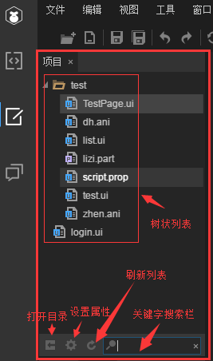
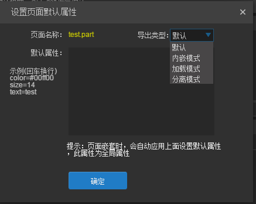

# Project Manager

> This article is based on LayaAirIDE 1.7.3 screenshot, if there are difference, please download the latest LayaAirIDE version.

## 1. Overview on project manager panel

​         ​The project manager is the work area that we can access to handle the project.In our use, the project manager displays the directory of the  “`project folder\laya\pages`”and the project page to show the tree structure. As shown in Figure 1:

​                

​        （picture 1）

**Tree page list: ** displays project folders and pages that have been created or imported.

**Open the directory：** defined where to open the selected directory.

**Setting properties: ** in the pop-up property settings window, you can set the export type of the page and default attributes, such as default size, color, etc., the property of global general.

​        

​        （Picture 2）           

​        The export type by defaults is **the inline mode**, which exports the configuration information of the page as the project code file. Using the **load mode**,  all page configuration information will be exported to a file in JSON format. ** The split mode ** is also exported to json format, but the difference is that the it exports each page independently and generates multiple json files. 

**Refresh the page list： **after you import the project page, click the refresh page list to import the page to synchronize and display the newly imported files.

**Keyword search bar： **quickly input keywords in the search column, with the keyword filter, convenient and fast positioning in the page location, as shown in Figure 3

​                

​        （picture 3）

 

## 2.  Project manager right key function introduction

**Open**

​        Right click the `file`， click open，**you can directly open the file in the scene editor.**

​        Right click the `directory`， click to open，**you can directly open the current directory of the resource manager**

**Rename**

​        Reset the name of a directory or file.

**Turn to template**

　　Only the UI file can use this function, set the UI as a template and store it in the template library. Can be set as common templates and custom templates

**Clone**

​        For files, a completely identical project file is copied.

​        For directories, the entire directory is copied (including files in the directory).

**Set the default properties**

​        You can only set the default properties of the page, as well as the export type. As shown in Figure 4-1.

　　   (picture 4-1)

**Delete**

　　You can`delete` directories or files by right - clicking delete function. You can also select the page and press the Backspace or Delete key to delete it. If you select the directory folder to delete, delete all the items in the directory will be deleted, please be careful.

**New**

​        In the project manager, you can create new UI pages / scenes, particles, animations, scripts. Right click the pop-up menu bar, and we select the new appropriate features.As shown in Figure 4-2.

​        

​        （picture 4-2）

 **New directory**

​        We can also create a new directory directly in the project manager.

**Open the directory**

​        Select the file or directory, click on this function to open the directory where the file or directory is located.

