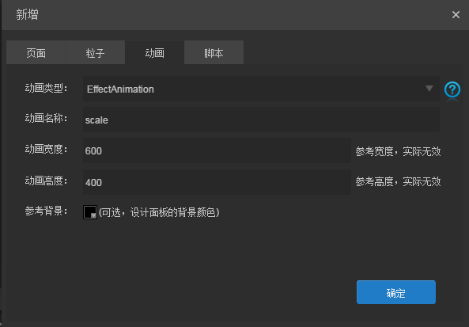
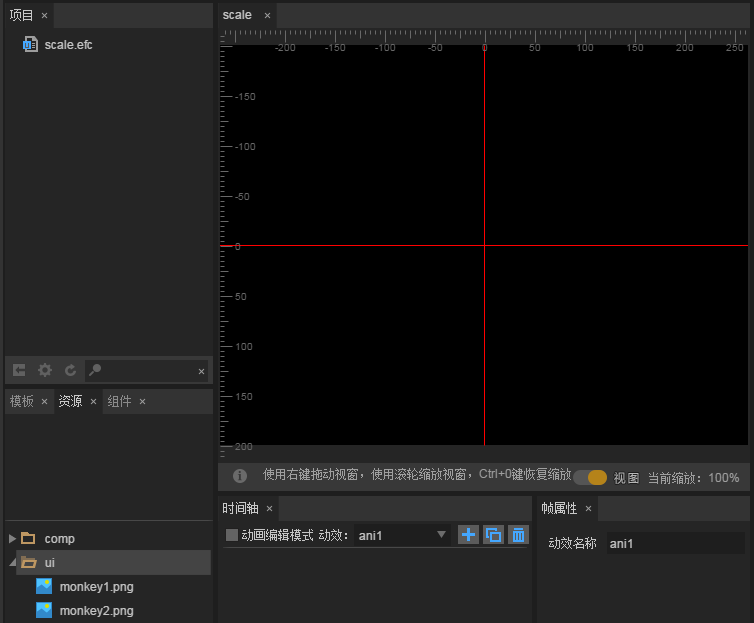
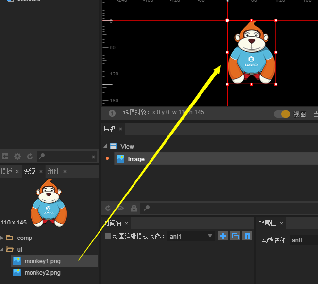
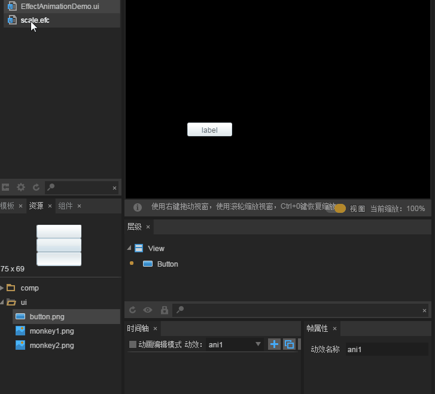
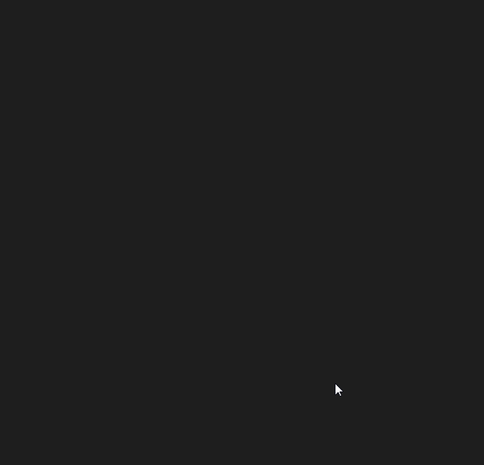

# Create an dynamic template (EffectAnimation)

### 1. What is the dynamic effect template?

The animation template is based on the time axis animation effect, by default animation effects, and then add the effect to a component. The component does not need coding, but it can easily achieve the same animation effect as coding. The action template can not be displayed independently. It can only be used as a template to animate the components in the UI page.


### 2. create and use the dynamic effect template in IDE

#### 2.1 Create EffectAnimation template files

In Project Explorer, `right click` --> select `New` --> `Animation`. In the new animation panel, the animation type is selected as `EffectAnimation`. Because we want to create a template for the zoom effect, the animation name is named `scale`, as shown in figure 1.

 <br />（Picture 1）

Click `OK` will create a `scale.efc` dynamic template file, double-click the file, we see the animation editing scene shown in Figure 2.

 <br />（Picture 2）


#### 2.2 create dynamic templates

**Objective : create an animation effect template  that will be zoomed in first then back.**

**Step A**：we drag a Image component from the Explorer into the `scale.efc`'s scene editor. As shown in figure 3.

 <br /> (Picture 3)


**Step B**：Check the ` animation editing mode`, and then select the`1st frame` of the `Image`components, right-click on the components to create key frames. As shown in Figure 4.

 <br />(Picture 4)


**Step C**：select the `1st frame`, and in the property manager, set the `scaleX` and `scaleY` attribute values of rotation and zoom to `0.2`As shown in figure 5. Once the property value is set, the scaling attributes scaleX and scaleY are automatically added to the Image timeline. (*since our moving template doesn't need displacement, it's OK to delete the properties automatically generated by the keyframe before X is deleted.*)

 <br />（Picture 5）

**Tips**：  it should be noted that there is an important difference between the animation template and the time axis animation. That is, if the animation of the animation template of the current animation template is set, the animation effect is invalid. For example, we want to shrink to 0.2 hours, in the time axis animation, in zeroth frames can be the first animation components directly down to 0.2, while in the dynamic effect in the template, cannot be set in the zeroth frame zoom effect, must be in the other frames (first frames) set the zoom effect target（*0.2*）.


**Step D**：create keyframe at 13th (refer to figure 4), set`scaleX` and`scaleY`  attribute values to `1`, click play to preview the animation effect.

 <br /> (Picture 6)


#### 2.3 Use the active template in the IDE

**Step A**： Create a UI page (in this case, `EffectAnimation.ui`）and drag and drop a Button component into the scene editor, as shown in Figure 7（*note that the button component in this example is in the ui directory*）。

 <br /> （Picture 7）


**Step B**： Drag the resulting zoom action template （scale.efc）to the Button component, as shown in Animation 8.

<br />(Picture 8) 


**Step C**：To make the center zoom effect, and let the button look more clearly. We select the Button component, in the Properties panel, set the pivot point attribute `anchorX` and `anchorY` set value of `0.5`, and then set the Button width and height to the pivot point of the xy axis position, as shown 

in Figure 9.

<br> (Picture 9)

*Tips： the pivot point effect needs to be set in the component properties of the UI, and the pivot point is set in the action template, and the effect is not valid for the component.*


**Step D**： select the Button component under the dynamic template, in the right property panel, set the trigger to play the event attribute `playEvent` value `mousedown`. As shown in Figure 10, and then press F12 to export the UI page, you can use it in the project.

 <br />(Picture 10)


**Step E**: At this point, the production of the action template has been completed. Press shortcut key F9 to open the project settings. In the UICode import class location will be used to import the class used in the template, otherwise it will be an error. As shown in Figure 11. Then press F12 (or Ctrl + F12) to export the UI page that you can use in your project.
<br/>(Picture 11)


### 3. Show the effect of the active template in the project

Create an entry class `Main.js`and set it as the default application. Write code as follows:

```javascript
//初始化引擎
Laya.init(1334,750);
//设置舞台背景色
Laya.stage.bgColor = "#ffffff";
//加载图集资源，加载成功后将UI界面添加到舞台上
Laya.loader.load("./res/atlas/comp.atlas",Laya.Handler.create(this,onLoaded));
function onLoaded(){
    //实例化导出的UI类
    var efc = new ui.TestPUI();
    //添加到舞台
    Laya.stage.addChild(efc);
}

```

After running, when the button is pressed, the animation effect is shown in Figure 12:

<br/>(Picture 12)


### 4. Number of dynamic effect templates to create complex dynamic effects

Just after the button has been pushed, the animation effect becomes bigger, we can make another dynamic effect template to realize the reduction effect, like bouncing. Thus, the continuous animation effect demonstration of pressing and bouncing fast switching states is realized.

First of all, we create a dynamic template file, the dynamic template because it is directly reduced. Only two key frames can be, as shown in Figure 13, we in the `12th frame`, the scale attribute `scaleX` and `scaleY` value is set to `0.2`.

<br/>(Picture 13)


Then, in the UI page, drag the dynamic template to the Button component and set the `playEvent` attribute to `mouseup` As shown in figure 14.

<br/>(Picture 14)


Finally, after saving, press F12 to export the UI, and then compile the code just now in the project. The running effect is shown in Figure 15, and the animation is very smooth under consecutive press and bounce events.
<br/>(Picture 15)


At this point, EffectAnimation basic tutorial has ended, developers can use LayaAirIDE dynamic template function  to quickly develop various animation effects components.