# 时间轴动画编辑器详解

*【注意】本篇教程采用LayaAirIDE 1.73版本，文中如有不同请以最新LayaAirIDE版本为准。*

> 时间轴动画编辑器最是LayaAirIDE中的核心模块，通过对时间轴上的关键帧制作，自动生成运动中的动画帧，可快捷的实现游戏中alpha透明度渐变、位移、旋转、缩放等动画效果。节省了制作人员的大部份时间，提高了开发效率。本篇从创建时间轴动画至编码运用，全面介绍时间轴动画编辑器的功能及使用。


# 1. 创建时间轴动画

　**时间轴动画有两种创建方式**。一种是创建`.ani`文件的时间轴动画，另一种是在UI页面（`.ui`文件）内创建时间轴动画。

　　两种文件制作时间轴动画的方式完全相同，**区别**仅在于`.ani`文件内创建的时间轴动画可被其它UI页面使用，而在UI页面内创建的时间轴动画，仅可在当前的UI页面内使用。

　　对于通用的时间轴动画，建议在`.ani`文件内创建。本篇以`.ani`文件方式为示例。

**Tips**：

- 如果在UI页面里创建时间轴动画 ，需要先在`场景编辑器`内选中要编辑的动画组件，然后点击勾选时间轴面板的`动画编辑模式`，再进行动画编辑制作操作。

- 在UI页面中制作时间轴动画，`动画编辑模式`勾选状态时，不能直接将组件拖入`场景编辑器`，需要先退出`动画编辑模式`，将要使用的UI组件先拖入`场景编辑器`，然后再重新进入`动画编辑模式`编辑。

  ​

### 1.1 创建时间轴动画文件ani

**步骤一**：在项目管理器中，`右键`菜单里， 选择 `新建` -> `动画`，如图1所示。

<br/>(图1)


**步骤二**：左键点击`动画`后，将弹出时间轴动画创建面板。在面板内选择GraphicAnimation类型，输入`动画名称`，点击`确定`，如图2所示。

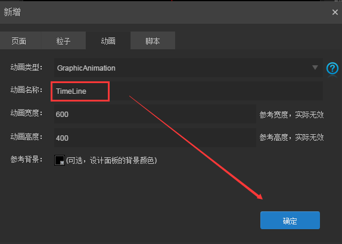<br/>(图2)

*Tips: 面板中的各栏目说明，请参考文档《UI页面、粒子、动画、脚本新增面板详解》*

点击确定后，即完成了`TimeLine.ani`动画文件的创建，并自动打开，进入了动画编辑模式。如图3所示。

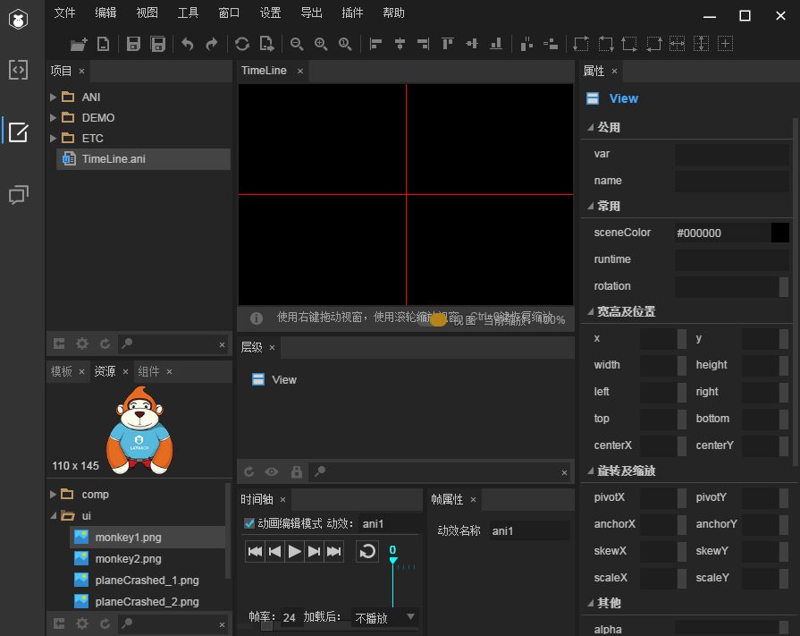<br/>(图3)

**Tips**:

- 打开`.ani`或`.ui`文件，`时间轴`面板与`帧属性`面板默认位于IDE的下方，制作时间轴动画这两个面板需要配合使用，如果找不到或不小心关掉了，可以按快捷键`F3`恢复为默认面板布局。

- 在`.ani`文件中，场景编辑区的起始坐标（`0,0`）点位于两条红线交叉的中心点。与UI文件的左上角有所不同，大家需要注意。

  ### 


### 1.2 创建一个位移的时间轴动画

#### 1.2.1 修改时间轴动效名称

<br/>(图4)

时间轴面板中可以管理多个动画效果，默认是以ani1、ani2……anix命名，为了便于记忆区分，我们需要修改动效名称，例如，我们要创建位移的动效，可以用move命名。修改后无需刷新，即时生效，如图5所示。

<br/>(图5)


#### 1.2.2  进入动画编辑模式

只有勾选动画编辑模式后，才可以对当前的动画效果进行编辑。进入编辑模式后，默认在0帧上，如图6所示。（*时间轴动画从0帧开始播放*）

<br/>(图6)


#### 1.2.3 导入动画资源

在资源面板中，将位图资源（Image组件）拖拽到动画编辑面板中，会自动在0帧创建一个关键帧。如图7所示。

<br/>(图7)

图7中`GraphicNode:2`代表每一个动画节点，在选中`第0帧`可以看到`2`正是目标对象的值。


#### 1.2.4 创建关键帧

创建关键帧有三种方式。分别是在层级面板中右键创建、在场景编辑器中右键创建、改变组件的任意属性值后自动创建。

**第一种：在层级面板中创建**

选中某一帧后，再选中层级面板中的组件节点，`右键` --> `创建关键帧`，如图8-1所示。
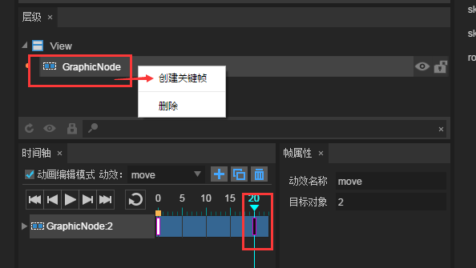<br/>(图8-1)

**第二种：在场景编辑器中右键创建**

在场景编辑器中，选中场景中的组件后  `右键`  --> `创建关键帧` 

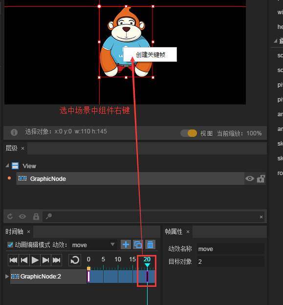<br/>(图8-2)


**第三种：自动创建。**

在场景编辑器中，选中组件，改变组件的任意属性值后会自动创建关键帧。

在本例中，我们采用第三种方式创建。首先用鼠标选中`第20帧`，然后将x轴属性值改为`160`，此时会自动在第20帧生成关键帧，成功创建了一个x轴从`0`到`160`的时间轴位移动画。如图8-3所示。

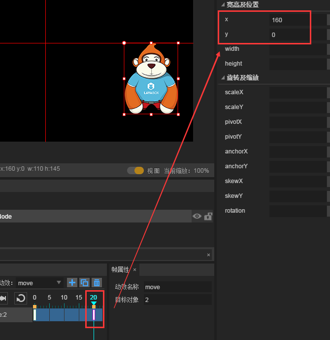<br/>(图8-3)


#### 1.2.5 播放时间轴动画

播放动画的按钮从左至右依次为，`首帧`按钮、`上一帧`按钮、`播放/暂停`按钮、`下一帧`按钮、`尾帧`（*最后一个关键帧*）按钮、`循环播放`按钮。不同按钮播放动画的效果如动图9所示。

<br/>(动图9)

**首帧按钮**：点击后播放指针移动到时间轴的首帧（*第0帧*）。

**上一帧按钮**：点击后播放指针移动到当前所在帧的上一帧。如果当前帧是首帧，则播放指针移动到关键帧的最后一帧。

**播放\暂停按钮**：点击后，会从当前帧所在位置开始播放动画效果，在最后一个关键帧停止。在播放状态下点击会暂停播放动画，再次点击播放，会从暂停时所在的帧继续继续播放。

**下一帧按钮**：点击后，播放指针移动至当前所在帧的下一帧。如果当前帧是关键帧的最后一帧，则播放指针移动到首帧。

**尾帧按钮**：点击后播放指针移动到时间轴关键帧的最后一帧。 

**循环播放按钮**：点击选中后，当点击播放按钮时，动画将会循环播放，再次循环按钮点击会取消循环播放状态。


　　

### 1.3  通过属性面板制作动画效果

在组件的属性面板中，有一些辅助动画效果实现的属性，本节中分别进行举例介绍。

#### 1.3.1 增加旋转动画效果

例如我们在上一个位移的动画基础上，通过对轴心点和旋转角度进行改变，制作一个移动旋转的动画效果。如动图10所示。

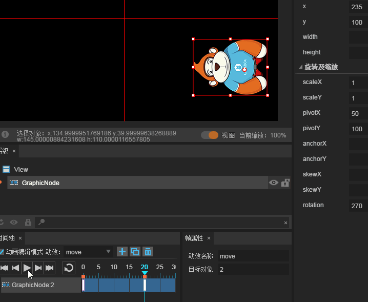<br/>(动图10)

**操作步骤：**

选中最后的关键帧（第20帧），选中组件，修改属性面板的值：`x`值为235，`y`值为100，`pivotX`值为50，`pivotY`值为100，`rotation`值为270。点击播放即可。

**属性解释：**

`x`与`y`是组件的位置坐标。

`pivotX`与`pivotY`是组件的轴心点坐标x与y。

`rotation`是组件的旋转角度。


#### 1.3.2 增加缩放动画效果

在上一个动画的基础上，通过更改缩放比例，可以看到时间轴动画的缩放效果，如动图11所示。

<br/>(动图11)

**操作步骤：**

选中最后的关键帧（第20帧），选中组件，修改属性面板的值：将`scaleX`与`scaleY`值均设为0.3。将`rotation`修改为360

**属性解释：**

`scaleX`是组件的水平方向缩放，默认值为1，不缩放。

`scaleY` 是组件的垂直方向缩放，默认值为1，不缩放。


#### 1.3.3 增加动画的透明渐变效果

透明渐变效果也是常用的动画效果之一，通过修改alpha值可以轻松实现淡入淡出等透明渐变效果。我们继续在上一个动画的基础上进行延伸。效果如动图12所示。

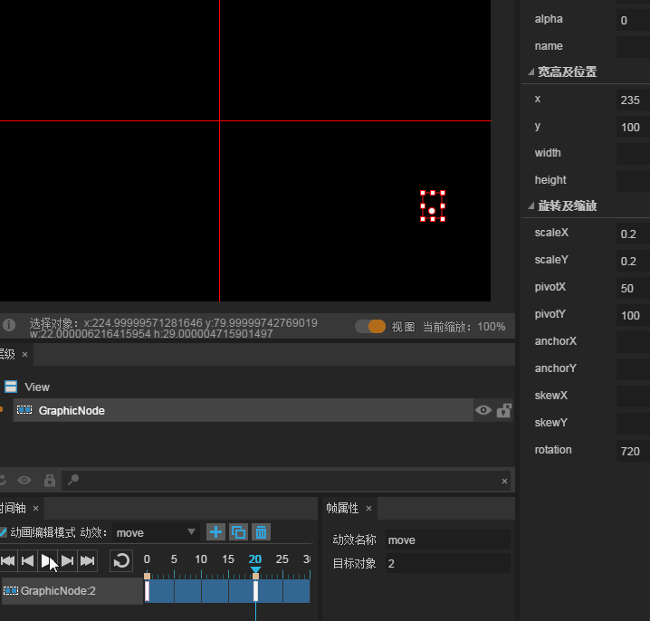<br/>(动图12)

**操作步骤：**

选中最后的关键帧（第20帧），选中组件，修改属性面板的值：将`scaleX`与`scaleY`值均修改为0.2。将`rotation`修改为720。`alpha`设置为0。

**属性解释：**

`alpha`是透明度属性值，默认为1，不透明。0为完全透明，属性的取值范围是0~1。


#### 1.3.4  轴心点动画效果设置

##### 创建一个新的时间轴动画

为了与刚才的位移效果区分，我们点击加号图标，再创建一个时间轴动画，如图13-1所示。

<br/>(图13-1)

创建后，将动画名称改为pivot，我们可以从动画列表中看到新创建的`pivot`动画和原有的`move`动画，如图13-2所示，通过点击列表中的名称可以实现不同动画的切换。

<br/>(图13-2)


##### 制作以中心点为轴心的动画

不设置轴心点时，默认以组件左上角为轴心，此时我们进行旋转操作，如动图14-1所示。

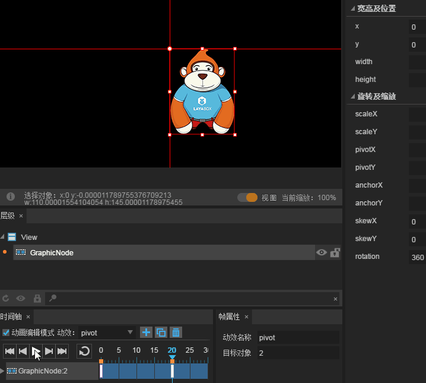<br/>(动图14-1)

如果想实现图片的中心点旋转如何操作呢，这里可以采用两种方式来实现。

**第一种：通过锚点实现**

锚点是按组件的X或Y轴的最大长度的比例进行设置，取值是`0-1`之间，例如，我们将`anchorX`与`anchorY`的属性值都取`0.5`，就是在X轴与Y轴长度的50%位置获得轴心点坐标。这样，在时间轴尾帧设置一个旋转角度值`rotation为360`，就实现了以中心点为轴心的旋转效果，效果如动图14-2所示。

<br/>(动图14-2)

**Tips**：*通过锚点是一种非常方便快捷的设置轴心点方式。但是锚点方式只能对UI组件设置轴心点，对于graphics组件以及Sprite等2D基础组件的轴心点只能通过第二种方式实现。*


**第二种：通过轴心点属性实现**

我们想以中心点为轴心旋转，还可以通过轴心点属性设置组件的中心为轴心点，例如图片的原大小是`110*145`，那么我们将原宽高除2就获得了中心点位置，设置`pivotX`属性值为`55`，`pivotY`属性值为`72.5`。然后播放动画，和第一种方法实现的效果一样。如动图14-3所示。

<br/>(动图14-3)

**Tips**：*通过锚点是一种非常方便快捷的设置轴心点方式。但是锚点方式只能对UI组件设置轴心点，对于Graphics组件以及Sprite等2D基础组件的轴心点只能通过第二种方式实现。*


#### 1.3.5 倾斜角度的动画效果设置

##### 倾斜属性的坐标系

倾斜属性skewX与skewY的坐标系与常规的坐标系不同，**水平方向为y，垂直方向为x**。如图15所示。

<br/>(图15)

为了便于了解skewX与skewY的倾斜角度变化。我们直接用时间轴动画来表达。

##### skewX的倾斜变化效果演示

操作：在`第0帧`不设置任何效果，`第20帧`将skewX设置为`30`，点击播放后，组件的skewX轴处于逆时针方向发生形变。如动图16-1所示。

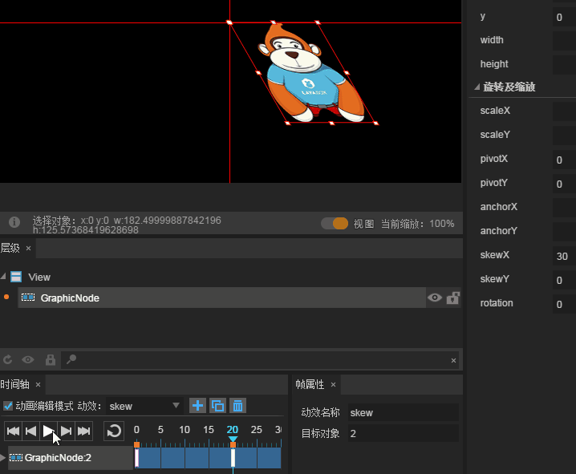<br/>(动图16-1)

**Tips**:*如果skewX值为负数，组件X轴而会顺时针方向移动发生形变。*

##### skewY的倾斜变化效果演示

操作：在`第0帧`不设置任何效果，`第20帧`将skewY设置为`30`，点击播放后，组件的skewY轴处于顺时针方向发生形变。如动图16-2所示。

<br/>(动图16-2)

**Tips**:*如果skewY值为负数，组件Y轴边会逆时针方向移动发生形变。*

##### skewY与skewY同时倾斜变化效果演示

操作：在`第0帧`不设置任何效果，`第20帧`将skewX设置为`30`，skewY设置为`20`，点击播放后，组件的skewX逆时针移动，skewY轴顺时针移动，共同挤压组件发生形变。如动图16-3所示。

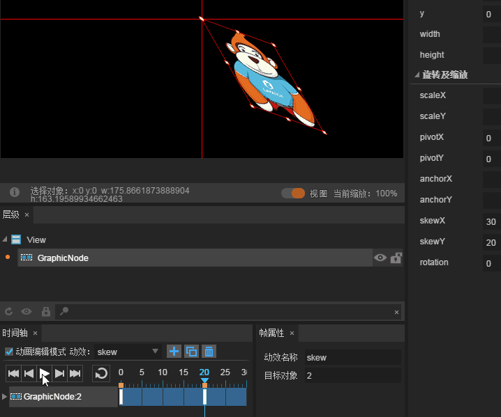<br/>(动图16-3)

##### 不产生形变的倾斜动画效果

之前的演示例子都是skew属性值为正数时，因倾斜角度变化而产生的形变效果，如果skew属性值为负数那形变的方向就是相反的方向。因此，当skewX与skewY采用同样的数值角度，一个属性为正数，另一个属性为负数。那么就会导致倾斜角度和方向相同，而不会产生形变了。下面我们通过一个简单的钟摆效果来演示没有形变的倾斜动画效果。

操作：在`第0帧`设置`skewX`为`-50`，`skewY`为`50`。第15帧`skewX`为`10`，`skewY`为`-10`。第30帧`skewX`与`skewY`的值与第0帧保持一致。设置后点击播放效果如动图16-4所示。

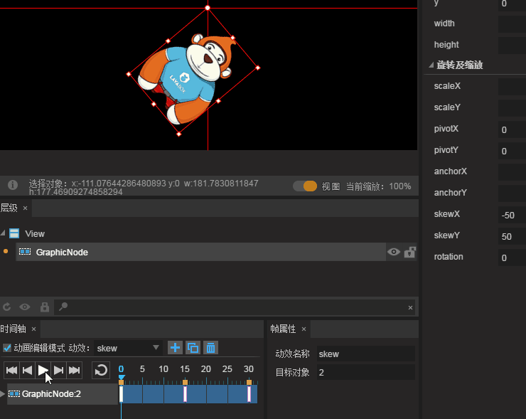<br/>(动图16-4)


## 2. 动画编辑器介绍

在动画编辑器里有两个基本概念：显示节点层和节点属性层。如图17所示，`GraphicNode`为显示节点，后面的数字是目标对象的ID，动画场景中每增加一个动画组件，时间轴中就会增加一个对应的显示节点。点击节点层左侧的展开按钮（*三角*），可以看到所有属于该节点的动画属性，图中的`skewY`与`skewX`是时间轴动画中要实现的倾斜动画属性，每增加一种动画属性，显示节点层下就会增加一个对应的节点属性层。

<br/>(图17)

### 2.1 新增动画与删除动画

之前的示例已经通过`+号`按钮展示了新增空的时间轴动画操作，然而，我们还可以通过复制动画的按钮，新增一个与原动画一样的新动画，新动画可以基于原动画的基础上继续扩展和调整。从图18中的动画列表中可以看出，复制新增的动画命名方式为"`原动画名_0,原动画名_1,.....`"例如，图18中，`skew_0`与`skew_1`是复制于`skew`，`skew_0_0_0`复制于`skew_0_0`。大家也可以在帧属性面板中修改默认的动画命名。

<br/>(图18)

点击删除按钮时，会提示是否删除，点击确定后将会删除当前动画，如图19-1所示。

<br/>(图19-1)

**Tips**:**这里需要注意的是，删除时间轴动画只会删除时间轴上的动画效果及属性，而不会删除场景中的动画节点**。尤其是我们把最后一个动画也删除后，会更加明显看到节点未被删除的情况，如图19-2所示。

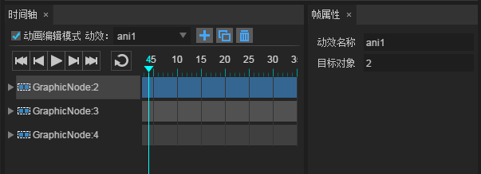<br/>(图19-2)


### 2.2 多节点动画的增加与删除

#### 2.2.1 新增节点层与节点命名

之前一直是以一个节点进行时间轴动画演示，现在我们复制新增一个skew动画，然后拖拽一个新的组件到场景。即会自动新增一个节点层。

由于多个节点并列出现时，不直观，很容易分不清操作的是场景中的哪一个节点。因此我们选中节点，在属性管理器中，设置name属性值，如图20所示。

<br/>(图20)

#### 2.2.2 制作多节点动画

在新增的节点层上，我们可以根据实际需要，设置与上一个节点层完全不同位置的关键帧，例如，我们这个节点层制作一个来回平移的动画，故意将第二个关键帧设置在第13帧的位置上。动画制作完成后，效果如动图21所示。（*前文已演示的基础操作将不再详细说明*）

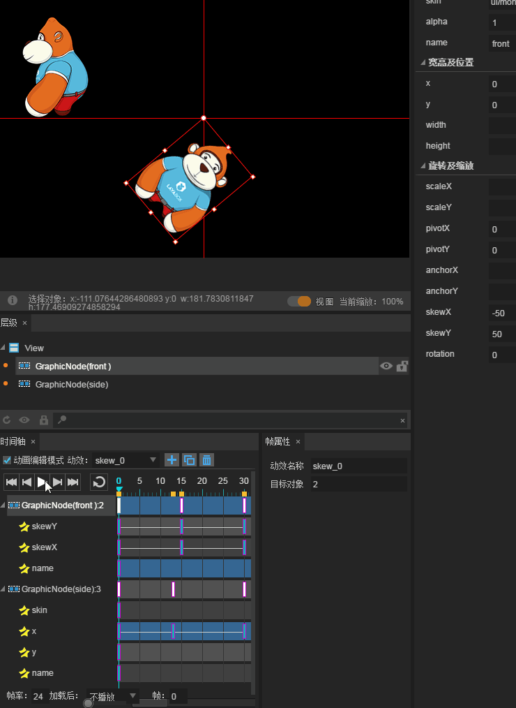<br/>(动图21)

**Tips**：由于本例中的平移动画位于负坐标区域内。这里需要特别说明一下。`时间轴动画的负坐标区域内，无法触发点击事件`，如果需要用到点击事件交互，则动画的X与Y必须位于正坐标区域，也就是十字红线交叉的右下区域。

#### 2.2.3 删除节点

<br/>(图22-1)

如果我们如图22-1中，选中节点，右键`删除`，并不能像删除节点属性那样，将当前节点删除，只能删除掉当前节点中制作的动画效果与节点属性。如图22-2所示。

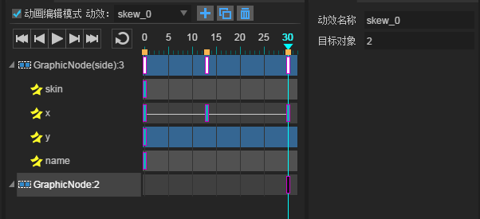<br/>(图22-2)

那么如何删除节点呢？需要在`层级`面板中选中要删除的节点，然后右键`删除`，如图22-3所示。在弹出提示`是否删除`时，点击`确定`即可。但是，如果**动画列表内有多个动画时**，一定要注意你删除的节点是不是在其它动画里也用到了，因为组件的删除会影响到全部动画。**一旦删除，其它动画内的该节点和动画也会消失。**

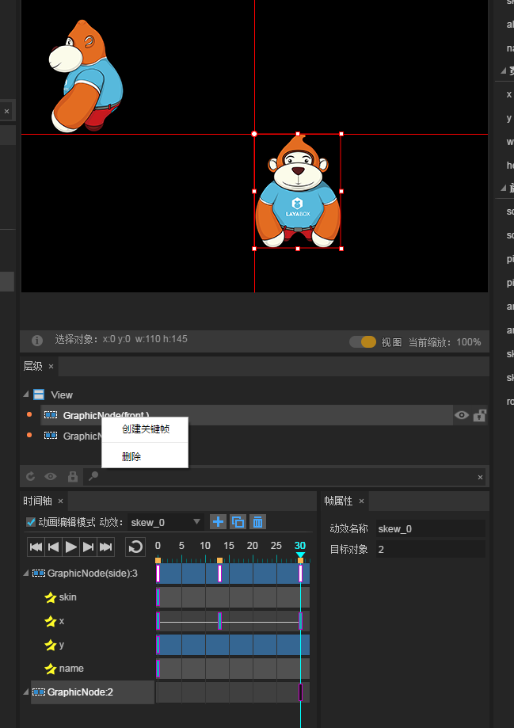<br/>(图22-3)


### 2.3 节点属性与缓动效果设置

在节点层下是各个节点属性层，选中节点属性的帧，可以看到详细的帧属性，如图23所示。

<br/>(图23)

#### 节点的帧属性介绍

`x`：x为属性名，-260为当前帧的值。如果选中skin，就显示skin属性名和对应的值。该栏不能修改。

`标签label`：该栏设置后，可以在项目中，通过标签名用代码对该帧进行操作。当设置标签后，设置标签的帧会出现红色圆点，如图24所示。

<br/>(图24)

`是否缓动`：可以选择是否使用缓动效果，默认为勾选状态。

`缓动类型`：默认为linearNone缓动效果，其它缓动效果开发者可自行体验使用。

**Tips**:*缓动效果作用于当前动画的起始关键帧位置，如需改变缓动类型者要特别注意。*


### 2.4 制作逐帧动画

逐帧动画也是游戏中常用的动画之一。在时间轴中有两种逐帧动画的制作方式。

##### 第一种方式，连续创建关键帧

第一步：拖拽第一帧的组件到场景编辑器中。第二步：在时间轴中连续创建关键帧。如图25-1所示。

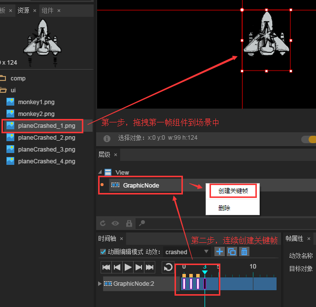<br/>(图25-1)

第三步：替换各帧skin（皮肤）属性，如动图25-2所示。然后点击播放即可看到动画效果。

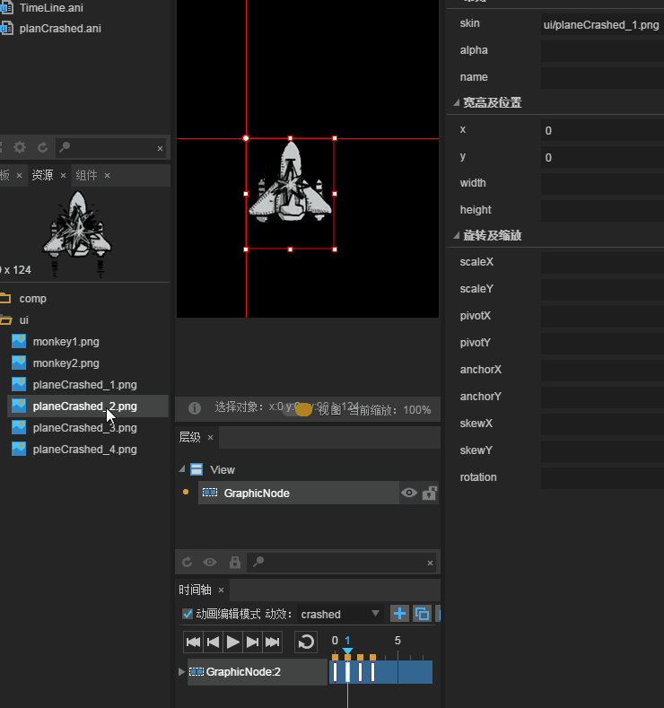<br/>(动图25-2)

**Tips**:*如果把组件分批拖到时间轴上，则会在场景中出现多个动画节点。而不是想要的逐帧动画效果。*

##### 第二种方式：一次性创建

批量选中组件拖拽到时间轴上，会直接创建完成逐帧动画，这种方式更为快捷。如动画25-3所示。

<br/>(动图25-3)


### 2.5 底部功能条

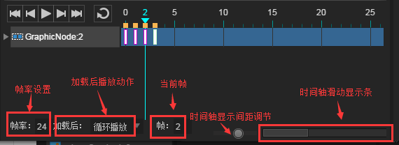<br/>(图26)

在时间轴动画编辑器的底部功能条中，具体说明如下：

`帧率：`默认为24帧，可以通过改变帧率改变播放的帧速。

`加载后：`选择不同的动作，在加载后会执行对应的操作。分别为不播放、播放一次、循环播放三种选项，默认为不播放。

*Tips：该项设置仅在UI中的时间轴中动画编辑时有效，在ani文件的动画编辑时设置无效。*

`帧：`默认显示当前帧，输入目标帧数后回车，会直接跳转到目标帧数。

`圆形滑动条：`用于时间轴上帧与帧之间的显示间距调节。如动图27-1所示。

<br/>(动图27-1)

`矩形滑动条：`拖动滑块移动时间轴，用于滑动显示时间轴上的帧。如动图27-2所示。

<br/>(动图27-2)


## 3、使用时间轴动画

### 3.1 导出时间轴动画

在IDE内按快捷键F12或Ctrl+F12会导出时间轴动画，`.ani`文件会生成在`项目根目录/bin/`目录下。动画中用到的资源图集位于`项目根目录/bin/res/atlas/`目录下，如图28所示。

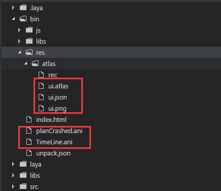<br/>(图28)

### 3.2 在项目中使用时间轴动画

在项目中使用时间轴动画主要分为三步。

第一步：加载动画所需的图集。

```javascript
//加载图集成功后，执行onLoaded回调方法
Laya.loader.load("res/atlas/ui.atlas", Laya.Handler.create(this, onLoaded));
```

第二步：创建Animation实例，加载动画文件

```javascript
//创建一个Animation实例
var tl = new Laya.Animation();
//加载动画文件
tl.loadAnimation("TimeLine.ani");
```

第三步：添加动画到舞台，播放动画

```javascript
//添加到舞台
Laya.stage.addChild(tl);
//播放Animation动画
tl.play();
```

完整的示例代码如下：

**入口类GameMain.js**

```javascript
//初始化引擎
Laya.init(600, 400);
//设置舞台背景色
Laya.stage.bgColor = "#ffffff";
//加载图集成功后，执行onLoaded回调方法
Laya.loader.load("res/atlas/ui.atlas", Laya.Handler.create(this, onLoaded));
function onLoaded() {
    //创建一个Animation实例
    var tl = new Laya.Animation();
    //加载动画文件
    tl.loadAnimation("TimeLine.ani");
    //添加到舞台
    Laya.stage.addChild(tl);
    //播放Animation动画
    tl.play();
}
```

代码运行效果如动图29所示：

<br/>(动图29)

### 3.3 使用多个时间轴动画

之前我们在TimeLine.ani中制作了多个动画，那如何加载使用其它的动画呢？这时候动画名称的价值就体现了。在默认使用播放方法`play()`的时候，缺省是播放第一个动画。如果要使用其它的动画，那么在第三个参数处设置动画名称即可。`play()`方法的api参数说明如图30所示。

 <br />（图30）

修改为使用多个Animation动画的示例代码如下：

```javascript
//初始化引擎
Laya.init(600, 400);
//设置舞台背景色
Laya.stage.bgColor = "#ffffff";
//加载图集成功后，执行onLoaded回调方法
Laya.loader.load("res/atlas/ui.atlas", Laya.Handler.create(this, onLoaded));
function onLoaded() {
    //创建一个Animation实例
    var tl = new Laya.Animation();
    //加载动画文件
    tl.loadAnimation("TimeLine.ani");
    //添加到舞台
    Laya.stage.addChild(tl);
    //播放Animation动画
    tl.play();

    //创建一个新的Animation实例
    var tl2 = new Laya.Animation();
    //加载动画文件
    tl2.loadAnimation("TimeLine.ani");
    //添加到舞台
    Laya.stage.addChild(tl2);
    //播放Animation动画的pivot动画
    tl2.play(0,true,"pivot");
    //动画的显示位置
    tl2.pos(300,0);
}
```

示例代码运行效果如动图31所示：

<br/>(动图31)

### 3.4 在UI中使用时间轴动画，然后在项目代码中调用。

#### 3.4.1 创建UI页，添加Animation动画到场景中。

我们先创建一个`TimeLine.ui`的UI页面，然后直接拖拽`planCrashed.ani`到场景中，如图32所示。

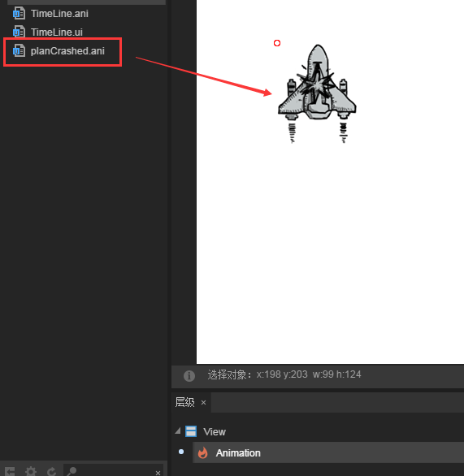 <br /> (图32)


#### 3.4.2 设置Animation动画属性值

选中UI场景中的动画，有很多属性值可以设置。这里我们先设置一下`var`的值，这个值必须设置，否则无法调用动画。然后设置一下位置属性的x值为500，y为0（*相当于代码中设置pos值*），避免和之前的动画重叠。其它的属性值就不一一介绍了，鼠标移动到属性名上会有对应的介绍。如图33所示。

 <br /> (图33)


#### 3.4.3 在项目中调用UI中的动画

按F12导出之后，直接在之前的示例中添加代码即可。代码示例如下所示：

**入口类GameMain.js** 

```javascript
//初始化引擎
Laya.init(600, 400);
//设置舞台背景色
Laya.stage.bgColor = "#ffffff";
//加载图集成功后，执行onLoaded回调方法
Laya.loader.load("res/atlas/ui.atlas", Laya.Handler.create(this, onLoaded));
function onLoaded() {
    //创建一个Animation实例
    var tl = new Laya.Animation();
    //加载动画文件
    tl.loadAnimation("TimeLine.ani");
    //添加到舞台
    Laya.stage.addChild(tl);
    //播放Animation动画
    tl.play();

    //创建一个新的Animation实例
    var tl2 = new Laya.Animation();
    //加载动画文件
    tl2.loadAnimation("TimeLine.ani");
    //添加到舞台
    Laya.stage.addChild(tl2);
    //播放Animation动画的pivot动画
    tl2.play(0,true,"pivot");
    //动画的显示位置
    tl2.pos(300,0);

    //创建一个UI实例
    var plan = new ui.TimeLineUI();
    //添加到舞台
    Laya.stage.addChild(plan);
    //播放UI场景中的动画
    plan.crashed.play();
}
```

运行效果如动图34所示：

 <br /> (动图34)

在UI中使用的动画，可以方便的直接在UI中的属性管理器中控制动画属性。比如，我们想让飞机的爆炸速度降下来。那么我们可以直接在UI里选中动画,然后设置interval的属性值就可以了。interval是控制动画播放间隔时间的（单位是毫秒），不设置时，默认为50毫秒。这里我们改为更多，就可以让飞机的爆炸速度降下来。如图35所示。

 <br /> (图35)

更改后按F12导出，然后无需更改项目代码，直接重新编译，即可以看运效果已改变，如动图36所示。

 <br />(图36)


至此，关于时间轴动画Animation的制作与使用已介绍完。更多关于时间轴动画的API使用可以查看[Animation API文档](http://layaair.ldc.layabox.com/api/index.html?category=Core&class=laya.display.Animation)。