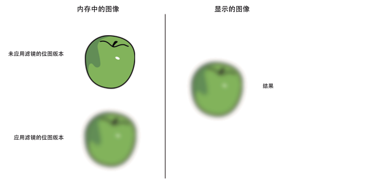

# 内存优化

发布时间：2016-12-30

### **一、对象池**

对象池，涉及到不断重复使用对象。在初始化应用程序期间创建一定数量的对象并将其存储在一个池中。对一个对象完成操作后，将该对象放回到池中，在需要新对象时可以对其进行检索。

由于实例化对象成本很高，使用对象池重用对象可减少实例化对象的需求。还可以减少垃圾回收器运行的机会，从而提高程序的运行速度。

以下代码演示使用`Laya.utils.Pool：`

```typescript
var SPRITE_SIGN:String = 'spriteSign';
var sprites:Array = [];
export class initialize()
{
    for (var i = 0; i < 1000; i++)
    {
        var sp:Sprite = Pool.getItemByClass(SPRITE_SIGN, Sprite)
        this.sprites.push(sp);
        Laya.stage.addChild(sp);
    }
}
new laya.initialize();
```

在initialize中创建大小为1000的对象池。

以下代码在当单击鼠标时，将删除显示列表中的所有显示对象，并在以后的其他任务中重复使用这些对象：

```typescript
Laya.stage.on("click", this, function()
{
    var sp:Sprite;
    for(var i:number = 0, len:number = sprites.length; i < len; i++)
    {
        this.sp = sprites.pop();
        this.Pool.recover(SPRITE_SIGN, sp);
        Laya.stage.removeChild(sp);
    }
});
```

调用Pool.recover后，指定的对象会被回收至池内。

 

### **二、使用Handler.create**

在开发过程中，会经常使用Handler来完成异步回调。Handler.create使用了内置对象池管理，因此在使用Handler对象时应使用Handler.create来创建回调处理器。以下代码使用Handler.create创建加载的回调处理器：

```javascript
Laya.loader.load(urls, Handler.create(this, this.onAssetLoaded));
```

在上面的代码中，回调被执行后Handler将会被对象池收回。此时，考虑如下代码会发生什么事：

```javascript
Laya.loader.load(urls, Handler.create(this, this.onAssetLoaded), Handler.create(this, this.onLoading));
```

在上面的代码中，使用Handler.create返回的处理器处理progress事件。此时的回调执行一次之后就被对象池回收，于是progress事件只触发了一次，此时需要将四个名为once的参数设置为false：

```javascript
Laya.loader.load(urls, Handler.create(this, this.onAssetLoaded), Handler.create(this, this.onLoading, null, false));
```

 

### **三、释放内存**

JavaScript运行时无法启动垃圾回收器。要确保一个对象能够被回收，请删除对该对象的所有引用。Sprite提供的destory会帮助设置内部引用为null。

例如，以下代码确保对象能够被作为垃圾回收：

```javascript
var sp:Sprite = new Sprite();
this.sp.destroy();
```


当对象设置为null，不会立即将其从内存中删除。只有系统认为内存足够低时，垃圾回收器才会运行。内存分配（而不是对象删除）会触发垃圾回收。

垃圾回收期间可能占用大量CPU并影响性能。通过重用对象，尝试限制使用垃圾回收。此外，尽可能将引用设置为null，以便垃圾回收器用较少时间来查找对象。有时（比如两个对象相互引用），无法同时设置两个引用为null，垃圾回收器将扫描无法被访问到的对象，并将其清除，这会比引用计数更消耗性能。

### **四、资源卸载**

游戏运行时总会加载许多资源，这些资源在使用完成后应及时卸载，否则一直残留在内存中。

下例演示加载资源后对比资源卸载前和卸载后的资源状态：

```typescript
var assets:Array = [];
this.assets.push("res/apes/monkey0.png");
this.assets.push("res/apes/monkey1.png");
this.assets.push("res/apes/monkey2.png");
this.assets.push("res/apes/monkey3.png");
  
Laya.loader.load(assets, Handler.create(this, onAssetsLoaded));
  
function onAssetsLoaded()
{
    for(var i:number = 0, len:number = assets.length; i < len; ++i)
    {
        var asset:Image = assets[i];
        console.log(Laya.loader.getRes(asset));
        Laya.loader.clearRes(asset);
        console.log(Laya.loader.getRes(asset));
    }
}
```

### **五、关于滤镜、遮罩**


尝试尽量减少使用滤镜效果。将滤镜（BlurFilter和GlowFilter）应用于显示对象时，运行时将在内存中创建两张位图。其中每个位图的大小与显示对象相同。将第一个位图创建为显示对象的栅格化版本，然后用于生成应用滤镜的另一个位图：

​	   <br/>
​	（图1）

应用滤镜时内存中的两个位图

当修改滤镜的某个属性或者显示对象时，内存中的两个位图都将更新以创建生成的位图，这两个位图可能会占用大量内存。此外，此过程涉及CPU计算，动态更新时将会降低性能（参见“图形渲染性能 – 关于cacheAs）。

 

ColorFiter在Canvas渲染下需要计算每个像素点，而在WebGL下的GPU消耗可以忽略不计。

最佳的做法是，尽可能使用图像创作工具创建的位图来模拟滤镜。避免在运行时中创建动态位图，可以帮助减少CPU或GPU负载。特别是一张应用了滤镜并且不会在修改的图像。

###  **六、其它优化策略**

1. 减少粒子使用数量，在移动平台Canvas模式下，尽量不用粒子；
2. 在Canvas模式下，尽量减少旋转，缩放，alpha等属性的使用，这些属性会对性能产生消耗。（在WebGL模式可以使用）；
3. 不要在timeloop里面创建对象及复杂计算；
4. 尽量减少对容器的autoSize的使用，减少getBounds()的使用，因为这些调用会产生较多计算；
5. 尽量少用try catch的使用，被try catch的函数执行会变得非常慢；