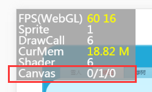

# Introduction to performance statistics panel   

　　At the beginning of the LayaAir engine design, the performance was the first target, and a lot of performance optimization was done in the engine. Reasonable use of the engine, can make the game and other engine products to achieve the experience of native APP. If developers can't play the advantage of the engine, then the final performance experience of the game or will not be able to talk about. Therefore, in the process of making the game, master the game and engine optimization skills is still very necessary.


> To understand the performance of the engine, you first need to read the performance statistics panel, and the performance statistics panel will be described in detail below.


### 1. Invoking Performance statistics panel 

The performance statistics panel built in the LayaAir engine can detect the current performance in real time. Invoke the statistical panel is different due to the different development languages.

In AS language,  `laya.utils.Stat` method is used directly by introducing `Stat.show()` class.

Entry class: Demo.ts write code as follows:

```typescript
//初始化舞台
Laya.init(1136, 640);
//调用性能统计面板方法，(0,0)为面板位置坐标
Laya.Stat.show(0,0);
```


### 2. FPS Related introduction

### 2.1  FPS Summary

FPS is the acronym for Frames Per Second. Suppose the frame rate of the game is 60FPS, indicating that the execution time of each frame in the game is 1/60 seconds. The higher the frame rate, more feels fluid visually.

<br />	（Picture 1）

Currently, the full frames of devices such as PCs and mobile phones are 60 frames, as shown in FIG. 1, but some games do not require a high frequency refresh. You can also use the engine's frame rate limit method `Stage.FRAME_SLOW`, to convert FPS Frame rate limit up to 30 frames.

Since the actual operating environment is in the browser, so the performance also depends on the efficiency of the JavaScript interpreter. Therefore, the FPS value of the same game may vary in different browsers. This part is not for developers to decide, and developers can do as much as possible to use good engines and optimization projects, strive for low-end devices or low performance browsers to enhance the FPS frame rate.

#### 2.2 FPS in different modes

The LayaAir engine supports two rendering modes: Canvas and WebGL. So when we look at the FPS frame rate, we should pay attention to which mode, `FPS(Canvas)` is the frame rate in Canvas mode, as shown in Figure 1. `FPS(WebGL)` is the frame rate in WebGL mode, as shown in figure 2.

<br />	（Picture 2）

#### 2.3  FPS numerical description

In Figure 1 and Figure 2, the first yellow value `60` is the current **FPS frame rate**, the higher the better.

The second yellow value `16` is the **amount of time it takes for each frame to be rendered**,  in milliseconds. The smaller the value, the better.

If the two values cannot be maintained in full frame, they will change during the operation of the product, as shown in figure 3.

 <br /> (Picture 3)


###  3. Sprite introduction

Sprite counts the number of all rendering nodes (including containers) that affect the number of traversal, data organization, and rendering times of the engine node. The lower the number, the better. Therefore, it is recommended to reduce the render nodes as much as possible in the design of the project.


### 4. Introduction of DrawCall

 **The number of DrawCall is an important indicator of performance**, the third line in the statistical panel, as shown in figure 4. DrawCall represents different meanings under Canvas and WebGL rendering, but the fewer are the better. We **Recommand developers limit no more than 100**.

 <br /> (Picture 4)


#### 4.1 The meaning of DrawCall under Canvas

 In Canvas mode, DrawCall represents the number of times each frame is drawn, including pictures, text, and vector graphics.

#### 4.2 The meaning of DrawCall under WebGL

In WebGL mode, DrawCall represents the render submission batch, and each time the data is prepared and the process of rendering GPU rendering is called the 1 DrawCall. In every 1 DrawCall, it is very time-consuming to switch the material and shader in addition to the time consuming notification of the rendering of GPU.


### 5. Introduction of CurMem

In WebGL mode, CurMem is the  memory occupied, the lower the better.

In Canvas mode, there is no concept of memory, CurMem indicates the memory usage, the lower the better.


### 6. IntroductionShader

Shader is the unique performance indicator of WebGL mode, which means the number of Shader submission per frame, the lower the better.


### 7. Canvas Introduction

In Canvas mode, there are three values, as shown in Figure 5, where there is no value until CacheAs is set, default is `0/0/0`. It respectively means: `number of canvas redrawn per frame` / `The number of canvas with “normal” buffer type` / `number of canvas types with “bitmap” buffer type`.


 <br /> (Picture 5)


**Tips**：For more optimization of CacheAs, you can view the document 《CacheAs static cache optimization》


 
