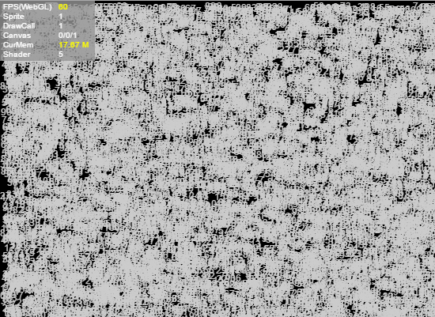

# Graphics rendering performance


### **1. Optimize Sprite**

1. Minimize unnecessary nesting and reduce the number of Sprite.

2. Objects in non-visible areas should be removed from the display list or set as far as possible visible=false。

3. For containers that have a large amount of static or infrequently changing content (such as buttons), you can set the cacheAs attribute for the entire container, dramatically reducing the number of sprites and dramatically improving performance. If you have dynamic content, it is best to separate it from static content so that only static content is cached.

4. In Panel, the direct sub object outside the panel region (the sub object of the sub object can not be judged) is rendered without rendering, and the sub object beyond the panel region is not consumed.

   ​

### **2. Optimize DrawCall**

1. Setting cacheAs to complex static content can reduce DrawCall greatly. Using cacheAs well is the key to game optimization.

2. Try to make sure that the image sequence of the same atlas is next to each other, and if the cross rendering is different, it will increase the number of DrawCall.

3. Try to make sure that all the resources in the same panel use an atlas, which reduces the submission batch.

   ​

### **3. Canvas optimization**

​      In the optimization of Canvas, we need to pay attention to, do not use cacheAs in the following occasions:

1. The object is very simple, such as a word or a picture, setting cacheAs= "bitmap" not only does not improve performance, but will lose performance.

2. There are always changes in the container, such as an animation or countdown in the container. If you set the cacheAs= "bitmap" to this container, it will lose performance.


You can determine whether the Canvas cache has been refreshed by looking at the first value of the Canvas statistics.


### **4. About cacheAs**

Setting cacheAs can cache the display object as a static image. When cacheAs, the child object changes, automatically re cache, and can manually update the cache by calling the reCache method. It is recommended to cache the complex content that is not always changing as a static image, which can greatly improve rendering performance. CacheAs has three values: "none", "normal" and "bitmap".

1. The default is "none" without any cache.

2. When the task is "normal", the canvas cache is executed under Canvas, and the command cache is executed under webgl mode.

3. When the value is "bitmap", the canvas is still cached under Canvas, and the renderTarget cache is used in webGL mode. It's important to note that the renderTarget cache mode in webGL has a 2048 size limit, and over 2048 adds extra memory overhead. In addition, the cost of continuous redrawing is relatively large, but it will reduce the drawcall, rendering the highest performance. Under webGL, the command cache mode only reduces the node traversal and command organization, and does not reduce drawcall, medium performance.


After setting the cacheAs, you can also set staticCache = true to prevent automatic updates of the cache, and you can manually call the reCache method to update the cache.

​        CacheAs mainly through two aspects to improve performance. First, reduce node traversal and vertex calculation; the second is to reduce drawCall.  Good use of cacheAs will be a powerful tool for optimizing engine performance.

​       The next example draws 10000 text:

```typescript
class Test {
     private text:Laya.Text;
    constructor() {
        Laya.init(550,400,Laya.WebGL);
        Laya.Stat.show();
        var textBox=new Laya.Sprite();

        for(var i=0;i<10000;i++)
        {
            this.text=new Laya.Text();
            this.text.text=(Math.random()*100).toFixed(0);
            this.text.color="#CCCCCC";
            this.text.x=Math.random()*550;
            this.text.y=Math.random()*400;
            textBox.addChild(this.text);
        }
        Laya.stage.addChild(textBox);
    }
}
```

下面是笔者电脑上的运行时截图，FPS稳定于52上下。

</br>

（图1）

 当我们对文字所在的容器设置为cacheAs之后，如下面的例子所示，性能获得较大的提升，FPS达到到了60帧。

```typescript
 //...省略其他代码
   var textBox=new Laya.Sprite();
   textBox.cacheAs="bitmap";
//...省略其他代码
```

</br>

 （图2）

### **五、文字描边**

在运行时，设置了描边的文本比没有描边的文本多调用一次绘图指令。此时，文本对CPU的使用量和文本的数量成正比。因此，尽量使用替代方案来完成同样的需求。

· 对于几乎不变动的文本内容，可以使用cacheAs降低性能消耗，参见“图形渲染性能 - 关于cacheAs”。

· 对于内容经常变动，但是使用的字符数量较少的文本域，可以选择使用位图字体。

### **六、跳过文本排版，直接渲染**

大多数情况下，很多文本都不需要复杂的排版，仅仅简单地显示一行字。为了迎合这一需求，Text提供的名为changeText的方法可以直接跳过排版。

```typescript
this.text.text="text";
Laya.stage.addChild(this.text);
//后面只是更新文字内容，使用changeText能提高性能
this.text.changeText("text changed.");
```

Text.changeText会直接修改绘图指令中该文本绘制的最后一条指令，这种前面的绘图指令依旧存在的行为会导致changeText只使用于以下情况：

· 文本始终只有一行。

· 文本的样式始终不变（颜色、粗细、斜体、对齐等等）。

 即使如此，实际编程中依旧会经常使用到这样的需要。