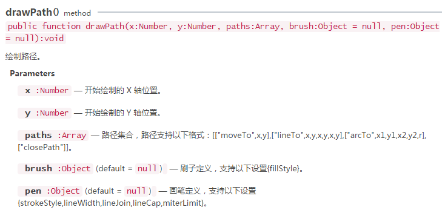
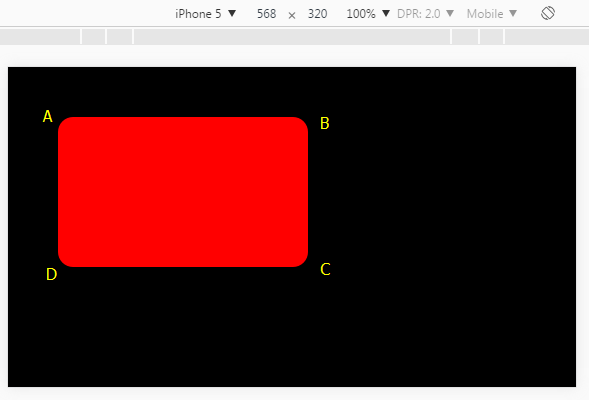
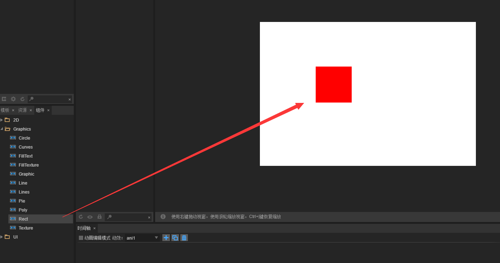
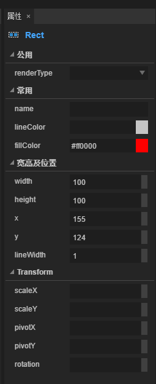

# Draw rectangle with rounded corners


### 1. Draw the rectangle with the drawRect method

Search the `laya.display.Graphics` class in API to see various vector graphics drawing methods. Among them, the  "drawRect();"method is used to draw rectangle. The detailed description of the method is shown below:

​	<br/>
​	(Picture 1)

Below we use the LayaAir engine to draw vector rectangles, the sample code is as follows:

```typescript
module laya {
    import Sprite = Laya.Sprite;
    import Stage = Laya.Stage;
 
    export class Sprite_DrawShapes {
        private sp: Sprite;
 
        constructor()
        {
            //初始化舞台
            Laya.init(500, 300);
            this.drawSomething();
        }
 
        private drawSomething(): void {
            this.sp = new Sprite();
            Laya.stage.addChild(this.sp);
           //画矩形
            this.sp.graphics.drawRect(20, 20, 100, 50, "#ffff00");
        }
    }
}
new laya.Sprite_DrawShapes();
```

Code running effect:

​	<br/>
​	(Picture 2)

In the example, "20, 20" is the rectangular starting point coordinate, 100 is the width to the right, if value is negative  will set the width left. 50 is the downward height,  if value is negative  will set the height upward. We can write the code, adjust the parameters to experience it.


### B. draw rectangle with drawPath

The method "drawPath ()" of the `laya.display.Graphics`class draws vector graphics,including rectangles and rounded rectangles. A detailed description of the method is shown as follows:

​	<br/>
​	(Picture 3)

The parameters of the "drawPath()" method are relatively complex. In order to make it easier for good understanding, let's draw a rectangle with drawPath () to  be familiar with some parameters in the path.

The sample code for drawPath drawing rectangles is as follows:

```typescript
module laya {
    import Sprite = Laya.Sprite;
    import Stage = Laya.Stage;
 
    export class Sprite_DrawShapes {
        private sp: Sprite;
 
        constructor()
        {
            //初始化舞台
            Laya.init(500, 300);
            this.drawSomething();
        }
 
        private drawSomething(): void {
            this.sp = new Sprite();
            Laya.stage.addChild(this.sp);
           //自定义路径
            var path:Array<any> =  [
                ["moveTo", 0, 0], //画笔移到A点
                ["lineTo", 100, 0],//画到B点
                ["lineTo", 100, 50],//再画到C点
                ["lineTo", 0, 50], //继续画到D点
                ["closePath"] //闭合路径
            ];
             //绘制矩形
            this.sp.graphics.drawPath(20, 20, path, {fillStyle: "#ff0000"});
        }
    }
}
new laya.Sprite_DrawShapes();
```

The code runs as shown below:

​	<br/>
​	(Picture 4)

The coordinate points "20, 20" set at the  first and second parameters of the drawPath define the starting coordinate for controlling the overall position. Third parameter set path as "MoveTo",  beginning of the movement of the brush
Start position. "0,0" is relative to the starting position of "20,20", so point A is still at the origin of the starting position. The description information "lineto" is drawn to the coordinates of the path point "100,0". Define the coordinate drawn to the position point B,  C , D and so on, finally to "closePath" to closed position, otherwise MoveTo will continue.

From the rendering rectangle, the drawPath method is certainly more convenient without the drawRect method. However, you can use this example to understand the relevant parameters usage. As for other non rounded graphics, we can self-code it ourselves by adjusting the parameters.


### C. Draw a rounded rectangle with drawPath

#### 3.1 user guide

DrawPath method in LayaAir engine can use graphics to draw a rounded corner, the specific operation takes three steps, draw the path specified starting point `["moveTo", x, y]`, draw a horizontal line`["lineTo", x, y]`, draw arc `["arcTo", p1.x, p1.y, p2.x, p2.y, r]`. 

**Parameter example**:

```java
["moveTo", 50, 50],
["lineTo", 150, 50],
["arcTo", 200, 50, 200, 100, 50],
```

The above parameter running effect diagram is shown in figure 5-1:

 <br /> (Picture 5-1)

Through Figure 5-1 we can see that `["moveTo", 50, 50]` locate the starting point of the brush at the `"50,50"`position. `["lineTo", 150, 50]`  draws a straight line from the starting point to the current endpoint（"`150, 50`"）. `["arcTo", 200, 50, 200, 100, 50]`draws a r (radius) of 50 arcs.

**Arc drawing principle **:

When rendering this arc, it actually using the current endpoint `"150, 50"`, endpoint 1 `"200, 50"`, endpoint 2 `"200, 100"`, the angles formed by the three points making a radius of 50px and tangent on both sides of the arc.


#### 3.2 Draw rounded rectangle example

Next, we'll draw a rounded rectangle with a radius of 30. Here's the sample code:


```typescript
module laya {
    import Sprite = Laya.Sprite;
    import Stage = Laya.Stage;
 
    export class Sprite_DrawShapes {
        private sp: Sprite;
 
        constructor()
        {
            //初始化舞台
            Laya.init(1136, 640);
            this.drawSomething();
        }
 
        private drawSomething(): void {
            this.sp = new Sprite();
            Laya.stage.addChild(this.sp);
            //自定义路径
            var path:any[] =  [
				["moveTo", 0, 0], //画笔的起始点，
				["arcTo", 500, 0, 500, 30, 30], //p1（500,0）为夹角B，（500,30）为端点p2
				["arcTo", 500, 300, 470, 300, 30],//p1（500,300）为夹角C，（470,300）为端点p2
				["arcTo", 0, 300, 0, 270, 30], //p1(0,300)为夹角D，（0,270）为端点p2
				["arcTo", 0, 0, 30, 0, 30],//p1(0,0)为夹角A，（30,0）为端点p2
			];
        //绘制圆角矩形
        this.sp.graphics.drawPath(100, 100, path, {fillStyle: "#00ffff"});
        }
    }
}
new laya.Sprite_DrawShapes();
```

Code running effect:

​	<br/>
​	(Picture 5-2)

In the above code, it seems that there is no problem. In fact, the starting point of the moveTo, need a straight line between the following arc. We only need to drawPath draw to add a border line. you can clearly see the error in rendering. The drawing method graphics.drawPath is modified as :

```java
//绘制圆角矩形
this.sp.graphics.drawPath(100, 100, path, {fillStyle: "#ff0000"},{"strokeStyle":"#ffffff","lineWidth":"10"});
```

The modified effect shown in Figure 5-3, starts at the point of the brush 0,0 when drawing the line,  it is not the result we want.

 <br /> (Picture 5-3)

Here we will change the example to the correct code:

```typescript
module laya {
    import Sprite = Laya.Sprite;
    import Stage = Laya.Stage;
 
    export class Sprite_DrawShapes {
        private sp: Sprite;
 
        constructor()
        {
            //初始化舞台
            Laya.init(1136, 640);
            this.drawSomething();
        }
 
        private drawSomething(): void {
            this.sp = new Sprite();
            Laya.stage.addChild(this.sp);
            //自定义路径
            var path:any[] =  [
				["moveTo", 30, 0], //画笔的起始点，
				["arcTo", 500, 0, 500, 30, 30], //p1（500,0）为夹角B，（500,30）为端点p2
				["arcTo", 500, 300, 470, 300, 30],//p1（500,300）为夹角C，（470,300）为端点p2
				["arcTo", 0, 300, 0, 270, 30], //p1(0,300)为夹角D，（0,270）为端点p2
				["arcTo", 0, 0, 30, 0, 30],//p1(0,0)为夹角A，（30,0）为端点p2
			];
        //绘制圆角矩形
        this.sp.graphics.drawPath(100, 100, path, {fillStyle: "#ff0000"},{"strokeStyle":"#ffffff","lineWidth":"10"});
        }
    }
}
new laya.Sprite_DrawShapes();
```

The running effect is shown in figure 5-4:

 (Picture 5-4)


### D. drag the control rectangle drawn with LayaAirIDE

​	**1**. Drag the control rectangle drawn with LayaAirIDE

​	<br/>
​   	(Picture 6) 

**2**. drag the curve component in the component onto the View page and automatically generate the default arc

​	<br/>
​   	(Picture 7)

**3**. modify (add / reduce) the values in the Rect component property, change the size, color, rotation angle, and so on of the rectangle.

​   	<br/>
​   	(Picture 8)  

​   	<br/>
​   	(Picture 9)  

Here we draw the rectangle through the components in the LayaAirIDE.
