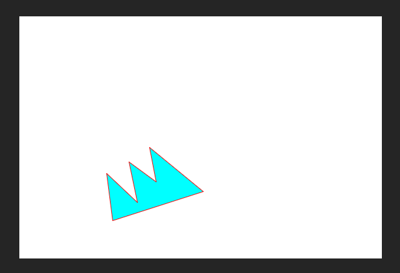

# Draw triangles, polygons, and custom patterns


​        Drawing a triangle, a polygon, or a custom pattern based on the specified path data can be done using the "drawpoly ();" method from laya.display.Graphics class in the LayaAir engine. A detailed description of the method is shown below:

​	<br/>
​	(Picture 1)


### A. Draw triangles

Now, We'll use the LayaAir engine to draw  first a triangle. The example code is as follows:

```javascript
module laya {
    import Sprite = Laya.Sprite;
    import Stage = Laya.Stage;
  
    export class Sprite_DrawShapes {
        private sp: Sprite;
  
        constructor()
        {
            Laya.init(500, 300);
            this.drawSomething();
        }
  
        private drawSomething(): void {
            this.sp = new Sprite();
            Laya.stage.addChild(this.sp);
            //画三角形
            this.sp.graphics.drawPoly(30, 28, [0, 100, 50, 0, 100, 100], "#ffff00");
  
        }
    }
}
new laya.Sprite_DrawShapes();
```

The code works as shown below:：

​	<br/>
​	(Picture 2)

​        Through the code, we can see that the third parameter of drawPoly function with point A, B,C (for coordinates respectively "0,100" , "50,0" , "100, 100"). The three coordinate points connected are filled with color value defined in the fourth parameter,  draw the yellow triangle above.  But what you need to understand and notice here is that all the coordinates in the third parameters are relative coordinates, which set in first and second parameters "30,28". Once the "30,28" changes, the overall shape of the position will be affected.


### **B. draw polygons**

​        We continue to use the above code example, by increasing the drawPoly third parameter coordinates, to achieve the polygon drawing, modify the code as follows:

```typescript
//画多边形
this.sp.graphics.drawPoly(30, 28, [0, 100, 50, 0, 100, 100, 75, 150, 25, 150], "#ffff00");
```

The code runs as shown below:

​	<br/>
​	(Picture 3)

​        In the modified code, we added the D point coordinates "75,150" and E point coordinates "25,150". By connecting the coordinates point to fill the color, we draw the polygon we want. To draw more polygons with more edges, increase the coordinate point  in the same way as above.


### **C. Draw a pattern based on the specified path data**

​        Through the triangle and polygon above, we have mastered the drawPoly drawing usage. The following example through an in-depth introduction, how to specify the path to draw a five-pointed star. The sample code is as follows:

```typescript
module laya {
    import Sprite = Laya.Sprite;
    import Stage = Laya.Stage;
  
    export class Sprite_DrawShapes {
        private sp: Sprite;
  
        constructor()
        {
            Laya.init(500, 300);
            this.drawSomething();
        }
  
        private drawSomething(): void {
            var canvas: Sprite = new Sprite();
            Laya.stage.addChild(canvas);
 
            var path: Array<number> = [];
            path.push(0, -130);//五角星A点坐标
            path.push(33, -33);//五角星B点坐标
            path.push(137, -30);//五角星C点坐标
            path.push(55, 32);//五角星D点坐标
            path.push(85, 130);//五角星E点坐标
            path.push(0, 73);//五角星F点坐标
            path.push(-85, 130);//五角星G点坐标
            path.push(-55, 32);//五角星H点坐标
            path.push(-137, -30);//五角星I点坐标
            path.push(-33, -33);//五角星J点坐标
 
            canvas.graphics.drawPoly(Laya.stage.width / 2, Laya.stage.height / 2, path, "#FF7F50");
      }
    }
}
new laya.Sprite_DrawShapes();
```


The code runs as shown below:

​	<br/>
​	(Picture 4)

​        Through the example code above written, we can handle many manners to draw polygon.


### D. Drawing irregular graphics with LayaAirIDE through the control (including triangles, polygons)


**1**.Open LayaAirIDE and click design mode to create a new View page

​	<br/>
​   	(Picture 5) 

**2**. Drag the curve component into the View page to automatically generate the default polygon

​	<br/>
​   	(Picture 6)  

**3**. Modify (add / subtract) the values in the Poly component properties, change the size of the polygon, the color, and so on.

​   	<br/>
​   	(Picture 7)   

​   	<br/>
​   	(Picture 8)  triangle

​   	<br/>
​   	(Picture 9)  irregular polygons


Here we draw the polygon through the LayaAirIDE component.