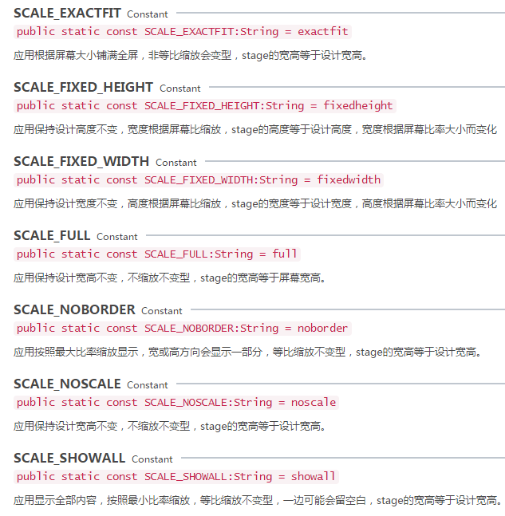
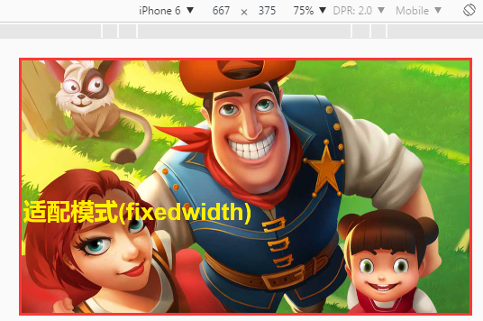
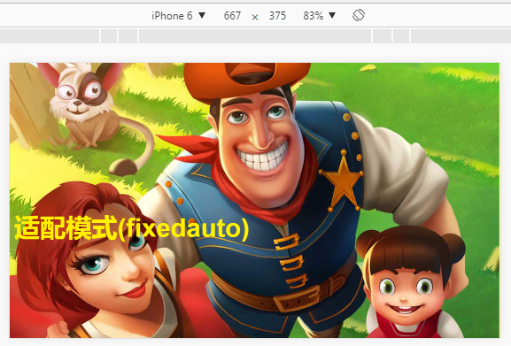

# Screen adaptable zoom mode detailed solution

​         The zoom mode is the focus of screen adaptation, from the basic concept to the parameter description. And combined with code examples to help you understand the LayaAir engine's screen zoom mode. In the API document, we search for laya.display.Stage，You can see that there are seven parameters for the zoom pattern, scaleMode, to implement the scaling requirements for various screen adaptation, as shown in Figure 1.

<br/>
​        （Picture 1）The parameter description of the LayaAir engine about the zoom mode scaleMode


**A brief overview of the parameters that we have to understand some of the basic concepts involved in this article: **

**1. Design width and height: ** 

​        The wide height defined in the project code  initializes the stage Laya.init () defined width is the design width.

**2. Stage Width and height : **

​        The stage width is the actual height of the game stage.

**3. Suitable width and height:**

​       The adaptation of the engine scales the width of the design to the width and height of the design. To facilitate understanding, we call adaptation width and height.

**4. Canvas width and height: **

​        The width of the canvas refers o the width and height of the canvas node in the HTML5, and all the visible contents in the game are in the canvas area.

**5. Screen width and height **

​        Screen width refers to the screen width of mobile browser. For example iphone6 vertical screen when the screen width is high `375*667`。The LayaAir engine can get the width and height of the screen by laya.utils.Browser.clientWidth and laya.utils.Browser.clientHeight.

**6. Physical width and height **

​        With regard to the physical width of the device screen, we need to understand the concept of pixel density first. On a PC computer, a pixel is usually a pixel in a pixel position. Today, mobile devices are developing at a high speed, and the screen of a cell phone usually has 2 or 3 pixels on a pixel position. Example iphone6 vertical screen when the physical width of `750*1334`。LayaAir engine through the laya.utils.Browser.width and laya.utils.Browser.height to get the screen width of the device screen physical height.


### The background image used in the sample code:

[loadingBg.jpg](http://ldc.layabox.com/uploadfile/file/20170223/1487816895380055.jpg)(Click open or save `1136×640` pixel background original diagram)


### 1. exactfit mode

​        The exactfit pattern is a raw ratio that does not take content into account, direct **Fill the entire browser screen with non-proportional scaling** Mode. In this mode. The width of the canvas and the stage width are all equal to the design width and will not change. However, when the physical width and height of the design range, this non-proportional scaling mode **It may cause the original design to be deformed**. The effect is shown in Figure 2 and figure 3.

​        <br/>
​        （Picture 2）Design width is `1136*640`, Physical wide height is `1334*750` exactfix mode to run the effect

​        <br/>
​        （Picture 3）Design width is `1136*640`, Physical wide height is `750*1334` exactfix mode to run the effect


**exactfit mode sample code : **

```typescript
module laya {
    import Text = Laya.Text;
    import Image = Laya.Image;
    import Sprite = Laya.Sprite;
 
    export class SmartScale_T {
 
        //适配模式
        private modes:string = "exactfit";
        //全局文本信息
        private txt: Text;
 
        constructor() {
        //初始化舞台大小
        Laya.init(1136, 640);
 
        //设置适配模式
        Laya.stage.scaleMode = this.modes;
        //设置舞台背景色
        Laya.stage.bgColor  = "#ffff99";
 
 
        //实例一个背景
        var bg = new Image();
        bg.skin = "res/img/loadingBg.jpg";
        Laya.stage.addChild(bg);
 
 
        //实例一个文本
        this.txt = new Text();
        this.txt.text = "适配模式("+this.modes+") ";
        this.txt.bold = true;
        this.txt.pos(10, 350);
        this.txt.fontSize = 60;
        this.txt.color   = "#fff000";
        Laya.stage.addChild(this.txt);
        }
 
    }
}
new laya.SmartScale_T();
```


### 2. fixedheight mode

​        In the fixedheight mode, the high maintenance design of the canvas and stage is highly unchanged. The width of the canvas and the stage is equal to the fitting width (the suitable width = the design height * the aspect ratio of the screen). Finally, according to the screen width and height, full screen scale adaptation is adopted. This mode is one of the mainstream adaptation modes.

​           For example: iPhone6 horizontal screen, screen width and height is `667*375`, height of 640, then using the fixedheight model, `adaptive width =(667/375)*640`. Adaptive width calculation results of 1138 after rounding is the width of the canvas. The full screen effect of the example stretching is shown in Figure 4:

​         <br/>
​        （Picture 4）Canvas width is high `1067*640`, Physical width is high `1334*750` running effect of fixedheight mode

​        Similarly, iPhone6 vertical screen `adaptive width =(375/667)*640`. Fit width calculation results after rounding 360 is the width of the canvas. If we are designed by a horizontal screen, it needs to be set up as an automatic horizontal screen when the mode is used, otherwise the parts of the canvas are not displayed. The fixedheight mode example tensile fit full screen effect is shown in Figure 5.

​        <br/>
​        （Picture 5）The canvas is wide and high `360*640`. Physical width is high `750*1334` Fixedheight mode running effect

**fixedheight mode sample code :**


```typescript
module laya {
    import Text = Laya.Text;
    import Image = Laya.Image;
    import Sprite = Laya.Sprite;
 
    export class SmartScale_T {
 
        //适配模式
        private modes:string = "fixedheight";
        //全局文本信息
        private txt: Text;
 
        constructor() {
        //初始化舞台大小
        Laya.init(0, 640);
 
        //设置适配模式
        Laya.stage.scaleMode = this.modes;
        //设置舞台背景色
        Laya.stage.bgColor  = "#ffff99";
 
 
        //实例一个背景
        var bg = new Image();
        bg.skin = "res/img/loadingBg.jpg";
        Laya.stage.addChild(bg);
 
 
        //实例一个文本
        this.txt = new Text();
        this.txt.text = "适配模式("+this.modes+") ";
        this.txt.bold = true;
        this.txt.pos(10, 350);
        this.txt.fontSize = 60;
        this.txt.color   = "#fff000";
        Laya.stage.addChild(this.txt);
        }
 
    }
}
new laya.SmartScale_T();
```


### 3. fixedwidth mode

​        fixedwidth mode, the width of the canvas and the stage to maintain the same design width, canvas and stage height equal to the height of the adaptation（`Fit Height = Design Width * Screen aspect ratio`），Finally, full screen scale adaptation is made according to the width of the screen, which is one of the mainstream adaptable modes.

​        For example: iPhone6 horizontal screen, the screen width is `667*375`, the design width is 1136, then after the Fixedwidth mode，`Fit height=(375/667)*1136`. Fit height calculation results after rounding the 639 is the height of the canvas. The full screen effect of the example stretching is shown in Figure 6 :

​        <br/>
​        （picture 6）Canvas dimension `1136*639`. physical dimension `1334*750` of Fixedwidth mode running effect

​        Similarly, iPhone6 vertical screen adaptation height =(667/375)*1136. Fit height calculation results of 2021 after rounding is the height of the canvas. If we are based on horizontal screen design, it is time to use this mode, Set up as an automatic horizontal screen，Otherwise, it is usually not the effect that we want when the width of the adapter is higher than the width of the screen, and the same ratio is scaled to the screen wide for full screen display. The Fixedwidth mode example tensile fit full screen effect is shown in Figure 6 : 

​        <br/>
​        （Picture 7）The running effect of a Fixedwidth mode with a wide canvas of `1136*2021`, and a high physical width of  `1334*750`.


**fixedwidth pseudo-code sample:**

```typescript
module laya {
    import Text = Laya.Text;
    import Image = Laya.Image;
    import Sprite = Laya.Sprite;
 
    export class SmartScale_T {
 
        //适配模式
        private modes:string = "fixedwidth";
        //全局文本信息
        private txt: Text;
 
        constructor() {
        //初始化舞台大小
        Laya.init(1136, 0);
 
        //设置适配模式
        Laya.stage.scaleMode = this.modes;
        //设置舞台背景色
        Laya.stage.bgColor  = "#ffff99";
 
 
        //实例一个背景
        var bg = new Image();
        bg.skin = "res/img/loadingBg.jpg";
        Laya.stage.addChild(bg);
 
 
        //实例一个文本
        this.txt = new Text();
        this.txt.text = "适配模式("+this.modes+") ";
        this.txt.bold = true;
        this.txt.pos(10, 350);
        this.txt.fontSize = 60;
        this.txt.color   = "#fff000";
        Laya.stage.addChild(this.txt);
        }
 
    }
}
new laya.SmartScale_T();
```


### 4. full mode

​        In the full mode, the width and height of stage and canvas will be ignored, which is directly equal to the physical width and height. So this is also the mainstream scaling mode with the highest accuracy of game quality. In this mode, the content of the design will not be scaled, keeping the original proportion of 1:1, and the stage will be aligned with the upper left corner of the browser screen. The original design content will be cut beyond the screen part. The example results are shown in Figure 10 and Figure 11.
​        
​        （figure 8）Design width and height and width of the same `1136*640` full mode horizontal screen running effect

​        
​        （figure 9）Design width of `1136*640`, physical width of `960*640` full mode horizontal screen running effect


**full mode sample code: **

```typescript
module laya {
    import Text = Laya.Text;
    import Image = Laya.Image;
    import Sprite = Laya.Sprite;
 
    export class SmartScale_T {
 
        //适配模式
        private modes:string = "full";
        //全局文本信息
        private txt: Text;
 
        constructor() {
        //初始化舞台大小
        Laya.init(0, 0);
 
        //设置适配模式
        Laya.stage.scaleMode = this.modes;
        //设置舞台背景色
        Laya.stage.bgColor  = "#ffff99";
 
 
        //实例一个背景
        var bg = new Image();
        bg.skin = "res/img/loadingBg.jpg";
        Laya.stage.addChild(bg);
 
 
        //实例一个文本
        this.txt = new Text();
        this.txt.text = "适配模式("+this.modes+") ";
        this.txt.bold = true;
        this.txt.pos(10, 350);
        this.txt.fontSize = 60;
        this.txt.color   = "#fff000";
        Laya.stage.addChild(this.txt);
        }
 
    }
}
new laya.SmartScale_T();
```

**Tips：**

​        1. although the mode is a high accuracy adaptation mode, the pressure on the game performance is also higher than other modes. If we choose this mode, we must consider the overall consideration of the game.

​        2. Since the width and height of the canvas and stage are taken directly from the physical width and height of the screen, the height value of Laya.init () can be set to 0 directly.


### 5. noscale mode

​        The noscale mode is a non - scaling pattern, and the width of the canvas and the stage is equal to the design width. On the basis of maintaining the 1:1 original design ratio, the stage is aligned with the top left corner of the browser screen. When the width of the screen is less than the content, it will be cut, and when the screen width is higher than the content, the black edge will appear. The running effect of this pattern is shown in Figure 12 and figure 13.

​        <br/>
​        （Figure 10）The screen width is greater than the design width.

​        <br/>
​        （Figure  11） the design content is beyond the screen width, the screen height is greater than the design height.


**The example code for the noscale mode is as follows: **


```typescript
module laya {
    import Text = Laya.Text;
    import Image = Laya.Image;
    import Sprite = Laya.Sprite;
 
    export class SmartScale_T {
 
        //适配模式
        private modes:string = "noscale";
        //全局文本信息
        private txt: Text;
 
        constructor() {
        //初始化舞台大小
        Laya.init(1136, 640);
 
        //设置适配模式
        Laya.stage.scaleMode = this.modes;
        //设置舞台背景色
        Laya.stage.bgColor  = "#ffff99";
 
 
        //实例一个背景
        var bg = new Image();
        bg.skin = "res/img/loadingBg.jpg";
        Laya.stage.addChild(bg);
 
 
        //实例一个文本
        this.txt = new Text();
        this.txt.text = "适配模式("+this.modes+") ";
        this.txt.bold = true;
        this.txt.pos(10, 350);
        this.txt.fontSize = 60;
        this.txt.color   = "#fff000";
        Laya.stage.addChild(this.txt);
        }
 
    }
}
new laya.SmartScale_T();
```


### 6. noborder model

​        In noborder mode, the width of the canvas is equal to the design width. Scaling, scaling the width of the screen to a party with the maximum ratio of design width to height. For example, the design size is `1136*640`, and the physical width of the screen is  `750*1334`. A wide ratio of `（750/1136）`is 0.66，Ratio of high `（1334/640）` is 2.08。When the noborder pattern is zoomed, the maximum ratio of one party (high). The fitting height is stretched to 1334  of the physical height, and the appropriate width isometric stretching （`1334/640*1136`）is 2368. Of course, part of the width of the screen will be cut off. The effect is shown in Figure 14.

​        <br/>
​        （Picture 12）The width of the canvas is high and the design size is kept `1136*640` stretched to the full screen at the maximum ratio of one side to the full screen.


**noborder pattern sample code is as follows : **

```typescript
module laya {
    import Text = Laya.Text;
    import Image = Laya.Image;
    import Sprite = Laya.Sprite;
 
    export class SmartScale_T {
 
        //适配模式
        private modes:string = "noborder";
        //全局文本信息
        private txt: Text;
 
        constructor() {
        //初始化舞台大小
        Laya.init(1136, 640);
 
        //设置适配模式
        Laya.stage.scaleMode = this.modes;
        //设置舞台背景色
        Laya.stage.bgColor  = "#ffff99";
 
 
        //实例一个背景
        var bg = new Image();
        bg.skin = "res/img/loadingBg.jpg";
        Laya.stage.addChild(bg);
 
 
        //实例一个文本
        this.txt = new Text();
        this.txt.text = "适配模式("+this.modes+") ";
        this.txt.bold = true;
        this.txt.pos(10, 350);
        this.txt.fontSize = 60;
        this.txt.color   = "#fff000";
        Laya.stage.addChild(this.txt);
        }
 
    }
}
new laya.SmartScale_T();
```


### 7. Showall model

​        In the showall mode, the width and height of stage and the canvas are equal to the adaptable width and height of the zoom.

​         For example, the design size is `1136*640`. and the physical width of the screen is `750*1334`. The calculated ratio （`750/1136`）is 0.66. Ratio of high （`1334/640`） is 2.08. When showall mode is used to zoom, the width of the canvas will be reduced to 750 of the physical width of the screen according to the minimum ratio, and the（`750/1136*640`） of the screen height is equal to 423. At this point, as 423 is less than 1334 of the physical height of the screen, a large number of black screens will appear. The effect is shown in Figure 15.

​        <br/>
​        （Picture 13） the width of the canvas is zoomed to `750*423`. Large number of black air screens appear on the `750*423` screen.


**Example code for the showall mode is as follows : **

```typescript
module laya {
    import Text = Laya.Text;
    import Image = Laya.Image;
    import Sprite = Laya.Sprite;
 
    export class SmartScale_T {
 
        //适配模式
        private modes:string = "showall";
        //全局文本信息
        private txt: Text;
 
        constructor() {
        //初始化舞台大小
        Laya.init(1136, 640);
 
        //设置适配模式
        Laya.stage.scaleMode = this.modes;
        //设置舞台背景色
        Laya.stage.bgColor  = "#ffff99";
 
 
        //实例一个背景
        var bg = new Image();
        bg.skin = "res/img/loadingBg.jpg";
        Laya.stage.addChild(bg);
 
 
        //实例一个文本
        this.txt = new Text();
        this.txt.text = "适配模式("+this.modes+") ";
        this.txt.bold = true;
        this.txt.pos(10, 350);
        this.txt.fontSize = 60;
        this.txt.color   = "#fff000";
        Laya.stage.addChild(this.txt);
        }
 
    }
}
new laya.SmartScale_T();
```


### 8. fixedauto mode

​        In fixedauto mode, the width of stage and canvas is equal to the width and height of the scaled image, while the scaling is displayed in full screen according to the aspect ratio.  According to the screen aspect ratio,  automatic calculation of SCALE_FIXED_WIDTH and SCALE_FIXED_HEIGHT two models, the selection screen aspect ratio is closer to the design aspect ratio model.

​        For example: iPhone6 horizontal screen, the screen size to `667*375`. The design width is 1136, then after using the fixedauto mode, the SCALE_FIXED_WIDTH mode will be automatically selected according to the width to height ratio.。`Fit height =(375/667)*1136`，The height of the canvas is calculated as 639 after the height of the fitting height is rounded. Example stretch fit full screen as shown in Figure 8:

​         <br/>
​        （Picture 14）Canvas dimension `1136*639`. Physical dimension `1334*750` running effect of fixedauto mode

​        Similarly, iPhone6 vertical screen adaptation of height =(667/375)*1136, with a height of 2021 calculation results after rounding is the height of the canvas. According to the ratio of width to height, the SCALE_FIXED_HEIGHT adaptation mode which is closer to the ratio of screen width to height is selected automatically.

​	If we are designed according to the horizontal screen, we need to set up the automatic horizontal screen when we use this mode. Otherwise, the height of the adaption is higher than the screen height, and then we should cut the crosswise according to the height of the design. This is usually not the result we want. The fixedauto mode example of the full screen full screen effect is shown in Figure 9:

​        <br/>
​        （picture 15）canvas dimension `1136*2021`. Physical dimension `1334*750` running effect of fixedauto mode


**fixedauto pattern sample code is as follows:**

```javascript
module laya {
    import Text = Laya.Text;
    import Image = Laya.Image;
    import Sprite = Laya.Sprite;
 
    export class SmartScale_T {
 
        //适配模式
        private modes:string = "fixedauto";
        //全局文本信息
        private txt: Text;
 
        constructor() {
        //初始化舞台大小
        Laya.init(1136, 640);
 
        //设置适配模式
        Laya.stage.scaleMode = this.modes;
        //设置舞台背景色
        Laya.stage.bgColor  = "#ffff99";
 
 
        //实例一个背景
        var bg = new Image();
        bg.skin = "res/img/loadingBg.jpg";
        Laya.stage.addChild(bg);
 
 
        //实例一个文本
        this.txt = new Text();
        this.txt.text = "适配模式("+this.modes+") ";
        this.txt.bold = true;
        this.txt.pos(10, 350);
        this.txt.fontSize = 60;
        this.txt.color   = "#fff000";
        Laya.stage.addChild(this.txt);
        }
 
    }
}
new laya.SmartScale_T();
```


**Conclusion : **

​        Full mode is fully pixel-by-pixel rendering, how big the screen size is, and how big the fit adaptation  is, is a high-quality, common adaptation mode, but in different sizes of screens, the size of the display content will vary, while HTML5 The game's performance pressure is higher than other adaptation modes

​        Showall and noborder are equal scaling patterns that keep the picture from deforming. The showall scales the screen and design minimum ratio to ensure that the picture can be fully displayed, but it will lead to the black side of the screen. Noborder is just the opposite. According to the maximum ratio of screen to design, the empty screen will not appear, but it will cause partial content of wide or high content to not be displayed.

​        Fixedwidth and fixedheight are more like variants of showall and noborder. They are also equal ratio scaling modes. However, specifying one side to move and scaling on the other side is a common mainstream adaptation mode in current HTML5 games.

​        Fixedauto can automatically select according to the screen adaptation of better than Fixedwidth or fixedheight mode, better for us to solve the HTML5 game for the different models lead to screen adaptation difficult to choice problem.

​        This article focuses on the different parameters of the zoom pattern. Instead of combining other screen adaption settings such as automatic screen rotation, developers can look at other related technical documents.

