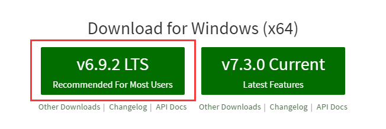

# Build a development environment (TS code compiler)


### 1.1 Node.js Download

​        TypeScript development HTML5 needs the Node.js environment, if not installed, please go to the official download (recommended version LTS), such as Figure 1, URL address : [https://nodejs.org/en/](https://nodejs.org/en/)

​        <br/>
​         Picture（1）

### 1.2 Configuring the TypeScript compilation environment

​        Step 1：Install Node.js, find the just downloaded Node.js installation package, and install it step by step. If you have installed it, you can skip this step

​        <br/>
​         Picture（2）

 

​        Step 2：After installing Node.js, Then you can use NPM to install TypeScript Compiler. Then you can compile TypeScript into JavaScript through this Compiler. In this step, developers need to open the CMD command line tool，Input instruction “`npm install -g typescript`”. When you press the return key, you can start the installation of TypeScript Compiler

```typescript
npm install -g typescript
```

​        <br/>
​         Picture（3）


​         Step 3：As shown in the following figure, when we see “-- typescrip@ version number” At the time, you can confirm the installation of the TypeScript Compiler, then can close the command line tool 

​        <br/>
​         Picture（4）


###  1.3 Check the TypeScript compiled environment version

Enter the “tsc -v” command on the command line to view the current version of the TypeScript compiled

```typescript
tsc -v
```

​       <br/>
​         Picture（5）