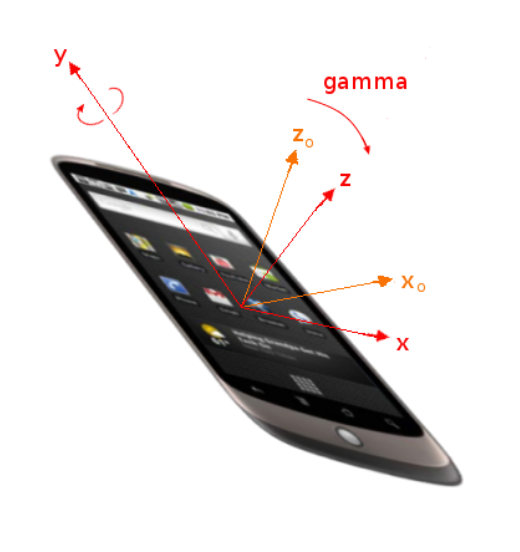

# Laya.device.motion description: gyroscope and accelerometer

[TOC]

Laya.device.motion have four classes for developers to use,AccelerationInfo,  Accelerator, Gyroscope and RotationInf. This section will describe in detail the relevant content of laya.device.motion API.

## 1. Gyroscope

​	`Gyroscope`  listens for `change`  in device orientation via the change event. This event has two callback parameters:

- `absolute` —— true if the device is based on the difference between the device coordinate system and the Earth coordinate system; if the device can not detect the earth coordinate system, `absolute` is `false`。
- `rotationInfo` —— RotationInfo type, containing `alpha`,`beta`,`gamma`, discuss in detail below.

 ​`alpha`,`beta` and `gamma` attributes must indicate the direction of the device, which is represented by the transformation from the coordinate system on the earth to the coordinate system fixed on the device. Coordinate systems must be adjusted in accordance with the following description.

 ​The earth coordinate system is a "East, north, upper" system at the user's location. It has 3 axes, where the ground is tangent to the user of the spheriod of the 1984 world geodetic system.

- East (X) on the ground, perpendicular to the north axis, east is positive

- North (Y) on the ground, to the north is positive (pointing to the North).

- Up (Z) is perpendicular to the ground and is positive.

  For a mobile phone or tablet, the device coordinate system is defined in the standard direction of the screen. If the screen orientation changes when the device rotates or unfolds the sliding keyboard, this does not affect the direction of the coordinate system of the device.

- X is on the screen or keyboard plane, and the right side of the screen or keyboard is positive.

- Y is on the screen or keyboard screen,  top of screen  or the keyboard is positive.

- Z is perpendicular to the screen or keyboard screen, out of screen or keyboard being positive.

  ​ The rotation is defined by right hand rule, also call clockwise. Starting from the two lines coincides, rotate the following rules:

1. #### Rotate the `alpha`  degree with the z-axis of the device coordinate system. The range of  `alpha` is [0, 360]。

<br/>
(Picture 1)

2. #### Rotate the device to`beta` coordinate system of the equipment coordinate in x axis, the range of `beta` is [-180, 180]。

<br/>
(Picture 2）

3. #### The device coordinate system is y, the axis is axis, and the rotation is `gamma` degrees. The range of `gamma` is [-90, 90]。

<br/>
(Picture 3）
The following shows the rotation orientation information:


```typescript
private var info:Text;
 
public function Gyroscope_Sample() 
{
 Laya.init(550, 400);
  
 info = new Text();
 info.fontSize = 50;
 info.color = "#FFFFFF";
 info.size(Laya.stage.width, Laya.stage.height);
 Laya.stage.addChild(info);
  
 Gyroscope.instance.on(Event.CHANGE, this, onDeviceorientation);
}
 
private function onDeviceorientation(absolute:Boolean, rotationInfo:RotationInfo):void 
{
 info.text = 
 "alpha:" + Math.floor(rotationInfo.alpha) + '\n' +
 "beta :" + Math.floor(rotationInfo.beta) + '\n' +
 "gamma:" + Math.floor(rotationInfo.gamma);
}
```

## 2. Accelerometer

​	`Accelerator` class periodically sends the device's motion sensor detection activity. This data indicates the movement of the device on the three-dimensional axis. When the device moves, the sensor detects the movement and returns the acceleration coordinates of the device. Even when it is still, you can get acceleration coordinates that contain gravity.

​	`change` callback function of the change event has one of the following parameters:

- `acceleration` —— `AccelerationInfo` Type. Provides acceleration information of the host device relative to the earth coordinate system, which is represented in the main coordinate system defined in the section of the gyroscope, in units of `m/s^2`。
- `accelerationIncludingGravity` —— `AccelerationInfo` Type. For acceleration data that can not provide the effect of excluding gravity (eg, lack of gyroscopes), as an alternative, acceleration data can be provided by gravity. This is not easy for many applications, but providing this information means providing maximum support. In this case, the `accelerationIncludingGravity`property provides the acceleration information for the host device and adds an inverse counter-gravity acceleration in the opposite direction of acceleration. The representation is defined as the main coordinate system of the gyroscope chapter. The unit of acceleration information is`m/s^2`。
- `rotationRate` —— `RotationInfo` attribute provides the rate at which the host device rotates in space, in the form of an angle change rate defined in the gyroscope chapter, which must be `deg/s`。
- `interval` —— interval from which data is obtained from hardware is milliseconds.

### 2.1 Get the physical direction of the device movement information

 Accelerometer axis is the physical direction of the device, which means that when you rotate the device, the accelerometer axis will rotate.

 The following demonstrates acquisition of equipment movement information:

```typescript
private var info:Text;

public function Accelerator_Sample()
{
	Laya.init(Browser.width, Browser.height);
	
	info = new Text();
	info.fontSize = 50;
	info.color = "#FFFFFF";
	info.size(Laya.stage.width, Laya.stage.height);
	Laya.stage.addChild(info);
	
	Accelerator.instance.on(Event.CHANGE, this, onMotoin);
}

private function onMotoin(acceleration:AccelerationInfo, accelerationIncludingGravity:AccelerationInfo, rotationRate:RotationInfo, interval:int):void
{
	info.text = 
		'acceleration:(' + acceleration.x.toFixed(3) + ', ' + acceleration.y.toFixed(3) + ', ' + acceleration.z.toFixed(3) + ')\n' +
		'accelerationIncludingGravity:(' + accelerationIncludingGravity.x.toFixed(3) + ', ' + accelerationIncludingGravity.y.toFixed(3) + ', ' + accelerationIncludingGravity.z.toFixed(3) + ')\n' +
		'rotationRate: alpha ' + Math.floor(rotationRate.alpha) + ', beta ' + Math.floor(rotationRate.beta) + ', gamma ' + Math.floor(rotationRate.gamma) + '\n' +
		'interval: ' + interval;
}
```

### **2.2  Get the device to display the direction of movement information**

​	You may need to display information as running direction, considering also if device rotating, the accelerometer axis does not change, such as the Y has always maintained vertically. Using `Accelerator.getTransformedAcceleration()`, you can get the running information in the display direction.

​	The `onMotion`  function in the above code example, using `Accelerator.getTransformedAcceleration()` convert information before using `AccelerationInfo` :

```typescript
private function onMotoin(acceleration:AccelerationInfo, accelerationIncludingGravity:AccelerationInfo, rotationRate:RotationInfo, interval:int):void
{
	acceleration = Accelerator.getTransformedAcceleration(acceleration);
  	accelerationIncludingGravity = Accelerator.getTransformedAcceleration(accelerationIncludingGravity);
  	......
}
```