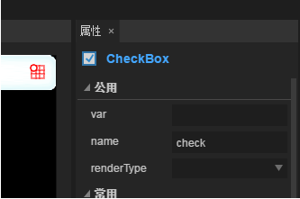
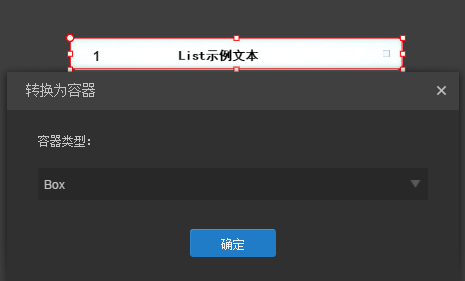
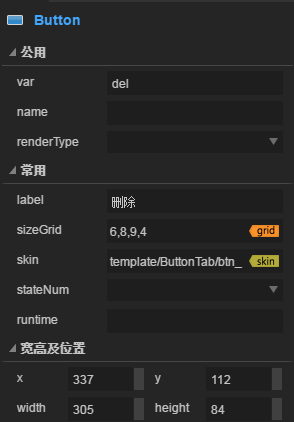
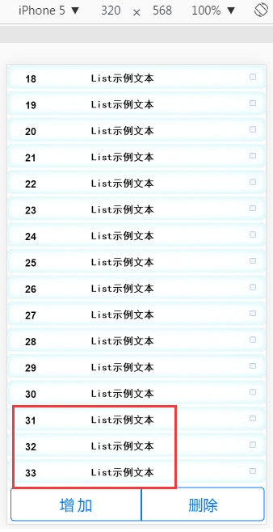

# List example: display, add, delete

​        List is a fairly common function. This article combines LayaAir engine and IDE for List display, add, delete and other related operations for step-by-step explanation, for developers learning engine and IDE practical reference. To create basic operations such as projects, check out other documents, skip this article

### A. make UI with LayaAirIDE

#####  1.1 Create a View page of type UI

​        
​        （Picture 1）Create a View type UI page called ListPage

​        First of all, we create a View type UI page in the LayaAirIDE project manager, which is 640*1136 wide. The page is named ListPage.

##### 1.2 Import UI resources

​      Import the UI page resources of art production into the resource manager. (specific import methods refer to documents imported from LayaAirIDE resources)

​        
​        （Picture 2）

##### 1.3 Making List background with nine squares

**1.3.1 Drag List background to the stage**

​      
​      （Picture 3）Drag the picture  bg_list.png to the stage

​	 **1.3.2  Image Passing through attributes into sizeGrid settings.**

​      
​      （Picture 4）Click on the right button of the sizeGrid property to open the settings panel

​	    **1.3.3 Set width to 640 (full screen width) in the property**

​      
​      （Picture 5）


 ##### 1.4 Making List containers

**1.4.1 Drag the checkbox.png to the stage and set the attribute name to check.**

​    
​        （Picture 6）

​**1.4.2 Drag a label.png to the stage, set the attribute name to listNumber, and other attributes refer to figure 7. **

​      
​      （Picture 7）label component for the serial number.

​	**1.4.3 Then drag a label.png to the stage and change the text to “List Sample text”, Property settings are shown in Figure 8:**

​      
​   （Picture 8）用于List文本的label组件

​	**1.4.4 Select the list background, serial number label, text label, checkbox, use Ctrl + B shortcut keys to create a Box container. Then select the Box container, set the Box property renderType to render. Figure 9, Figure 10. **

​      
​     （Picture 9）

​     
​      （Picture 10）

​	**1.4.5 Click the box container Ctrl + B again to create a List container, as shown in Figure 11. Note that all the List containers must be based on the Box container, so let's take a closer look at the hierarchy in Figure 12, which is based on the box loop.**

​      
​      （Picture 11）

​      
​      （Picture 12）

#####  1.5 Set the List property

​	Select the List container, set the Lis property var to _list (this variable can be called under all the properties under the component), and then set the other properties as needed, repeatX is the number of X-axis list, repeatY is the number of Y-axis list, spaceX Is the X-axis list spacing, and spaceY is the Y-axis list spacing. As shown in Figure 13:

​        
​      （Picture 13）

##### 1.6 Add operation button

​        Here, we use the template ButtonTab directly, drag and drop to the stage, and then click into the child node, set the VaR, label attributes, and nine squares, etc.. As shown in Figure 14, figure 15:

​        
​      （Picture 14）

​        
​      （Picture 15）

​      Adjust the details of the UI position, as shown in figure 16. When F12 releases UI, you can enter the code phase

​       
​      （Picture 16）

### 2. Using ActionScript language to realize List code logic

#####         2.1 Display the UI page.

​      2.1.1 Create a ListDemo.as program file and set it as the startup class.

​      
​     （Picture 17）

​      2.1.2  Edit code, display UI

We first introduce the loading and the UI class, and then load the atlas resources used to display the UI. Finally, the example UI interface is added to the stage. The following three links are implemented through coding ：

```typescript
module demo{        
        import WebGL = Laya.WebGL;
        import Loader = laya.net.Loader;
        import Handler = laya.utils.Handler;  
 
        //引入制作的List UI页面类，此处要结合自己项目，注意引入名称是否正确     
        import listPageUI = ui.test.ListPageUI;
                 
        export class list
        {                  
              private  listP:listPageUI;
              constructor()
           {
                //初始化舞台宽高
                Laya.init(640, 1136,WebGL);
                Laya.stage.bgColor = "#ffffff";
 
                //预加载资源文件后执行回调
                Laya.loader.load(["./res/atlas/ListPage.atlas","res/atlas/template/ButtonTab.atlas"], Handler.create(this, this.onLoaded));
              }
                 
              private  onLoaded():void 
            {
                    //实例UI界面
                    this.listP = new listPageUI();
                    //添加UI界面到舞台
                    Laya.stage.addChild(this.listP);
       
              }
        }
}
new demo.list();
```

​*      Tips：The path of the atlas in the code should be flexibly adjusted according to the actual situation of the project*

​        2.1.3 After the encoding is completed, run according to F5, as shown in Figure 18, the page display and the effect of IDE production is consistent, began to edit the logic code.

​        
​        （Picture 18）

#####     2.2 Write code logic

​**2.2.1 Implementation of List number logic**

​      In order to realize the data adding of List serial number, we need to use the “laya.ui.List” API in the list data source assignment array, the cell rendering processor renderHandler, and “laya.display.Node” API through the sub node name to obtain the sub node object method getChildByName. Let's look at the API instructions as follows: figure 19, Figure 20, figure 21.

​        
​      （Picture 19）

​      
​      （Picture 20）

​      
​        （Picture 21）

 **List serial number to add the code below: **

```typescript
module demo{        
        import WebGL = Laya.WebGL;
        import Loader = laya.net.Loader;
        import Handler = laya.utils.Handler;  
        import Box = laya.ui.Box;
        import Label = laya.ui.Label;
 
        //引入制作的List UI页面类，此处要结合自己项目，注意引入名称是否正确     
        import listPageUI = ui.test.ListPageUI;
                 
        export class list{                  
                private listP:listPageUI;
                private arr:Array;
                constructor()
                {
                        //初始化舞台宽高
                        Laya.init(640, 1136,WebGL);
                        Laya.stage.bgColor = "#ffffff";

                        //预加载资源文件后执行回调
                       Laya.loader.load(["./res/atlas/ListPage.atlas","res/atlas/template/ButtonTab.atlas"], Handler.create(this, this.onLoaded));
                  
                }
                 
                //资源加载后回调
                private  onLoaded():void 
                {
                        //实例UI界面
                        this.listP = new listPageUI();
                        //添加UI界面到舞台
                        Laya.stage.addChild(this.listP);
 
                        //获得List模拟数据，并渲染
                        this.getListData();                
                }
 
                //List数据模拟，渲染
                private  getListData():void
                {
                  //添加list数据
                  this.arr = [];
                  for (var i:number = 1; i <= 30; i++) {
                      this.arr.push({listNumber:{text:i}});
                  }
 
                  //将this.arr数据赋值到列表数据源。
                  this.listP._list.array = this.arr;
                  //list渲染:单元格渲染处理器(默认返回参数cell:Box,index:int)。
                  this.listP._list.renderHandler=new Handler(this,this.onRender);
                }
 
                /**
                 *渲染List 
                 * @param cell
                 * @param index
                 * 
                 */                
                private  onRender(cell:Box,index:number):void
                {
                    //如果索引不再可索引范围，则终止该函数
                    if(index > this.arr.length)return;
                    //获取当前渲染条目的数据
                    var data:any=this.arr[index];
                    //根据子节点的名字listNumber，获取子节点对象。         
                    var listNumber:Label=cell.getChildByName("listNumber");
                    //label渲染列表文本（序号）
                    listNumber.text=data.listNumber.text;
                }
        }
}
new demo.list();
```

​        The code running results are shown in Figure 22, and the serial data is successfully brought in. Specific implementation of logic and code instructions to view code and annotations directly.

​        
​      （Picture 22）

2.2.2 List order scroll
​      30 simulated data in the above example run, you can only see 16. So we need to add a scroll effect. The vScrollBarSkin in the laya.ui.List API fits our needs. The API description is shown in Figure 23:

​        
​        （Picture 23）
This function adds only one line of code, and it doesn't stick to all the code, and puts the following code before assigning the list data source.

```typescript
//添加list滚动条功能
this.listView._list.vScrollBarSkin='';
```

​       Again run the effect shown in Figure 24:

​        
​        （Picture 24）

2.2.3 List to increase functionality

​       To achieve List increase, you need to use LayaAir engine in the laya.display.Sprite event listener on () method in the LayaAir engine laya.display.Sprite to listen to the click event CLICK, and the method of adding cell data sources in laya.ui.List API addItem ();

​    
​       （Picture 25）

​       
​       （Picture 26）

 ```typescript
module demo{        
        import WebGL = Laya.WebGL;
        import Loader = laya.net.Loader;
        import Handler = laya.utils.Handler;  
        import Box = laya.ui.Box;
        import Label = laya.ui.Label;
        import Event = laya.events.Event;
 
        //引入制作的List UI页面类，此处要结合自己项目，注意引入名称是否正确     
        import listPageUI = ui.test.ListPageUI;
                 
        export class list{                  
                private listP:listPageUI;
                private arr:Array;
                constructor()
                {
                        //初始化舞台宽高
                        Laya.init(640, 1136,WebGL);
                        Laya.stage.bgColor = "#ffffff";
 
                        
                        //预加载资源文件后执行回调
                        Laya.loader.load(["res/atlas/ListPage.atlas","res/atlas/template/ButtonTab.atlas"], Handler.create(this, this.onLoaded));
                }
                 
                //资源加载后回调
                private  onLoaded():void 
                {
                        //实例UI界面
                        this.listP = new listPageUI();
                        //添加UI界面到舞台
                        Laya.stage.addChild(this.listP);
 
                        //获得List模拟数据，并渲染
                        this.getListData();                
                        //侦听增加按钮点击事件
                        this.listP.add.on(Event.CLICK,this,this.onAddClick);
                }
 
                //模拟List数据
                private  getListData():void
                {
                        //添加list数据
                        this.arr = [];
                        for (var i:number = 1; i <= 30; i++) {
                                        this.arr.push({listNumber:{text:i}});
                        }
                         
                        //添加list滚动条功能
                        this.listP._list.vScrollBarSkin='';
                        //将this.arr数据赋值到列表数据源。
                        this.listP._list.array = this.arr;
                        //list渲染:单元格渲染处理器(默认返回参数cell:Box,index:int)。
                        this.listP._list.renderHandler=new Handler(this,this.onRender);
                }
 
                /**
                 *渲染List 
                 * @param cell
                 * @param index
                 * 
                 */                
                private  onRender(cell:Box,index:number):void
                {
                        //如果索引不再可索引范围，则终止该函数
                        if(index > this.arr.length)return;
                        //获取当前渲染条目的数据
                        var data:any=this.arr[index];
                        //根据子节点的名字listNumber，获取子节点对象。         
                        var listNumber:Label=cell.getChildByName("listNumber");
                        //label渲染列表文本（序号）
                        listNumber.text=data.listNumber.text;
                }
 
                //添加新的List条目                 
                private  onAddClick():void
                {                
                        //添加单元格数据源
                        this.listP._list.addItem({listNumber: {text:this.arr.length+1}});
                }
        }
}
new demo.list();
 ```

​       See the code and notes directly:


​       The code runs as shown in figure 27:

​       
​       (Figure 27) increase the list effect

2.2.3 Make List able to delete features

​       List delete functions need to achieve checkbox function, delete the mouse button interception, delete the data after the re rendering. See the code and notes directly:

 ```typescript
module demo{        
    import WebGL = Laya.WebGL;
    import Loader = laya.net.Loader;
    import Handler = laya.utils.Handler;  
    import Box = laya.ui.Box;
    import Label = laya.ui.Label;
    import Event = laya.events.Event;
    import CheckBox = laya.ui.CheckBox;
    //引入制作的List UI页面类，此处要结合自己项目，注意引入名称是否正确     
    import listPageUI = ui.test.ListPageUI;
         
    export class list{                  
        private listP:listPageUI;
        private arr:Array;
        constructor()
        {
            //初始化舞台宽高
            Laya.init(640, 1136,WebGL);
            Laya.stage.bgColor = "#ffffff";
 
 
            //预加载资源文件后执行回调
            Laya.loader.load(["res/atlas/ListPage.atlas","res/atlas/template/ButtonTab.atlas"], Handler.create(this, this.onLoaded));
        }
         
        //资源加载后回调
        private  onLoaded():void 
        {
            //实例UI界面
            this.listP = new listPageUI();
            //添加UI界面到舞台
            Laya.stage.addChild(this.listP);
 
            //获得List模拟数据，并渲染
            this.getListData();    
            //侦听增加按钮点击事件
            this.listP.add.on(Event.CLICK,this,this.onAddClick);
            //侦听删除按钮点击事件
            this.listP.del.on(Event.CLICK,this,this.onRemoveClick);
        }
 
        //模拟List数据
        private  getListData():void
        {
            //添加list数据
            this.arr = [];
            for (var i:number = 1; i <= 30; i++) {
                    this.arr.push({listNumber:{text:i,isCheck:false}});
            }
             
            //添加list滚动条功能
            this.listP._list.vScrollBarSkin='';
            //将this.arr数据赋值到列表数据源。
            this.listP._list.array = this.arr;
            //renderHandler:单元格渲染处理器(默认返回参数cell:Box,index:int)。
            this.listP._list.renderHandler=new Handler(this,this.onRender);
            //mouseHandler: list单元格鼠标事件处理器
             this.listP._list.mouseHandler = new Handler(this,this.onMouse);
        }
 
        /**
         *渲染List 
         * @param cell
         * @param index
         * 
         */                
        private  onRender(cell:Box,index:number):void
        {
            //如果索引不再可索引范围，则终止该函数
            if(index > this.arr.length)return;
            //获取当前渲染条目的数据
            var data:any=this.arr[index];
            //根据子节点的名字listNumber，获取子节点对象。         
            var listNumber:Label=cell.getChildByName("listNumber");
            //label渲染列表文本（序号）
            listNumber.text=data.listNumber.text;
 
            //获取当前渲染条目的check组件
            var check:CheckBox=cell.getChildByName("check");
            //根据isCheck的值，确定当前check组件是否为勾选状态（可以避免出现其他多余的选中状态）
            if(data.isCheck)
            {
                    check.selected=true;
            }
            else
            {
                    check.selected=false;
            }
        }
 
        //添加新的List条目                 
        private  onAddClick():void
        {      
            //添加单元格数据源
            this.listP._list.addItem({listNumber: {text:this.arr.length+1},isCheck:false});
        }
 
        /**
         *鼠标事件添加 
         * @param e
         * @param index
         * 
         */                
        private  onMouse(e:Event,index:number):void
        {
            //鼠标单击事件触发
            if(e.type == Event.CLICK)
            {
                //判断点击事件类型,如果点中的是checkBox组件执行
                if((e.target) instanceof CheckBox)
                {
                    //记录当前条目所包含组件的数据信息(避免后续删除条目后数据结构显示错误)
                    var tempObj:any = this.arr[index];
                     
                    //根据check的选中状态，设置条目的数据信息
                    if(((e.target) as CheckBox).selected)
                    {
                        this.listP._list.setItem(index,{listNumber:{text:tempObj.listNumber.text} ,isCheck:true});
                    }
                    else
                    {
                        this.listP._list.setItem(index,{listNumber:{text:tempObj.listNumber.text},isCheck:false});
                    }
                }
            }
        }
 
 
        //移除选中的条目                 
        private  onRemoveClick():void
        {
            //创建一个新的数组，存放移除条目后的数据
            var temp:any = [];
            for(var i:number=0;i<this.arr.length;i++)
            {
                //将非选中状态的条目数据存储起来
                if(!this.arr[i].isCheck)
                {
                    temp.push(this.arr[i]);
                }
            }
            // this.arr = null;
            this.arr = temp;
            //将新的数组赋值给list
            this.listP._list.array = this.arr;
        }
 
 
    }
}
new demo.list();
 ```

​       The running effect is shown in figure 28:

​       
​       （Picture 28）After removing the effect of 2,3,4
​

​        So far, we have completed the list of UI production, as well as display, add, delete code logic. If you have any questions, please go to the community：ask.layabox.com。


