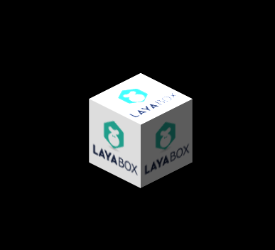
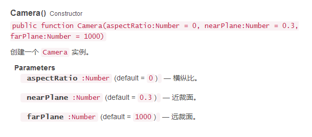
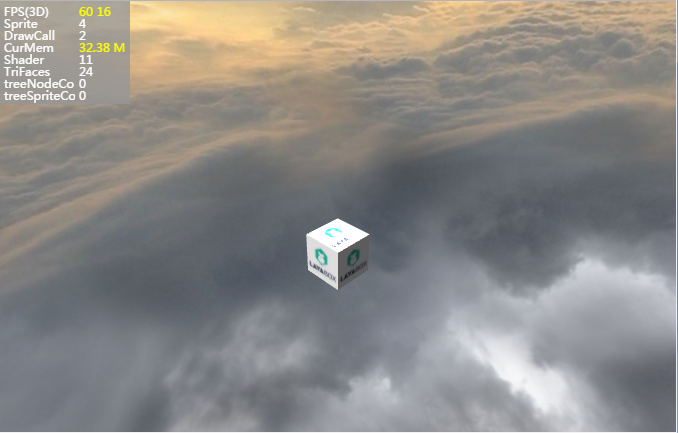

## LayaAir3D Camera

The camera in LayaAir can be understood as a camera for shooting movies or TV dramas, capturing 3D world pictures and then presenting them to the screen. At the same time, the LayaAir 3D engine also adds VR cameras, developers can use it to develop VR stereo applications or games.

Of course, there are other important properties of the camera, and the following will be introduced its function.

### Exporting a camera from Unity

After the 1.7.10 version of the engine and the 1.5.0 version of the unity export plug-in is released, the cameras created in the unity can be exported! And the exported files retain the location, visual angle, background color, scissors, field of view and other parameters of the camera in the 3D space. When loading the scene after export, the effect of the display is exactly the same with that in unity, which is convenient for developers to control the camera's view.

At the same time, because the LayaAir 3D engine supports multiple cameras, so you can also set up multiple cameras is derived in unity, a multi camera viewport settings see the last class of "multi camera use" section.

So, how do we get the camera if you create a camera in unity and export it and load the export file in the code? This can be obtained through the index or name of the sub node of the scene. After we get it, we can also make mobile rotation, set the sky box, add script and so on.

The code is as follows:

```java
package {
	import laya.d3.core.Camera;
	import laya.d3.core.scene.Scene;
	import laya.display.Stage;
	import laya.utils.Handler;
	import laya.utils.Stat;
  
	public class LayaAir3D
	{
		public function LayaAir3D() 
		{
			//初始化引擎
			Laya3D.init(1000, 500,true);			
			//适配模式
			Laya.stage.scaleMode = Stage.SCALE_FULL;
			Laya.stage.screenMode = Stage.SCREEN_NONE;
			//开启统计信息
			Stat.show();			
			//预加载角色动画资源
			Laya.loader.create("monkey/monkey.ls",Handler.create(this,onSceneOK));
		}		
		
		private function onSceneOK():void
		{
			//添加3D场景
			var scene:Scene = Laya.loader.getRes("monkey/monkey.ls");
			Laya.stage.addChild(scene);  
          
         	//从场景中获取摄像机
            var camera:Camera = scene.getChildByName("Main Camera") as Camera;
          	//后续对摄像机的逻辑操作.......
        }
	}
}
			
```

	In Unity, the camera name is "Main Camera" by default, so in the above code, the camera gets the scene via the getChildByName ("Main Camera") method for subsequent logical operations. Developers can also customize the name of the camera in unity.

  **（tips：The following sample code is modified from the code in the Quick Start 3D Tour documentation）**

### Camera movement and rotation

The camera inherits from Sprite3D, so it can also be 3D transform operation, through the transform property in the 3D scene to move the rotation change, multi-angle viewfinder, the audience or the player get a more realistic space experience.

Set the camera's rotation:

```typescript
//实例化一个相机，设置纵横比，0为自动匹配。0.1是最近看到的距离，100是最远看到的距离
var camera:Laya.Camera = new Laya.Camera();
//移动相机，设置相机向z轴移动3米，true代表的是局部坐标，false是相对世界坐标
camera.transform.translate(new Laya.Vector3(0,0,3),false);
//加载到场景
scene.addChild(camera);
```

Set the camera's rotation

```typescript
//欧拉角旋转相机。局部坐标，弧度制（false为角度制）
camera.transform.rotate(new Laya.Vector3(0,0,3),true,true);
```


### Orthogonal projection and perspective projection of camera

When we observe the world, see is a "near the small" perspective of the world, in the 3D engine, in order to better simulate the human eye can see the world, the default camera with a "projection" effect.

<br> (Figure 1) default perspective projection

But there is a big part of the game, especially the 2D and 3D mixed game oblique angle of 45 degrees, the game screen is not with the perspective effect, so this time, we need to set the camera to the orthogonal projection, so it doesn't produce much smaller near the perspective effect.

```typescript
//正交投影属性设置
camera.orthographicProjection = true;
//正交垂直矩阵距离，控制3D物体远近与现实大小
camera.orthographicVerticalSize = 7;
//移动摄像机位置
camera.transform.translate(new Laya.Vector3(0,26.5,45));
//旋转摄像机角度
camera.transform.rotate(new Laya.Vector3(-30,0,0),true,false);
```

<br> (Figure 2) orthogonal projection


### Camera cropping and field of vision

**Clipping distance**

The camera can also set the distance between the crop, showing only the distance between the scene model, the model does not render outside the display. Its biggest advantage is to improve the performance of the game.

When creating a camera, the camera constructor will cut it by default at a distance of 0.3 meters and a distance of 1000 meters (Figure 1). Developers can set in the constructor or set via 

camera properties.


<br>（Picture 3）

```typescript
//创建摄像机时初始化裁剪（横纵比，近距裁剪，远距裁剪）
var camera:Laya.Camera = new Laya.Camera(0,0.1,100);
//近距裁剪
camera.nearPlane = 0;
//远距裁剪
camera.farPlane = 100;
```
tips：Generally in the game, we will use the fog effect and the camera cut at the same time, the fog effect is far from the basic place are not clear, then you can set the remote cut, improve the game rendering performance.

**Camera view**

Camera field of vision is similar to the focal length, through the adjustment of visual field parameters, you can see the view of the scene range, near-large changes in perspective, it is adjusted by the angle value, the greater the angle, the greater the field of view, developers can Set their own needs.

```typescript
//设置相机的视野范围90度
camera.fieldOfView = 90;
```


### Camera capture target

In creating a camera, we often need to adjust the camera position, for alignment to display a three-dimensional object, or display a region. For beginners, space thinking has not yet formed a habit, the adjustment of the time spent will be a lot.

LayaAir 3D engine 3D transform provides a lookAt () method, used to capture the target, automatically adjust the 3D object alignment point. The camera can also use it to achieve our goal of adjusting the viewing angle. Code is as follows

LookAt (target observation target vector, up upward vector, isLocal local space)

```typescript
//添加3D场景
var scene:Laya.Scene = new Laya.Scene();
Laya.stage.addChild(scene);
//添加自定义模型
var box:Laya.MeshSprite3D= scene.addChild(new Laya.MeshSprite3D(new Laya.BoxMesh(1,1,1))) as Laya.MeshSprite3D;
box.transform.rotate(new Laya.Vector3(0,45,0),false,false);
scene.addChild(box);
//添加摄像机
var camera:Laya.Camera = (scene.addChild(new Laya.Camera())) as Laya.Camera;
camera.transform.translate(new Laya.Vector3(0,1,5));
//摄像机捕捉模型目标
camera.transform.lookAt(box.transform.position,new Laya.Vector3(0,-1,0));
```

We set the camera's up in the direction of (0, -1,0), and the camera's y direction is negative, and it reverses on the Y axis, so the picture becomes inverted square (Figure 4). Other directions, beginners can try more.

<br> (Figure 4) capture the target


### Camera background color and sky box

**background color**

In the 3D scene, we use the camera to control the background color, by setting the camera clearColor property to change the background color of the 3D space, the color using the three-dimensional vector Vector3 (red, green, blue) way to adjust the value, the engine defaults to pure black.

```typescript
//设置背景颜色
camera.clearColor = new Laya.Vector3(0.5,0.5,0.6);
```

**Sky box**

Most of the scenes in the scene need to show sky views, such as blue sky, white clouds, dusk, stars, etc. in the LayaAir 3D engine, it is created by adding a sky box (SkyBox) to the camera property.

But if the camera uses the orthogonal projection, the sky box will not be able to achieve the desired results, developers can try.

The sky box is made up of a cube model and 6 seamless texture maps, which are similar to 360 panoramic maps. With the rotation of the view angle, we can observe the foreground effect in all directions.

The following code “skyCube.ltc" in the JSON format to store 6 maps of the path, here is not much to introduce, we will introduce in the sky box details of the sky box mapping methods and “skyCube.ltc" configuration.

```typescript
//创建天空盒
var skyBox:Laya.SkyBox = new Laya.SkyBox();
//清除标记，使用天空（必须设置，否则无法显示天空）
camera.clearFlag = Laya.BaseCamera.CLEARFLAG_SKY;
//绑定天空盒对象到摄像机
camera.sky = skyBox;
//为天空盒加载贴图文件
skyBox.textureCube = Laya.TextureCube.load("skyBox/skyCube.ltc");
```


<br>(Figure 5) Use the skybox.


### Use multiple cameras

In the same scene, multiple cameras can be used, and when they are loaded into the scene, they produce their own view of the game. In the game we met before, such as double 3D game, we used two 3D cameras. The left half screen showed a player, the right half screen showed another, which greatly enriched the game character.

However, the disadvantages of multi cameras are very expensive. The number of triangular faces and DrawCall will increase exponentially. Several cameras will lose several times of performance loss, so developers need to consider it as appropriate.

3D scene shows the size and position of 2D and the game is not the same, mainly rely on the camera viewport (ViewPort) to control, through it to screen segmentation.

In the example below, we loaded a 3D scene, and through the ViewPort around the viewport separation code is as follows:


```java
class LayaAir3D_MultiCamera
{
  constructor()
  {
    //初始化引擎
    Laya3D.init(1280, 720,true);
    //适配模式
    Laya.stage.scaleMode = Laya.Stage.SCALE_EXACTFIT;
    Laya.stage.screenMode = Laya.Stage.SCREEN_NONE;
    //开启统计信息
    Laya.Stat.show();			
    //加载3D资源
    Laya.loader.create("LayaScene_loveScene/loveScene.ls",
                       Laya.Handler.create(this,this.on3DComplete));
  }

  private  on3DComplete():void
  {
    //创建场景
    var scene:Laya.Scene=Laya.Scene.load("LayaScene_loveScene/loveScene.ls");
    Laya.stage.addChild(scene);

    //创建摄像机1添加到场景
    var camera1:Laya.Camera=new Laya.Camera();
    scene.addChild(camera1);
    //摄像机1添加控制脚本
    // camera1.addComponent(CameraMoveScript);
    //修改摄像机1位置及角度
    camera1.transform.translate(new Laya.Vector3(0,2,8),true);
    camera1.transform.rotate(new Laya.Vector3(-23,0,0),true,false);
    //设置视口为左半屏
    camera1.viewport=new Laya.Viewport(0,0,640,720);

    //创建摄像机2添加到场景
    var camera2:Laya.Camera=new Laya.Camera();
    scene.addChild(camera2);
    //修改摄像机2位置及角度
    camera2.transform.rotate(new Laya.Vector3(-45,0,0),false,false);
    camera2.transform.translate(new Laya.Vector3(0,0,25),true);
    //设置视口为右半屏
    camera2.viewport=new Laya.Viewport(640,0,640,720);
  }
}
new LayaAir3D_MultiCamera();
```

Compile and run the above code, the operating results shown in Figure 6. Developers can also test at the same time, with a single camera, DrawCall and the number of triangles will be less than half.

<br> (Figure 6) dual cameras split screen
