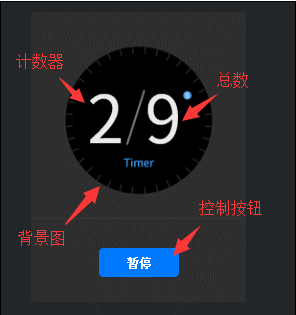

# Clip Component


##  1. Create Clip components through LayaAirIDE

###1.1 Creating Clip
​        The Clip component can be used to display bitmap slice animations. Clip can divide a picture by horizontal division number clipX, vertical separation number clipY, or horizontally divide the width of each slice clipWidth, vertical segmentation each slice height clipHeight, from left to right, from top to bottom, cut and combine to be a slice animation.

​        The Clip component can be used to play the slice animation and display a frame picture of the slice animation.
​        Click on the Clip component in the resource panel, drag and drop to the page edit area, and then add the Tab component to the page.
Clip Script interface reference [Clip API](http://layaair.ldc.layabox.com/api/index.html?category=Core&class=laya.ui.Clip)

​        Clip example of resource for components：

​        <br/>
​    （Picture 1）

 

​        The display effect after the group sets the value of the clipX attribute to 10:

​        <br/>
​    （Picture 2）

​        The display effect after setting the value of the index attribute to 1:

​        <br/>
​    （Picture 3）

###  1.2 Clip Common attributes of components

​        <br/>
​    （Picture 4）

 

| **attribute**     | **Functional description**            |
| ---------- | ------------------- |
| autoPlay   | Boolean value indicating whether the current slice animation is automatically played. |
| clipWidth  | The width of each slice is used to split the picture resource horizontally.  |
| clipHeight | The height of each slice is used to split the picture resource vertically.  |
| clipX      | Horizontal segmentation of image resources, the number of copies of the cutting width.  |
| clipY      | The number of equal cutting points in vertical segmentation of image resources.  |
| index      | Segment animation current display frame index.      |
| interval   | Play time interval of slice animation.        |
| sizeGrid   | Effective grid data of image resources (data of 9th sizeGrid). |
| skin       | Tab button image resources.          |


##  2. Create Clip components through code

 	When we write code, we can't avoid creating UI by code `UI_Clip` Class, import in code `laya.ui.Clip` package, and set Clip related attributes through code.

**Run example effect:**
​	<br/>
​	(Picture 5) Creating counters through code

​	<br/>
​	(Picture 6)

​	Clip other properties can also be set by the code, the above example shows how to obtain every second by the timer update clip.clipX slice, by updating the number of seconds to achieve the timer function, interested readers can set their own code Clip , To create a Clip that meets the needs of your project.

**Sample code ：**

```javascript
package
{
	import laya.display.Stage;
	import laya.events.Event;
	import laya.ui.Button;
	import laya.ui.Clip;
	import laya.ui.Image;
	import laya.utils.Handler;
	import laya.webgl.WebGL;
	
	public class UI_Clip
	{
		/***控制器按钮资源***/
		private var buttonSkin:String = "../../../../res/ui/button-7.png";
		/***切片资源***/
		private var clipSkin:String = "../../../../res/ui/num0-9.png";
		/***背景资源***/
		private var bgSkin:String = "../../../../res/ui/coutDown.png";
		
		/***计数器***/
		private var counter:Clip;
		/***计数器当前索引***/
		private var currentIndex:int;
		/***控制器按钮***/
		private var controller:Button;
		
		public function UI_Clip()
		{
			// 不支持WebGL时自动切换至Canvas
			Laya.init(800, 600, WebGL);
			//画布垂直居中对齐
			Laya.stage.alignV = Stage.ALIGN_MIDDLE;
			//画布水平居中对齐
			Laya.stage.alignH = Stage.ALIGN_CENTER;
			//等比缩放
			Laya.stage.scaleMode = Stage.SCALE_SHOWALL;
			//背景颜色
			Laya.stage.bgColor = "#232628";
			
			//加载资源
			Laya.loader.load([buttonSkin, clipSkin, bgSkin], 
                             laya.utils.Handler.create(this,onSkinLoaded));
		}
		
		/***加载资源完成***/
		private function onSkinLoaded(e:*=null):void
		{
			//显示背景图
			showBg();
         	//创建计数器
			createCounter();
            //显示总数
			showTotal();
            //创建控制按钮
			createController();
		}
		
		/***显示背景***/
		private function showBg():void 
		{
			//实例化背景图
			var bg:Image = new Image(bgSkin);
			//设置图片大小
			bg.size(224, 302);
			//位置居舞台中间
			bg.pos(Laya.stage.width - bg.width >> 1, Laya.stage.height -bg.height >> 1);
			//加载到舞台
			Laya.stage.addChild(bg);
		}
		
		/***创建计数器切片***/
		private function createCounter():void
		{
			//实例化计数器切片
			counter = new Clip(clipSkin, 10, 1);
			//自动播放
			counter.autoPlay = true;
			//播放间隔时间1秒
			counter.interval = 1000;			
			//计数器切片位置
			counter.x = (Laya.stage.width - counter.width) / 2 - 35;
			counter.y = (Laya.stage.height - counter.height) / 2 - 40;
			//加载到舞台
			Laya.stage.addChild(counter);
		}
		
		/***显示总数切片***/
		private function showTotal():void 
		{
			//实例化总数切片
			var clip:Clip = new Clip(clipSkin, 10, 1);
			//总数切片索引为最后一个
			clip.index = clip.clipX - 1;
			//总数切片位置
			clip.pos(counter.x + 60, counter.y);
			//加载到舞台
			Laya.stage.addChild(clip);
		}
		
		/***创建控制按钮***/
		private function createController():void 
		{
			//实例化控制按钮
			controller = new Button(buttonSkin, "暂停");
			//标签字体为粗体
			controller.labelBold = true;
			//按钮标签字体颜色的四种状态
			controller.labelColors = "#FFFFFF,#FFFFFF,#FFFFFF,#FFFFFF";
			//按钮大小
			controller.size(84, 30);
			//按钮点击事件——计数器状态控制
			controller.on(Event.CLICK, this, onClipState);
			//按钮位置
			controller.x = (Laya.stage.width - controller.width) / 2;
			controller.y = (Laya.stage.height - controller.height) / 2 + 110;
			//加载到舞台
			Laya.stage.addChild(controller);
		}
		
		/***计数器状态***/
		private function onClipState(e:*=null):void 
		{
			//如果计数器为播放状态
			if (counter.isPlaying)
			{
				//停止播放动画
				counter.stop();
				//记录当前播放索引（如果不记录，重新播放时，索引会从0开始）
				currentIndex = counter.index;
				//按钮标签改变
				controller.label = "播放";
			}
			else//计数器为停止状态
			{
				//播放动画
				counter.play();
				//从当前记录的索引播放
				counter.index = currentIndex;
				//按钮标签改变
				controller.label = "暂停";
			}
		}	
	}
}
```


 