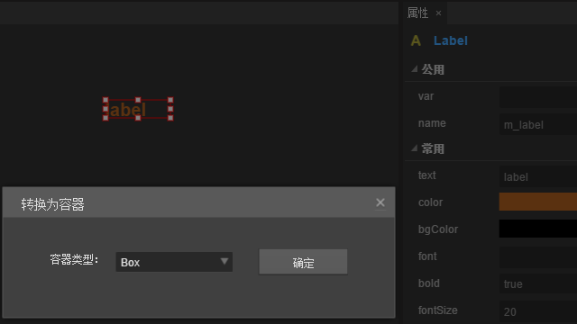
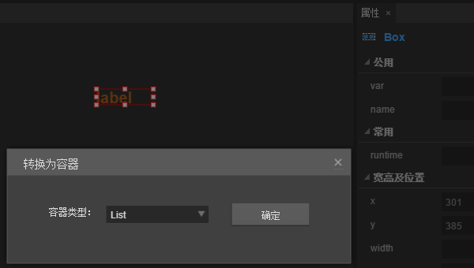
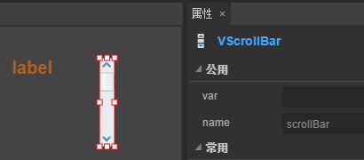
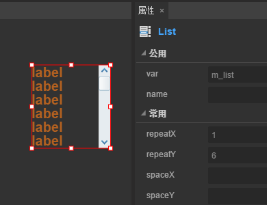
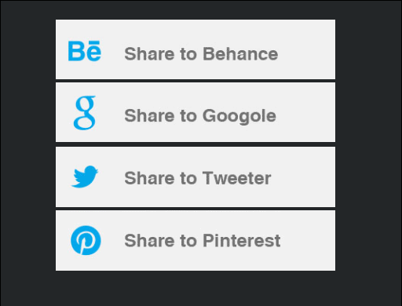

# List Component


##  1. create List components through LayaAirIDE

​        The List component displays the list of items. The default is a vertical list. Custom lists can be made through the UI editor. Each list of the List list is usually the same, and you can also use the editor to customize the list content items of different styles.
​        List is usually composed of two parts: a list of render items (cells), and a scroll bar.
​        List script interface of component is referenced [List API](http://layaair.ldc.layabox.com/api/index.html?category=Core&class=laya.ui.List)。

 

### 1.1 Creating List components

#### 1. Edit list item.

​	A list item can be a Box object or a View (page) or other custom page object. Here, take the Box object as an example.
​	**a.** From the resource panel, select drag into a Label component, to the edit area of the interface, set the Label attribute name value of m_label. Also, set the display properties of the Label to make it look better.
​	**b.** Select the Label object, using the shortcut Ctrl +B menu bar or select Edit **Menu bar -> Edit -> Convert to container** into the container into the container set options, open the panel, select a container type for the Box, click the OK button to complete the add Box container.

​        <br/>
​    （Picture 1）


 ####2. Convert to List container.

   Select the list render item object, use the shortcut key Ctrl +B or select **Menu Bar -> Edit -> Convert to Container** Options, open to the container settings panel, select the container type is List, click the button to determine the completion of the container List add.
   ​        <br/>
​       （Picture 2）
####3. Specifies a list of render items for List.
  Method 1： Double-click the List object, enter the List internal, set the value of the property name of the List list render items to render. **Note: the value of the render item property name here must be render.**

  Method 2：Double click the List object, enter the List internal, set the attributes of the List list rendering item renderType value of render.

  
​           <br/>
   ​    （Picture 3）

####4. Adding scroll bar components to List.
  Method 1: select and drag a VScrollBar component from the resource panel to the inside of the List component, and set the attribute of the VScrollBar component object, name, whose value is scrollBar.   ***Note: the value of the scroll bar property name must be scrollBar.***

  Method 2: select the list component, the right property panel usually appears vScrollBarrSkin, select and drag a VScrollBarr component from the resource panel to the skin property, and then generate the scrollbar immediately

​        <br/>
​    （Picture 4）

####5. Drag to set the width of List
​	Set the value of the attribute repeatX to 1, and set the value of repeatY to 6. Sets the global reference name of the List object, that is, the value of the attribute VaR is set to m_list.
   ​        <br/>
   ​    （Picture 5）

####6. Assigning List objects in code.

```javascript
 var data:Array =[];

   for(var m:int =0;m<20;m++){

        data.push({m_label:"No."+m});
}
m_list.array = data;
```


####7. Running in the program to see the effect.
   ​        <br/>
​       （Picture 6）

####8. Add script to the code, hide the scroll bar, and set the effect of dragging the rubber band.
```javascript
 m_list.scrollBar.hide = true;//隐藏列表的滚动条。
 m_list.scrollBar.elasticBackTime = 200;//设置橡皮筋回弹时间。单位为毫秒。
 m_list.scrollBar.elasticDistance = 50;//设置橡皮筋极限距离。
```

####9. Running in the program to see the effect.
   ​        <br/>
   ​    （Picture 7）


### 1.2 List Common attributes of components

​        <br/>
​    （Picture 8）

  

| **Attribute**         | **Functional description**                 |
| -------------- | ------------------------ |
| repeatX        | The number of cells displayed horizontally.            |
| repeatY        | The number of cells displayed vertically.            |
| spaceX         | The spacing between pixels in a horizontal direction (in pixels) |
| spaceY         | The space between the cells displayed vertically (in pixels) |
| vScrollBarSkin | Vertical scrollbar skin.              |
| hScrollBarSkin | Horizontal scrollbar skin               |

  

### 1.3 Tips:

1. There are two ways to add scroll bars to List: one is to drag and drop a scroll bar directly inside the List, and the name of the scroll bar is scrollBar, and the other is to set the attributes of List, vScrollBarSkin, and hScrollBarSkin, which are the resource addresses of the scroll bar.

2. List's list render item can either be a Box object or a page object.

   ​


## Two. Create List components through code

​	When we write code, we can't control UI by code, create UI_List class, import `laya.ui.List` package in code, and set List related attributes by code.

**Run example effect:**
​	<br/>
​	(Picture 9) Creating List through code

​	Other properties of List can also be set up by code. The following example code demonstrates how to create List of different skins (styles) by code, and interested readers can set up List by themselves to create a list that meets their own needs.

**Sample code ：**

```javascript
package
{
	import laya.display.Stage;
	import laya.ui.Box;
	import laya.ui.Image;
	import laya.ui.List;
	import laya.utils.Handler;
	import laya.webgl.WebGL;
	
	public class UI_List
	{
		//列表对应图片的路径
		private var data:Array = [  "../../../../res/ui/listskins/1.jpg",
									"../../../../res/ui/listskins/2.jpg",
									"../../../../res/ui/listskins/3.jpg",
									"../../../../res/ui/listskins/4.jpg",
									"../../../../res/ui/listskins/5.jpg",
									"../../../../res/ui/listskins/1.jpg",
									"../../../../res/ui/listskins/2.jpg",
									"../../../../res/ui/listskins/3.jpg",
									"../../../../res/ui/listskins/4.jpg",
									"../../../../res/ui/listskins/5.jpg",
									"../../../../res/ui/listskins/1.jpg",
									"../../../../res/ui/listskins/2.jpg",
									"../../../../res/ui/listskins/3.jpg",
									"../../../../res/ui/listskins/4.jpg",
									"../../../../res/ui/listskins/5.jpg"];
		
		public function UI_List()
		{
			// 不支持WebGL时自动切换至Canvas
			Laya.init(800, 600, WebGL);
			//画布垂直居中对齐
			Laya.stage.alignV = Stage.ALIGN_MIDDLE;
			//画布水平居中对齐
			Laya.stage.alignH = Stage.ALIGN_CENTER;
			//等比缩放
			Laya.stage.scaleMode = Stage.SCALE_SHOWALL;
			//背景颜色
			Laya.stage.bgColor = "#232628";

			//创建列表
			createList();			
		}
		
		/***创建list列表**/
		private function createList():void
		{
			//实例化列表
			var list:List = new List();
			//设置列表渲染单元格为Item类（注：必须是类，不能是实例化对象，Item需类继承于Box）
			list.itemRender =Item;
			//列表显示区单元格的列数
			list.repeatX = 1;
			//列表显示区单元格的行数
			list.repeatY = 4;
			//设置列表位置
			list.x = (Laya.stage.width - Item.WID) / 2;
			list.y = (Laya.stage.height - Item.HEI * list.repeatY) / 2;
			
			// 使用但隐藏垂直滚动条
			list.vScrollBarSkin = "";
			//滚动在头或底回弹时间
			list.scrollBar.elasticBackTime = 500;
			//滚动在头或底最大距离
			list.scrollBar.elasticDistance = 200;
			
			//设置为可以选择
			list.selectEnable = true;
			//选择单元格时回调方法
			list.selectHandler = new Handler(this, onSelect);
			//渲染单元格时的回调方法
			list.renderHandler = new Handler(this, updateItem);
			//为列表赋值
			list.array = data;
			//加载到舞台
			Laya.stage.addChild(list);
		}
		
		/***渲染单元格时的回调方法***/
		private function updateItem(cell:Item, index:int):void 
		{
			//用获得的数据给图片更换皮肤
			cell.img.skin=cell.dataSource;
		}
		
		/***选择单元格回调***/
		private function onSelect(index:int):void
		{
			trace("当前选择的索引：" + index);
		}
	}
}


//单元格类，继承于Box
import laya.ui.Box;
import laya.ui.Image;

class Item extends Box
{
	/***单元格宽***/
	public static var WID:int = 375;
	/***单元格高***/
	public static var HEI:int = 85;
	/***单元格中图片***/
	public var img:Image;
	
	public function Item()
	{
		//设置大小宽高
		size(WID, HEI);
		//实例化图片
		img = new Image();
		//加载到单元格中
		addChild(img);
	}
}

```

