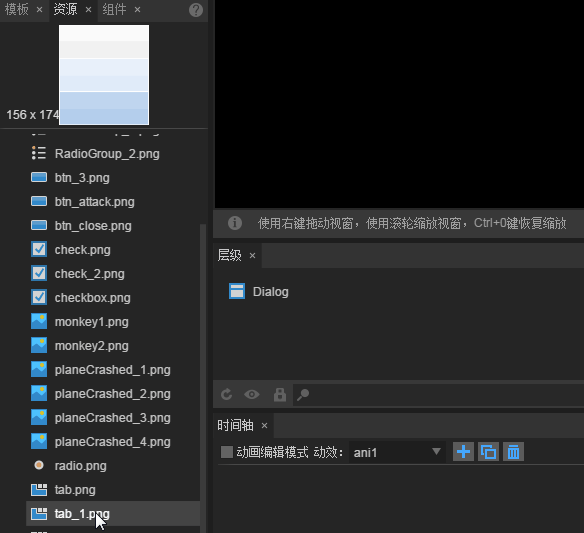
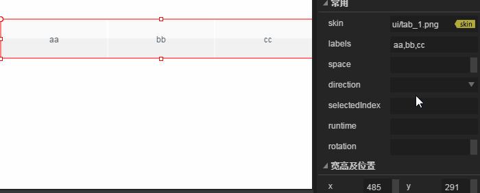
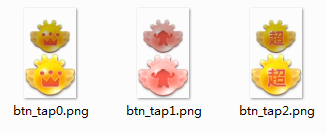
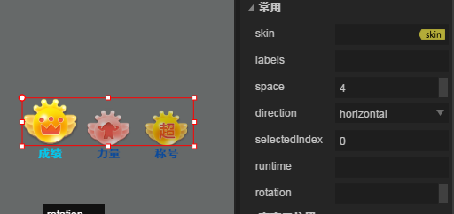

# Tab Component

> Because many component properties are generic, common and generic component attributes have been introduced in the `attribute setter`document. Please read the 《property setter》 document before reading this article.

## 1. Understanding Tab components

### 1.1 role of Tab components

​        The Tab component is used to define the tabbed button groups, such as multi page switching display. As shown in figure 1.

 （Picture 1）

### 1.2 Skin specification (skin) for Tab components

The skin of the Tab component is named as `tab` or prefixed with `tab_`. In the skin design specifications, the two state diagram or the three state diagram is vertically equal, as shown in figure 2.

   (Fig. 2) three state Tab skin

*Tips：skin of the tab component cannot use the nine cell attribute, so the size of the actual application should be determined when the resource is designed*

### 1.3 Tab Introduction of API for components

Tab component API description, please refer to  [http://layaair.ldc.layabox.com/api/index.html?category=Core&class=laya.ui.Tab](http://layaair.ldc.layabox.com/api/index.html?category=Core&class=laya.ui.Tab)

## 2. Create a Tab component with LayaAirIDE

### 2.1 Create Tab        

​        Click on the Tab component resource in the `Explorer` to drag and drop to the scene editor, which creates a Tab component successfully in the page. As shown in figure 3.

​         （Picture 3）

### 2.2 Adding tags through labels

 As shown in Figure 3, there are only two labels in the default Tab component. If you want to add tags, just add a new tag in the labels attribute, and modify the text content in the tag is also set in this property, operation as shown in figure 4-1.

  (Picture 4-1)

### 2.3 Changing the layout direction and spacing of Tab components

The Tab component defaults to horizontal layout（*horizontal*），Vertical layout is achieved by changing the direction property（*vertical*）。**Setting distance** it can be implemented through the space property. As shown in figure 4-2.
 
Picture 4-2）

### 2.4 Setting default options for radio group Tab

The selectedIndex attribute is used to change the index value of the Tab component. When the default is not set, it does not select any option. If you want to set the default tab option of the Tab component, you can set the attribute value of selectedIndex, 0 for first labels, and 1 for second tags...... And so on。 The running effect is shown in figure 4-3.

 
（Picture 4-3）

## 3、Custom Tab components

​	In this case, we use the same Tab resources by setting the labels generated Tab component three label. However, in actual games, there are different requirements for tag styles in the same Tab component, then the labels setting method can not achieve the effect. At this time, you need to use the custom Tab component. For example, the effect shown in figure 5.

​	  （Picture 5）

### 3.1  Preparing art resources

​	Here we'll use three different two state art resources to define the Tab component, and the picture resources are shown in figure 6.

    （Picture 6）

**Tips**：

　　Special attention should be paid to the naming rules of the picture. In the custom Tab component, we use multiple button component combinations, and cannot directly use the naming rules of the `Tab` components. You can use the naming rules for `Button` components, `CheckBox` components, and`Radio`components. The BTN prefix used in Figure 6 is the naming rule for the Button component.
  
​	

### 3.2 Making buttons in IDE

The resource Explorer folder copied to the project, and then in IDE, the Button components produced by one by one from the explorer to drag the scene editor, from left to right, the name property of each Radio component, in order to “item0、item1、item2.....”，（do not add name attribute by this rule, the generated Tab component is invalid component and cannot run normally）. In addition, since the resource is two state, you need to set the satNum attribute value to 2. When the text of the label property is set, the effect is shown in figure 7.

   （Picture 7）

### 3.3 Convert to Tab container components

​	Adjust the attributes after three select button, press the shortcut key `Ctrl+B` Choice `Tab` Container components, click `Determine` Complete the conversion (Figure 8).

​	   （Picture 8）

​	After the conversion is successful, the default selection index selectedIndex is 0 (the first Tab tag), the radio frame spacing space is 4, and the direction direction can not be set or set to horizontal (horizontal), as shown in figure 9.

​	   （Picture 9）

​	Through these steps, you can see that the custom Tab component is successful. By default, the first checkbox is selected and switched to its third frame selection state, and the other checkbox is the unselected state of the first frame.

