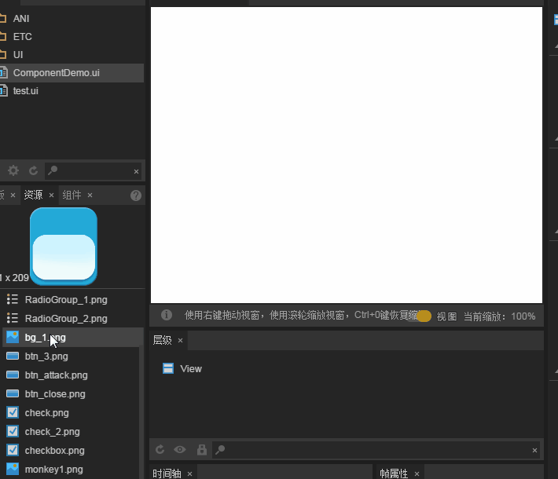
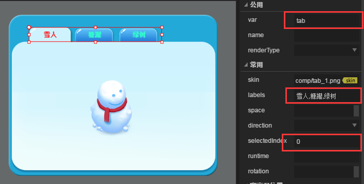

# ViewStack component

> Because many component properties are generic, common and generic component attributes have been introduced in the `property setter`document. Please read the 《property setter》 document before reading this article. In addition, this article will involve some Tab component knowledge, please read the Tab component detailed documentation.

## 1. Understanding ViewStack components

### 1.1 The role of ViewStack components

ViewStack component is mainly used for multi page view switching. It contains multiple sub pages, but only one is displayed by default, and can be displayed through the sub page index. In general, we make tag switching pages by combining it with Tab tags. As shown in figure 1.

<br/>（Picture 1） 

### 1.2 Resource specification (skin) for ViewStack components

The ViewStack component is passed `Ctrl+B` converted container class components do not have independent component resource specifications. In this case, the image component resources are used directly. In actual game development, UI components can be used according to the actual development needs.

### 1.3 Introduction of API for ViewStack component

​	ViewStack API use of components, please refer to [http://layaair.ldc.layabox.com/api/index.html?category=Core&class=laya.ui.ViewStack](http://layaair.ldc.layabox.com/api/index.html?category=Core&class=laya.ui.ViewStack)。


## 2. Creating ViewStack components through LayaAirIDE

### 2.1 Creating ViewStack pages

#### 2.1.1 Preparing art resources

Prepare the page background map and the page art resources that need to be switched, and put them into the LayaAirIDE Explorer directory.

#### 2.1.2 Set the square for the background image of the page

The page background of the pop-up box usually uses the nine square lattice, here we first set the background square attribute. As shown in figure 2-1.

 <br />(Picture 2-1)

#### 2.1.3 Create page background

Drag the background map that has just been set up to the scene editor. As shown in figure 2-2.

 <br />(Picture 2-2)

#### 2.1.4 Creating ViewStack pages

Drag and drop the UI basic components involved in the page to the UI file `Scene Editor`, and then the shortcut key `Ctrl+B` convert to `ViewStack` container assembly. As shown in figure 3-1.

 <br /> (Picture 3-1)


#### 2.1.5 Setting the name property of the sub page of the ViewStack component

ViewStack page name attribute naming rules for item0, Item1, Item2... If there are more pages, and so on, as shown in Figure 3-2, does not increase the name attribute according to this rule, the generated ViewStack component is invalid components, can not run normally.

 <br /> (Picture 3-2)

**Tips**：*The name property, where the character must be item, cannot be changed to other. When you exit the ViewStack child page, it is normal to display item0 only by default, otherwise the ViewStack component does not work.*


#### 2.1.6 Adjust the UI layout of the page

​	Set the name property, you can double-click into veiwStack components, the first UI page layout adjustment handle good. In this case, we only adjust the size and location of the resources used by different pages, and align the three sub pages in the center. The effect is shown in figure 3-3.

​        <br/> （Picture 3-3）


### 2.2   Setting the page index selectedIndex of ViewStack

​	The ViewStack component defaults to the picture with the name property of item0 because the default value of the default selectedIndex attribute is controlled by 0. We can change the default display page of the ViewStack component by adjusting the value of the selectedIndex attribute. The effect is shown in figure 4.

<br/>（Picture 4）

**Tips**：

**The Var value of the ViewStack component must be set. When writing the code, it needs to control the ViewStack component through the global variables of the Var reputation, so as to change the attributes of the selectedIndex and realize the page switching. In this case, the viewStack is used, as shown in the top right-hand corner of the figure 4, and the developer can take another name.。**


### 2.3 Creating Tab tags for control

​	 Typically, the ViewStack component needs a corresponding control tag, and we create a Tab tag to control the display of ViewStack sub page switching.

​	Click on the Tab component in the resource panel, drag and drop to the UI page scene editor to generate the Tab component. The art resource of the Tab component is shown in Figure 5, which is matched with the background style in the picture above.

​        <br/>
​      （Picture 5）

​        The Tab component is dragged to the editor, and the alignment is aligned with the background map. Set the common attribute VaR to tab for program call control. Set the common attributes of labels "snowman, sugar, green trees, the choice for the 0 button index selectedIndex. Set the font size, bold font, font status, color, etc. of other attributes.

​	The display effect is shown in figure 6:

​        <br/>
​    （Picture 6）


## 3. ViewStack component switching display through code control

​	In the above several production steps, we completed the creation and composition of components in IDE, we next through the program code Tab tag and ViewStack sub page switching display associated.

​	Save the page, press the F12 release page, publish, in the project UI folder generated ComponentDemoUI.as class, we use it directly


Create ComponentDemo.as and set the default program, write code as follows:

```typescript
// 程序入口
class ComponentDemo{
    /**包含tab与viewStack组件的测试页面**/
    private comp:ui.ComponentDemoUI;
    constructor()
    {
        Laya.init(1334,750, Laya.WebGL);
        Laya.stage.scaleMode = "full";
        Laya.stage.bgColor = "#ffffff";
        //加载图集成功后，执行onLoaded回调方法
        Laya.loader.load("res/atlas/comp.atlas",Laya.Handler.create(this,this.onLoaded));
    }
    private onLoaded():void{
        //创建一个UI实例
        this.comp = new ui.ComponentDemoUI();
        //添加到舞台上显示
        Laya.stage.addChild(this.comp);
        //点击Tab选择按钮的处理
        this.comp.tab.selectHandler = new Laya.Handler(this,this.onSelecte);
    }
    /**根据选择tab的索引切换页面**/
    private onSelecte(index:number):void{
        //切换ViewStack子页面
		this.comp.viewStack.selectedIndex=index;
    }
}
new ComponentDemo();
```

Run the example code, and the effect is shown in figure 10.

<br/>（Picture 10） 