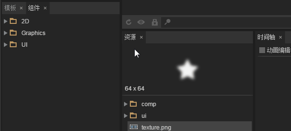

# Custom interface layout and recovery default

>  This article is based on LayaAirIDE 1.7.3 screenshot, if there are difference, please download the latest LayaAirIDE version.

The editor layout refers to the location, size, and tabs of each panel in LayaAirIDE.

## Preset and restore layout

### Preset

In the design mode of LayaAir, you candrag and resize of each function section  in the interface, and save it automatically after the interface layout is modified. The next time you open it, it will open in the last layout.

### Restore

If the interface template is closed or misplaced, the shortcut key `F3` can be used to quickly ** restore the default interface layout**, or from `menu bar` click on the-->【`window`】 --> 【`recovery panel`】。

 

## Custom interface

### 1. Adjust the panel size :

​        The mouse is suspended to the boundary line between the two panels. After the mouse pointer is changed,you can press the mouse to modify the size of two adjacent panels. As shown in Figure 1.

​	 

​	（Picture 1）

### 2. The mobile panel :

​        Clicking on the tab bar of the panel and dragging it, panel can move to any position in the editor window. As shown in Figure 2, the blue area indicates the target area where the panel is dragging and dropping.

​	  
​	(Picture 2)

 

### 3. Tabs panel :

​        In addition to moving the panel position, drag the tab bar when you can move the mouse to another panel of the tab area. in the face of the target panel appears blue frame display where you can release the mouse, you can stack the two panels together , As shown in Figure 3. Tab panels are very convenient when the desktop resolution is low.

​	  
​	(Picture 3)

