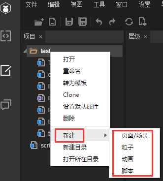
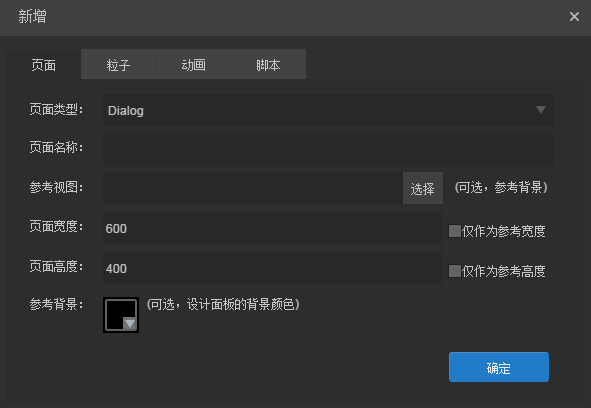
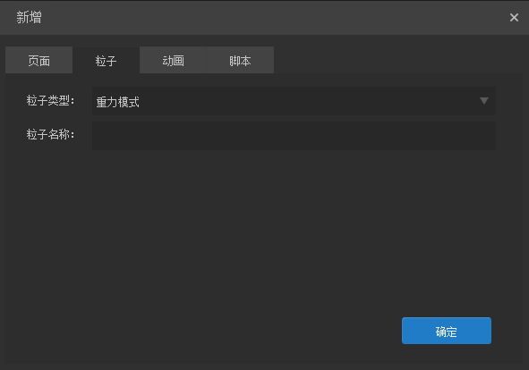
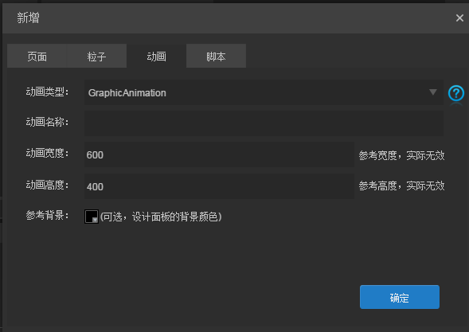

# UI page, particle, animation and script new panel detail

　　 In the project manager, right-click to create new UI pages, particles, animation, scripts, as shown in Figure 1, this article will introduce some of the parameters of these features.

​         
​        	（Picture 1）

### 1. the new UI page

**In the new panel, you can create two UI interfaces, View and Dialog, in the `page bar`. As shown in figure 2**：

​         
​        	（Picture 2）

**[parameter description]**

**Page type**：

　　 The default is View, and this type of page has no closing function, and is usually used for the game backgrounds and hierarchical pages that have been kept open. Another option type is Dialog, Dialog inherits from View, in addition to all the functions of View, but also can realize the dialog box pop-up, drag, close the window and other functions, often used in the game pop-up interface.

**Page name**：

　　 New page file name, which must be filled in. 

**Reference view**：

　　 Reference view is through the design interface in the background to load a graphic, to facilitate the production of UI, and the original design consistent with the reference picture. The item is optional and the background image of the reference view is not exported to the project. It is only used for the reference of UI production.

**Page width**：

　　 The width of the page, after setting the width will not be calculated, check the “only as a reference width”, the need to calculate the width in real time, the performance will produce additional pressure, not recommended check.

**Page height**：

　　 The height of the page will not be calculated beyond the height after setting, and the “only reference width” will be used to calculate the height in real time, which will cause additional pressure on the performance, and it is not recommended to check.

**Reference background**：

　　The reference background is similar to the reference view and is only used for UI reference and does not take effect in the project. Is optional.

### **2. The new particles**

　　 In the new particles, you can create gravitational mode and radius mode 2D example animation, you can also create 3D particle animation. As shown below:

​         
​        	（Picture 3）

**[Parameter Description]**

**Particle type**：

　　Particle type is gravity model, radius model and particle 3D mode, the default for the gravity mode.

　　Gravity pattern of particles is an angle to the other direction was fired particles effect.

　　The radius model is a rotating particle effect around the center point.  There is no fundamental difference between the radius mode and the gravity mode. The gravity mode can be used to adjust the parameters. The radius mode can also be adjusted to the effect of gravity mode. The difference is that the configuration of the initial parameters is different.

　　The particle 3D mode is based on a 3-dimensional particle effect.

**Particle name**：

　　 New particle file name, which must be filled in.

### **3. New animation**

　　  In a new animation, you can create a frame animation.

​         
​        	（Picture 4）

**[Parameter Description]**

**Animation Type**：

　　 The animation type is GraphicAnimation and EffectAnimation.

　　 GraphicAnimation is the default option, which creates a timeline animation that contains multiple animation effects.

　　 EffectAnimation as animation template, can only create a template animation effect, the effect on a component, and can not display the animation effect independently.

**Animation name**：

　　 The new frame animation file name must be filled in.

**Animation width**：

　　The animation width setting is only used as the background width of the design, and the setting is invalid in the game operation.

**Animation height**：

　　 The setting of animation height is only used as the background height of the design, and the setting is invalid in the game operation.

**Reference background**：

　　 Reference background is also only used for background contrast reference of animation, and will not be effective in the project. It's optional.

### **4. New script**

　　 In the new script, you can create extended scripts and additional scripts. As shown in the following picture:

​         
​        	（Picture 5）

**[Parameter Description]**

**Script Type**：

　　 The default is the extension script, which can inherit the object, expand the properties of the object, the following figure "aa、bb" and other attributes to generate the extension script and modify the attribute parameters, drag the object after the property panel to expand the properties.

​        	 
​        	（Picture 6）

　　 Additional scripts do not inherit and extend the object, but rather control the object with additional scripts.

**Script Name**：

　　 The name of the new script, which must be filled in.

**Run class name**：

　　 When running the script corresponding to the class name, such as : game.view.myScript
