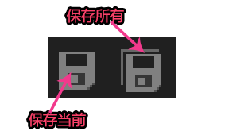
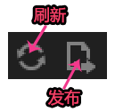

# Toolbar introduction

> This article is based on LayaAirIDE 1.7.3 screenshot, if there are difference, please download the latest LayaAirIDE version.

​        The toolbar is located  in the main top window of the editor and below the menu bar. When you open the project, you can see eight sets of control buttons or messages that are used to provide editing functions for specific panels or to facilitate us to implement workflows.

​         
​    	（Picture 1）

 

### 1. Project operation tools

​     
​    	（Picture 2）

​        New directory: create a directory folder, shortcut key (Ctrl + D) , in the current project.

​        New page: Create a new page (Page), shortcut key (Ctrl + N) in the selected directory.

 

### 2. Save tools

​   
​    	（Picture 3）

 

​        Save the current: save the current operation page, shortcut (Ctrl + S).

​        Save all: save all changes to the project, shortcut keys (Ctrl + Shift + S).

 

### 3. Revocation of tools

​         
​    	（Picture 4）

 

​        Undo: undo current operation, shortcut key (Ctrl + Z)

​        Recovery Undo: You can return the undo operation and the shortcut key (Ctrl + Y) when you cancel it.

 

### 4. Refresh the release tool

​         
​    	（Picture 5）

​        Refresh: click New after the user imports new resources or changes to the file, the program will automatically load new resources or configuration, shortcut key (F5).

​        Release: after the user has completed the design, you can click on the release, generate publishing files for sharing or use, shortcut key (F12).

 

### 5. Tool viewer

​         
​    	（Picture 6）

​        Zoom view: after the click of the zoom view button, the scene will automatically scale, but does not affect the design of the width of the high control size, shortcut key (Ctrl + +).

​        Zoom view: click the zoom view button, the scene will automatically zoom in, zoom in does not affect the design width and control size, shortcut key (Ctrl + -).

​        Restore view: after clicking the restore View button, the scene automatically restores to the initial size, and the shortcut key (Ctrl +).

 

### 6. Alignment tool

   

​    	（Picture 7）

 

​        Left Alignment: The left alignment of multiple controls will be left-aligned with the starting coordinates of the leftmost control as the alignment point.

​        Right alignment: multiple controls right aligned with right end of the rightmost control as the starting point for right alignment.

​        Align horizontally: multiple controls align horizontally and align automatically with horizontal center coordinates.

​        Align vertically: multiple controls are vertically centered. The alignment method calculates the vertical center coordinates automatically and aligns them in the center.

​        Top alignment: multiple control top alignment will align top with the vertex coordinates of the top control as the alignment point.

​        Bottom alignment: the bottom alignment of multiple controls aligns the bottom coordinates of the bottom control as alignment points at the bottom.

​        Horizontal average interval: multiple controls are automatically calculated at horizontal intervals and aligned horizontally at the average distance.

​        Vertical average interval: multiple controls are automatically calculated at vertical intervals and aligned vertically at the average distance.

 

### 7. Displacement operation

​      
​    	（Picture 8）

 

​        Move to the upper left corner: move the selected controls to the upper left corner of the scene view.

​        Move to the lower left corner: move the selected controls to the lower left corner of the scene view.

​        Move to the upper right corner: move the selected controls to the upper right corner of the scene view.

​        Move to the lower right corner: move the selected controls to the lower right corner of the scene view.

​        Move to the middle level: move the selected controls to the horizontal center of the scene view, and keep the vertical position of the control unchanged.

​        Move to the middle level: move the selected controls to the horizontal center of the scene view, and keep the vertical position of the control unchanged.

​        Relative origin: move the selected control to the origin of the scene view (0,0), and center vertically and horizontally with the origin position.

 
