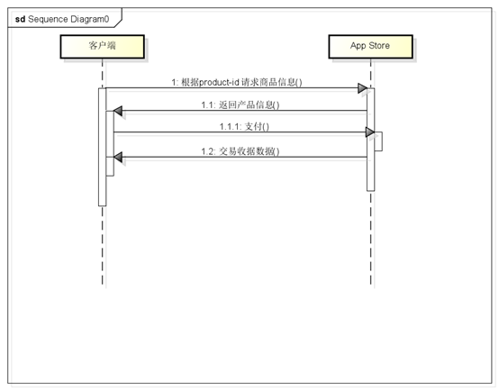

# IOS In-App Purchases


　　IOS In-app purchases, Hereinafter referred to as IAP.

　　Because the App Store does not support third-party payment methods such as Alipay and WeChat payment,  so no matter what engine or tool development, eventually must be provided by Apple IAP to complete the transaction.

　　In order to help developers save time for debugging IAP related interfaces, Layabox encapsulates the relevant interfaces and provides JavaScript developers with direct calls or extensions.

　　IAP process is very simple, and the client communicates directly with the App Store to complete the transaction, as follows:

​	 <br/>
​	Picture（1）


  For a stand-alone game, the IAP process has been completed an IAP process, but considering the possibility of cheating, developers can also increase the verification steps, as shown below:

​	<br/>
​	Picture（2）

  The above methods can be a good way to prevent cheating, so it is recommended that the developer must increase the steps of validation.

  After you know the process of IAP, you can start to implement the functionality.

  Before using the IAP feature, some preparation need to be done:

  [IOS package release and publishing App detailed process](https://github.com/layabox/layaair-doc/tree/master/English/LayaNative/packagingReleases_IOS)

After the above operation is completed, the implementation of the IAP function can be completed with reference to the following example code.

### 1.  Application layer JavaScript coding

```javascript
// JavaScript中 组装充值相关参数. (参数意义参见本文末尾处的附录1)
var json= '{"order_id":"OriderID_20160824_9824","amount":1,"product_id":"Laya.joychina.test","callback_uri":"http://186.152.54.225:8800/Apple.pay"}';
 
// JavaScript中 调用充值函数. (这里会调用原生开发语言中对应的LP_Login方法)
conchMarket.recharge(json,function(jsonString) {
     var pJson = JSON.parse(jsonString);
     console.log("code:"+ pJson .code);
     console.log("product_id:"+ pJson.product_id);
     console.log("amount:"+ pJson.amount);
     console.log("order_id:"+ pJson.order_id);
     console.log("desc:"+ pJson.desc);
});
```

### 2.  Coding in Objective-C under IOS system

(Note: LayaNative sample consumer class IAPManager class is provided as a reference)

```javascript
// MarketAppStore.mm文件中的LP_Recharge方法中添加内购相关代码, 然后在JavaScript中调用conchMarket.recharge就会执行此方法.
-(void)LP_Recharge:(NSString*) jsonParam
{
    // TODO 添加内购相关代码.
}
```

IAP functionality in iOS can be done easily through the above steps.

### 3.  Recharge interface and parameter description: 

  `conchMarket.recharge(jsonParam,callBack);`

`jsonParam` argument is an input parameter, a json string, and the json object must provide the following properties

| Name           | type     | description                         |
| ------------ | ------ | --------------------------- |
| product_id   | string | Apple's ID (set in iTunesConnect) |
| amount       | number | Purchase quantity                       |
| order_id     | string | Order ID (standalone set empty string)           |
| callback_uri | string | Server authentication address (standalone set empty string)         |


`callBack` parameter is to buy the purchase callback function, which pass back a json string parameter, json attribute has the following:

| Name         | type     | describe                          |
| ---------- | ------ | --------------------------- |
| code       | number | The success is 0, and the failure is -1                |
| product_id | string | Apple's ID (set in iTunesConnect) |
| amount     | number | Purchase quantity                        |
| order_id   | string | Order ID                       |
| desc       | string | Successful "success", failure "error"    |
