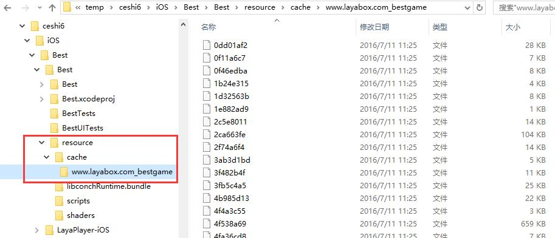
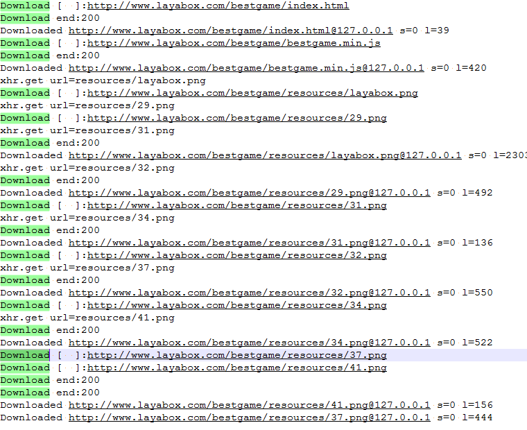
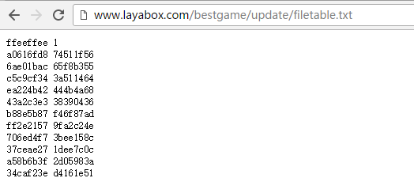

# LayaDCC tool

## Introduction
LayaDCC：Laya-Dynamic Content Check，a hot update solution provided by LayaPlayer. The advantage is that the network traffic can be reduced effectively when the running difference is updated. main data is DCC file, DCC file is used to describe the check value of all files in the project. DCC file is generated by the tool layadcc.

Layadcc will traverse all of the project files, generate a binary file filetable.bin that contains all the file's checksums. layaPlayerAt startup, this file is obtained from the server（If you need it）determine what files need to be updated.

layadcc it can also be used to create a resource package that is used to pack the resources into App.

## type of LayaPlayer resource package
There are three current resource packaging solutions.
1. #### App networking package：  

   App itself does not have any resources,  and the volume is the smallest.
   LayaPlayer first run time, all the resources used will be downloaded from the server side, And cached in the local。Second and after operation, DCC file will be obtained from the server first, and then when you need to download a file, Check whether local resources need to be updated, Only when it needs to be updated is it really downloaded, Non-updated resources are read directly from the local cache
   Local caches will increase gradually.

2. #### Resource based App networking packages:

   App package itself contains some or all of the game resources, with a larger package.
   data can still be updated, i.e. each run will still take the DCC file from the server to check, if found a file in the package is old, it will download the new file in the local cache, then run again, as long as the cache file has not changed, we still use the cache. 
   After many updates, most of the files of the App package are invalid, and the local cache is always taken. At this time, it is recommended to renew the App package and package it with new resources.

3. #### App offline package (stand-alone package) :  

   All of the resources are packaged in App directly, without the need for network downloads, or even networking. The volume is the largest.
  Because it is a stand-alone version, no url, so can not be dynamically updated resources, you want to update the resource, you can only update the App.

## Install and use layadcc
layadcc based on Node.js, So you need a Node.js environment.
### 1. Install  Node.js 
Reach nodejs[official website](https://nodejs.org/en/) download.
node.js cant support too old version, under 0.xx, you can use the command to view the node version
for example :  
```bash
$ node -v
v4.2.0
```
This version is OK.

### 2. install layadcc
```bash
npm install -g layadcc
```
If you install it smoothly, you can execute layadcc directly on the command line.

### 3.Usage method

```
layadcc Resource catalog [options]
options:
    -cache Generate a resource package.
    -lwr All file paths are in lowercase.（Generally do not need）
    -url url If you want to package resources, Corresponding url.
    -cout outpath Packaging resources output directory, If not set up, it's under the resource directory.
for example:
   layadcc d:/game/wow -cache -url www.game.com
```
### 4. Actual operationn
#### 4.1 Operating environment
Make sure Node.js, npm, and layadcc are installed properly
Authentication method:  
  
Picture 1  
As long as the implementation of layadcc no error on it.

#### 4.2 html5 project environment
Suppose there is a game project, put contents under F:/work/test/bestgame/ (Start page index.html is in this directory), directory structure is：
  
Picture 2   
After the project is published, the corresponding URL address is： `http://www.layabox.com/bestgame/index.html`  
（If the single version does not need the URL address）

#### 4.3 Packaging resources
Now you have to pack the HTML5 project and put it in the App project.
```
 layadcc F:/work/test/bestgame -cache -url http://www.layabox.com/bestgame/index.html
```
If it is a single package, input:
```
 layadcc F:/work/test/bestgame -cache -url http://stand.alone.version/index.html
```

Following figure :  
  
Picture 3  

After adding the `-cache` parameter, all the resource files will be traversed, Output to `-cout` specified directory, if there is not `-cout` Parameters, create a layadccout directory in the working directory（As shown above）, the cache directory in the output directory is the resource to be used when packaging the App.
Then you can copy this directory into the corresponding directory of the project that you build, and you can compile and pack the App.  
In different development environments, it needs to be placed in different directories（If you use the LayaAirIDE or layabox command line tools, This can be done automatically）.  

**Android Eclipse:**  
 <br />
（Picture 4） The resource directory of the Android is the assets directory under the project

**Android Studio:**  
  
（Picture 5）  

**iOS XCode:**  
 <br />
（Picture 6）IOS is the resource directory

#### 4.4 Update server
This is the most common operation after the release of App. Whenever updating the contents of the HTML5 project, we need to generate new DCC when we need to submit to the server or local test, so that the client can update to the latest resources. The operation process is as follows
Picture ：   
  
Picture 7   

You can see that after the layadcc is executed, in the specified directory（Now is the current path）A update directory will be generated below. Then copy the update directory to the same directory in the local or remote server.
**Tips:**   
For convenience and no error, it is recommended to execute layadcc directly in the directory where the server is located.

**update Catalog introduction:**   
  
Picture 8  

allfiles.txt Relative path of all resource files.
assetsid.txt  dcc statistics of the entire resource package checksum.
filetable.bin dcc main file, which is the check value of each file.
filetable.txt Text format DCC files, with the exception of the first three lines, each row represents a file and the corresponding check value, And allfiles.txt exactly correspond, Line 4 corresponds to the file is the first line of allfiles.txt.
filetable1.txt This file is no longer used. 

**Be careful:**  
1. If there is no update directory on the web server directory, Or update directory there is no content, The client dcc update mechanism will be closed, So all the resources will be downloaded again. It is recommended to use this method during development.
2. The above example is in the current directory,in fact, you can specify other paths, relative or absolute, for example:
   `layadcc d:/game/bin/h5` or `layadcc ../bin/h5`


#### 4.5 test
1. Test for successful resource packaging
   First say that there is no resource in the package, in this case all the resources will be downloaded from the Internet，log is as follows:   
     
   Picture 9  Can see a lot of Download   
   **Print information instructions ：**  
    Inside the url followed by @127.0.0.1 is for debugging, Indicates the server address corresponding to this file. s=0Indicates that this file does not have dcc information,  l=xxx indicates the length of the downloaded file.

    If you hit a resource package, that is, the things under the cache directory are copied to the above specified directory, and the most intuitive change is that the package becomes larger. Then running app, there will be a print of the resource read from the resource package, as follows:
        
    Picture 10  
   **Print information description**  
   Print `found the file in the package:` It means that the corresponding resources are obtained from the package, No download to the network, seeing this log indicates the success of packaging resources. If you hit the stand-alone version, Then all resources should have this print, there should be no downloads.

2. Whether the service has a DCC test：  
   Open the address in a browser： http://www.layabox.com/bestgame/update/filetable.txt  
   Notice to change to your own address, if the file exists, it means to hit DCC. As follows:  
     
   Picture 11 

3. Update mechanism works for the test
   An intuitive test is to update the resources, App产生了对应的改变, App produces a corresponding change, Can see on app. From the log，It's time to get the resources, Those who have not changed are printed  `found the file in the package:`, And the change is all printed `Downlaod [ ] xxxurl `。   
   **Note**  
     1 The Download is only executed once, and second times into the app, and if the resource is not changed, it will be taken directly from the cache.
     2 The mechanism of DCC is the runtime update, so it will be downloaded only when the resource is needed, instead of downloading all updates as soon as it is started.


**summary**  
* All there is `Downlaod [ ] url ` That means download, no dcc or resource update
* All there is`found the file in the package:`, description package resources success, dcc work.


**Note :**  
* When layadcc is executed, the modification time of all files will be modified, the purpose is to prevent cdn in the back of the source that the file has not been modified.
* The above address is fictive, address does not exist http://www.layabox.com/bestgame/index.html 


## Common problem
1. After packing the resources, it doesn't feel fast, may caused by resources are still downloading.
    1. Determine whether they are really downloading, see if logs have Download and find mentioned above, if there are both read caching and downloading, there is no problem, but really download slowly.
    2. If all are Download, no read cache 
        1. Did you forget to play DCC and check whether the server has DCC information through the browser?
        2. Check whether the package resource path is correct.

2. After the release of App, some resources were modified but not updated by the App. 
    1. Did you forget to play dcc?
    2. I hit DCC, but forgot to submit it to the server (it is recommended to play DCC on the server)?
    3. DCC has been hit, and it is also submitted to the server, but because of the CDN, this change has not been distributed to your node.

3. I confirm that the DCC process is all right, but one resource will be downloaded each time, do not take the cache.
    1. Confirm whether this resource is in the package resource, that is, in the DCC list, and you can search this file in update/allfiles.txt.
    2. If it's in. Confirm whether the URL that requests this resource has an search part, that is, XXX, and if added, it is impossible to walk the DCC process.   
    3. If there is no search, it may be that the actual content of the file does not match the check value, and DCC will think it is a wrong file, and it will not be cached. Possible reasons:
        1. After playing DCC, someone changed the content of the file, causing the DCC check value to be inconsistent with the actual file content. Solution: replay DCC
        2. No one changed the content of the file, but DCC was hit on the client side. After the file was uploaded to the server, the content was modified by the uploaded software. This usually happens on a text file, for example, some version management tools and FTP tools will change the return line from the windows back to the UNIX return. Solution: pass the file in the zip way, or hit the DCC on the server.
        3. There is no above problem, and the wrong one is the picture. The possible reason is that some systems will intercept HTTP requests all over the world. When requesting pictures, they can cache a compressed picture through their own servers, so as to achieve the so-called saving traffic. The checked value of the compressed picture is definitely not the same as the DCC record. The solution: turn off the flow saving function.
        4. If there is no open flow savings. But with CDN, it may also be a problem with CDN, for example, the DCC file has been refreshed, but the corresponding resource file is not refreshed. Confirm the method: download the resource file on this node (method see Appendix) through the curl command, and compare it with the source file of the source station, if it is different, that is, confirm. Solution: force the CDN node to refresh, or look for CDN service.

4. During development, every time you hit dcc too much trouble.
    Do not use layadcc to hit DCC, if it has been hit,
    Delete the update directory and reinstall the app to remove the internal cache, so that the DCC mechanism is turned off, and each file is downloaded every request. 
    If you hit DCC another time and generate the update directory on the server side, the cache will play a role, and if you want to turn it off, you can do it again.

## Further more
1. Process of LayaDCC
     
   Picture 12  
   Corresponding code in index.js

2. Download a file on a CDN node.
```sh
curl -H "Host:www.layabox.com" http://182.110.238.110/bestgame/index.html >a.html
```
Representing the 182.110.238.110 node `http://www.layabox.com/bestgame/index.html`,  file is downloaded and saved to a.html
The Host in it: the later content is changed to its own domain name, `http://`following IP address is changed to the address of the node server. How do you get the node server address? In LayaPlayer, the node server is usually not changed, so you can get the address through any Download print, for example :  
```
Downloaded http://www.layabox.com/bestgame/bestgame.min.js@182.110.238.110 s=44216b56 l=422
```
It is known that the node address is  182.110.238.110。 
