# IOS打包发布APP的所有详细流程 

其他一些不错的参考：[点击打开链接：ios开发者证书申请及xcode5应用上线发布](https://www.lvtao.net/ios/558.html)

## 一、申请苹果开发者账号

  首先需要申请苹果开发者账号才能在APP store 里发布应用。

　　开发者账号分为：（1）个人开发者账号   （2）企业开发者账号  

　　主要的区别是：[点击打开链接](http://www.zhihu.com/question/20308474)

### 1.个人开发者以及企业开发账号申请

　　[**点击打开链接**](http://jingyan.baidu.com/article/676629976d12aa54d51b841f.html)

其中企业申请的时候需要邓白氏编码：

#### 1.1     公司的邓白氏编码

 给苹果公司发个邮件（或则直接拨打苹果开发者服务热线:4006 701 855 2）。他会给你提供免费注册邓白氏码的网址。直接注册就好.

   [https://developer.apple.com/ios/enroll/dunsLookupForm.action](https://developer.apple.com/ios/enroll/dunsLookupForm.action)

#### 1.2     公司的营业执照副本和公司中英文名对照证明

 证明你公司英文名的信件（这个其实只要一句话说一下就好了，比如你就写此信标明我们公司的英文名是 XXXX就ok了），公司盖章。

   很多国内公司都无法传真到国外，这个时候你可以使用网络传真，推荐用 [http://faxzero.com/](http://faxzero.com/) 

#### 1.3     一张开通VISA或MASTER的信用卡

 可以是个人的，提交帐号给Apple代扣款（$99美金）

### 2、 步骤

#### 2.1     申请邓白氏码

　　 首先要申请邓白氏码,在申请的第二天你就会接到电话，跟邮件。那个邮件不是邓白氏码。而是你的申请码。最好是留着吧。是个十位码, 大约中午的时间你会接到华夏邓白氏的电话。就是跟你核对一下资料。大约晚上的时候，你就会接受到新的邮件。那个才是邓白氏码。这个邓白氏码是无效的，需要等至少14天后才可以使用.

　　等14天后，去ios develop网站申请公司开发者账号，如果提示邓白氏码无效，则给苹果开发者中心打电话,告诉他邓白氏无效，她会处理（可能是和邓白氏联系）过几天（具体几天客服会告诉你）邓白氏码就可用了。

　　然后你会填公司信息的时候可能会遇到提示说公司信息和苹果数据库中的信息不符（其实是邓白氏的数据库与苹果的数据库未同步），不要着急，接着打电话，她会告诉你在苹果数据库中的公司信息。然后告诉你一个邓白氏的联系邮箱（这个邮箱是邓白氏专为申请苹果公司开发者账号使用的）你把苹果数据库中的公司信息发给邓白氏让它更改。再等14天，再去申请，一切就ok了.这种情况不是每个人都会遇到。如果信息相符，那是最好的了。不用再等14天了。

  

*Tips：耐心等待14天后再注册，邓白氏码有尝试次数限制。*

#### 2.2     信息注册

 　　申请完邓白氏码后,就是去注册iOS公司开发者账号了, 到 [http://developer.apple.com/programs/ios/](http://developer.apple.com/programs/ios/) 这个开发者账号注册入口，开始enroll(注册)。如果你已经有apple的个人账号了，那你可以将你的个人账号作为开发者账号，不然你就新申请一个账号。

　　当让你选择你是注册成为个人或者公司时，请选择公司。注册是填信息一定要注意，不要乱填，要真是填写，不然后面验证时你就麻烦了。当问你你要选择那个开发平台时，你要选择ios.

　　当你注册完个人apple账号，就会转入公司信息填写。公司信息填写也要真实填写，这个是会和你的公司营业执照挂钩的，后面审核会用到。注册信息只能是用英文的，所以对于没有英文名的公司和地址，都要先去处理这些东西了。填写完公司信息，下一步就是填写邮件（这个后期会用来跟apple开发者中心联系）和代表人（你可以选择你自己或者你老板的名称，都可以）。接下来就是等待对方审核了，这一般会等待1-2天，如果审核过了，对方会给你发邮件。

  

PS：代表人，及legal entity字段，必须与申请邓白氏码时填写的一致，否则无法通过，这个即是上面说的数据库信息不符的字段。

#### 2.3     传真资料

　　apple那边如果通过了你的公司信息，就会发邮件要你传送资料过去（对方会用 [devenroll@apple.com](mailto:devenroll@apple.com)这个邮件）。你需要传送你的公司营业执照，一封证明你公司英文名的信件（这个其实只要一句话说一下就好了，比如你就写此信标明我们公司的英文名是 XXXX就ok了），公司盖章。然后传真过去。很多国内公司都无法传真到国外，这个时候你可以使用网络传真（我就是这么做的），推荐用 [http://faxzero.com/](http://faxzero.com/) 

　　**这一步是最麻烦的，要等3-4天的审核期**

*Tips：实在不行可以传真到亚洲苹果并请他们转交苹果开发者团队。 不过苹果不推荐这么做。*

#### 2.4     电话验证

​    如果你的传真对方通过了，对方会发邮件给你，让你打电话进行验证。里面有个中文区电话，你可以选择打这个电话。

#### 2.5     付款

　　 电话验证完，一般几分钟你就会收到邮件让你付款。apple是不开通国内在线付款的，所以，你得填一张purchaseform。你要准备一张跨国的信用卡（比如visa，或者mastercard等），把你的信用卡信息填进去，然后吧purchase form再次传真过去。基本上等2天后，如果对方通过你的付款，你就正式开通啦。

#### 2.6     激活账号

　　付完款后，账号基本就开通了，然后苹果会发一个激活账号的邮件，邮件中有激活码，直接点激活码去激活。

 到这里开发者账号申请结束。

## 二、申请APPID

### 1 . 添加BundleID

​       
​      图(1)

**点击添加之后**

​       
​      图(2)

**选择要发布的商店**

​      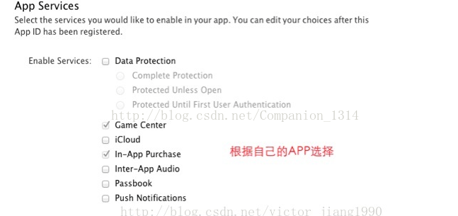 
​      图(3)

 最后提交就好了

### 2. 连接iTunesConnect

​         刚激活的账号暂时无法登录iTunesConnect，需要等苹果给你发一封关于可以登录的邮件后才能登录，否则会说你无权限。 
图(4)

### 3. 创建新应用

**3.1  登录iTunes Connect后，点击“管理你的应用” 进入管理页。**

​       
​      图(5)

 **3.2  点击“添加新的应用”按钮**

​       
​      图(6)

  

前两个就不说了，第三个SKUNumber什么意思我也不知道，为了保持唯一，并好记，就和BundleID一样。第四个BundleID一经选择，就不能更改，所以要谨慎选择。

**3.3 设置生效时间和价格**

​       
​      图(7)

 这里的价格是按层级来的，并不是具体的多少钱，Tier 1为1美元，在中国商店就相当于6元人民币。

 注意下面还有一个你的APP发布的商店，默认是所有商店都发布。

​       
​      图(8)

 **3.4 设置APP信息**

​     包括版本号，所有权

​       
​      图(9)

​     

　　还有APP的内容描述，默认都选择None，根据自己的APP实际情况

​       
​      图(10)

　　然后是一些元数据，关于APP的描述，用于显示在APPStore中。关键字用于用户可以利用这些关键字搜索到你的APP。SupportURL是当你的APP出现问题时，用户可以联系的地址。

​        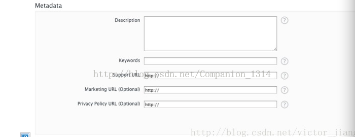 
​      图(11)

　　接着是APPStore审核的反馈信息，包括联系人信息，以及提供APP的测试账号。

​       
​      图(12)

​        最后是上传Icon、屏幕截图，屏幕截图不超过5张。

​        
​      图(13)

​        提交，就有APP ID了。

​       
​      图(14)

### 

**Tips：**

​            注意现在的状态为Preparefor Upload，点击ViewDetails, 进入后点击“Readyto Upload    Binary”

​       
​      图(15)

​            接着会询问你是否使用加密功能，选择后保存。

​        
​      图(16)

​            现在的状态为“WaitingFor Upload”了。

## 三、上传应用

### 1 创建CSR文件

1.1   打开电脑中的钥匙串，在应用程序中找到

​       
​      图(17)

 1.2 选择导航栏中下面的选项

​         
​      图(18)

 1.3 然后输入用户邮箱，名字，选择保存到硬盘。

​       
​      图(19)

 **注意：用户的Email 是开发者账号的邮箱，CA邮箱可以不用填写，前提是你选择的是存储到硬盘**

这时在本地就生成了一个这样的文件

​       
​      图(20)（这个文件在开发者中心生成发布证书的时候需要用到）

### 2 创建发布证书

 2.1 选择App Store

​      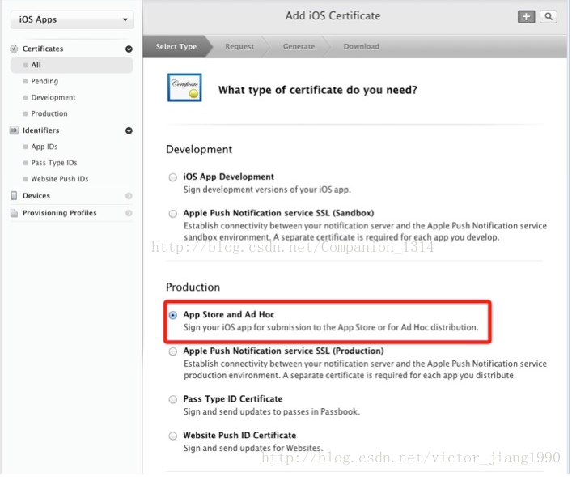 
​      图(21)

 2.2 上传刚刚创建的CSR文件

​      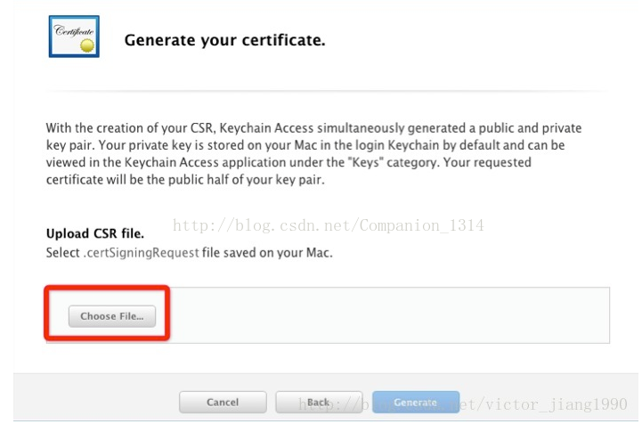 
​      图(22)

 2.3 上传后证书创建成功，下载到本地。

​       
​      图(23)

2.4 双击该文件，加入到钥匙串中。

​       
​      图(24)

**这样做的目的就是为你的电脑安装发布许可证，只有这样你的电脑才能发布程序**

### 3 创建ProvisioningProfiles

####  3.1 选择APP Store                              

​       
​      图(25)

####  3.2 选择App ID

​         
​      图(26)

####  3.3 选择证书

​       
​      图(27)

　　这个证书也就是刚刚生成的那个证书，在这我遇到的一个错误就是，有两个证书，我选择了一个错误的，结果打包出来的描述文件有问题，导致发布失败。

####  3.4 命名

​       
​      图(28)

选择的名字，在安装到Xcode的时候可以看得见。

 3.5 最后提交后下载ProvisioningProfiles文件到本地，双击打开添加到Xcode中。

### 4. Xcode设置

####  4.1 设置target

​                    这里的BundleIdentifier必须和前面申请的BundleID一致；版本号也必须和前面申请AppID时的版本号一致。

​       
​      图(29)
​       
​      图(30)

####  4.2 修改签名文件

　　必须选择前面创建的ProvisioningProfiles文件

 
​      图(31)

  

####  4.3 添加发布配置

 如果没有添加一个

​       
​      图(32)

接下来就是打包程序

在我们的xcode 中有一个打包的按钮

​       
​      图(33)

打好包后，它会自动弹出来，也可以在 orignize 查看

​       
​      图(34)

​       
​      图(35)

之后就是验证信息，点击上图的Validate 进行验证一下，确定没问题了在提交。不验证也可以提交，但是如果不验证的话有问题会很麻烦，最好养成先验证后提交的好习惯。

点击验证后，出现一下图框，在这边输入开发者的账号和密码，点next

​       
​      图(36)

选择一个描述文件（具有发布证书的描述文件）

​       
​      图(37)

这个界面说明你的app没问题，如果有问题的话会提示错误或警告，有错误的要要重新修改你的app再次打包验证，有一些警告可以不做修改直接提交，这个纯粹是看你是否完美主义。

​      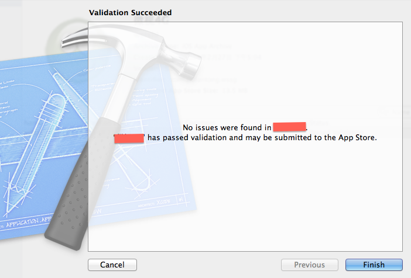 
​      图(38)

## 四、将应用提交到app store

苹果推荐用xcode自带的application loader 来提交我们的应用，但是除了用这个以外还能用其他的，下面来分别介绍。

### 第一种：直接将应用发到app store

*（不推荐这种方法）*

点击distribute

​       
​      图(39)

选择

​       
​      图(40)

​      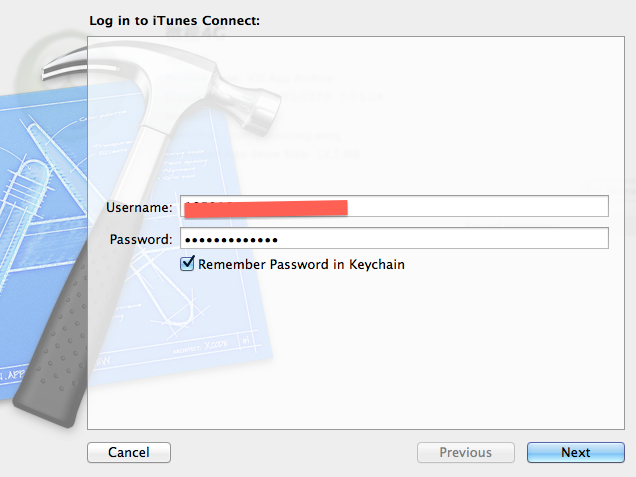 
​      图(41)

​       
​      图(42)

点击submit后就可以提交了

### 第二种：用xcode自带的application loader来提交我们的应用。

（推荐）

和上述方法第一步相同点击distribute，但是选择第二个选项

​      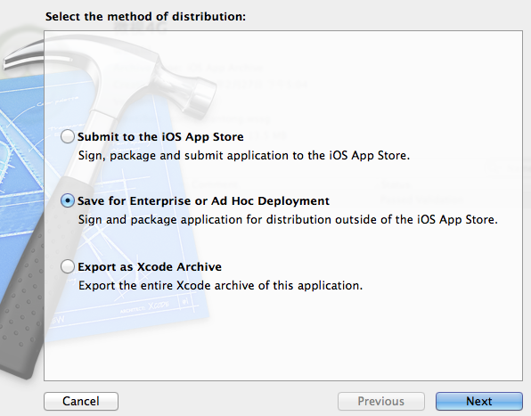 
​      图(43)

这里将生成一个ipa供我们保存到本地

​       
​      图(44)

保存好后，选择 xcode — open develop

er tool — application loader

​      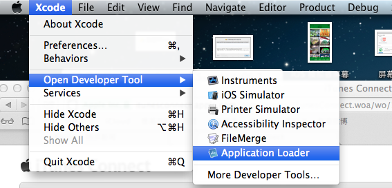 
​      图(45)

 看到如下图片，填好信息后，就可以上传了

​       
​      图(46)

​       
​      图(47)

​      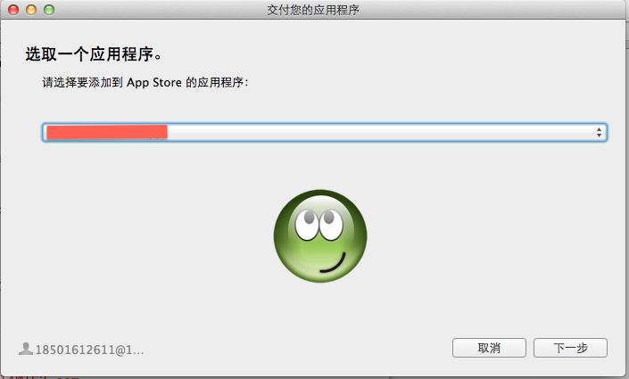 
​      图(48)

这边点击“选取”后，将我们刚刚存在本地的.ipa 文件上传就可以了

​       
​      图(49)

​      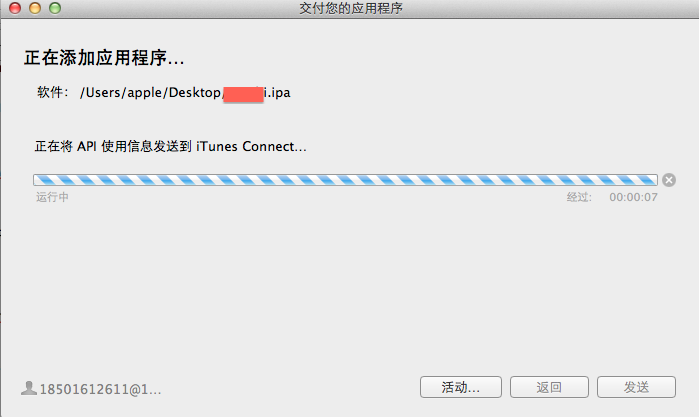 
​      图(50)

​      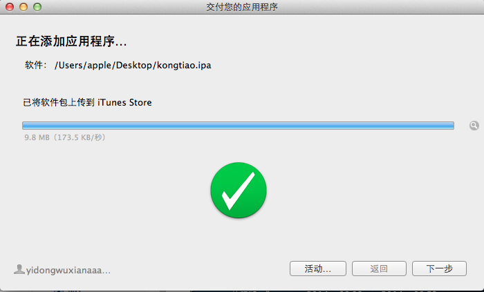 
​      图(51)

上传成功，这个时候，可以看到你的app的状态也变成了 waiting for review 。上传完成后的5、6天可以查看我们应用的状态看有没有改变，没改变也不用着急，当苹果审核时，状态会变成 in review。接下来你就可以知道你的应用是成功了还是被拒绝了。