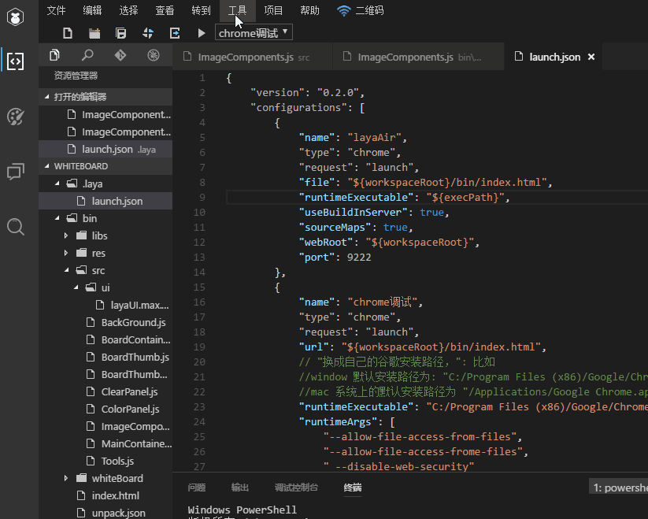
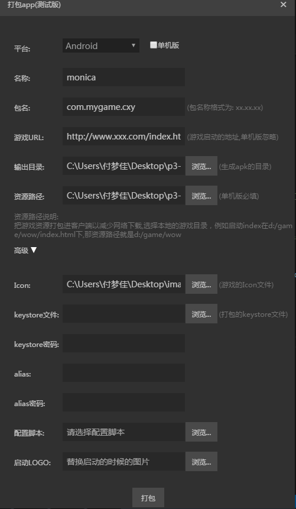

# LayaBox packaging tools

The project created using LayaAir IDE can not only generate H5 pages running on the web site, but also can be packaged into App to install and run at the mobile end. However, at present, only supporting Android version of app is supported, because IOS system can only be packaged through Apple XCode, and can not be packaged by other third party tools. For the construction of the XCode project for IOS, you can refer to the document “build the project”.

Packaging function is used only for quick testing and demonstration. If you really want to release it, it is recommended to use the method of building a project.


## 1. Effect:

　　Unpack the existing layabox package, modify the icon and start the page and other parameters, rebuild a new app. Generated this app can be installed and run directly, can also be released directly to the major platforms (after access login and payment functions).

## 2. Operational requirements:
1. Need to have installed 1.7 above jdk, if not installed, you can get it
   [Here](http://www.oracle.com/technetwork/java/javase/downloads/jdk8-downloads-2133151.html) Download.

   (Now there is a problem: in the MAC system, if you have already installed 1.8, it may lead to a packaging error.)

## 3. Instructions:
Click the menu Tools / package app (beta), as follows:
  
When you fill in the parameters, you can pack it. **Packing takes time**, so there will be a progress prompt， if there is no error,  the progress will reach 100%.
After the output directory will generate the final package results.

The meaning of the specific parameters is shown in the following description.


## 4、Android Apk Package
### 4.1 Main interface: 



### 4.2 The meaning of interface parameters :

#### 4.2.1 Stand-alone app  

　　If selected, is to package stand-alone version, or it is packaged online version.
　　Stand-alone version does not require networking, No corresponding URL. So you don't have to provide URL, But the game resources must be provided, startup page is fixed in the resource path index.html. If the project's launch page is not index.html, startup page is fixed to the resource path.
　　The online version must have a URL to do, and whether the packaging resource can be decided by itself（see the  "Resource Paths" section below）.   
　　  <br />
　　**Tips:  Even in the stand-alone version, network operations can still be done through the XMLHttpRequest or websocket, but does not support dynamic update of resources.**


#### 4.2.2 name  

It is the name of the app, which is displayed under the app icon after installation.  
for example:  
    
 `猎刃2` It's the name to be filled here  
*Tips: At present, only the name under the Chinese system can be modified* 


#### 4.2.3 Package names

Android application package name is not visible in the normal case. The rule of naming anti domain names is generally used (it helps to distinguish and avoid conflicts with the app already available in the system).   
　　for example : com.layabox.runtime.demo   
　　package name must be xxx.yyy.zzzformat, at least two levels, that is xxx.yyy . Otherwise the package will fail.


#### 4.2.4 Game url

　　Because the packaged application is an online project, you need to provide a startup URL, pointing to a HTML page, the entry of the application. If a project is generated by LayaAir, there will be an index.html address inside the QR code. When testing, it can be used directly for convenience. But when it comes to anroid applications, you have to have a real webserver address. For example:  
*LAN address: *  

``` 
    http://10.10.20.19:8888/index.html
```
*Actual address:*  
```
    http://layaair.ldc.layabox.com/layaplayer/index.html
```


#### 4.2.5 Output directory

　　就是打包结果，如果没有错误的话，这个目录下面就会生成重新打包好的文件，现在名字固定为 game.apk。 实际使用的时候可以改名，
　　改文件名不会影响app安装后显示的名称。  
　　*Tips: 如果打包过程中出现问题而中断，则会在这个目录下残留一些临时目录，遇到这种情况，只要直接把这些目录删掉即可。*


#### 4.2.6 资源路径

　　资源就是实际的游戏资源，例如脚本、图片、声音等。对于在线游戏，只要有游戏的url就能正常运行，但是把资源直接打进包中的话， 可以避免网络下载，加快资源载入速度。如果是单机游戏，由于没有提供游戏url，就必须给资源目录，把所需的资源全部打包进apk。 注意打包进apk的资源依然可以通过我们的dcc工具（资源缓存管理）进行更新。

　　*Tips: 打包资源的在线游戏，必须在server端打dcc了，否则就会失去打包的优势，依然会下载所有的资源。如何打dcc，参考[LayaDcc打包工具](https://github.com/layabox/layaair-doc/tree/master/Chinese/LayaNative/LayaDcc_Tool)*


#### 4.2.7 ICON  

　　APP的图标文件，打包工具会根据这个文件来生成android需要的各个大小的图标。因此，这个图标最好符合android的最大图标的大小， 例如 144x144，如果原始图片太小，生成的图标效果就会变差。图标文件的格式必须是jpg或者png，如果有圆角的话，必须是png格式且圆角部分透明。


#### 4.2.8 keystore，keystore密码，alias，alias密码  

　　这些都是keystore相关的参数。keystore用来给生成的apk进行签名。如果不填，打包工具会使用自带的keystore文件来签名。 不过为了安全，建议使用自己的keystore文件。如果还没有keystore文件，可以用java自带的keytool来生成一个，具体生成方法可以 查找keytool帮助或者百度一下。

　　为什么要有keystore密码和alias密码两个密码呢？ 如果粗略解释下，可以认为keystore是一个 集合，可以包含很多证书，他里面的每个证书都有一个别名，就是alias。如果要取出某个证书来使用的话，首先要进入keystore，于是就需要 keystore的密码，然后要取出里面的某个alias的证书，又要这个alias的密码。


#### 4.2.9 配置脚本：

　　配置脚本相关请参考：[打包相关的其它设置综述](https://ldc.layabox.com/doc/?nav=ch-as-5-1-4)


#### 4.2.10 启动LOGO：

　　启动页面中的logo可以替换成自己的设计的图片。

　　*Tips: 使用LayaNative打包服务。启动页面中必须保留包含Layabox的LOGO图，此处仅为启动LOGO的设计样式改变，也就是说可以采用Layabox的LOGO图与产品LOGO结合等方式。*


#### 4.2.11打包：

　　填好各参数后点击 `打包` 按钮执行打包工作，打包时间较长，因此会有一个进度提示，如果没有任何错误，进度到达100% 以后，在输出目录就会生成最后的打包结果。打包完成后，在输出目录下会生成一个game.apk文件。

