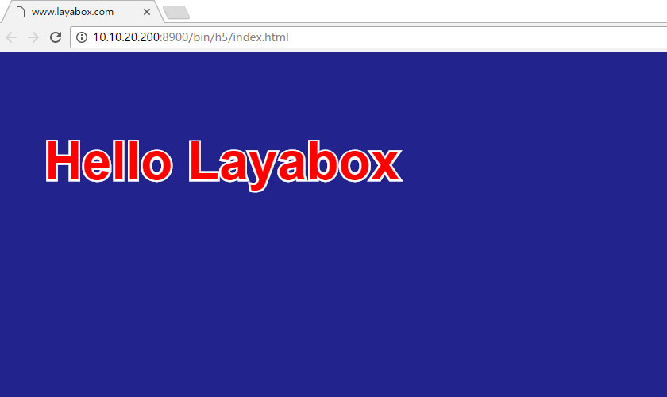
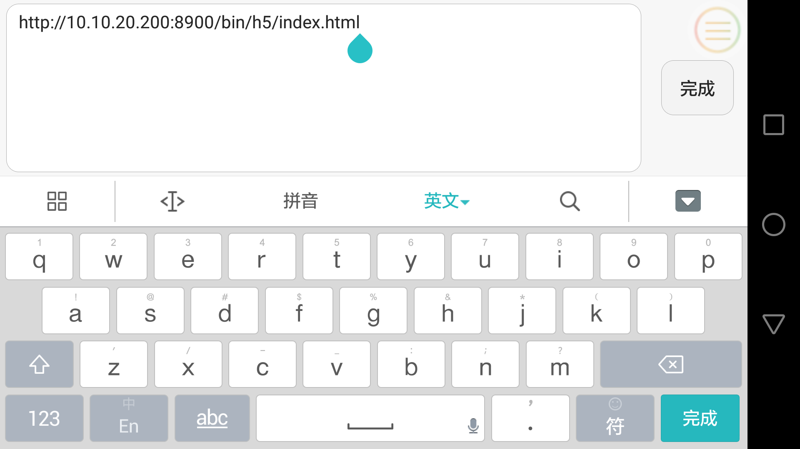

#  Run LayaAir project with LayaNative

Remember that when you look at this document, you should mastered the LayaAir or have a certain understanding of the API, LayaAir document details how to use LayaIDE to create the first program "Hello LayaBox".

**Tips：Enter a project address, if you find any screen is not displayed on the screen, it may be because the project is not properly set horizontal and vertical screen, please refer to the document https://github.com/layabox/layaair-doc/tree/master/English/LayaNative/screen_orientation **

Step 1： We have now created a Hello LayaBox a simple project, as shown in Figure 1

Operating results shown in Figure 2:

Step 2 : Click on the “QR code” menu key in the upper right corner of LayaIDE. A two-dimensional code interface will appear and a HTTP address is displayed below the interface. The address in the instance is `http://10.10.20.200:8900/bin/h5/index.html`, As shown in Figure 3:

Step 3: Click on the QR code interface, the “open browser” button, it will be in the browser to `http://10.10.20.200:8900/bin/h5/index.html`. Open the picture as shown in Figure 4.

STep 4: Open the LayaBox test App that has been installed on your cell phone and open as shown in Figure 5.

Step 5 ：Click the input address bar to enter `http://10.10.20.200:8900/bin/h5/index.html`, as shown in Figure 6:

Step 6: Click the 'GO' button, as shown in Figure 7:

Step 7 : LayaNative will load this Hello LayaBox project instance, as shown in Figure 8:

