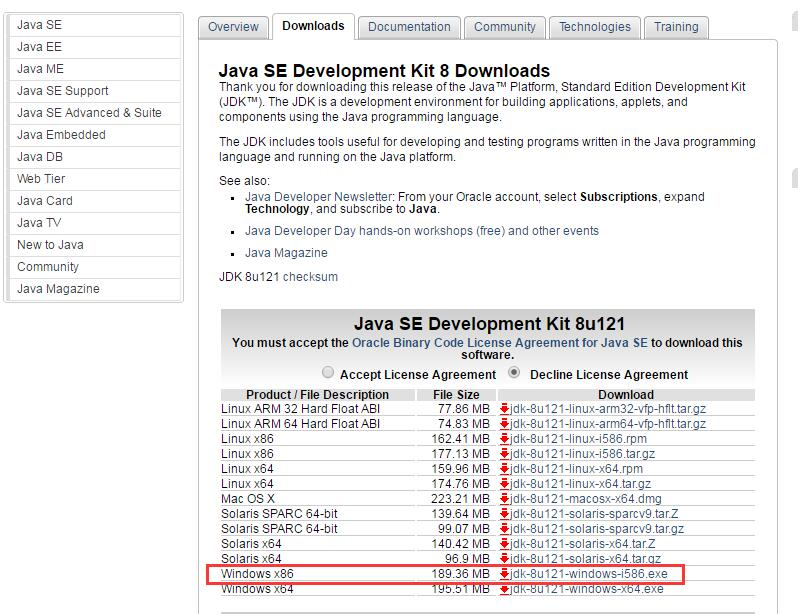
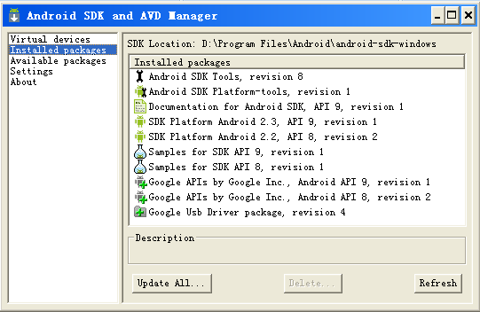
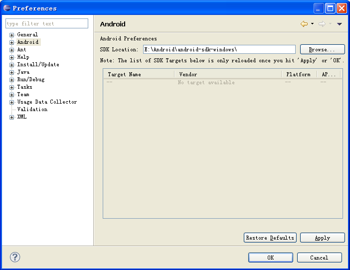
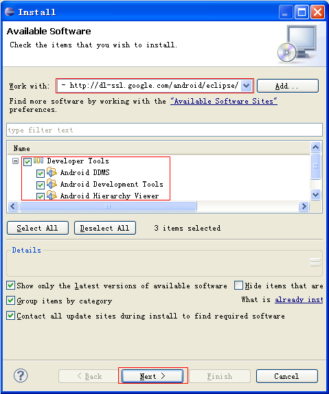
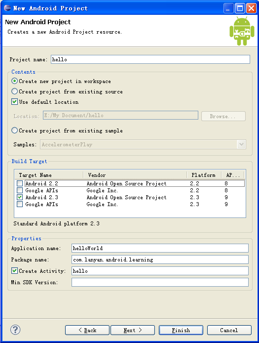
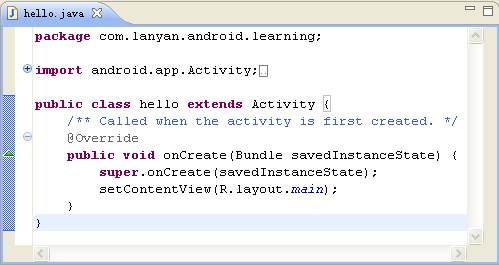
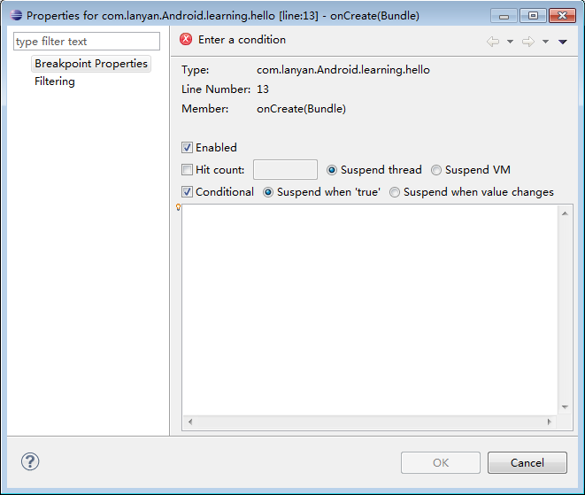
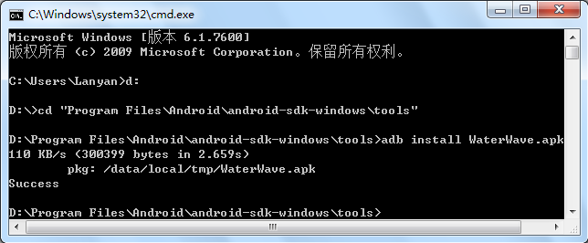

# Eclipse搭建android环境

## 一、安装JDK

### 1、JDK下载

打开网站[http://www.oracle.com/technetwork/java/javase/downloads/jdk8-downloads-2133151.html](http://www.oracle.com/technetwork/java/javase/downloads/jdk8-downloads-2133151.html)，会看到“Java SE”的下载页面，如图1-1，点击windows x86版本下载即可。

**图1-1 Java SE下载页面**

### 2、安装JDK

双击jdk-8u121-windows-i586.exe，得到如图1-2界面。

**图1-2 Java SDK 设置界面**

点击“下一步”，更改并确认安装路径（D:\Java\jdk1.6.0_21\，请注意若改变路径后请加上Java\jdk1.6.0_21\，防止安装文件与D盘文件混合），点击“下一步”。

**图1-3 Java 目标文件夹安装界面**

更改路径后点击下一步，然后“完成”。

### 3、环境变量设置

XP：“我的电脑” -->右键属性 --> “高级” -->“环境变量” -->系统变量（WIN7：“我的电脑” -->右键属性 -->“高级系统设置” -->“高级” -->“环境变量” -->系统变量）。

**设置以下三个属性以及其值：**

`java_home：D:\Program Files\Java\jdk1.6.0_21`

指向JDK安装路径，在该路径下你应该能够找到bin、lib等目录。JDK的安装路径可以选择任意磁盘目录，但是建议目录层次浅一点。

`path：%java_home%\bin;%java_home%\jre\bin`

指向JDK的bin目录，该目录下存放的是各种编译执行命令，使系统可以在任意路径下识别java命令，并且在控制台编译运行时就无需键入大串的路径，否则以后每运行一次java程序就要先把它的class文件移动到%java_home%\bin目录下，然后打开DOS将路径改到该路径下面，执行class文件。

由于安装了JDK后，该目录下就有了两个虚拟机（JDK下的JRE和JRE），所以需要包括两个虚拟机下的bin文件夹。

倘若在path中没有添加“jdk1.6.0_21\bin”，将会出现图1-4所示情况：

**图1-4 javac问题**

`classpath：.;%java_home%\lib\dt.jar;`

指向java程序编译运行时的类文件搜索路径，告诉JVM要使用或执行的class放在什么路径上，便于JVM加载class文件，目的达到用户可以import *，“.;”表示编译运行时先查找当前目录的class文件，dt.jar作用是运行环境类库，提供Java Swing组建显示的支持，可以用WinRAR打开看看，jar和zip格式一样，只是扩展名不同；tools.jar作用是提供工具类库和实用程序的非核心类；lib提供开发工具使用文件。

打开“开始” -->“运行”，打入“cmd”，进入dos系统界面。然后输入“javac”，如果安装成功，系统会显示一系列关于javac命令的参数以及用法。

特别注意：java_home后面不能加“;”，并且注意路径名是JDK的路径，而不是JRE，并且对变量名是不区分大小写的。

#### 补充：dt.jar、rt.jar、tools.jar

dt.jar和tools.jar是两个java最基本的包，里面包含了java中最重要的lang包到各种高级功能如可视化的swing包，是java必不可少的。

| jar包      | 类别                                       | 备注说明                                     |
| --------- | ---------------------------------------- | ---------------------------------------- |
| tools.jar | 工具类库，编译和运行需要其中的类sun.tools.java.*，sun.tools.javac.* | 一般只在javac时用到，java XXX.java 等价于java –classpath=%java_home%/lib/tools.jar XX.XXX.main XXX.java，javac是对上述命令的封装，因此不用加到classpath中。应用服务器用来编译JSP文件，应用服务器会自己加载，不需要自己设置。 |
| rt.jar    | java基础类库                                 | 默认在根classloader的加载路径里面，无需添加至classpath，同样jre/lib下的大部分jar都在这个路径中；检测方法：删去classpath中的rt.jar，用java –verbose命令检测。 |
| dt.jar    | 运行环境的类库，主要是swing包                        | 用到swing时最好加上，Eclipse开发环境默认是JRE，所以需要设置。   |

**参考资源：**

3个jar包的作用：[http://blog.csdn.net/hlw881008/article/details/5505251](http://blog.csdn.net/hlw881008/article/details/5505251)

Eclipse下看3个包的作用：[http://blog.csdn.net/dy_paradise/article/details/3909212](http://blog.csdn.net/dy_paradise/article/details/3909212)

JDK各文件夹的作用：[http://blog.csdn.net/qcontriver/archive/2010/03/09/5360975.aspx](http://blog.csdn.net/qcontriver/archive/2010/03/09/5360975.aspx)

## 二、安装Eclipse

### 1、Eclipse下载

打开官方网站[www.eclipse.org](http://www.eclipse.org/)，点击Downloads，选择Windows 32 Bit下的Eclipse Classic 3.6.1下载，即[http://www.eclipse.org/downloads/download.php?file=/eclipse/downloads/drops/R-3.6.1-201009090800/eclipse-SDK-3.6.1-win32.zip](http://www.eclipse.org/downloads/download.php?file=/eclipse/downloads/drops/R-3.6.1-201009090800/eclipse-SDK-3.6.1-win32.zip)。下载到D:\。

### 2、Eclipse安装

将下载到的zip压缩包解压，将eclipse.exe图创建桌面的快捷方式（右键图表 -->“发送到” -->“桌面快捷方式”），以便于启动。

注意：SDK就像是java的JDK，ADT只是一个eclipse的插件，所以两者的安装次序没有严格的要求。

## 三、安装SDK

### 1、下载SDK

打开网站[http://www.onlinedown.net/softdown/32289_2.htm](http://www.onlinedown.net/softdown/32289_2.htm)下载android-sdk_r08-windows.zip，并解压到D:\Android。

### 2、SDK安装

运行文件夹D:\Android\android-sdk_r08-windows\android-sdk-windows中的SDK Manager.exe，出现图3-1，选择需要安装的文件，然后“Install”，等待long long的时间。

**图3-1 SDK安装界面**

如果遇到消息“Failed to fetch URL…”的错误提示，那么需要将HTTPS方式改为HTTP方式，在“Android SDK and AVD Manager”窗口的左侧选择“Settings”，选中“Force https://...”选项，点击“Save & Apply”，并重新运行SDK Setup.exe

在这里我花了很长时间，后来发现下载了一些过时的文件，所以需要注意。点击Available packages选择高版本的SDK。

**图3-2 Available packages**

**图3-3 Installed Packages**

注意：为了让使用者减少长久的等待时间，这里将所下载的目录打包成压缩文件，这样就可以直接解压使用而不需要执行步骤SDK安装。参见软件目录中的android-sdk-windows.rar压缩包。

安装结束之后文件列表如下：其中一部分可能是多余的，网上的解释：

add-ons:一些扩展库，例如 Google APIs Add-On

docs:API文档等等

platforms:各个版本的平台组件

samples:一些实例程序

tools:各种辅助工具

usb_driver:windows下的一些usb驱动

temp:存放下载平台组件过程中的临时文件

### 3、SDK配置

将tools所在文件夹路径（我的路径是D:\Program Files\Android\android-sdk-windows\tools;）加入到path的环境变量中，方法与设置环境变量方法相同。

请注意：此时必须完善Android SDK的安装方可成功，具体操作如下：

1）SDK Location指向android目录

Windowàpreferences中的android选项，SDK Location所填的内容应该是Android SDK的安装路径（在这里是D:\Android\android-sdk-windows）即可。

补充：若在“SDK安装”过程中，是直接解压android-sdk-windows.rar压缩包，那么需要先进行SDK配置，才能完善SDK的安装。

**图3-4 Android SDK路径配置**

如果不设置SDK Location的值，将出现图3-5错误。

**图3-5 未添加SDK路径错误**

2）更新eclipse中的SDK

“Window” -->“Android SDK and AVD Manager” -->“Installed packages” -->“Update All” -->“Accept All” -->“Install Accepted”，详见图3-6。全部安装的时间大约是45分钟，出现“ADB Restart”对话框，单击“Yes”，最后关闭除eclipse之外的对话框即可，此时ADT安装成功。

在“Install Accepted”后出现“Failed to fetch URL http://dl-ssl.google.com/android/repository/repository.xml”

搜了很多资料，方法如下：

1）“Android SDK and AVD Manager”左侧的“Setting”，选中“Force https://…”这个选项；

2）取消选择“Ask before restarting ADB4”，保存设置，该SDK下载器，已经没有"Save and Apply"，修改设置后工具自动到指定地址下载repository.xml（关于save and apply没用的帖子已经很多，有添加环境变量和按enter保存等方法。我第一次下了改版本无法使用，通过以前r05版本修改配置后，才顺利使用r06下载器的。）

3）如果连接成功，则说明OK,接下来就是下载安装

问题：在左侧中没有“Setting”选项，但是实践证明，出现这个状况问题不大。

选择需要的包：

a.如果你只要尝试一下Android 2.0 Emulator（模拟器），那么你只选择“SDK Platform Android 2.0. API 5, revision 1”来安装就可以了。

b.如果你要在此SDK上开发应用程序和游戏应用,那么你需要接受并遵守所有许可内容（Accept All）

**图3-6 SDK更新界面**

如果不对SDK进行更新，那么在创建Android Project时将出现“An SDK Target must be specified”的错误，如图3-7。

**图3-7 An SDK Target must be specified界面**

## 四、配置ADT

打开Eclipse，Help->Install New Software打开图4-1对话框

**图4-1 ADT下载网址设置**

在“Location”中写入[http://dl-ssl.google.com/android/eclipse](http://dl-ssl.google.com/android/eclipse)，即按照红框中的内容填写，最后点击OK，将出现图4-2界面，单击“Select All”之后，将红框所在的关键部分处修改相同，单击两次不同页面下的“Next>”之后，再选择“I accept the terms of license agreement”以及“Finish”，然后耐心等待约20分钟，让系统Install Software，注意此时可能会出现“Security Warning”，主要意思是ADT包含未署名的内容，并且不具有有效性和真实性，询问是否继续安装，关系不大，单击“OK”，最后eclipse将提示重启使ADT生效，单击“Restart Now”即可。

**图4-2 ADT安装**

## 五、创建模拟器（AVD）

Windows -->Android SDK and AVD Manager -->Virtual devices -->New按照图5-1填写，最后点击Create AVD即可。

注意：如果你点击左侧面板的Virtual Devices，再右侧点击New，而target下拉列表没有可选项时，这时候点击左侧面板的Available Packages，在右侧勾选https://dl-ssl.google.com/android/repository/repository.xml，然后点击Install Selected按钮，接下来就是按提示做。

**图5-1 创建新的模拟器**

解释：Target是模拟器的可用平台；SD Card是记忆卡，也就是手机的内存卡；Skin是模拟器显示的屏幕大小，具体参数为：

> WVGA：800*480
>
> QVGA：320*240
>
> VGA：640*480
>
> HVGA：480*320
>
> WQVGA400：240*400
>
> WQVGA432：240*432
>
> WVGA800：800*480
>
> WVGA854：854*480

或者也可以选择Resolution，自由设置模拟器屏幕大小。Hardware（AVD所需要的特殊设备）中的值：Abstracted LCD density（分辨率）其值是由选择的Skin自动设置的等等。

**图5-2 运行模拟器**

选中SDK Android2.2，点中Start -->Launch，将出现图3-3的模拟器。

**图5-3 启动模拟器**

**图5-4 未知虚拟设备**

android模拟器出错，emulator: ERROR: unknown virtual device name

原因：我的文档的默认位置改变，由于创建的文件路径引用错误造成的。

法一：把“F:\Users\<username>\.android”下的文件复制到“C:\Users\<username>\.android“下面即可解决这个问题，不过这样的解决方案有一个明显的缺点，那就是如果又新建立AVD，又得重新复制。

法二：“我的电脑” -->右击属性 -->“高级” -->“环境变量” -->“系统变量” -->“新建”变量名为“ANDROID_SDK_HOME”(注意，这个变量名不能改变，只能是这个名字！)，然后把变量值改为你想把AVD所在的“.android”文件夹放置的位置，比如：”F:\AndroidEmulator”，在这里我把它放在Android SDK包中，值为：“D:\Program Files\Android\android-sdk-windows”

## 六、HelloWorld程序

### 1、创建Android Project

“File” -->“New” -->“Other” -->“Android” -->“Android Project”，出现图3-1界面，然后根据需要填写Project name、Application name、Package name、Create Activity内容，并选择Build Target即可。

**其中：**

Project name：一个项目的名称，实际对应一个文件夹。

Build Target：选择该应用程序所使用的SDK版本。

Application name：程序的名称，一般会出现在应用程序的标题栏。

Pakcage name：此名理论上可以随意，但Pakcage有一定的命名规范，即：第一目指明组织类型，比如com一般指公司，org指组织，edu指教育部分；第二目指该组织的名称，比如sun等，我是自己用了自己的名字；第三目及以后则可根据自己的分类进行定义。

Creak Activity：Activity是一个Andriod程序的一个运行实体，有点类似于C语言的main函数，所不同的是Android程序可以有多个类似与main函数的实体。

Min SDK Version：该项一般与Build Target一一对应，不需要特别指出。

**图6-1 New Android Project**

### 2、创建AVD设备

见第五节。如果没有创建AVD设备，也没有关系，可以右击工程à“Run As” -->“Run Configurations” -->“Android Application” -->“Android”（填上需要运行的工程名） -->“Target”（将部署设备的选择设为Mannul，防止有多个部署设备时的混乱） -->“Run”。在跳出的对话框中选择“Launch a new Android Virtual Device”，选中SDK，点击OK即可。

### 3、编译运行程序

打开hello.java文件，其内容如图6-2所示：

**图6-2 hello.java文件内容**

**图6-3 Java Build Path 设置**

Project -->Properties，出现图6-3对话框，将Android 2.2勾上，点击OK；Run -->Run（Ctrl+F11） -->Yes -->选中SDK，点击Start -->Launch -->OK，等待2分钟将出现图6-4结果界面，表明成功。

注意：右击所要运行的java文件 -->“Run As” -->“Run Configurations” -->“Android Application” -->“Android”（填上需要运行的工程名） -->“Target”（将部署设备的选择设为Mannul，防止有多个部署设备时的混乱） -->“Run”即可。

**图6-4 运行结果界面**

参考来源：[http://blog.csdn.net/zhq56030207/archive/2010/08/31/5852130.aspx](http://blog.csdn.net/zhq56030207/archive/2010/08/31/5852130.aspx)

### 4、调试程序

#### 通过DDMS来调试程序：

（1）将Eclipse开发工具的工作界面切换到DDMS标签。如图6-5和图6-6所示。

**图6-5 打开视图布局显示操作**

**图6-6 视图布局选择框**

（2）在“DDMS”界面中选择“Devices”标签，查看其菜单功能：Debug Process（调试进程）、Update Threads（更新线程）、Update Heap（更新堆）、Cause GC（引起垃圾回收）、Stop Process（停止线程）、Screen Capture（屏幕截图）、Reset adb（重启Android Debug Bridge）菜单选项。

#### 通过DDMS的“Logcat”来调试程序

（1）“Logcat”通过“andrdoi.util.Log”类的静态方法来查找错误和打印系统日志消息。

andrdoi.util.Log常用的方法有以下5个：

Log.v(String tag, String msg);      VERBOSE

Log.d(String tag, String msg);      DEBUG

Log.i(String tag, String msg);              INFO

Log.w(String tag, String msg);     WARN

Log.e(String tag, String msg);      ERROR，适用于“断点”方式调试程序

Log.v、Log.d信息应当只存在于开发过程中，最终版本只可以包含Log.i、Log.w、Log.e三种日志信息。

（2）点击“Run”-->“Debug”菜单命令，进入调试模式。

（3）切换到“DDMS”界面，点击“Logcat”标签，查看我们刚刚在程序中打印的Log信息。用不同颜色表示不同等级的信息，方便跟踪程序。

（4）调试方法

1）设置断点，单步执行：双击某行的标记栏

2）声明条件断点，触发完成：断点在表达式值发生变化时触发。双击设置完断点后右击断点，选择“Breakpoint Properties”在勾上“Enable”、“Conditional”，在框中写上表达式变量，当满足时，程序就会挂起；同时，在输入条件表达式时，也可以使用代码帮助。在上下文菜单中，通过Ctrl+Shift+I或右击变量并选择Inspect选择，会显示结果。

**图6-7 设置调试界面**

## 七、导入一个现有工程

### 导入非Android工程方法：

“File” -->“Import” -->“General” -->“Existing Project into Workspace” -->“Next” -->“Select root directory” -->“Browse”，选择待导入工程所在的位置。

注意：若没有Android的包，则需要重新设置“Build Path”。

### 导入Android工程方法：

“File” -->“New” -->“Project” -->“Android” -->“Android Project” -->“Next” -->“Contents” -->“Project name”（另起一个名称） -->“Create project from existing source” -->“Location” -->“Browse”（选择Android工程所在文件夹，到.xml所在的文件夹为止） -->“Build Target”（选择模拟器平台版本） -->“Finish”。

## 八、安装APK软件

### 1、模拟器上安装APK软件

首先进入Android SDK所在文件夹，由于模拟器启动需要几分钟的时间，所以我们先用命令（emulator -avd youravdname）启动模拟器（注：双击tools文件夹下的emulator.exe无法启动）；然后将plantform-tools下的文件复制到Android SDK文件夹下的tools下（若有重复覆盖即可，也可添加plantform-tools的环境变量），然后打开“运行”，输入cmd，单击“确定”，输入“adb install ”并将要执行的apk拉到cmd中按Enter，之后将会出现图8-1界面，Success！

**图8-1 命令提示符界面**

注意：必须将plantform-tools下的文件复制到tools下或者将plantform-tools的路径加入path 的环境变量中，因为adb命令在plantform-tools中而tools中没有，所以假若没有进行这一操作，将出现图8-2的错误。

**图8-2 ‘adb’不是内部或外部命令界面**

若apk文件名含有中文，将出现图8-3错误，只需要将中文改成英文和数字即可。

**图8-3 “Segmentation fault”出错界面**

**图8-4 apk安装效果界面**

安装成功后将在模拟器面板上出现红色框中的图标，单击即可运行。

### 2、模拟器上卸载APK软件

“Setting（如图8-4中的Setting图标）” -->“Applications”（应用程序） -->“Manage Applications”（管理应用程序） -->“WaterWave” -->“Uninstall”（卸载） -->“OK”（确认）。此时卸载成功面板上的“WaterWave”图标消失。

**图8-5 APK卸载成功**

### 3、真机上安装APK软件

首先“设置” -->“应用程序” -->勾选“未知源” -->“返回” -->“开发” -->勾选“USB调试”。

#### 3.1 方法一

下载并安装91手机助手for Android。然后用USB将手机和电脑相连，打开91助手如图8-6。

**图8-6 91手机助手开始界面**

“手动连接” -->“USB 连接” -->“？” -->“系统维护” -->“文件管理” -->“快速入口” -->“存储卡” -->“上传到设备” -->“文件”（选择要安装的.apk文件） -->双击要安装的.apk文件，出现图8-7，单击安装，完成。

**图8-7 apk安装界面**

或者简便方法：直接双击.apk就可以安装到手机中去。

#### 3.2 方法二

在http://www.hiapk.com/bbs/thread-40417-1-1.html上下载HiAPK Installer（APK安装器），直接双击即可安装完成（只能装在电脑上），如图8-8。这个软件会自动关联你的APK程序，只要双击一下APK程序就可以自动安装到手机里。

**图8-8 HiAPK Installer安装成功界面**

#### 3.3 方法三

安装ASTRO（文件管理器）：将ASTRO.apk放到手机的SD中，然后在手机的文件管理器中的SD卡中点中该apk文件，之后在面板上就会出现ASTRO的图标。以后安装软件时，只要把.apk文件拷到SD卡中，就可以在手机上的APK安装器上进行软件的安装与卸载。

#### 3.4 方法四

下载一个手机的内置APK安装器，然后把.apk文件拷到SD卡中，手机操作安装即可。

补充：文件管理器的功能：文件查看、文件管理、文件搜索、程序卸载和备份、进程管理、SD卡状态。

APK安装器：简化安装apk文件的过程，使其在电脑上操作就可以使apk软件装到手机上。

注意：手机连接电脑时，要下载驱动器或者APK安装器（常用的是豌豆夹，91助手），要不然只是手机的存储卡连上电脑，而手机没连上。