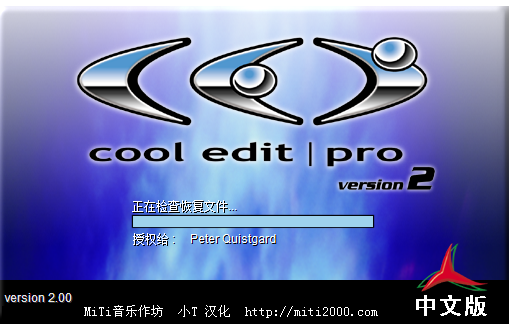

# Sound introduction

In LayaPlayer, sound is divided into two modes: background music and sound effect.

## 1. Background music

In LayaPlayer, background music is only supported by MP3 format, and only one background music can be played.

## 2. Sound effect

In projects, sound effects are frequent events. In order to ensure operation efficiency, LayaPlayer uses openAL to play sound effects, because MP3 is streaming media format, and it can not be resolved at present.

**Tips：**  
**1. LayaPlayer sound only supports wav and ogg format**  
**2. wav and ogg only support 8 and 16, does not support 32-bit**
**3. Note: LayaPlayer-0.9.5 previous version, wav and ogg only supports 22050 sampling rate, 16bit, mono channel**

To check the current LayaPlayer version, there are two ways:
1. With JS, call `conch.config.getRuntimeVersion();` method to get the version number.  
2. Plug the device into the computer and check the log, as shown below:  


## 3. Prompt information

1. Later version of LayaAir-1.7.5, if called `SoundManager.playSound()` with MP3 incoming file format, hint information is popped out, and the hint information display as follows: 
`The sound only supports wav or ogg format,for optimal performance reason,please refer to the official website document.`  
means should convert mp3 to wav or ogg format.

2. ，In the previous version of LayaAir-1.7.5,  there is no error message, you find that every time you play the sound will appear a **jerky effect**. This is most likely because the playback sound used is in the MP3 format, and the format is needed to be convert.

## 4. Resolving compatibility

If your project uses the mp3 format for sound effects in the web version, the wav format is used in LayaPlayer. It is recommended that the project be loaded in the way of configuration files, so that it will increase the judgement of LayaPlayer running environment only when loading the configuration files. Pseudo-code is as follows:

```javascript
if(window.conch)
{
    ...加载 "soundConfig-LayaPlayer.json"
}
else
{
    ...加载 "soundConfig-json"
}
SoundManager.playSound(soundJson[0].url,1);
....
SoundManager.playSound(soundJson[1].url,1);
```

**Tips**  
*1. Conch can only be called under the LayaPlayer environment, and there is no conch definition in the web version.*  
*2. If you use the as language to develop, you can get conch objects in this way through `Browser.window['conch'] `*
*3. Or you can use - `if(Render.isConchApp )` - to evaluate.*

## 5. Use the Cool Edit Pro tool for sound format conversion
Now there are many tools that can transform wav to MP3. Here we introduce a Cool Edit Pro tool briefly. Here is a brief introduction to the specific steps of the tool in the process of MP3 transformation wav:
1. First, download and install Cool Edit Pro first, and then open the Cool Edit Pro program;



2. Click “Batch Conversion” under “file” n the upper left corner to enter  “batch conversion” submenu


**Note: It is suggested that the 1, 2, 3, and 4 step of the batch file should be operated step by step.**

3. Select the file source: click the right to add the file. Here we select all the files under the sound file for batch processing, and then click Open:  


4. The conversion sampling type: click and change the target format under the resampling directory. Here we choose the sampling rate 22050Hz, mono channel and 16 bit bit that we need, then click OK. 


5. Select the new format: Output Format Select what we need Windows PCM (*. Wav), format type 22050Hz, 16bit, mono;


8. Select the destination folder and file name: Here is a simple choice of the output directory just fine, and then click "run the batch" to output the desired file, when the "file batch conversion completed" prompt, indicating that you have successfully completed the MP3 conversion wav batch conversion


9. If you run the Cool Edit Pro tool for batch processing, the following popups will appear. You only need to re replace the Resample.xfm files, then run the Cool Edit Pro again.


**In this case , on Baidu search for a cool edit resample.xfm, or purchase it.**

**10. If the cool edit pro downloaded on the Internet has no batch conversion, You can convert one to a batch first.**
