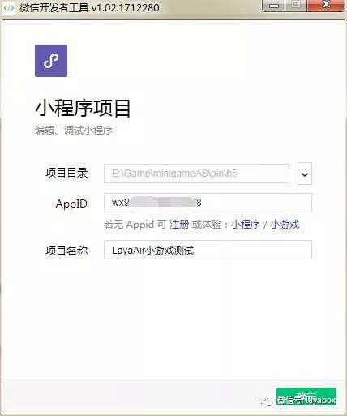
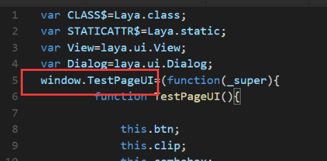

# Create a WeChat mini-game

### A. Setting environment for development

#### 1. Download and install LayaAirIDE integrated development environment

LayaAirIDE is an integrated development environment for the LayaAir engine, integrating with LayaAir engine and example projects, UI, animation and other visual editing, project code development and management tools. **Developers can directly use LayaAirIDE to create a sample project for Wechat Games.**

**Official website to download address** ：[http://ldc.layabox.com/layadownload/?type=layaairide](http://ldc.layabox.com/layadownload/?type=layaairide)

> Tips：LayaAirIDE 1.7.14 Version began to integrate micro-channel game development

#### 2. Download and install WeChat game development tools

WeChat game development tool is a small game development and testing environment, because LayaAir engine developers can use LayaAirIDE for project development, installing this game development tool is mainly used for small game project compilation, preview, real machine test and Debugging, upload and publish issued.


In the first page of the game development document, go to the Developer Tools download page via the navigation link to download the development tools.

 

**Development tool downloading address**：
https://mp.weixin.qq.com/debug/wxagame/dev/devtools/download.html

#### 3. Create an enterprise developer account for a mini-program, get the developer ID (AppID)

Although debugging can be developed without AppID, functionality is limited. So before development, it is best to create a small program of enterprise developer account for  optimal conditions.

Registered address: https://mp.weixin.qq.com/cgi-bin/registermidpage?action=index&lang=zh_CN

 

> Tips:WeChat game does not support individual registration, if it is a personal developer can only create a small program, can not create a small game project. So, personal developers if you want to experience, first do not enter AppID, click on the input box under the **mini-game** words.

### 

### B. Create micro-channel game project

#### 1. Create a game demo project with LayaAirIDE

Open LayaAirIDE and build a new project. Select the ”WeChat mini-game example“, set the name of the project, the project path, the development language type, engine version. You can create a small game, as shown in the following figure.


> Tips：This example is temporarily ActionScript3 development language, and the difference between the TS and JS projects and the AS3 project will be described later.

#### 2. See the sample project results

After creating the project, we can click the debug button (as shown below). You can see what our example looks like.


> Tips：In addition to compiling JS, this step is mainly to let you remember what our example looks like. Later, if the effect of the small game is the same , result should be not wrong.

#### 3. Simple understanding of the project's release directory.


LayaAir developers should understand that the h5 directory under the project directory / bin is the running directory. LayaAirIDE has automatically created a mini-game adapter and project files within the sample project, so in the development phase, when creating a game project, direct the game project directory to this sample run directory. (The TS and JS projects are different from the AS projects. In addition, when the large-scale game project is officially released, in our experience, it is best to create a separate game project for official release in the game development tool, Specific related introduction, will be put into the advanced document details)

**special reminder** ：

> because the engine JS files under the TS and JS directory are multiple, not merged. It is not supported by WeChat games. If it's TS or JS project, the 1.7.14 beta version can only merge the JS with the third party JS merge tool, such as webPack, then copy it to the small game's project directory. The formal version of the LayaAirIDE plan 1.7.14 begins to integrate the functions of the WeChat game auto merge release. Any language version in LayaAirIDE can be released as a target for small game projects.

### C. Create a small game project

#### 1. Developer account login, select the project type

Open the ”WeChat web developer tool“ and log in with the developer's WeChat scavenging code. Then select the **small program project** click into the project settings.


#### 2. Setting up a mini-program project

In the minigame program project settings panel, the `project directory` can select the running directory of the minigame example project created by LayaAirIDE. (if you want to create an additional directory, you can manually copy the contents of the running directory in the LayaAirIDE before the debug and release of the game.)



AppID in the app developer account (as shown below). If not, you can click the AppID input box to experience the game, but the function will be limited.

 


**Need special attention** mini-game does not support personal registration, if it is a personal developer, then enter AppID can only enter the development of small programs, can not enter the development of small games. So if personal developers want to experience, do not enter AppID, click the input box to experience the game. If you can not see the game a few words, then your version must be wrong, do not support the game. Re-download at the address provided in this document.


#### 3. Compilation and debugging of WeChat developer tools

Create game project, click on the compiler, can be in the preview and debugging tools, AS3 project, the JS automatically merge at compile time, so this step should be very smooth, you can see the effect with the LayaAirIDE model in the debugging results are consistent.

 

If it is TS or JS version. If you do not manually modify the error will be. We can see the error message in the debugger, this piece of debugging is chrome debugging, so it is not detailed.

The reasons for the errors are basically caused by two issues.

1. TS and JS versions have not yet integrated the JS merge capabilities of small games, so multiple JS files will be mistaken for cross file execution domain problems.

2.the same is due to LayaAirIDE not yet integrated JS merger, so the game's entry game.js, the engine does not automatically import the game's import file. So do not manually modify, certainly can not find the entrance document.

**solution**:

1. Use a third-party JS merge tool to combine multiple JS into a single JS. Then modify the entry procedure game.js, the merged js can be introduced.

Modified game.js reference :

```javascript
require("./weapp-adapter.js");
require("./main.min.js");
```

2. If the engine JS do not want to merge together, it is possible, only the project JS together on the line. But in the importation process will be more than one engine JS references come in.

修改后的game.js参考：

```javascript
require("./weapp-adapter.js");
require("./libs/min/laya.core.min.js");
require("./libs/min/laya.wxmini.min.js");
require("./libs/min/laya.webgl.min.js");
require("./libs/min/laya.ui.min.js");
require("./main.min.js");
```

3. there is no non-merger solution, it is possible, because of the implementation of domain problems caused by JS error, then, we will set the execution domain to the global domain, it can be solved. For example, our game demo program, you can see through the debugger can not find TestPageUI, then we find the TestPageUI in layaUI.max.all.js it becomes window.TestPageUI (as shown below), and then modify The entrance procedure game.js, all JS can reference.

 

The modified game.js reference:

```javascript
require("./weapp-adapter.js");
require("./libs/min/laya.core.min.js");
require("./libs/min/laya.wxmini.min.js");
require("./libs/min/laya.webgl.min.js");
require("./libs/min/laya.ui.min.js");
require("./js/ui/layaUI.max.all.js");
require("./main.min.js");
```

It needs to be reminded that if the project is larger, there will be more places to change. **Currently this is not recommended*, because IDE will be overlaid every time it releases and updates the project. It is suggested that JS merge is adopted to merge multiple project JS into a JS.

#### 4. The testing and debugging of the prototype

Unless it is a small game for some novice encountered compatibility issues, because LayaAirIDE can also debug project, basically the effect of both sides will different. So the most important thing here is the ** preview ** feature, through the mobile WeChat scan code, in the WeChat real machine testing and debugging.

 

Scan the QR code with wechat, it launch the application project, click the floating window button in the upper right corner, you can open the debug and open the performance monitoring panel.


Open the device debugging and performance monitoring panel, as shown below.

 


At this point, a complete process of small game development is over. Is it not very simple? The small game developed by LayaAirIDE is basically intuitive to release WeChat mini-game.