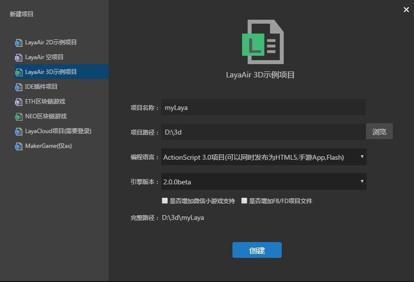

## 快速开始一个3D项目

以下我们将用LayaAir引擎快速开始一个3D项目，并且以AS语言为教程，简单演示用引擎代码实现一个基本的3D应用。

### IDE创建3D示例项目

下载LayaAirIDE，启动新建项目选择3d项目如图所示。

<br>（图1）

这里我们选择Actionscript3.0语言。创建完成我们发现ide为我们创建好了一个3d的模板。关于项目的结构介绍开发者可以参考2D的新手教程。这里不在赘述。

我们直接F5（mac系统用户可能要cmd+F5）或者点击运行按钮，我们可以看到调试窗口创建出一个方体。

<br>（图2）

LayaAir3D.as这个启动类为我们构建出了一个3D的世界。并且添加了一个简单的3D世界所必须的几个要素（场景，摄像机，光源，3D模型、材质）。关于这些概念知识后续教程我们会详细的介绍，逐步带领大家学习3D知识。

对于这个简单点的demo，我们发现这个方体是一个静态的，不能给我们带来3D那种所见即所得的立体视觉感，那么我们添加简单的几行代码让他转动起来。首先找到启动类LayaAir3D.as，修改成如下这个类。开发者可以直接直接粘贴到自己的项目中。

```java
package {
	/*
	*@author wenqiang
	*/
	import laya.d3.core.Camera;
	import laya.d3.core.MeshSprite3D;
	import laya.d3.core.Sprite3D;
	import laya.d3.core.light.DirectionLight;
	import laya.d3.math.Vector3;
	import laya.d3.math.Vector4;
	import laya.d3.resource.models.BoxMesh;
	import laya.utils.Handler;
	import laya.display.Stage;
	import laya.utils.Stat;
	import laya.d3.core.scene.Scene3D;
	import laya.d3.core.material.BlinnPhongMaterial;
	import laya.webgl.resource.Texture2D;
	public class LayaAir3D {
		
		public function LayaAir3D() {

			//初始化引擎
			Laya3D.init(0, 0);

			//适配模式
			Laya.stage.scaleMode = Stage.SCALE_FULL;
			Laya.stage.screenMode = Stage.SCREEN_NONE;

			//开启统计信息
			Stat.show();

			//添加3D场景
			var scene:Scene3D = Laya.stage.addChild(new Scene3D()) as Scene3D;

			//添加照相机
			var camera:Camera = (scene.addChild(new Camera( 0, 0.1, 100))) as Camera;
			//移动摄影机位置
			camera.transform.translate(new Vector3(0, 3, 3));
			//旋转摄影机方向（角度）
			camera.transform.rotate(new Vector3( -30, 0, 0), true, false);
			//设置背景颜色
			camera.clearColor = null;
			//添加方向光
			var directionLight:DirectionLight = scene.addChild(new DirectionLight()) as DirectionLight;
             //灯光的漫反射颜色
			directionLight.diffuseColor = new Vector3(0.6, 0.6, 0.6);
             //灯光的方向（弧度）
			directionLight.transform.worldMatrix.setForward(new Vector3(1, -1, 0));
			//添加自定义模型
			var box:MeshSprite3D = scene.addChild(new MeshSprite3D(new BoxMesh(1,1,1))) as MeshSprite3D;
			//模型旋转方向
			box.transform.rotate(new Vector3(0,45,0),false,false);
			//给自定义的模型创建一个材质球
			box.meshRenderer.material = new BlinnPhongMaterial;
			//创建材质
			var material:BlinnPhongMaterial = new BlinnPhongMaterial();
			//加载材质的漫反射贴图
			Texture2D.load("h5/res/layabox.png", Handler.create(null, function(tex:Texture2D):void {
				//得到返回的Texture2D添加给材质球
				material.albedoTexture = tex;
			}));
			//给模型附上材质
			box.meshRenderer.material = material;
			//这里我们添加旋转逻辑
			var vect:Vector3 = new Vector3(1,1,0);
			//利用时间循环每10毫秒旋转一次
			Laya.timer.loop(10,null,function ():void{
				box.transform.rotate(vect,true,false);
			})
		}		
	}
}
```


<br>（图3）

这里我们用了一个计时器，每10ms驱动这个方体转动一个下，具体的讲解请开发者阅读相关的教程和api，这里我们只是简单的演示，简单的代码如下：

```java
            var vect:Vector3 = new Vector3(1,1,0);
			Laya.timer.loop(10,null,function():void{
				box.transform.rotate(vect,true,false)
			})	
```

到此我们已经能够跑通一个简单的例子，并且驱动这个方体进行旋转（图3）。


### LayaAir 3D世界的基本构成

通过上面的代码示例我们可以看到一个基本的3D世界诞生了。当然，上面的代码还比较简单，要作出丰富多彩的游戏世界，我们还需要了解引擎更多的功能。

图4为LayaAir 3D世界可见要素视图。除了3D场景、摄像机、灯光和模型外，动画也是可显示要素之一。后期课程我们将逐步向大家介绍。

（图4）


### 3D世界变换与向量的简单运用

在上例示例中，创建了有关显示的几大要素模块，但我们还看见在摄像机、灯光、模型上运用到了向量Vector3或Vector4等，用它们去为对象的位置、方向、色彩等赋值。

#### 坐标系及位置、旋转修改

在2D引擎中我们是直接调整x、y坐标来控制显示对象的位置与旋转方向，3D引擎中显示对象较为复杂，加入了z轴坐标，因此我们用到了Vector3三维向量，用它的值分别代表着x、y、z。

但是，各种3D引擎和3D模型动画制作软件对坐标方向的定义会有所不同，因此需初学者们掌握它们的区别。

LayaAir 3D引擎坐标用专业术语来说属于**`右手坐标系`**（图5），简单来说来，屏幕右侧为正X轴方向，上方为正Y轴方向，屏幕向观察者方向为正Z轴方向（屏幕后方向为负Z轴方向）。有的3D引擎属于左手坐标系，在此不作介绍，有兴趣的初学者可以百度了解。

<br>（图5）右手坐标系


引擎中也分为世界坐标系与局部坐标系，世界坐标系是3D场景的坐标，三轴方向永远不变（图5）。局部坐标为模型本身坐标，可以随着模型方向的旋转变化而改变，但我们可以通过右手坐标系手势去识别坐标方向（图6），下图中手的模型为沿y轴旋转-90度后的3D模型右手坐标系局部坐标，大拇指永远为局部坐标的正X轴方向。

<br>（图6）

了解了上述坐标系，那么就可以通过3D变换来改变它们了，在示例代码中，transform是一个3D变换对象（Transform3D ），它在3D世界中非常重要，有关显示对象很多变化逻辑控制的代码都会用到它。

代码中我们用到了3D变换中的translate移动及rotate旋转方法，并用三维向量代表x、y、z的值。同时，两种方法都可以在参数中设置是否是局部空间移动、旋转，初学者们可以在程序中设置，观察移动和旋转有什么不同。

```java
            //移动摄像机位置
			camera.transform.translate(new Vector3(0, 3, 3));
          	//旋转摄像机方向（角度）
			camera.transform.rotate(new Vector3( -30, 0, 0), true, false);
```

<br>（图7）

以上为Transform3D的API中移动、旋转方法描述，当然，变换对象还有很多属性与方法，我们在以后示例中逐步讲解。


#### 向量的使用

向量在LayaAir 3D引擎中使用非常频繁，从二维向量到四维向量到处都会看到它们的身影。最基础的用法就是本示例中用于赋值使用。

代码中3D对象的移动、旋转、缩放等变换用三维向量作为了它的x、y、z轴向坐标赋值。

那么在灯光的各种颜色属性赋值上，三维向量中的值又分别代表了R、G、B三种颜色，分别为红、绿、蓝，LayaAir 3D引擎中，三个颜色的最大值为1，是按百分比的方式设置，整体值越大，颜色越亮，越小颜色越暗，如果值超过1将会产生曝光效果。

至于红、绿、蓝能组合成什么样的颜色，初学者们可以向游戏美术设计师们咨询学习，比如红加绿为黄、红加蓝为紫等等，一般在项目开发过程中，程序员需要反复调整颜色值去试验好的效果。

示例中以下代码：

```java
             //灯光的漫反射颜色
			directionLight.diffuseColor = new Vector3(0.6, 0.6, 0.6);
             //灯光的方向（弧度）
			directionLight.transform.worldMatrix.setForward(new Vector3(1, -1, 0));
```

在项目中，还有许多比较复杂的用法，需要运用向量作一些数学运算，本课程作为入门课程，在此暂时不多作介绍。

