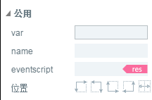
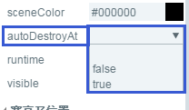
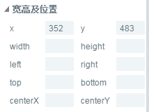
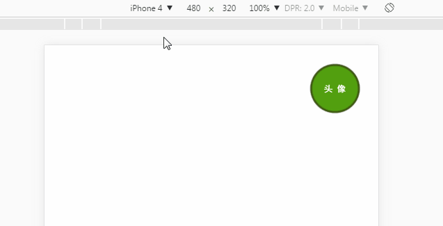

# 属性设置器

​         属性设置器是我们查看并编辑当前选中组件属性的工作区域。在场景编辑器或层级管理器中选中组件，就会在属性设置器中显示该组件的属性以供查询和编辑。

属性设置器面板如图1所示，从上到下通常为： 组件或节点名、**公用**属性、**常用**属性、**宽高及位置**、**旋转及缩放**、**其他**等等。

  
​  （图1）属性面板分组

## 1、`公用`属性介绍

公用属性中通常是`var`、`name`、`eventscript`、`位置`。如图2-1所示。

   (图2)

### 1.1 设置全局变量名称

`Var` ：声名一个唯一的全局变量名称，用于在项目的代码中根据这个名称来调用这个组件。

### 1.2 设置组件标识名称

`name`： 是组件的标识名称，通常用于层级管理器中区分其它组件，他的父容器也可以通过这个名称找到这个组件。

### 1.3 设置资源皮肤

`eventscript`：拖动资源到输入框可替换皮肤，点积按钮可快速定位皮肤资源。　　

## 2、`常用`属性介绍

在常用属性里，有一些操作是通用的。这里我们分别介绍一下。

### 2.1 场景颜色(sceneColor)

场景颜色即场景编辑器背景颜色，可手动输入编码修改颜色，还可以从调色板修改如图3-1，3-2所示。

   (图3-1)

   (动图3-2)

### 2.2 场景销毁关闭设置(autoDestoryAtClosed)

`autoDestoryAtClosed`场景被关闭后，是否自动销毁（销毁节点和使用到的资源），默认为false。

   (图3-3)

### 2.3 强大的runtime属性

`runtime`是属性管理器中非常强大的一个组件扩展功能。通过在runtime属性中设置逻辑类，实例时创建的不再是组件的可视类，而是runtime属性中指定的逻辑类。该属性中需要指定逻辑类的全路径，例如“game.user.player”。

### 2.4 visible

`visible`是否显示默认为true。

## 3、宽高及位置属性

宽高及位置属性在UI制作中有着很重要的作用。主要用于调整位置及UI屏幕适配（图4）。

 （图4）

### 3.1 x、y属性

x与y属性是组件在场景编辑器中的x与y轴坐标。

场景编辑器的左上角为坐标原点`（0, 0）`。 以原点为中心，x轴向右延伸为正坐标增加，y轴向下为正坐标增加。

在`场景编辑器`中选中组件后按住鼠标可以移动修改x与y轴位置，也可以在属性输入框中设置固定值。

### 3.2  width、height宽高属性

在不改变组件大小的情况下，组件的宽高虽会自动计算，但在属性面板中并不会显示出来。当通过约束框或固定值设置对组件进行了缩放重置后，宽高属性会显示出来，同时也可以进行数字的拖拉调节。

不选择任意组件时，当前宽高为页面宽高。

*Tips：部分组件只改能改变约束框大小，实际组件并不会放大，但鼠标点击区域会缩放到约束框的大小，例如CheckBox。*

### 3.3  UI适配属性

`left、right、top、bottom`四个属性主要用于组件与页面边缘距离位置适配。

`centerX、centerY`两个属性主要用于组件与页面中心位置适配。

在游戏开发中，我们不可能把所有屏幕分辨率全部考虑到，有的分辨率高，有的分辨率低。如果游戏项目代码中使用了全屏适配，组件又固定了位置，在不同分辨率的屏幕下就会造成UI组件错位现象。我们需要按以下方式进行调整。

#### 3.3.1 边距位置适配

**设计目标**：在游戏右上角放一个头像，始终保持屏幕上边缘和右边缘50px。

**错误的实现效果**：

如果我们按某一种屏幕分辨率为组件的x与y设置固定值，则会出现动图4-1的效果。与设计目标不符。

  
 (动图4-1) 为组件的x与y设置固定值时，不同屏幕分辨率效果。

**正确的实现效果**：

`left、right、top、bottom`四个属性分别基于父容器的左边缘、右边缘、上边缘、下边缘。所以要实现在不同屏幕分辨率下的相同居右效果，需要设置right与top的属性值，我们把它都设置成50像素。设置后的运行效果如动图4-2所示。

  (动图4-2)

**屏幕适配对边距设置的影响**：

这里特别要注意的是，`left、right、top、bottom`的属性效果是基于父容器（页面）的各个边缘，而不是屏幕的各个边缘。父容器（页面）的分辨率一定要与项目中Laya.init()设置的分辨率相同，如果没有设置成相同，那么并不能实现动图4-2的运行效果。

#### 3.3.2 边距的拉伸适配

除了居于某一个边缘的适配作用外，同时设置left、right、top、bottom的属性值，还可以根据不同屏幕对组件进行拉伸适配。例如我们将left、right、top、bottom的属性值都设置为100，运行后如动图4-3所示。

   (动图4-3)

*Tips：拉伸适配的边距设置方式通常需要结合九宫格来实现。*

#### 3.3.3 中心位置适配

中心适配常用于基于屏幕中间的游戏启动LOGO，弹出提示框等。我们可以通过centerX、centerY进行位置居中设置，如图5-1、5-2所示。

 （图5-1）

 （图5-2）

## 4、旋转及缩放属性

旋转及缩放属性在游戏UI中，特别是在IDE制作动画时经常用到。

#### 4.1 修改轴心点

“轴心点”：组件的旋转或缩放中心点，默认在组件中的原点`（0,0）`点位置。

pivotX、pivotY、anchorX、anchorY四个属性都是用于修改轴心点位置。

pivotX、pivotY（轴心点）是通过改变组件轴心点XY坐标的固定值来修改轴心点位置。

anchorX、anchorY（锚点）是通过X与Y轴的组件宽或高的百分比计算出轴心点坐标位置，如图6所示，宽与高的50%计算出的坐标正好是中心点坐标位置。

 （图6）

**Tips**：*通过锚点是一种非常方便快捷的设置轴心点方式。但是锚点方式只能对UI组件设置轴心点，对于Graphics组件以及Sprite等2D基础组件的轴心点只能通过设置`pivotX与pivotY`的方式实现。*

#### 4.2 修改倾斜角度

skewX、skewY是以轴心点为中心进行水平、垂直角度倾斜，修改属性值效果如动图7所示。

 （动图7） 

#### 4.3 修改组件缩放大小

scaleX、scaleY是以轴心点为中心进行水平、垂直大小缩放。

默认为1，不缩放；正数值越大，缩放尺寸越大。

缩放到0，不可见；

`-1`为**镜像**，效果如动图8所示 。负数值越大，镜像后缩放尺寸越大。

 （动图8） 

**Tips**：*如果轴心点在中心，可以原地镜像，比如角色两个方向可以使用同一个资源实现。*

## 5、其他通用属性介绍

LayaAirIDE提供了大量的组件，它们都有一些相同的其他通用属性，因为它们大都继承于Component组件基类。在这里我们主要介绍一下其他属性中的通用部分，组件本身的特殊属性，我们将在每个单独组件介绍时讲解。

通用属性包括以下几类

显示相关属性：alpha、visible

缓存相关属性：cacheAs、staticCache

鼠标操作相关属性：disabled、gray、htTestPrior、mouseEnabled、mouseThrough

label相关属性：labelAlign、labelColors、labelBold、labelFont、labelPadding、labelSize、labelStroke、labelStrokeColor、strokeColor

### 5.1 显示相关属性

显示相关属性相对比较容易理解，显示对象都具有alpha和visible属性。

`alpha`调整显示对象透明度，数值在0-1之间，0为全部透明，1为不透明，区间内属于不同程度半透明。

**Tips**：显示对象alpha数值无论为多少，如果加了鼠标监听，那么它都支持鼠标事件，哪怕alpha为0的情况下，鼠标事件也会发生。

`visible`控制组件的是否显示，该属性为布尔值，默认值为true，正常显示。当值为false时，组件不显示出来，并且鼠标事件无效果。

*Tips：visible为false时不显示是指在浏览器中运行时不显示，在IDE中设置为false不会即时产生隐藏变化。*

### 5.2 缓存相关属性

关于缓存优化方面的属性，cacheAs、staticCache建议单个组件不要使用，不经常变化的复杂页面时再使用。

**当游戏中有大量的UI，并且一个UI有多个节点，变化较小时，我们推荐使用cacheAs（大部分UI都可以使用）。**

例如我们使用的LayaAirIDE软件，软件中的很多面板，例如属性设置器、资源管理器、项目管理器等，它们的节点子对象很多，但不是很频繁的改动，因此我们都使用了cacheAs进行缓存，提高了渲染效率。

**对于经常变化的复杂UI，可以把UI分成两层，较少变化的一层使用cacheAs，经常变化的层不使用。**例如有“倒计时”显示的UI，我们也可以把它分成倒计时部分和其他部分，其他部分进行cacheAs，倒计时部分不进行cacheAs。

开发时使用cacheAs需认真学习理解，错误的理解和使用缓存机制反而会降低性能。下列是两个主要属性的详细说明：

**cacheAs：**

缓存组件，是否缓存为静态图像，合理作用能提高性能 。它有"none"，"normal"和"bitmap"三个值可选。

**"none选项"：**表示不做任何缓存。

**"normal选项"：**

​	canvas模式下进行画布缓存 ：它相当于把由多个子对象组成的UI缓存成一张位图，游戏每帧渲染时，只是渲染缓存的位图，而不是把所有子对象全部渲染一次，因此节省了渲染开销，提高了性能。

​	webgl模式下进行命令缓存：它相当于只缓存了子对象遍历过程及程序命令组织，未缓存成一张位图，在游戏每帧渲染时，不用再次去遍历子对象，而是直接把子对象按照遍历好的层级进行显卡渲染，它不会减少drawcall，不会增加内存损耗，渲染性能中等。

**Tips**: *cacheAsBitmap属性功能等同cacheAs属性的normal模式，cacheAsBitmap属性为兼容旧版本IDE而保留，当前如果有相关需求，建议使用cacheAs的normal进行设置。*

**"bitmap选项"**：

​	canvas模式下依然是画布缓存。

​	webgl模式下进行renderTarget缓存：它相当于把多个子对象组成的UI 缓存成一张位图并提交给显卡进行每帧渲染，减少了drawcall，渲染性能最高。需注意的是缓存的位图会额外增加一部分内存开销，缓存的位图越大，内存开销越大。且缓存位图大小不能超过2048。这种模式在不断重绘时也会增加CPU的开销。

**Tips**：*当cacheAs选择"normal"和"bitmap"时，子对象发生变化，会自动重新缓存，同时也可以手动调用reCache方法更新缓存。* 

**staticCache：**

设置cacheAs为非"none"时此值才有效，staticCache=true时，子对象变化时不会自动更新缓存，只能通过调用reCache方法手动刷新。

例如一些数据较多的UI，当UI打开在读取数据时，可能会不停的更新UI显示，这时可以设置staticCache为true，当数据读完后，再通过reCache方法一次性把数据读取并刷新。

具体实例请和数据分析请参考“技术文档—2D进阶篇—cacheAs性能优化”

### 5.3 鼠标操作相关属性

鼠标操作相关属性说明及演示效果如下

| **其他属性**     | **功能说明**                                 |
| ------------ | ---------------------------------------- |
| mouseEnabled | 是否接受鼠标事件。 默认为false，如果监听鼠标事件，则会自动设置本对象及父节点的属性 mouseEnable 的值都为 true（如果父节点手动设置为false，则不会更改）。 |
| disabled     | 是否禁用，禁用后变灰，且不接收鼠标事件。                     |
| gray         | 是否变灰，变灰后仍能接受鼠标事件。                        |

 （动图9） 

**mouseThrough：**

组件mouseEnabled=true鼠标可用时，是否可穿透。默认值为false，如果设置为true，则点击空白区域可以穿透过去，只针对自身有效。

**hitTestPrior：**

是否优先检测自己。默认为false， 鼠标碰撞检测是优先检测子对象，然后冒泡到父对象，如果hitTestPrior=true 鼠标碰撞优先检测本对象，本对象被击中后，才进一步检测子对象。 对于已知大小的容器（特别是根容器），默认为false，设置此值为true，能减少节点碰撞，提高性能。

例如一个较复杂的Box，内部有多个子对象，但我们只需要对Box本身进行鼠标监听，因此可以设置hitTestPrior为true，鼠标点击的时候，省去了从子对象冒泡到Box的过程，直接触发了鼠标事件，从而提高了性能。

*Tips：UI的View组件hitTestPrior默认属性值为true。*

### 5.4 label相关属性

很多组件的内部包含了label标签，比如Button、CheckBox、Tab等。它们的其他属性中也有相同的label属性设置，功能说明请看下表

| **属性名**          | **功能说明**                                 |
| ---------------- | ---------------------------------------- |
| labelAlign       | 标签对齐模式，默认为居中对齐。注：在CheckBox中无效            |
| labelColors      | 表示标签各个状态下的文本颜色。 格式: "upColor,overColor,downColor,disableColor"。默认为“蓝色，绿色”。 |
| labelBold        | 表示标签文本标签是否为粗体字。                          |
| labelFont        | 表示文本标签的字体名称，以字符串形式表示。IDE中可选择。            |
| labelPadding     | 表示文本标签的边距。 格式："上边距,右边距,下边距,左边距"。         |
| labelSize        | 表示文本标签的字体大小。                             |
| labelStroke      | 文字描边宽度（以像素为单位）。 默认值0，表示不描边。              |
| labelStrokeColor | 文字描边颜色，以字符串表示。 默认值为 "#000000"（黑色）;       |
| strokeColor      | 表示各个状态下的描边颜色。 格式: "upColor,overColor,downColor,disableColor"。 |

*Tips：以上表格的属性在label组件中不含label，但作用完全一致，比如`labelAlign`属性与label组件的`align`属性完全一致。*