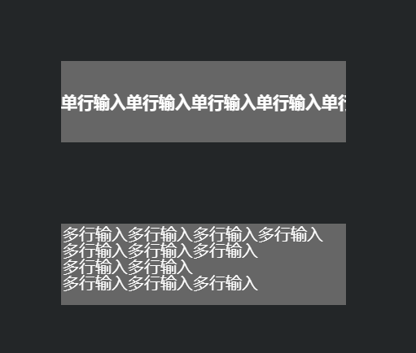

# textInput的单行输入&多行输入

文本输入框是游戏中经常会用到的一个UI组件，任何时候需要输入的时候都要使用到textInput这个类，我们先看一下TextInput这个类的API。

laya.ui.textInput中所有的API参数：

</br>

这里我们设置文本的单行输入和多行输入，单行输入只能在一行内输入，多行可以通过回车在上一行未满的情况下在下一行输入。

```javascript
//初始化引擎,不支持WebGL时自动切换到Canvas
Laya.init(640,800,Laya.WebGL);
//设置画布的背景颜色
Laya.stage.bgColor = "#efefef";
Text_InputSingleline();
Text_InputMultiline();

function Text_InputSingleline(){
    var textInput = new Laya.TextInput("单行输入");//创建一个 TextInput 类的实例对象 textInput 。
    textInput.wordWrap = true;//设置 textInput 的文本自动换行。
    textInput.fontSize = 30;//设置 textInput 的字体大小。
    textInput.x = 0;//设置 textInput 对象的属性 x 的值，用于控制 textInput 对象的显示位置。
    textInput.y = 0;//设置 textInput 对象的属性 y 的值，用于控制 textInput 对象的显示位置。
    textInput.width = 300;//设置 textInput 的宽度。
    textInput.height = 200;//设置 textInput 的高度。
    textInput.bgColor = "#c30c30";
    Laya.stage.addChild(textInput);//将 textInput 添加到显示列表。
}
function Text_InputMultiline(){
    var textInput = new Laya.TextInput("多行输入");//创建一个 TextInput 类的实例对象 textInput 。
    textInput.fontSize = 30;//设置 textInput 的字体大小。
    textInput.wordWrap = true;//设置 textInput 的文本自动换行。
    textInput.multiline = true;//设置textInput的多行输入
    textInput.x = 0;//设置 textInput 对象的属性 x 的值，用于控制 textInput 对象的显示位置。
    textInput.y = 300//设置 textInput 对象的属性 y 的值，用于控制 textInput 对象的显示位置。
    textInput.width = 300;//设置 textInput 的宽度。
    textInput.height = 200;//设置 textInput 的高度。
    textInput.bgColor = "#c30c30";
    Laya.stage.addChild(textInput);//将 textInput 添加到显示列表。
}
```

运行结果：

</br>

通过设置multiline为true开启多行输入，实现我们上图的效果。其他的参数和设置Text文本基本相同，想设置不同大小的字体和样式和Text的设置方法一样，大家可以修改上述示例中的参数体验。