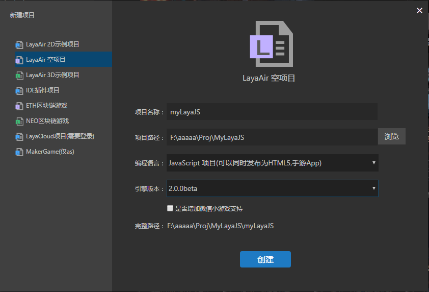
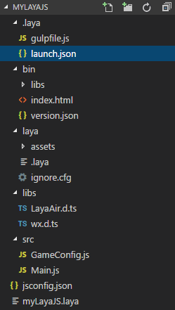
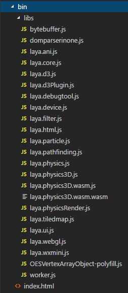

# 创建JS项目并详解目录结构

 

​      首次打开LayaAir IDE，或者在IDE的“文件”菜单里使用“新建项目”功能。可以创建一个空项目，IDE在创建时会自动生成结构清晰的目录结构，我们将在这介绍 LayaAir IDE 生成的目录结构。


## 1、用LayaAirIDE创建项目

​    **步骤一：打开LayaAirIDE，如果是首次打开，直接点击“新建项目”开始创建新项目。如图1所示**

 <br />（图1）


​    **步骤二：在“新建项目”的窗口里，选择建立LayaAir空项目，如图2所示。**

> 第一行`名称`栏里填写项目名称；
>
> 第二行`路径`栏里填写项目存储的路径 ；
>
> 第三行`类型`栏里选择项目类型，分别为ActionScript、JavaScript、TypeScript项目，这里我们需要选择 “JavaScript项目”；
>
> 第四行`引擎`栏里选择引擎版本。可以选择稳定版本或是最新的beta版。版本的区别可以在官网的引擎版本下载日志里查看。

 <br />

点击“创建”后，IDE生成项目文件夹结构如下：

<br />（图3）


## 2、目录结构介绍

### 2.1 项目运行配置文件（.laya文件夹）

​    `.laya` 文件夹下存放的是项目在开发运行中的一些配置信息。

#### 2.1.1`.laya/launch.json` 文件说明

　　 `launch.json` 文件保存了项目调试的一些配置信息,分别是LayaAirIDE的调试配置和chrome浏览器调试配置。不要轻易去改动，改错后会影响项目的调试。

　　**`launch.json`重要属性说明：**

　　`"name": "layaAir"`表示用LayaAirIDE内置的调试方式。

　　`"name": "chrome调试"`表示用chrome浏览器调试。

　　`"file": "${workspaceRoot}/bin/index.html"`表示项目运行启动的入口文件路径。

　　`"runtimeExecutable": "C:/Program Files (x86)/Google/Chrome/Application/chrome.exe"`,表示chrome浏览器的路径，开发者根据自己的需要来设置这个路径。

　　`"userDataDir": "${tmpdir}"` 表示chrome调试缓存的临时目录，默认为用户的临时目录，开发者可以更改设置，例如将缓存设置为当前项目根目录下的cache目录： `"userDataDir": "${workspaceRoot}/cache"`。

#### 2.1.2  `.laya/gulpfile.js` 文件说明

　　`gulpfile.js`文件是利用 Node.js 流的威力基于gulp的，是ide编译需要用到的文件，你可以快速构建项目并减少频繁的 IO 操作 通过代码优于配置的策略，让简单的任务简单，复杂的任务可管理。


​    上图的launch.json问题是开发者可能碰到的。如果碰到以上问题，需要检查configurations的URL路径是否存在问题。如果是“/”路径符需要改为“\\”。


### 

### 2.2 项目的输出目录（bin）

​    `bin`目录下存放的就是当前项目的输出文件，如图4。

​    `bin/index.html`是项目的入口文件，所有的LayaAir引擎类库或者是第三方类库的JS都需要在这里引入。

​    *Tips：index.html里的script注释注明了每个类库的相关功能，开发者可以根据项目需要来删减类库的引用，点击项目发布按钮会对index.html里的js文件进行压缩，用以减少网络传输。如果引用第三方类库，必须要在引用LayaAir引擎类库之前。*

​    `bin/libs` 文件夹存放的是 LayaAir 引擎各模块的JS 文件，如图4所示，在项目中需要使用哪个模块就需要在 index.html 引入对应的 模块包JS文件。

 <br />（图4）

**这里我们顺便介绍一下LayaAir引擎模块主要的几个部分：**

　　`laya.core.js `是核心包，封装了显示对象渲染，事件，时间管理，时间轴动画，缓动，消息交互，socket，本地存储，鼠标触摸，声音，加载，颜色滤镜，位图字体等。

　　 `laya.webgl.js` 封装了webgl渲染管线，如果使用webgl渲染，可以在初始化时调用`Laya.init(1136,640,laya.webgl.WebGL);` 

　　`laya.ani.js`是动画模块，包含了swf动画，骨骼动画等。

　　`laya.filter.js`包含更多webgl滤镜，比如外发光，阴影，模糊以及更多。

　　 `laya.html.js`封装了html动态排版功能。

　　 `laya.ui.js` 提供了制作UI的各种组件实现。

　　`laya.tilemap.js` 提供tileMap解析支持。


### 2.3 UI项目目录（laya）

​     “`laya`”目录用于存放LayaAirIDE当前的UI项目。

​    “`laya/assets`” 目录用来存放UI页面、粒子等组件所需的图片资源。

​    “`laya/pages`”目录用来存放LayaAirIDE创建页面布局生成的文件。

​    “`laya/.laya`”文件是LayaAirIDE的UI项目配置文件。


### 2.4 `.d.ts`代码提供文件目录（libs）

 `libs`目录下是layaAir引擎LayaAir.d.ts文件。用来代码提示，开发者假如有三方的类库使用，相关的.d.ts文件请放到这个目录下。 


### 2.5 项目代码目录（src）

​    项目代码文件默认将存放在 src 目录。

 

### 2.6 项目配置文件

​    `项目名.laya` 是项目配置文件，文件内记录了当前项目的项目名称、使用的类库版本号和项目类型。

```json
{"proName":"studyLayaAirJS","version":"1.5.5","proType":2}
```
​    `jsconfig.json`文件是ts工程的配置文件，勿删。