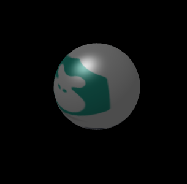

# LayaAir3D之材质光色与贴图

### 材质光色与贴图属性

标准材质属性与灯光光色属性有一定的类似，体现在漫反射、高光、环境色等属性上，但材质包括的更全，更方便调整物体美术效果，主要包括了反射率、漫反射颜色与漫反射贴图、高光色与高光贴图、环境色与环境贴图、反射颜色与反射贴图、法线凹凸贴图。下面我们对这些属性进行详细的介绍。


### 反射率

反射率（albedo）主要反映的是材质的明亮程度与颜色，数值越高，材质越明亮。

反射率的值是一个四维向量，查看下列代码，向量中四个元素分别代表着红、绿、蓝、透明alpha。

透明alpha效果为百分比，0为全透明，1为全透明，如果需要设置为半透明或全透明显示，只调整反射率还不行，还需要设置材质的渲染模式为混合类型才能达到目的（图1）。

修改“快速开启3D之旅”课程中的代码如下可得到图1效果：

```typescript
//创建材质
var material = new Laya.PBRSpecularMaterial();
//创建漫反射二维纹理贴图
Laya.Texture2D.load("res/layabox.png",Laya.Handler.create(this,function(text){
  material.albedoTexture = text;
}));
//只有设置了渲染模式为透明混合类型才能达到透明效果
//设置材质蓝色染色及30%半透明
 material.albedoColor=new Laya.Vector4(1,1,1,0.3);
//渲染模式(也可设置数值，5-13等为混合类型，可观察其效果变化)
 material.renderMode =Laya.PBRSpecularMaterial.RENDERMODE_TRANSPARENT;
box.meshRenderer.material = material;
```

(图1)反射率染色与透明</br>


### 漫反射颜色与漫反射贴图

漫反射颜色（diffuseColor）是指材质的单一自身颜色，美术行业内可以称它为物体的固有色。而漫反射贴图（diffuseTexture）是指材质的2D固有纹理图片，比如木头材质需要使用木头纹理图片，砖墙材质需要使用砖墙纹理图片。

游戏中使用最多的就是漫反射贴图，游戏美术贴图绘制中工作量最大的也是漫反射贴图，它能基本反映物体的基本质感。

漫反射颜色与贴图在LayaAir3D引擎中也可以混合使用，它们会有融合效果，漫反射颜色会对模型的光照面进行染色（背光面不会产生变化），它类似于灯光的漫反射光源色，产生更整体的色调（图2）。

修改“快速开启3D之旅”课程中的代码如下，创建了蓝色的漫反射颜色，受光面偏蓝了。见（图2）效果：

```typescript
//添加方向光
var directionLight = scene.addChild(new Laya.DirectionLight());
directionLight.color = new Laya.Vector3(0.6, 0.6, 0.6);
directionLight.transform.worldMatrix.setForward(new Laya.Vector3(1, -1, 0));
scene.ambientColor = new Laya.Vector3(0.5,0.5,0.5);   
//创建材质
var material = new Laya.PBRSpecularMaterial();
//创建漫反射二维纹理贴图
Laya.Texture2D.load("res/layabox.png",Laya.Handler.create(this,function(text){
  material.albedoTexture = text;
  //设置材质漫反射颜色
  material.albedoColor = new Laya.Vector4(0.5,0.5,2,1);
})); 
box.meshRenderer.material = material;
```

(图2)漫反射颜色与贴图混合</br>


### 高光色与高光贴图 

高光色（specularColor）与灯光高光色一样，是指模型物体转角处，或正对着光源处产生的高光颜色。

模型上的高光色受灯光与材质高光色同时影响，如果无灯光或灯光的高光色为黑色，那么即使材质上设置了高光色与高光贴图，模型上的高光同样不会出现。

高光贴图（specularTexture）是一张2D纹理图片，图片中的像素颜色代表着相应模型处的高光颜色和亮度，像素颜色越亮，在像素处的模型高光越亮。

当然，高光色与高光贴图可以同时使用，效果可能会更好，开发者们可以反复测试，调节出需要的效果。

修改“快速开启3D之旅”课程中的代码，在场景中加载一辆卡车，可观察一下使用了高光色、高光贴图，并与默认只使用灯光高光进行一下对比，代码如下：

```typescript

  //获取模型
  var meshSprite3D = this.role3D.getChildAt(0).getChildAt(0);
  //从模型上获取共享材质
  var sharedMaterial =meshSprite3D.meshRenderer.sharedMaterial;
  //修改材质的高光颜色，让高光处偏红
  sharedMaterial.specularColor = new Laya.Vector4(1,0,0,1);
  //加载高光贴图（与漫反射一致，也可单独制作高光贴图）
  Laya.Texture2D.load("res/layabox.png",Laya.Handler.create(this,function(text){
      sharedMaterial.specularTexture = text;
  }));
```

编译上述代码，（图3）中使用了材质高光色与高光贴图，效果更好。（图4）中使用了灯光的默认白色高光色，效果一般。

(图3)</br>

(图4)</br>


### 环境色

环境色(ambientColor )，是对场景内材质进行颜色融合染色，使材质趋于某种颜色色调，同时还能对材质进行提亮，模拟天空色调，光强度。

修改“快速开启3D之旅”课程中的代码如下可得到（图6）效果：

```typescript
//添加3D场景
var scene = Laya.stage.addChild(new Laya.Scene3D());
//设置环境色，提亮模型
scene.ambientColor = new Laya.Vector3(0.5,0.5,0.5);
```

(图5)固定灯光下，材质未使用环境颜色</br>

(图6)固定灯光下，材质使用环境颜色提亮</br>


### 反射贴图

反射贴图( customReflection )我们一般是采用一套盒子纹理贴图TextureCube，它会对模型进行整体包裹，模拟周边环境反映在模型上的效果。

反射贴图显示效果同时也与反射率albedoColor、渲染模式renderMode相关。

渲染模式必须改为双面不透明才能显示反射贴图（RENDERMODE_OPAQUE）。

反射率albedoColor数值越高，反射贴图效果越小，漫反射贴图效果越强，可根据实际的模型材质效果调节，比如水面、镜面、金属面可调节不同的反射率达到需求。

 修改“快速开启3D之旅”课程中的代码如下，为了更好的观察反射效果，使用球形模型。运行后可得到（图7）效果：

```typescript
//添加方向光
var directionLight = scene.addChild(new Laya.DirectionLight());
directionLight.color = new Laya.Vector3(0.6, 0.6, 0.6);
directionLight.transform.worldMatrix.setForward(new Laya.Vector3(1, -1, 0));
scene.ambientColor = new Laya.Vector3(0.5,0.5,0.5);
//添加自定义模型（球）
var box = scene.addChild(new Laya.MeshSprite3D(new Laya.SphereMesh(1)));
box.transform.translate(new Laya.Vector3(0,1,-3));
Laya.timer.loop(10,this,function(){
  box.transform.rotate(new Laya.Vector3(0, 1, 0), true, false);
})
//创建材质
var material = new Laya.PBRSpecularMaterial();
//创建漫反射二维纹理贴图
Laya.Texture2D.load("res/layabox.png",Laya.Handler.create(this,function(text){
  material.albedoTexture = text;
  //设置材质漫反射颜色
  // material.albedoColor = new Laya.Vector4(0.5,0.5,2,1);
  //修改材质的高光颜色，让高光处偏红
  // material.specularColor = new Laya.Vector4(1,0,0,1);
})); 	
//获取反射贴图（用立方体全视角贴图进行赋值（类似于360全景包裹））
Laya.TextureCube.load("LayaScene_test/Assets/1v1Scene/NewCubemap.ltc",Laya.Handler.create(this,function(cube){
  //设置反射贴图
  scene.customReflection = cube;
  //设置反射贴图的反射率
  scene.reflectionIntensity = 1;
}));
//设置渲染模式为不透明（否则无法显示反射贴图）
material.renderMode = Laya.PBRSpecularMaterial.RENDERMODE_OPAQUE
//降低材质的反射率，加强反射贴图反射
material.albedoColor=new Laya.Vector4(0.1,0.1,0.1,0);
//为模型赋材质
box.meshRenderer.material = material;
```

(图7)反射贴图</br>


### 法线凹凸贴图

法线凹凸贴图(normalTexture)在3D中有着非常重要的作用，模型表现的精细程度主要受法线贴图影响，它能模拟高精度、高面数模型的细节，大大提升游戏画面品质。当然，如果使用法线贴图，对硬件的性能要求随之提高。

法线贴图为美术设计师提供，他们靠两种方法制作，一种是在3D制作软件中模型高模烘焙出低模使用的法线贴图，工作量巨大；一种是用漫反射贴图通过一些工具转化成法线贴图，工作量小，但效果比烘焙方法稍差。法线贴图效果如（图8）所示，它是用漫反射贴图转化而成。

(图8)</br>

如果需要使用法线贴图在开发过程中需注意以下问题：

1．法线贴图对模型数据有一定的要求，如果模型上没有切线信息将无法产生法线凹凸的效果。例如LayaAir 3D引擎中自带的各种Mesh网格类型BoxMesh、SphereMesh、CylinderMesh等是没有切线信息的，即使使用了法线贴图也不会在视图中显示出凹凸。

2．如果需要使用法线贴图，且模型是通过LayaAir的unity插件中导出，在Mesh Setting网格设置时需要注意不能勾选“忽略切线”选项，如（图9）。

(图9)</br>

3．如果需要使用法线贴图，游戏场景中必须使用灯光，否则模型上也不会产生凹凸效果。

我们从unity3D中创建一个Cube模型（unity中创建的模型带切线信息），并赋上漫反射贴图与法线贴图后用LayaAir导出插件导出数据并使用，法线贴图也会自动加载到模型上。修改“快速开启3D之旅”课程中的代码如下，编译运行后见（图10）凹凸效果。

```typescript
Laya.Scene3D.load("LayaScene_test_Light/test_Light.ls",Laya.Handler.create(this,function(s){
  var scene = Laya.stage.addChild(s);
  //也可以代码加载法线贴图
  //从模型中获取meshSprite3D对像
  // var meshSprite3D=s.getChildByName("Cube");
  //获取模型的材质实例
  // var material=meshSprite3D.meshRenderer.material;
  //为材质添加法线贴图
  // Laya.Texture2D.load("LayaScene_test_Light/Assets/LayaPlugin/8.jpg",Laya.Handler.create(this,function(text){
  // 	material.normalTexture= text;
  // }));
})); 
```

(图10)法线贴图</br>


### 导出的材质文件.lmat修改

经过对材质光色与贴图属性的了解，我们了解了怎么通过代码修改物体的材质属性与贴图，灵活的去控制需要达到的效果。

不过目前美术上的效果基本都是通过unity编辑器去实现，然后导出数据进行使用。因为目前LayaAir 3D引擎正在完善中，又因H5游戏引擎的特点，不能完全包括unity中所有材质类型与属性，因此在unity中的效果与在实际游戏中的效果会有所差别。

未来的版本中，我们将用插件的方式在unity中创建专用的LayaAir标准材质供开发者们使用，这样可以使在unity中制作的美术效果与游戏的效果完全一致，方便开发者们使用。

那么在等待的这个期间，我们怎么去修改并达到一些美术效果呢？在unity中每一个材质在导出时都会生成.lmat格式文件，我们可以修改材质.lmat文件方式进行调整美术效果。

例如我们通过下例代码，加载一个场景，然后先通过光照设置达到夜晚效果（图11）。

```typescript
Laya.Scene3D.load("LayaScene_test_Light/test_Light.ls",Laya.Handler.create(this,function(s){
  var scene = Laya.stage.addChild(s);
  //设置环境光偏暗蓝色
  scene.ambientColor = new Laya.Vector3(0.2,0.2,1);
  //获取场景灯光
  var light = scene.getChildByName("Directional light");
  //设置灯光光偏暗
  light.color = new Laya.Vector3(0.5,0.5,0.5);
}));
```

(图11)</br>

根据上图所示，如果需要把“Love”形模型变为灯箱的亮度，通过代码修改相对麻烦，相对简单的方式是修改它所对应的材质文件.lmat，打开材质文件观察，可以发现材质文件中存储的就是各种光色属性与贴图（图12），我们修改盖材质的环境光颜色为”1.5,1.2,1.2”，刷新网页文件就可以看到效果，模型变亮了达到灯箱的效果（图13）。

(图12)</br>

(图13)</br>

通过以上的方法可以调节场景中的各种材质属性，使之达到美术所需效果。当然，我们更期待后续的unity中LayaAir专属材质，直接在unity中编辑与游戏中一致的最终效果。