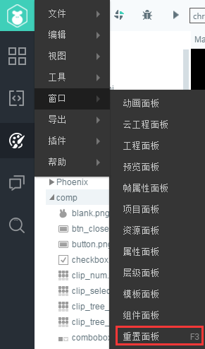

# 自定义界面布局与恢复

>  本篇采用LayaAirIDE 1.7.3 bate 截图，如有不同，请下载最新的LayaAirIDE，以最新版本IDE为准。

编辑器布局是指LayaAirIDE里各个面板的位置、大小和层叠情况。 

## 预设与恢复布局

### 预设

在LayaAir的设计模式下，可以对界面的各个功能版块进行位置拖动与大小调整，在界面布局修改结束后会自动保存，下次打开时，会按最后一次的布局打开。

### 恢复

如果界面模板被关闭或错位，可以采用快捷键`F3`快速**恢复默认的界面布局**，或者在`菜单栏` 中点击-->【`窗口`】 --> 【`恢复面板`】。

 

## 自定义界面

### 一、调整面板大小：

​        将鼠标悬浮到两个面板之间的边界线上，看到鼠标指针发生变化后，就可以按下鼠标来修改相邻两个面板的大小。如动图1所示。

​	 

​	（动图1）
