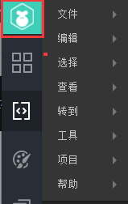
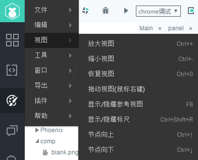
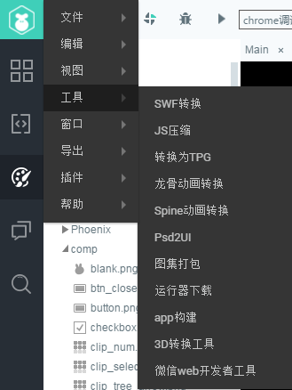
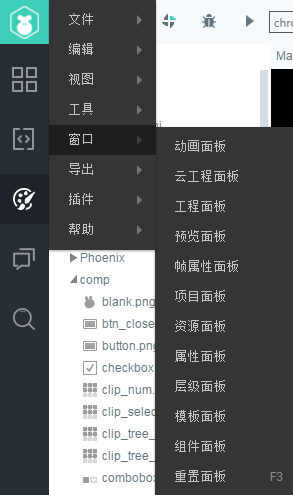

# 菜单栏介绍

 

​        菜单栏 位于界面最上方，包含了整个IDE的控制信息，对界面不熟悉的朋友可以快速的在菜单栏中找到需要进行操作的功能。下面我们将对菜单栏的进行详细介绍。

​    
​        	（图1）

 

### 一、文件      

​    
​        	（图2）

- 新建项目： 通过新建项目选项窗口来创建一个新的项目。

- 新建文件： 通过新建页面窗口来创建一个新的编辑页面，快捷键 Ctrl+N。

- 新建目录： 在项目中创建一个新的页面文件夹，快捷键 Ctrl+D。

- 打开项目： 通过资源管理器来浏览并打开一个项目，快捷键 Ctrl+D。

- 转换项目： 在转换项目窗口中，可以选择MornUI项目，将其转换为LayaAir项目。

- 设置项目： 设置项目的配置文件，快捷键 F9。

- 设置页面： 设置页面的默认属性，快捷键 Ctrl+P。

- 刷新编辑器：可以刷新编辑器的状态，相当于复位或重启编辑器。 

  ​

### 二、编辑

​   
​        	（图3）

- 撤销： 撤销当前操作，返回上一步操作，快捷键 Ctrl+Z。

- 重做： 当撤销过多时，可以恢复撤销的操作，快捷键 Ctrl+Y。 

- 删除： 删除选中的资源或控件，快捷键 Delete。

- 复制： 复制当前选中的资源或控件，快捷键 Ctrl+C。

- 粘贴： 对已经复制的资源或控件进行粘贴操作，快捷键 Ctrl+V。

- 原位粘贴：在控件原有位置复制粘贴选中控件，快捷键 Ctrl+Shift+V。

- 剪切：剪切选中控件或资源，快捷键 Ctrl+X。

- 全选：选中全部控件，快捷键 Ctrl+A。

- 快速移动：将选中的控件快速向方向键位置移动10像素，快捷键 Shift+方向键。

- 转为容器：将选中的控件转为容器，可以在转换框中选择具体转的容器类型，快捷键 Ctrl+B。

- 移除容器：将选中容器移除容器类型转为普通控件，快捷键 Ctrl+U。

- 重复复制：在弹出的重复组件中设置要多次复制的行数列数以及间距，快捷键 Ctrl+R。

- 定位资源：快速定位资源在资源管理器中的位置，快捷键 Ctrl+K。

- 查找替换：弹出替换窗口，可将查找到的位置替换成别的内容，快捷键 Ctrl+F。

- 保存文件：保存文件更改，快捷键 Ctrl+S。

- 保存所有文件：保存所有文件更改，快捷键 Ctrl+Shift+S。

  ​

### 三、视图

​    
​             （图4）
- 放大视图：放大场景编辑器，快捷键 Ctrl++。

- 缩小视图：缩小场景编辑器，快捷键 Ctrl+-。

- 恢复视图：恢复场景编辑器至原始大小，快捷键 Ctrl+0 （或Ctrl+|）。

- 拖动视图：按住鼠标右键（或鼠标滚轮）拖动视图位置。

- 显示/隐藏参考视图：设置在场景编辑器中显示/隐藏视图，快捷键 F8。

- 显示/隐藏标尺：设置在场景编辑器中显示/隐藏标尺，快捷键 Ctrl+Shift+R。

- 节点向上：控制选中的控件在层级管理器中的层级位置向上移动一位，快捷键 Ctrl+↑。

- 节点向下：控制选中的控件在层级管理器中的层级位置向下移动一位，快捷键 Ctrl+↓。

  ​

### 四、工具

​    
​        	（图5）

- SWF转换：打开SWF资源转化工具窗口，以供用户进行SWF转换操作。

- JS压缩：打开JS压缩工具窗口，以供用户将JS文件进行压缩和混淆。

- 龙骨动画转换：打开龙骨动画转换窗口，以供用户将DragonBones骨骼动画转换为LayaAir识别的格式。

- Spine动画转换：打开Spine动画转换窗口，以供用户将Spine骨骼动画转换为LayaAir识别的格式。

- 图集打包：打开图集打包窗口，以供用户进行图集打包操作。

- 运行器下载：打开运行器下载的二维码窗口，以供用户扫码下载LayaNative的运行器。

- 打包APP：APP打包的环境配置与操作窗口，以供用户将LayaAir项目打包为安卓的APP（apk文件）

- 渠道打包工具：打开渠道打包窗口，以供用户将LayaAir引擎项目直接打包为已对接多个安卓主流渠道的apk包。

- APP构建：打开构建功能窗口，以供用户将LayaAir引擎项目构建为Android-eclipse、Android-studio、XCode(IOS)三种移动端的APP项目工程。

- 3D转换工具：打开3D转换工具的URL链接，压缩包内提供了3DMax与Unity3D编辑器的资源转换工具，让3DMax与Unity3D的资源成为LayaAir引擎支持的资源。

  ​

### 五、窗口

​    
​        	（图6）

- 动画面板：如果动画管理器面板被关闭，可以在这里设置将该面板重新显示。

- 帧属性面板：如果帧属性面板被关闭，可以在这里设置将该面板重新显示。

- 项目面板：如果项目管理器面板被关闭，可以在这里设置将该面板重新显示。

- 资源面板：如果资源管理器面板被关闭，可以在这里设置将该面板重新显示。

- 属性面板：如果属性设置器面板被关闭，可以在这里设置将该面板重新显示。

- 层级面板：如果层级管理器面板被关闭，可以在这里设置将该面板重新显示。

- 模板面板：如果模板管理器面板被关闭，可以在这里设置将该面板重新显示。

- 组件面板：如果组件面板被关闭，可以在这里设置将该面板重新显示。

- 恢复面板设置：恢复所有管理器面板的位置以及视图大小，快捷键 F3。

  ​

### 六、导出

​    
​        	（图7）

- 导出：将做好的界面打包导出，如果资源文件夹未产生变化则跳过该文件夹只对已变化文件夹进行打包并导出，快捷键 F12。

- 清理并导出：强制清理之前已经打包过的资源文件，对所有文件进行重新打包并导出，快捷键 Ctrl+F12。

- 导出代码（不导出资源）：当资源没有产生变化，只是UI位置、属性等产生变化时，使用该功能，仅重新导出UI代码，不会重新导出资源，会加快UI项目的导出效率。

- 发布（不打包未使用资源）：与F12功能相近，但是只会对已经使用的资源进行打包并导出，不对未使用的资源进行操作。使用该功能因为需要遍历全部资源的使用状态，会导致UI项目的导出速度减慢，所以不建议开发的时候使用，仅在发布项目线上版本的时候使用即可。

- 导出语言包：该功能可以提取当前LayaAirIDE所有的UI文本内容生成lang.lang文件，用以设置多语言版本。

- 刷新资源及页面：刷新并重新显示资源及页面，一般在产生资源变动的情况下用来刷新所有，快捷键 F5。

- 刷新页面：对页面进行刷新并重新显示页面，快捷键 F6。

- 刷新资源：刷新资源管理器，重新显示资源管理器对资源的引用，快捷键 F7。

- 查找未被使用的资源：查找项目中未被使用的资源，并整理成列表，方便快速删除不用的资源，快捷键 F4。

  ​

### 七、插件

可自主编辑开发插件或寻找共享插件安装至IDE中，以供开发者使用。

### 八、帮助

​   
​        	（图8）

- 开发人员工具：用于打开编辑器的调试页面。
- 官网： 打开Layabox官网链接。
- 官网示例：打开官网的LayaAir引擎示例链接。
- 开发者中心：打开Layabox开发者中心链接。
- 打开编辑器本地缓存：打开编辑器的本地缓存文件所在目录。
- 检查更新：打开LayaAirIDE的版本下载列表链接。
- 更新日志：打开gitHub中的引擎与IDE版本更新日志链接。
- 当前版本号：显示LayaAirIDE当前的版本号。

